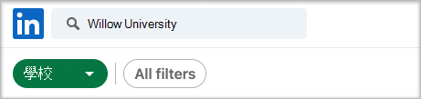
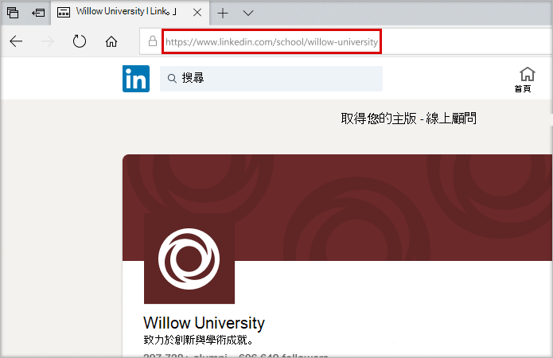
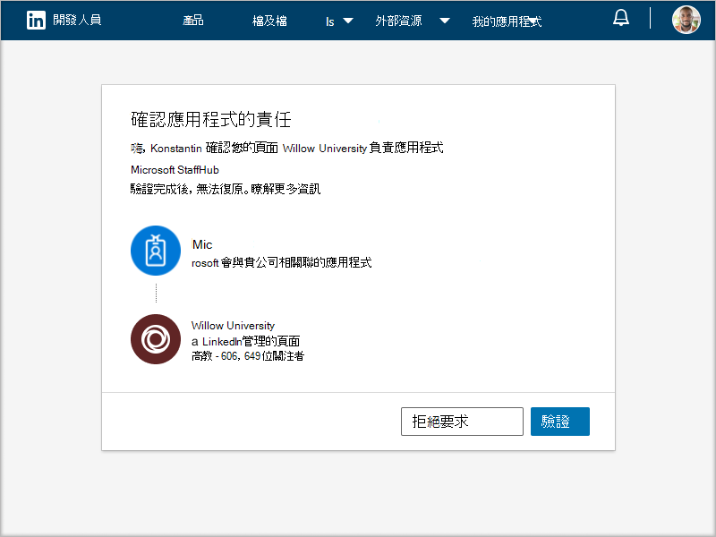

# 購買、設定及啟用職涯教練Microsoft Teams

職涯教練是由Microsoft Teams 教育版提供的LinkedIn應用程式，提供個人化指引給高教學生流覽其事業歷程。 職涯教練為教育機構提供統一的生涯解決方案，讓學生探索其事業路徑、培養實際技能，以及將網路全部建在一個地方。

## 支援的語言

職涯教練語言進行當地語系化：

- 中文 (簡體、中國大陸) 
- 繁 (傳統、臺灣) 
- 英文 (英文) 
- 英國 (英文) 
- 加拿大 (法文) 
- 法文 (法國) 
- 德文 (德文) 
- 日本 (日本) 
- 巴西 (葡萄牙文) 
- 西班牙文 (西班牙) 
- 墨西哥 (西班牙文) 

深入瞭解[職涯教練。](https://aka.ms/career-coach)

> [!NOTE]
> 使用本指南中的最佳作法和實用秘訣，為學生、教職員職涯教練和教職員啟用此課程的功能。 請參閱 [快速規劃指南](https://support.microsoft.com/office/c5d0b934-bfcf-4fe7-8a85-ba7bbb1b6ad4) 文章。

## 審查需求

若要為職涯教練啟用應用程式，請審查讓應用程式啟動及運作所需的內容。

**技術需求**

- Office 365租使用者Azure Active Directory

- Microsoft Teams

- LinkedIn帳戶Azure Active Directory

**許可證**

- 教師

- 學生

> [!NOTE]
> 您必須職涯教練教職員授權給 IT 系統管理員，以完成此組組。

**教育機構的資料與檔案**

- 課程目錄資料

- 提供的學習欄位

- 教育機構的LinkedIn頁面

- LinkedIn Learning校園訂閱 (偏好) 

## 購買職涯教練授權

職涯教練 (除了中國及俄羅斯) 之外，還透過註冊教育版解決方案 (EES) 、雲端服務提供者 (雲端解決方案提供者) 和 Microsoft 365 系統管理中心 (Web 直接) 提供合格高等教育機構的附加授權。 客戶Microsoft Teams應用程式，必須擁有 Microsoft 365 A3/A5 或 Office 365 A1/A3/A5 才能購買附加元件職涯教練授權。

### 指派應用程式授權給使用者

有關逐步指示，請參閱指派 [授權給使用者](/microsoft-365/admin/manage/assign-licenses-to-users)。

### 開啟LinkedIn帳戶連結

職涯教練 **要求** 教育機構的使用者能夠將其帳戶與Microsoft 365帳戶LinkedIn在 職涯教練

1. 使用一個[Azure AD](https://aad.portal.azure.com/)全域系統管理員的帳戶，Azure AD系統管理中心。

2. 選取 **使用者**。

3. 在使用者 **頁面上** ，選取 使用者 **設定**。

4. 在 **LinkedIn帳戶** 連結下，允許使用者連接其帳戶，以在某些 Microsoft app LinkedIn存取他們的帳戶連結。 使用者同意連接其帳戶之前，不會共用任何資料。

   - 選取 **是** ，為教育機構的所有使用者啟用服務

   - 選取 **選取的** 群組，只針對教育機構中一群選取的使用者啟用服務

   - 選取 **No** 以撤銷教育機構中所有使用者的同意

瞭解如何在 LinkedIn[中整合帳戶Azure Active Directory](/azure/active-directory/enterprise-users/linkedin-integration)

## 在 職涯教練 系統管理中心Teams帳戶

您可以使用系統管理中心中的Microsoft Teams設定，職涯教練教育機構的管理員設定，並讓使用者啟用。

**要考慮的事情**

- 下列各節必須完成，才能職涯教練使用 - 品牌和喜好設定、LinkedIn
- 課程目錄和學習欄位的 CSV 具有必要的格式，且最大大小為 18 MB

- 如果您在應用程式上看到「職涯教練目前正在設定中，職涯教練即將使用」，則所需的節尚未完成。

- 在包含所需欄位的設定頁面上，如果欄位尚未完成，頁面將不會提交
  - 使用者不會看到警告訊息，頁面不會提交

## 存取 職涯教練 應用程式設定

使用管理[應用程式頁面](/microsoftteams/manage-apps)來Teams教育機構應用程式目錄中的 App。

1. 請Teams **系統管理中心**。

2. 在左側流覽中，選取 **Teams**  >  **應用程式管理應用程式**。  

    > [!NOTE]
    > 您必須是全域系統管理員Teams服務系統管理員才能存取頁面。

3. 搜尋 **或流覽** 職涯教練。  

4. 選取 **職涯教練**，然後選取 **設定。**  

    

### 設定職涯教練應用程式設定

職涯教練有五種組組類別：

- [品牌和喜好設定](#brand-and-preferences)

- [LinkedIn連接](#linkedin-connection)

- [課程目錄](#course-catalog)

- [學習領域](#fields-of-study)

- [定制](#customization)

> [!NOTE]
> 品牌和喜好設定LinkedIn設定、課程目錄和學習領域，才能有效地為學生、教職員啟用應用程式。

#### 品牌和喜好設定

在品牌和喜好設定設定頁面上設定教育機構的名稱、標誌和預設語言。

> [!NOTE]
> 這是必填區段-職涯教練提交品牌和喜好設定時，無法啟用此功能。

##### 教育機構圖示

教育機構圖示會職涯教練識別教育機構特有的內容、整個應用程式的課程目錄資源，以及儀表板的實際體驗區段。 圖示的格式最好為：

- 透明 PNG
- 長寬比為 1：1
- 最大大小為 64 px x 64 px。

##### 教育機構縮圖

當課程無法使用特定影像時，教育機構圖示會用於整個 App 的課程目錄資源。 圖示的格式最好為：

- A PNG
- 長寬比為 16：9
- 最大大小為 360 px x 200 px。

#### LinkedIn連接

此LinkedIn組會職涯教練與來自 LinkedIn 的公開畢業生資料。

> [!NOTE]
> 這是必要的節- 職涯教練未驗證頁面連結LinkedIn啟用。

##### 新增並確認LinkedIn頁面

決定教育機構的LinkedIn頁面。 在 LinkedIn搜尋或LinkedIn職員工成員，以判斷要使用的正確頁面，以尋找該頁面。  
  
1. 請Teams **系統管理中心**。

1. 選取 **Teams**  >  **應用程式 管理應用程式**  >  **職涯教練LinkedIn**  >  **連接**。

2. 在 LinkedIn上搜尋並選取學校篩選，LinkedIn頁面。 或者，請連上職教職員成員，LinkedIn學校頁面的正確選項。 [如何識別LinkedIn頁面](https://www.linkedin.com/help/linkedin/answer/40133/differences-between-a-linkedin-page-for-a-school-and-company?lang=en)

    

3. 新增LinkedIn頁面 URL。 URL 必須是學校頁面，而不是公司頁面，而且通常的格式為 `https://www.linkedin.com/school/willow-university/` 。

   

4. 選取 **提交**。

5. 如果成功提交，頁面將會更新以顯示驗證 **連結** 和 **驗證連結到期**。 驗證連結會在 30 天后過期。

     

6. 複製驗證連結，然後與教育機構的LinkedIn系統管理員共用。如需進一LinkedIn頁面系統管理員角色，請參閱LinkedIn [管理檔](https://www.linkedin.com/help/linkedin/answer/102672)。

7. 頁面LinkedIn系統管理員，會使用唯一的驗證連結職涯教練學校頁面建立關聯。 [有關頁面驗證LinkedIn檔](https://www.linkedin.com/help/linkedin/answer/102672)。

> [!NOTE]
> 需要頁面LinkedIn管理員的驗證，才能完成LinkedIn的職涯教練。

   

#### 課程目錄

課程目錄代表教育機構提供給學生的課程和課程。

> [!NOTE]
> 這是必要的節-職涯教練課程目錄無法啟用。

這些課程在 App 中用於兩個區域：

- 課程會作為學習資源的一部分退回。  

- 課程和課程中繼資料 ，例如描述，可用來協助學生在上傳文字記錄時識別其技能。  

若要建立課程目錄，請彙集教育機構所傳授的所有課程清單，並上傳為 CSV 檔案。 應用程式會從課程目錄繪製，以從學生的成績記錄中找出其技能，並建議要參加的課程。

##### 課程目錄檔案格式和架構

檔必須採用 CSV 格式，大小上限為 18 MB。 檔必須包含必要的欄位課程 **標題**、**課程識別碼** 和 **課程 URL。** 包含建議的欄位可返回更好的搜尋結果和技能識別，改善學生的體驗。

> [!NOTE]
> 從範例課程 [目錄檔]( https://aka.ms/career-coach/docs/it-admins/sample-catalog) 開始著手。

下表顯示課程目錄中要包含的專案：

| 名稱             | 地位      | 類型   | 描述                                                                    |
|------------------|-------------|--------|--------------------------------------------------------------------------------|
| courseId         | 必要    | 字串 | 課程識別碼通常 (會與文字記錄中產生的內容) 。 |
| 標題            | 必要    | 字串 | 通常是課程標題。                                                      |
| sourceLink       | 必要    | URL    | 課程頁面的網站連結。                                               |
| 描述      | 建議 | 字串 | 課程簡介文字。                                              |
| language         | 建議 | 字串 | 課程語言。 使用標準語言代碼。                           |
| 格式           | 建議 | 字串 | 線上、 (、個人或個人) 。                              |
| 縮圖連結    | 建議 | URL    | 課程影像的縮圖連結。                                            |
| 縮圖AltText | 建議 | 字串 | 影像的協助工具替代文字                                           |
| educationLevel   | 建議 | 字串 | 學習層級，例如 文科/畢業生。                                       |
| 主題           | 建議 | 字串 | 與課程所傳授技巧相關聯的主題或標記。          |

##### 新增課程目錄

1. 請Teams **系統管理中心**。

1. 選取 **Teams** &gt; **管理應用程式** &gt; **職涯教練設定** &gt;  &gt; **目錄**。  

2. Upload CSV 格式的課程，並包含必要的欄：courseId、title、sourceLink。 每一列都必須包含每個所需資料行的資料。

包含建議的欄位可返回更好的搜尋結果和技能識別，改善學生的體驗。

4. 選取 **提交**。

   

#### 學習領域

學習領域與主要興趣領域、學術專業和學位是同義字。 學生開始使用應用程式並開始設定個人化設定檔時，會參照這些標題。

> [!NOTE]
> 這是必填區段- 職涯教練沒有研究欄位清單，無法啟用此功能。

新增所有學生可用的學習欄位，例如工程、英文、商務等等。 欄位清單可讓學生探索可能感興趣的學習欄位，並新增其焦點區域至其設定檔。

> [!NOTE]
> 從研究 [檔的範例欄位](https://aka.ms/career-coach/docs/it-admins/sample-fieldsofstudy) 開始。

下表顯示要納入研究欄位的專案：

| 名稱          | 地位   | 類型   | 描述                    |
|---------------|----------|--------|--------------------------------|
| fieldsOfStudy | 必要 | 字串 | 學習欄位的名稱 |

##### 新增學習欄位

1. 請Teams **系統管理中心**。
1. 選取 **Teams** &gt; **管理應用程式** &gt; **職涯教練設定** &gt;  &gt; **學習欄位**。  

2. Upload CSV 格式的學習領域。

3. 選取 **提交**。

#### 定制

職涯教練可自訂為教育機構所獨一無二的。 自訂支援新增體驗至儀表板。 建議您新增工作委員會、活動、職稱服務辦公室、職稱相關活動、學生俱樂部的連結，以及協助學生取得實際經驗的其他資源。

##### 新增自訂體驗

1. 請Teams **系統管理中心**。

1. 選取 **Teams** &gt; **應用程式 管理應用程式** &gt;   >  **職涯教練設定** &gt; **自訂**。

2. 新增每個 URL、標題和簡短描述。  
  
3. 選取 **提交**。

## 讓職涯教練組織使用

現在，職涯教練已針對您的組織進行配置。 請遵循下列步驟，職涯教練中組織Microsoft Teams。

### 啟用應用程式

完成組組後，請為學生和授權使用者啟用應用程式，以便他們存取職涯教練。  
  
> [!NOTE]
> 您必須擁有全域或Teams管理員角色許可權。

1. 請Teams **系統管理中心**。

1. 選取 **Teams 應用程式** &gt; **管理應用程式** &gt; **職涯教練。**

2. 將狀態切換 **開關移至** 允許 。  

  > [!NOTE]
  > 允許表示此 App 可供教育機構中的使用者使用。 封鎖表示學生無法使用 App。

### 新增職涯教練為已安裝的應用程式

> [!NOTE]
> 此步驟可確保有 1 個) ，職涯教練為貴組織 2 正確) 學生找到職涯教練。

1. 請Teams **系統管理中心**。

2. 選取 **Teams** &gt; **應用程式設定策略** &gt; *您的策略*。

3. 在安裝的應用程式下，選取新增應用程式。

4. 在新增已安裝的應用程式窗格中，搜尋使用者在開始使用應用程式時要自動安裝Teams。 您也可以根據應用程式權限原則篩選應用程式。 當您選擇應用程式清單時，請選取新增。

### 釘上應用程式

釘職涯教練可讓學生更容易使用及顯示應用程式。

1. 請Teams **系統管理中心**。

2. 選取 **Teams** &gt; **應用程式設定策略** &gt; *您的策略*。

3. 在 **釘選的 App** 下，選擇新增 **應用程式**。

4. 搜尋 **職涯教練**，**然後選取** 新增 。

5. 選擇應用程式顯示的順序， **然後選取** 儲存 。

> [!NOTE]
> 學生會收到已Microsoft Teams職涯教練通知。

請參閱 [在 Microsoft 中管理應用程式設定](/microsoftteams/teams-app-setup-policies) 政策以進一步詳細資料。

## 移除租使用者資料

您的租使用者資料包含已上傳或產生為應用程式佈建的一部分的資訊。 若要刪除租使用者職涯教練的所有資料，請讓租使用者全域系統管理員開啟支援票證，要求永久刪除租使用者的資料。 請注意，此程式無法反轉。 資料移除完成後，職涯教練 應用程式會針對所有使用者回到其預先設定的非個人化狀態，而 Teams 系統管理員必須再次設定應用程式，才能繼續使用。

下列說明刪除程式：

- 租使用者全域系統管理員必須提交支援票證，清楚說明永久刪除租使用者資料的要求。 **無法限制刪除的資料集或時間視窗**。

- 提交後，支援票證將在一周之後解決，以滿足合規性的最短保留政策。 您可以在此期間取消作業。

- 一周之後，職涯教練小組可確保刪除與租使用者相關的所有資料。 Microsoft 支援服務會監控票證，並將于刪除程式完成後通知您，且不超過 **30 天**。

## 資源

下列資源可協助規劃您的職涯教練應用程式。

- [歡迎使用 Microsoft Teams](Teams-overview.md)

- [如何推出 Teams](get-started-with-teams-resources-for-org-wide-rollout.md?tabs=SmallBusiness)

- [Microsoft Teams 中的團隊和頻道概覽](teams-channels-overview.md)

- [在系統管理中心Microsoft Teams應用程式](manage-apps.md)

- [線上虛擬方向套件](https://www.microsoft.com/education/remote-learning/virtual-orientation)

- [頻道的限制Teams規格](limits-specifications-teams.md)

- [開始使用系統管理訓練Microsoft Teams](ITAdmin-readiness.md)

- [Teams疑難排解](/microsoftteams/troubleshoot/teams-welcome)

- [在 Microsoft Teams 中管理應用程式權限原則](teams-app-permission-policies.md)
