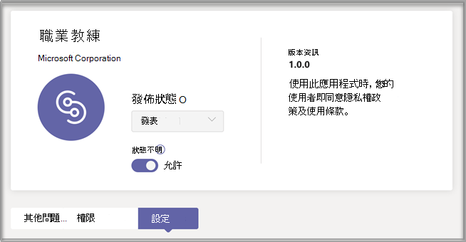
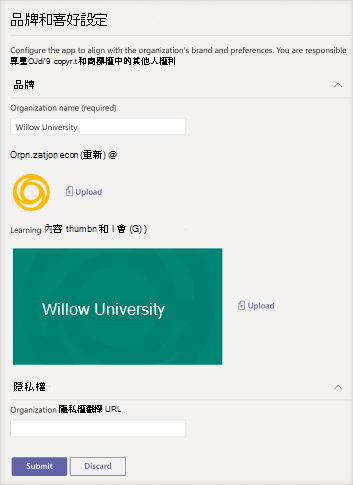

# 購買、設定及啟用適用于Microsoft Teams

職稱教練是Microsoft Teams教育用應用程式，由 LinkedIn 提供個人化指引，讓高教學生流覽其事業歷程。 Career Coach 為教育機構提供一個統一的生涯解決方案，讓學生探索其事業路徑、培養實際技能，以及將他們的網路全部建在一個地方。

深入瞭解職業 [教練](https://aka.ms/career-coach)。

> [!NOTE]
> 使用本指南中的最佳作法和實用秘訣，為學生、教職員啟用專業教練的功能。 請參閱 [快速規劃指南](https://support.microsoft.com/office/c5d0b934-bfcf-4fe7-8a85-ba7bbb1b6ad4) 文章。

## 審查需求

若要為教育機構啟用 Career Coach，請審查讓應用程式啟動及運作所需的內容。

**技術需求**

  - Office 365租使用者Azure Active Directory

  - Microsoft Teams

  - LinkedIn帳戶Azure Active Directory

**許可證**

  - 教師 

  - 學生

> [!NOTE]
> 必須指派專業教練教職員授權給 IT 系統管理員，以完成此組組。

**教育機構的資料與檔案**

  - 課程目錄資料

  - 提供的學習欄位

  - 教育機構的LinkedIn頁面

  - LinkedIn學習校園訂閱 (偏好) 

## 購買職業教練授權

透過註冊教育解決方案 (EES) 、雲端服務提供者 (雲端解決方案) ，以及 Microsoft 365 系統管理中心 (web) ，除了中國與俄羅斯) 之外，全球範圍都提供專業教練。 ( 做為Microsoft Teams應用程式，客戶必須擁有Microsoft 365 A3/A5 或 Office 365 A1/A3/A5。

### 指派應用程式授權給使用者

有關逐步指示，請參閱指派 [授權給使用者](/microsoft-365/admin/manage/assign-licenses-to-users)。

### 開啟LinkedIn帳戶連結

職稱 **教練** 要求教育機構的使用者能夠將其帳戶Microsoft 365到他們在LinkedIn教練中協助使用的帳戶

1. 使用 Azure [AD](https://aad.portal.azure.com/) 組織的全域系統管理員帳戶來登錄 Azure AD 系統管理中心。

2. 選取 **使用者**。

3. 在使用者 **頁面上** ，選取 使用者 **設定**。

4. 在 **LinkedIn帳戶** 連結下，允許使用者連接其帳戶，以存取LinkedIn Microsoft App 中的帳戶連結。 使用者同意連接其帳戶之前，不會共用任何資料。

   - 選取 **是** ，為教育機構的所有使用者啟用服務

   - 選取 **選取的** 群組，只為教育機構中一群選取的使用者啟用服務

   - 選取 **No** 以撤銷教育機構中所有使用者的同意

瞭解如何在 LinkedIn[中整合帳戶Azure Active Directory](/azure/active-directory/enterprise-users/linkedin-integration)

## 在系統管理中心設定Teams教練

您可以使用系統管理中心中的Microsoft Teams設定，為教育機構設定 Career Coach，並讓使用者啟用。

## 存取職業教練應用程式設定

使用管理[應用程式頁面](/microsoftteams/manage-apps)來Teams教育機構應用程式目錄中的 App。

1. 請Teams **系統管理中心**。

2. 在左側流覽中，選取 **Teams**  >  **應用程式管理應用程式**。  

    > [!NOTE]
    > 您必須是全域系統管理員Teams服務系統管理員才能存取頁面。

3. 搜尋或流覽 **職業教練**。  

4. 選取 **生涯教練**，然後選取 **設定。**  

    

### 設定職業教練應用程式設定

職業教練有五種組組類別：

- [品牌和喜好設定](#brand-and-preferences)

- [LinkedIn組](#linkedin-configuration)

- [課程目錄](#course-catalog)

- [學習領域](#fields-of-study)

- [定制](#customization)

> [!NOTE]
> 品牌和喜好設定LinkedIn設定、課程目錄和學習領域，才能有效啟用適用于學生、教職員和教職員的應用程式。

#### 品牌和喜好設定

在品牌和喜好設定設定頁面上設定教育機構的名稱、標誌和預設語言。

##### 教育機構圖示

教育機構圖示會用於整個 Career Coach，以識別教育機構特有的內容、整個 App 的課程目錄資源，以及儀表板的實際體驗區段。 圖示的格式最好為：

 - 透明 PNG
 - 長寬比為 1：1
 - 最大大小為 64 px x 64 px。

##### 教育機構縮圖

當課程無法使用特定影像時，教育機構圖示會用於整個 App 的課程目錄資源。 圖示的格式最好為：

- A PNG
- 長寬比為 16：9
- 最大大小為 360 px x 200 px。

#### LinkedIn組

此LinkedIn組會連接來自公司之公開LinkedIn。

> [!NOTE]
> 未經頁面連結驗證，才能啟用LinkedIn教練。

##### 新增並確認LinkedIn頁面

決定教育機構的LinkedIn頁面。 在 LinkedIn搜尋或LinkedIn職員工成員，以判斷要使用的正確頁面，以尋找該頁面。  
  
1. 請Teams **系統管理中心**。

1. 選取 **Teams App** 管理  >  **App** Career  >  **Coach**  >  **LinkedIn連接**。

2. 輸入教育機構的 LinkedIn URL。  

3. 選取 **Apply**。

4. 複製驗證 URL，然後與教育機構的頁面系統管理員LinkedIn頁面LinkedIn[共用。](https://www.linkedin.com/help/linkedin/answer/4783/linkedin-page-admins-overview?lang=en) 驗證連結會在 30 天后到期。  

     

#### 課程目錄

課程目錄代表教育機構提供給學生的課程和課程。 這些課程在 App 中用於兩個區域：

- 課程會作為學習資源的一部分退回。  

- 課程和課程中繼資料 ，例如描述，可用來協助學生上傳文字記錄時識別其技能。  

若要建立課程目錄，請彙集教育機構所傳授的所有課程清單，並上傳為 CSV 檔案。 應用程式會從課程目錄繪製，以從學生的成績記錄中找出其技能，並建議要參加的課程。 

##### 課程目錄檔案格式和架構

檔必須採用 CSV 格式，大小上限為 18 MB。 檔必須包含必要的欄位課程 **標題**、**課程識別碼** 和 **課程 URL。** 包含建議的欄位可返回更好的搜尋結果和技能識別，改善學生的體驗。

> [!NOTE]
> 從範例課程 [目錄檔]( https://aka.ms/career-coach/docs/it-admins/sample-catalog) 開始著手。

下表顯示課程目錄中要包含的專案：

| 名稱             | 地位      | 類型   | 說明                                                                    |
|------------------|-------------|--------|--------------------------------------------------------------------------------|
| courseId         | 必要    | 字串 | 課程識別碼通常 (會與文字記錄中產生的內容) 。 |
| 標題            | 必要    | 字串 | 通常是課程標題。                                                      |
| sourceLink       | 必要    | Url    | 課程頁面的網站連結。                                               |
| 描述      | 推薦 | 字串 | 課程簡介文字。                                              |
| 語言         | 推薦 | 字串 | 課程語言。 使用標準語言代碼。                           |
| 格式           | 推薦 | 字串 | 教學模式，例如線上、視像、個人。                              |
| 縮圖連結    | 推薦 | Url    | 課程影像的縮圖連結。                                            |
| 縮圖AltText | 推薦 | 字串 | 影像的協助工具替代文字                                           |
| educationLevel   | 推薦 | 字串 | 學習層級，例如 文科/畢業生。                                       |
| 主題           | 推薦 | 字串 | 與課程所傳授技巧相關聯的主題或標記。          |

##### 新增課程目錄

1. 請Teams **系統管理中心**。

1. 選取 **Teams App** 管理 &gt; **App** Career &gt; **Coach** &gt; **設定** &gt; **課程目錄**。  

2. Upload CSV 格式的課程。

4. 選取 **Apply**。

   

#### 學習領域

學習領域與主要興趣領域、學術專業和學位是同義字。 學生開始使用 App 並開始設定個人化設定檔時，會參照這些標題。

新增所有學生可用的學習欄位，例如工程、英文、商務等等。 欄位清單可讓學生探索可能感興趣的學習欄位，並新增其焦點區域至個人檔案。

> [!NOTE]
> 從研究 [檔的範例欄位](https://aka.ms/career-coach/docs/it-admins/sample-fieldsofstudy) 開始。
##### 新增學習欄位

1. 請Teams **系統管理中心**。
1. 選取 **Teams** &gt; **應用程式 管理應用程式** &gt; **：設定** &gt;  &gt; **訓練課程和學習領域**。  

2. Upload CSV 格式的學習領域。

3. 選取 **Apply**。

#### 定制

您可以自訂您的教育機構唯一的生涯教練。 自訂支援新增體驗至儀表板。 建議您新增工作板、活動、職稱服務辦公室、職稱相關活動、學生俱樂部的連結，以及協助學生取得實際經驗的其他資源。

##### 新增自訂體驗

1. 請Teams **系統管理中心**。

1. 選取 **Teams App** 管理 &gt; **App** Career Coach &gt;   >  **設定** &gt; **自訂**。

2. 新增每個 URL、標題和簡短描述。  
  
3. 選取 **Apply**。

## 為貴組織提供職業教練

現在，已為貴組織配置了職稱教練。 請遵循下列步驟，確保組織在 Microsoft Teams 中Microsoft Teams。

### 啟用應用程式

完成組組之後，請為學生和授權使用者啟用應用程式，以便他們存取職業教練。  
  
> [!NOTE]
> 您必須擁有全域或Teams管理員角色許可權。

1. 請Teams **系統管理中心**。

1. 選取 **Teams App** 管理 &gt; **App** Career &gt; **Coach**。

2. 將狀態切換 **開關移至** 允許 。  

  > [!NOTE]
  > 允許表示此 App 可供教育機構中的使用者使用。 封鎖表示學生無法使用 App。

### 將職業教練新增為已安裝的應用程式

> [!NOTE]
> 此步驟可確保 1) 為貴組織正確配置 2) 學生找到職稱教練。

1. 請Teams **系統管理中心**。

2. 選取 **Teams** &gt; **應用程式設定策略** &gt; *您的策略*。 

3. 在安裝的應用程式下，選取新增應用程式。

4. 在新增已安裝的應用程式窗格中，搜尋使用者啟動應用程式時要自動安裝Teams。 您也可以根據應用程式權限原則篩選應用程式。 當您選擇您的應用程式清單時，請選取新增。

### 釘上應用程式

釘上生涯教練，讓學生更容易使用及看到應用程式。

1. 請Teams **系統管理中心**。

2. 選取 **Teams** &gt; **應用程式設定策略** &gt; *您的策略*。 

3. 在 **釘選的 App** 下，選擇新增 **應用程式**。

4. 搜尋 **職業教練**， **然後選取** 新增 。

5. 選擇應用程式顯示的順序， **然後選取** 儲存 。

> [!NOTE]
> 學生會收到有關Microsoft Teams教練已釘釘的通知。

請參閱 [在 Microsoft 中管理應用程式設定](/microsoftteams/teams-app-setup-policies) 政策以瞭解其他詳細資料。

## 資源

下列資源可協助規劃您的職業教練應用程式。

- [歡迎使用 Microsoft Teams](Teams-overview.md)

- [如何推出 Teams](get-started-with-teams-resources-for-org-wide-rollout.md?tabs=SmallBusiness)

- [Microsoft Teams 中的團隊和頻道概覽](teams-channels-overview.md)

- [在系統管理中心Microsoft Teams應用程式](manage-apps.md)

- [線上虛擬方向套件](https://www.microsoft.com/education/remote-learning/virtual-orientation) 

- [頻道的限制Teams規格](limits-specifications-teams.md)

- [開始使用系統管理訓練Microsoft Teams](ITAdmin-readiness.md)

- [Teams疑難排解](/microsoftteams/troubleshoot/teams-welcome)

- [在 Microsoft Teams 中管理應用程式權限原則](teams-app-permission-policies.md)
