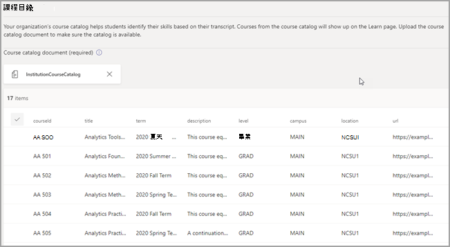

# <a name="purchase-configure-and-enable-career-coach-for-microsoft-teams"></a><span data-ttu-id="762d5-103">購買、設定及啟用適用于Microsoft Teams</span><span class="sxs-lookup"><span data-stu-id="762d5-103">Purchase, configure, and enable Career Coach for Microsoft Teams</span></span>

<span data-ttu-id="762d5-104">職稱教練是Microsoft Teams教育用應用程式，由 LinkedIn 提供個人化指引，讓高教學生流覽其事業歷程。</span><span class="sxs-lookup"><span data-stu-id="762d5-104">Career Coach is a Microsoft Teams for Education app powered by LinkedIn that provides personalized guidance for higher education students to navigate their career journey.</span></span> <span data-ttu-id="762d5-105">Career Coach 為教育機構提供一個統一的生涯解決方案，讓學生探索其事業路徑、培養實際技能，以及將他們的網路全部建在一個地方。</span><span class="sxs-lookup"><span data-stu-id="762d5-105">Career Coach offers educational institutions a unified career solution for students to discover their career path, grow real-world skills, and build their network all in one place.</span></span>

<span data-ttu-id="762d5-106">深入瞭解職業 [教練](https://aka.ms/career-coach)。</span><span class="sxs-lookup"><span data-stu-id="762d5-106">Learn more about [Career Coach](https://aka.ms/career-coach).</span></span>

> [!NOTE]
> <span data-ttu-id="762d5-107">使用本指南中的最佳作法和實用秘訣，為學生、教職員啟用專業教練的功能。</span><span class="sxs-lookup"><span data-stu-id="762d5-107">Use the best practices and helpful tips in this guide to enable the capabilities of Career Coach for students, faculty, and staff.</span></span> <span data-ttu-id="762d5-108">請參閱 [快速規劃指南](https://support.microsoft.com/office/c5d0b934-bfcf-4fe7-8a85-ba7bbb1b6ad4) 文章。</span><span class="sxs-lookup"><span data-stu-id="762d5-108">See the [Quick planning guide](https://support.microsoft.com/office/c5d0b934-bfcf-4fe7-8a85-ba7bbb1b6ad4) article.</span></span>

## <a name="review-the-requirements"></a><span data-ttu-id="762d5-109">審查需求</span><span class="sxs-lookup"><span data-stu-id="762d5-109">Review the requirements</span></span>

<span data-ttu-id="762d5-110">若要為教育機構啟用 Career Coach，請審查讓應用程式啟動及運作所需的內容。</span><span class="sxs-lookup"><span data-stu-id="762d5-110">To enable Career Coach for your educational institution, review what you need to get the app up and running.</span></span>

<span data-ttu-id="762d5-111">**技術需求**</span><span class="sxs-lookup"><span data-stu-id="762d5-111">**Technical requirements**</span></span>

  - <span data-ttu-id="762d5-112">Office 365租使用者Azure Active Directory</span><span class="sxs-lookup"><span data-stu-id="762d5-112">Office 365 tenant with Azure Active Directory</span></span>

  - <span data-ttu-id="762d5-113">Microsoft Teams</span><span class="sxs-lookup"><span data-stu-id="762d5-113">Microsoft Teams</span></span>

  - <span data-ttu-id="762d5-114">LinkedIn帳戶Azure Active Directory</span><span class="sxs-lookup"><span data-stu-id="762d5-114">LinkedIn account connections in Azure Active Directory</span></span>

<span data-ttu-id="762d5-115">**許可證**</span><span class="sxs-lookup"><span data-stu-id="762d5-115">**Licenses**</span></span>

  - <span data-ttu-id="762d5-116">教師</span><span class="sxs-lookup"><span data-stu-id="762d5-116">Faculty</span></span> 

  - <span data-ttu-id="762d5-117">學生</span><span class="sxs-lookup"><span data-stu-id="762d5-117">Students</span></span>

> [!NOTE]
> <span data-ttu-id="762d5-118">必須指派專業教練教職員授權給 IT 系統管理員，以完成此組組。</span><span class="sxs-lookup"><span data-stu-id="762d5-118">A Career Coach Faculty license must be assigned to the IT admin completing the configuration.</span></span>

<span data-ttu-id="762d5-119">**教育機構的資料與檔案**</span><span class="sxs-lookup"><span data-stu-id="762d5-119">**Data and files from your educational institution**</span></span>

  - <span data-ttu-id="762d5-120">課程目錄資料</span><span class="sxs-lookup"><span data-stu-id="762d5-120">Course catalog data</span></span>

  - <span data-ttu-id="762d5-121">提供的學習欄位</span><span class="sxs-lookup"><span data-stu-id="762d5-121">Fields of study offered</span></span>

  - <span data-ttu-id="762d5-122">教育機構的LinkedIn頁面</span><span class="sxs-lookup"><span data-stu-id="762d5-122">Educational institution’s LinkedIn page</span></span>

  - <span data-ttu-id="762d5-123">LinkedIn學習校園訂閱 (偏好) </span><span class="sxs-lookup"><span data-stu-id="762d5-123">LinkedIn Learning campus subscription (preferred)</span></span>

## <a name="purchase-the-career-coach-licenses"></a><span data-ttu-id="762d5-124">購買職業教練授權</span><span class="sxs-lookup"><span data-stu-id="762d5-124">Purchase the Career Coach licenses</span></span>

<span data-ttu-id="762d5-125">透過註冊教育解決方案 (EES) 、雲端服務提供者 (雲端解決方案) ，以及 Microsoft 365 系統管理中心 (web) ，除了中國與俄羅斯) 之外，全球範圍都提供專業教練。 (</span><span class="sxs-lookup"><span data-stu-id="762d5-125">Career Coach is available worldwide (except China and Russia) for qualified higher education institutions through Enrollment for Education Solutions (EES), Cloud Service Providers (CSP), and Microsoft 365 admin center (web direct).</span></span> <span data-ttu-id="762d5-126">做為Microsoft Teams應用程式，客戶必須擁有Microsoft 365 A3/A5 或 Office 365 A1/A3/A5。</span><span class="sxs-lookup"><span data-stu-id="762d5-126">As a Microsoft Teams app, customers must have Microsoft 365 A3/A5 or Office 365 A1/A3/A5.</span></span>

### <a name="assign-app-licenses-to-users"></a><span data-ttu-id="762d5-127">指派應用程式授權給使用者</span><span class="sxs-lookup"><span data-stu-id="762d5-127">Assign app licenses to users</span></span>

<span data-ttu-id="762d5-128">有關逐步指示，請參閱指派 [授權給使用者](https://docs.microsoft.com/microsoft-365/admin/manage/assign-licenses-to-users)。</span><span class="sxs-lookup"><span data-stu-id="762d5-128">For step-by-step instructions, see [Assign licenses to users](https://docs.microsoft.com/microsoft-365/admin/manage/assign-licenses-to-users).</span></span>

### <a name="turn-on-linkedin-account-connections"></a><span data-ttu-id="762d5-129">開啟LinkedIn帳戶連結</span><span class="sxs-lookup"><span data-stu-id="762d5-129">Turn on LinkedIn account connections</span></span>

<span data-ttu-id="762d5-130">職稱 **教練** 要求教育機構的使用者能夠將其帳戶Microsoft 365到他們在LinkedIn教練中協助使用的帳戶</span><span class="sxs-lookup"><span data-stu-id="762d5-130">Career Coach **requires** your educational institution’s users to have the ability to connect their Microsoft 365 account to their LinkedIn account that is facilitated within Career Coach</span></span>

1. <span data-ttu-id="762d5-131">使用 Azure [AD](https://aad.portal.azure.com/) 組織的全域系統管理員帳戶來登錄 Azure AD 系統管理中心。</span><span class="sxs-lookup"><span data-stu-id="762d5-131">Sign in to the [Azure AD admin center](https://aad.portal.azure.com/) with an account that's a global admin for the Azure AD organization.</span></span>

2. <span data-ttu-id="762d5-132">選取 **使用者**。</span><span class="sxs-lookup"><span data-stu-id="762d5-132">Select **Users**.</span></span>

3. <span data-ttu-id="762d5-133">在使用者 **頁面上** ，選取 使用者 **設定**。</span><span class="sxs-lookup"><span data-stu-id="762d5-133">On the **Users** page, select **User settings**.</span></span>

4. <span data-ttu-id="762d5-134">在 **LinkedIn帳戶** 連結下，允許使用者連接其帳戶，以存取LinkedIn Microsoft App 中的帳戶連結。</span><span class="sxs-lookup"><span data-stu-id="762d5-134">Under **LinkedIn account connections**, allow users to connect their accounts to access their LinkedIn connections within some Microsoft apps.</span></span> <span data-ttu-id="762d5-135">使用者同意連接其帳戶之前，不會共用任何資料。</span><span class="sxs-lookup"><span data-stu-id="762d5-135">No data is shared until users consent to connect their accounts.</span></span>

   - <span data-ttu-id="762d5-136">選取 **是** ，為教育機構的所有使用者啟用服務</span><span class="sxs-lookup"><span data-stu-id="762d5-136">Select **Yes** to enable the service for all users in your educational institution</span></span>

   - <span data-ttu-id="762d5-137">選取 **選取的** 群組，只為教育機構中一群選取的使用者啟用服務</span><span class="sxs-lookup"><span data-stu-id="762d5-137">Select **Selected group** to enable the service for only a group of selected users in your educational institution</span></span>

   - <span data-ttu-id="762d5-138">選取 **No** 以撤銷教育機構中所有使用者的同意</span><span class="sxs-lookup"><span data-stu-id="762d5-138">Select **No** to withdraw consent from all users in your educational institution</span></span>

<span data-ttu-id="762d5-139">瞭解如何在 LinkedIn[中整合帳戶Azure Active Directory](/azure/active-directory/enterprise-users/linkedin-integration)</span><span class="sxs-lookup"><span data-stu-id="762d5-139">Learn how to [Integrate LinkedIn account connections in Azure Active Directory](/azure/active-directory/enterprise-users/linkedin-integration)</span></span>

## <a name="configure-career-coach-in-the-teams-admin-center"></a><span data-ttu-id="762d5-140">在系統管理中心設定Teams教練</span><span class="sxs-lookup"><span data-stu-id="762d5-140">Configure Career Coach in the Teams admin center</span></span>

<span data-ttu-id="762d5-141">您可以使用系統管理中心中的Microsoft Teams設定，為教育機構設定 Career Coach，並讓使用者啟用。</span><span class="sxs-lookup"><span data-stu-id="762d5-141">Using the admin settings in the Microsoft Teams admin center, you can configure Career Coach for your educational institution and enable it for users.</span></span>

## <a name="access-the-career-coach-app-settings"></a><span data-ttu-id="762d5-142">存取職業教練應用程式設定</span><span class="sxs-lookup"><span data-stu-id="762d5-142">Access the Career Coach app settings</span></span>

<span data-ttu-id="762d5-143">使用管理[應用程式頁面](/microsoftteams/manage-apps)來Teams教育機構應用程式目錄中的 App。</span><span class="sxs-lookup"><span data-stu-id="762d5-143">Use the [Manage apps page](/microsoftteams/manage-apps) to view the Teams apps in your educational institution’s app catalog.</span></span>

1. <span data-ttu-id="762d5-144">請Teams **系統管理中心**。</span><span class="sxs-lookup"><span data-stu-id="762d5-144">Sign in to the **Teams admin center**.</span></span>

2. <span data-ttu-id="762d5-145">在左側流覽中，選取 **Teams**  >  **應用程式管理應用程式**。</span><span class="sxs-lookup"><span data-stu-id="762d5-145">In the left navigation, select **Teams apps** > **Manage apps**.</span></span>  

    > [!NOTE]
    > <span data-ttu-id="762d5-146">您必須是全域系統管理員Teams服務系統管理員才能存取頁面。</span><span class="sxs-lookup"><span data-stu-id="762d5-146">You must be a global admin or Teams service admin to access the page.</span></span>

3. <span data-ttu-id="762d5-147">搜尋或流覽 **職業教練**。</span><span class="sxs-lookup"><span data-stu-id="762d5-147">Search or browse for **Career Coach**.</span></span>  

4. <span data-ttu-id="762d5-148">選取 **生涯教練**，然後選取 **設定。**</span><span class="sxs-lookup"><span data-stu-id="762d5-148">Select **Career Coach**, and then select **Settings.**</span></span>  

    

### <a name="configure-the-career-coach-app-settings"></a><span data-ttu-id="762d5-150">設定職業教練應用程式設定</span><span class="sxs-lookup"><span data-stu-id="762d5-150">Configure the Career Coach app settings</span></span>

<span data-ttu-id="762d5-151">職業教練有五種組組類別：</span><span class="sxs-lookup"><span data-stu-id="762d5-151">Career Coach has five configuration categories:</span></span>

- [<span data-ttu-id="762d5-152">品牌和喜好設定</span><span class="sxs-lookup"><span data-stu-id="762d5-152">Brand and preferences</span></span>](#brand-and-preferences)

- [<span data-ttu-id="762d5-153">LinkedIn組</span><span class="sxs-lookup"><span data-stu-id="762d5-153">LinkedIn configuration</span></span>](#linkedin-configuration)

- [<span data-ttu-id="762d5-154">課程目錄</span><span class="sxs-lookup"><span data-stu-id="762d5-154">Course catalog</span></span>](#course-catalog)

- [<span data-ttu-id="762d5-155">學習領域</span><span class="sxs-lookup"><span data-stu-id="762d5-155">Fields of study</span></span>](#fields-of-study)

- [<span data-ttu-id="762d5-156">定制</span><span class="sxs-lookup"><span data-stu-id="762d5-156">Customization</span></span>](#customization)

> [!NOTE]
> <span data-ttu-id="762d5-157">品牌和喜好設定LinkedIn設定、課程目錄和學習領域，才能有效啟用適用于學生、教職員和教職員的應用程式。</span><span class="sxs-lookup"><span data-stu-id="762d5-157">Brand and preferences, LinkedIn configuration, Course catalog, and Fields of study are **required** to effectively enable the app for students, faculty, and staff.</span></span>

#### <a name="brand-and-preferences"></a><span data-ttu-id="762d5-158">品牌和喜好設定</span><span class="sxs-lookup"><span data-stu-id="762d5-158">Brand and preferences</span></span>

<span data-ttu-id="762d5-159">在品牌和喜好設定設定頁面上設定教育機構的名稱、標誌和預設語言。</span><span class="sxs-lookup"><span data-stu-id="762d5-159">Set your educational institution’s name, logo, and default language on the brand and preferences settings page.</span></span>


##### <a name="educational-institution-icon"></a><span data-ttu-id="762d5-161">教育機構圖示</span><span class="sxs-lookup"><span data-stu-id="762d5-161">Educational institution icon</span></span>

<span data-ttu-id="762d5-162">教育機構圖示會用於整個 Career Coach，以識別教育機構特有的內容、整個 App 的課程目錄資源，以及儀表板的實際體驗區段。</span><span class="sxs-lookup"><span data-stu-id="762d5-162">The educational institution icon is used throughout Career Coach to identify content unique to your educational institution, course catalog resources throughout the app, and on the real-world experiences section of the dashboard.</span></span> <span data-ttu-id="762d5-163">圖示的格式最好為：</span><span class="sxs-lookup"><span data-stu-id="762d5-163">The icon is best formatted as:</span></span>

 - <span data-ttu-id="762d5-164">透明 PNG</span><span class="sxs-lookup"><span data-stu-id="762d5-164">A transparent PNG</span></span>
 - <span data-ttu-id="762d5-165">長寬比為 1：1</span><span class="sxs-lookup"><span data-stu-id="762d5-165">Aspect ratio of 1:1</span></span>
 - <span data-ttu-id="762d5-166">最大大小為 64 px x 64 px。</span><span class="sxs-lookup"><span data-stu-id="762d5-166">Maximum size of 64 px x 64 px.</span></span>

##### <a name="educational-institution-thumbnail"></a><span data-ttu-id="762d5-167">教育機構縮圖</span><span class="sxs-lookup"><span data-stu-id="762d5-167">Educational institution thumbnail</span></span>

<span data-ttu-id="762d5-168">當課程無法使用特定影像時，教育機構圖示會用於整個 App 的課程目錄資源。</span><span class="sxs-lookup"><span data-stu-id="762d5-168">The educational institution icon will be used for course catalog resources throughout the app when a specific image isn't available for a course.</span></span> <span data-ttu-id="762d5-169">圖示的格式最好為：</span><span class="sxs-lookup"><span data-stu-id="762d5-169">The icon is best formatted as:</span></span>

- <span data-ttu-id="762d5-170">A PNG</span><span class="sxs-lookup"><span data-stu-id="762d5-170">A PNG</span></span>
- <span data-ttu-id="762d5-171">長寬比為 16：9</span><span class="sxs-lookup"><span data-stu-id="762d5-171">Aspect ratio of 16:9</span></span>
- <span data-ttu-id="762d5-172">最大大小為 360 px x 200 px。</span><span class="sxs-lookup"><span data-stu-id="762d5-172">Maximum size of 360 px x 200 px.</span></span>

#### <a name="linkedin-configuration"></a><span data-ttu-id="762d5-173">LinkedIn組</span><span class="sxs-lookup"><span data-stu-id="762d5-173">LinkedIn configuration</span></span>

<span data-ttu-id="762d5-174">此LinkedIn組會連接來自公司之公開LinkedIn。</span><span class="sxs-lookup"><span data-stu-id="762d5-174">The LinkedIn configuration connects Career Coach with public alumni data from LinkedIn.</span></span>

> [!NOTE]
> <span data-ttu-id="762d5-175">未經頁面連結驗證，才能啟用LinkedIn教練。</span><span class="sxs-lookup"><span data-stu-id="762d5-175">Career Coach can't be enabled without the LinkedIn page connection verified.</span></span>

##### <a name="add-and-confirm-the-linkedin-page"></a><span data-ttu-id="762d5-176">新增並確認LinkedIn頁面</span><span class="sxs-lookup"><span data-stu-id="762d5-176">Add and confirm the LinkedIn page</span></span>

<span data-ttu-id="762d5-177">決定教育機構的LinkedIn頁面。</span><span class="sxs-lookup"><span data-stu-id="762d5-177">Determine the educational institution's LinkedIn page.</span></span> <span data-ttu-id="762d5-178">在 LinkedIn搜尋或LinkedIn職員工成員，以判斷要使用的正確頁面，以尋找該頁面。</span><span class="sxs-lookup"><span data-stu-id="762d5-178">Find the LinkedIn page by searching on LinkedIn or connecting with a career services staff member to determine the correct page to use.</span></span>  
  
1. <span data-ttu-id="762d5-179">請Teams **系統管理中心**。</span><span class="sxs-lookup"><span data-stu-id="762d5-179">Sign in to the **Teams admin center**.</span></span>

1. <span data-ttu-id="762d5-180">選取 **Teams App** 管理  >  **App** Career  >  **Coach**  >  **LinkedIn連接**。</span><span class="sxs-lookup"><span data-stu-id="762d5-180">Select **Teams apps** > **Manage apps** > **Career Coach** > **LinkedIn connection**.</span></span>

2. <span data-ttu-id="762d5-181">輸入教育機構的 LinkedIn URL。</span><span class="sxs-lookup"><span data-stu-id="762d5-181">Enter your educational institution's LinkedIn page URL.</span></span>  

3. <span data-ttu-id="762d5-182">選取 **Apply**。</span><span class="sxs-lookup"><span data-stu-id="762d5-182">Select **Apply**.</span></span>

4. <span data-ttu-id="762d5-183">複製驗證 URL，然後與教育機構的頁面系統管理員LinkedIn頁面LinkedIn[共用。](https://www.linkedin.com/help/linkedin/answer/4783/linkedin-page-admins-overview?lang=en)</span><span class="sxs-lookup"><span data-stu-id="762d5-183">Copy the verification URL and share it with your educational institution’s LinkedIn page admin [LinkedIn page admin documentation](https://www.linkedin.com/help/linkedin/answer/4783/linkedin-page-admins-overview?lang=en).</span></span> <span data-ttu-id="762d5-184">驗證連結會在 30 天后到期。</span><span class="sxs-lookup"><span data-stu-id="762d5-184">The verification link expires after 30 days.</span></span>  

     

#### <a name="course-catalog"></a><span data-ttu-id="762d5-186">課程目錄</span><span class="sxs-lookup"><span data-stu-id="762d5-186">Course catalog</span></span>

<span data-ttu-id="762d5-187">課程目錄代表教育機構提供給學生的課程和課程。</span><span class="sxs-lookup"><span data-stu-id="762d5-187">The course catalog represents the courses and classes offered to students by your educational institution.</span></span> <span data-ttu-id="762d5-188">這些課程在 App 中用於兩個區域：</span><span class="sxs-lookup"><span data-stu-id="762d5-188">These courses are used within the app in two areas:</span></span>

- <span data-ttu-id="762d5-189">課程會作為學習資源的一部分退回。</span><span class="sxs-lookup"><span data-stu-id="762d5-189">Courses are returned as part of learning resources.</span></span>  

- <span data-ttu-id="762d5-190">課程和課程中繼資料 ，例如描述，可用來協助學生上傳文字記錄時識別其技能。</span><span class="sxs-lookup"><span data-stu-id="762d5-190">Courses and course meta data, like descriptions, are used to help students identify their skills when they upload a transcript.</span></span>  

<span data-ttu-id="762d5-191">若要建立課程目錄，請彙集教育機構所傳授的所有課程清單，並上傳為 CSV 檔案。</span><span class="sxs-lookup"><span data-stu-id="762d5-191">To create the course catalog, put together a list of all courses taught at your educational institution and upload it as a CSV file.</span></span> <span data-ttu-id="762d5-192">應用程式會從課程目錄繪製，以從學生的成績記錄中找出其技能，並建議要參加的課程。</span><span class="sxs-lookup"><span data-stu-id="762d5-192">The app draws from the course catalog to identify a student’s skills from their transcript and to suggest courses to take.</span></span> 

> [!NOTE]
> <span data-ttu-id="762d5-193">請參閱[資料在 Teams](location-of-data-in-teams.md) [安全性與](security-compliance-overview.md)合規性中的位置，以瞭解保護學生資訊的資訊。</span><span class="sxs-lookup"><span data-stu-id="762d5-193">See [Location of data in Teams](location-of-data-in-teams.md) and [Security and compliance](security-compliance-overview.md) for information about protecting of student information.</span></span> 

##### <a name="course-catalog-documents-formatting-and-schema"></a><span data-ttu-id="762d5-194">課程目錄檔案格式和架構</span><span class="sxs-lookup"><span data-stu-id="762d5-194">Course catalog documents formatting and schema</span></span>

<span data-ttu-id="762d5-195">檔必須採用 CSV 格式，大小上限為 18 MB。</span><span class="sxs-lookup"><span data-stu-id="762d5-195">The document needs to be in CSV format with a maximum size of 18 MB.</span></span> <span data-ttu-id="762d5-196">檔必須包含必要的欄位課程 **標題**、**課程識別碼** 和 **課程 URL。**</span><span class="sxs-lookup"><span data-stu-id="762d5-196">The document must contain the required fields **course title**, **course ID**, and **course URL**.</span></span> <span data-ttu-id="762d5-197">包含建議的欄位可返回更好的搜尋結果和技能識別，改善學生的體驗。</span><span class="sxs-lookup"><span data-stu-id="762d5-197">Including the recommended fields improves the experience for students by returning better search results and skill identification.</span></span>

> [!NOTE]
> <span data-ttu-id="762d5-198">從範例課程 [目錄檔]( https://aka.ms/career-coach/docs/it-admins/sample-catalog) 開始著手。</span><span class="sxs-lookup"><span data-stu-id="762d5-198">Start with the [sample course catalog]( https://aka.ms/career-coach/docs/it-admins/sample-catalog) document to get started.</span></span>

##### <a name="sample-csv-file"></a><span data-ttu-id="762d5-199">範例.CSV檔案</span><span class="sxs-lookup"><span data-stu-id="762d5-199">Sample .CSV file</span></span>

```
courseId,title,sourceLink,description,language,format,thumbnailLink,thumbnailAltText,educationLevel,topics
"AA-501","Analytics Foundations","https://example.com/course-id","This course equips the student with the knowledge and skills needed to conduct and present large-scale studies based on advanced analytics.","en-us","In-person","https://via.placeholder.com/360x200","Undergraduate","Alt text for the thumbnail","analytics, data science, data analysis, linear regression"
```

<span data-ttu-id="762d5-200">下表顯示課程目錄中要包含的專案：</span><span class="sxs-lookup"><span data-stu-id="762d5-200">The following table shows the items to include in the course catalog:</span></span>


| <span data-ttu-id="762d5-201">名稱</span><span class="sxs-lookup"><span data-stu-id="762d5-201">Name</span></span>             | <span data-ttu-id="762d5-202">地位</span><span class="sxs-lookup"><span data-stu-id="762d5-202">Status</span></span>      | <span data-ttu-id="762d5-203">類型</span><span class="sxs-lookup"><span data-stu-id="762d5-203">Type</span></span>   | <span data-ttu-id="762d5-204">描述</span><span class="sxs-lookup"><span data-stu-id="762d5-204">Description</span></span>                                                                    |
|------------------|-------------|--------|--------------------------------------------------------------------------------|
| <span data-ttu-id="762d5-205">courseId</span><span class="sxs-lookup"><span data-stu-id="762d5-205">courseId</span></span>         | <span data-ttu-id="762d5-206">必要</span><span class="sxs-lookup"><span data-stu-id="762d5-206">Required</span></span>    | <span data-ttu-id="762d5-207">字串</span><span class="sxs-lookup"><span data-stu-id="762d5-207">string</span></span> | <span data-ttu-id="762d5-208">課程識別碼通常 (會與文字記錄中產生的內容) 。</span><span class="sxs-lookup"><span data-stu-id="762d5-208">Usually the course id (Typically maps to what is generated in the transcript).</span></span> |
| <span data-ttu-id="762d5-209">標題</span><span class="sxs-lookup"><span data-stu-id="762d5-209">title</span></span>            | <span data-ttu-id="762d5-210">必要</span><span class="sxs-lookup"><span data-stu-id="762d5-210">Required</span></span>    | <span data-ttu-id="762d5-211">字串</span><span class="sxs-lookup"><span data-stu-id="762d5-211">string</span></span> | <span data-ttu-id="762d5-212">通常是課程標題。</span><span class="sxs-lookup"><span data-stu-id="762d5-212">Usually the course title.</span></span>                                                      |
| <span data-ttu-id="762d5-213">sourceLink</span><span class="sxs-lookup"><span data-stu-id="762d5-213">sourceLink</span></span>       | <span data-ttu-id="762d5-214">必要</span><span class="sxs-lookup"><span data-stu-id="762d5-214">Required</span></span>    | <span data-ttu-id="762d5-215">Url</span><span class="sxs-lookup"><span data-stu-id="762d5-215">URL</span></span>    | <span data-ttu-id="762d5-216">課程頁面的網站連結。</span><span class="sxs-lookup"><span data-stu-id="762d5-216">Website link to the course page.</span></span>                                               |
| <span data-ttu-id="762d5-217">描述</span><span class="sxs-lookup"><span data-stu-id="762d5-217">description</span></span>      | <span data-ttu-id="762d5-218">推薦</span><span class="sxs-lookup"><span data-stu-id="762d5-218">Recommended</span></span> | <span data-ttu-id="762d5-219">字串</span><span class="sxs-lookup"><span data-stu-id="762d5-219">string</span></span> | <span data-ttu-id="762d5-220">課程簡介文字。</span><span class="sxs-lookup"><span data-stu-id="762d5-220">Introduction text for the course.</span></span>                                              |
| <span data-ttu-id="762d5-221">語言</span><span class="sxs-lookup"><span data-stu-id="762d5-221">language</span></span>         | <span data-ttu-id="762d5-222">推薦</span><span class="sxs-lookup"><span data-stu-id="762d5-222">Recommended</span></span> | <span data-ttu-id="762d5-223">字串</span><span class="sxs-lookup"><span data-stu-id="762d5-223">string</span></span> | <span data-ttu-id="762d5-224">課程語言。</span><span class="sxs-lookup"><span data-stu-id="762d5-224">Language of the course.</span></span> <span data-ttu-id="762d5-225">使用標準語言代碼。</span><span class="sxs-lookup"><span data-stu-id="762d5-225">Use standard language codes.</span></span>                           |
| <span data-ttu-id="762d5-226">格式</span><span class="sxs-lookup"><span data-stu-id="762d5-226">format</span></span>           | <span data-ttu-id="762d5-227">推薦</span><span class="sxs-lookup"><span data-stu-id="762d5-227">Recommended</span></span> | <span data-ttu-id="762d5-228">字串</span><span class="sxs-lookup"><span data-stu-id="762d5-228">string</span></span> | <span data-ttu-id="762d5-229">教學模式，例如線上、視像、個人。</span><span class="sxs-lookup"><span data-stu-id="762d5-229">Mode of teaching, e.g., online, video, in-person.</span></span>                              |
| <span data-ttu-id="762d5-230">縮圖連結</span><span class="sxs-lookup"><span data-stu-id="762d5-230">thumbnailLink</span></span>    | <span data-ttu-id="762d5-231">推薦</span><span class="sxs-lookup"><span data-stu-id="762d5-231">Recommended</span></span> | <span data-ttu-id="762d5-232">Url</span><span class="sxs-lookup"><span data-stu-id="762d5-232">URL</span></span>    | <span data-ttu-id="762d5-233">課程影像的縮圖連結。</span><span class="sxs-lookup"><span data-stu-id="762d5-233">Thumbnail link to the course image.</span></span>                                            |
| <span data-ttu-id="762d5-234">縮圖AltText</span><span class="sxs-lookup"><span data-stu-id="762d5-234">thumbnailAltText</span></span> | <span data-ttu-id="762d5-235">推薦</span><span class="sxs-lookup"><span data-stu-id="762d5-235">Recommended</span></span> | <span data-ttu-id="762d5-236">字串</span><span class="sxs-lookup"><span data-stu-id="762d5-236">string</span></span> | <span data-ttu-id="762d5-237">影像的協助工具替代文字</span><span class="sxs-lookup"><span data-stu-id="762d5-237">Accessibility alt text for the image</span></span>                                           |
| <span data-ttu-id="762d5-238">educationLevel</span><span class="sxs-lookup"><span data-stu-id="762d5-238">educationLevel</span></span>   | <span data-ttu-id="762d5-239">推薦</span><span class="sxs-lookup"><span data-stu-id="762d5-239">Recommended</span></span> | <span data-ttu-id="762d5-240">字串</span><span class="sxs-lookup"><span data-stu-id="762d5-240">string</span></span> | <span data-ttu-id="762d5-241">學習層級，例如</span><span class="sxs-lookup"><span data-stu-id="762d5-241">Study level, ex.</span></span> <span data-ttu-id="762d5-242">文科/畢業生。</span><span class="sxs-lookup"><span data-stu-id="762d5-242">Undergraduate/Graduate.</span></span>                                       |
| <span data-ttu-id="762d5-243">主題</span><span class="sxs-lookup"><span data-stu-id="762d5-243">topics</span></span>           | <span data-ttu-id="762d5-244">推薦</span><span class="sxs-lookup"><span data-stu-id="762d5-244">Recommended</span></span> | <span data-ttu-id="762d5-245">字串</span><span class="sxs-lookup"><span data-stu-id="762d5-245">string</span></span> | <span data-ttu-id="762d5-246">與課程所傳授技巧相關聯的主題或標記。</span><span class="sxs-lookup"><span data-stu-id="762d5-246">Topics or tags that are associated with the skills the courses teach.</span></span>          |

##### <a name="add-the-course-catalog"></a><span data-ttu-id="762d5-247">新增課程目錄</span><span class="sxs-lookup"><span data-stu-id="762d5-247">Add the course catalog</span></span>

1. <span data-ttu-id="762d5-248">請Teams **系統管理中心**。</span><span class="sxs-lookup"><span data-stu-id="762d5-248">Sign in to the **Teams admin center**.</span></span>

1. <span data-ttu-id="762d5-249">選取 **Teams App** 管理 &gt; **App** Career &gt; **Coach** &gt; **設定** &gt; **課程目錄**。  </span><span class="sxs-lookup"><span data-stu-id="762d5-249">Select **Teams apps** &gt; **Manage apps** &gt; **Career Coach** &gt; **Settings** &gt;  **Course catalog**.</span></span>

2. <span data-ttu-id="762d5-250">Upload CSV 格式的課程。</span><span class="sxs-lookup"><span data-stu-id="762d5-250">Upload courses in CSV format.</span></span>

4. <span data-ttu-id="762d5-251">選取 **Apply**。</span><span class="sxs-lookup"><span data-stu-id="762d5-251">Select **Apply**.</span></span>

   

#### <a name="fields-of-study"></a><span data-ttu-id="762d5-253">學習領域</span><span class="sxs-lookup"><span data-stu-id="762d5-253">Fields of study</span></span>

<span data-ttu-id="762d5-254">學習領域與主要興趣領域、學術專業和學位是同義字。</span><span class="sxs-lookup"><span data-stu-id="762d5-254">The fields of study are synonymous with major areas of interest, academic major, and degree.</span></span> <span data-ttu-id="762d5-255">學生開始使用 App 並開始設定個人化設定檔時，會參照這些標題。</span><span class="sxs-lookup"><span data-stu-id="762d5-255">These titles are referenced by students when they start using the app and begin setting up their personalized profile.</span></span>

<span data-ttu-id="762d5-256">新增所有學生可用的學習欄位，例如工程、英文、商務等等。</span><span class="sxs-lookup"><span data-stu-id="762d5-256">Add all fields of study available to students such as Engineering, English, Business, and so on.</span></span> <span data-ttu-id="762d5-257">欄位清單可讓學生探索可能感興趣的學習欄位，並新增其焦點區域至個人檔案。</span><span class="sxs-lookup"><span data-stu-id="762d5-257">The list of fields lets students discover fields of study that may interest them and add their area of focus to their profile.</span></span>

> [!NOTE]
> <span data-ttu-id="762d5-258">從研究 [檔的範例欄位](https://aka.ms/career-coach/docs/it-admins/sample-fieldsofstudy) 開始。</span><span class="sxs-lookup"><span data-stu-id="762d5-258">Start with the [sample field of study](https://aka.ms/career-coach/docs/it-admins/sample-fieldsofstudy) document.</span></span>
##### <a name="add-the-fields-of-study"></a><span data-ttu-id="762d5-259">新增學習欄位</span><span class="sxs-lookup"><span data-stu-id="762d5-259">Add the fields of study</span></span>

1. <span data-ttu-id="762d5-260">請Teams **系統管理中心**。</span><span class="sxs-lookup"><span data-stu-id="762d5-260">Sign in to the **Teams admin center**.</span></span>
1. <span data-ttu-id="762d5-261">選取 **Teams** &gt; **應用程式 管理應用程式** &gt; **：設定** &gt;  &gt; **訓練課程和學習領域**。  </span><span class="sxs-lookup"><span data-stu-id="762d5-261">Select **Teams apps** &gt; **Manage apps** &gt; **Career Coach** &gt; **Settings** &gt;  **Fields of study**.</span></span>

2. <span data-ttu-id="762d5-262">Upload CSV 格式的學習領域。</span><span class="sxs-lookup"><span data-stu-id="762d5-262">Upload field of study in CSV format.</span></span>

3. <span data-ttu-id="762d5-263">選取 **Apply**。</span><span class="sxs-lookup"><span data-stu-id="762d5-263">Select **Apply**.</span></span>

#### <a name="customization"></a><span data-ttu-id="762d5-264">定制</span><span class="sxs-lookup"><span data-stu-id="762d5-264">Customization</span></span>

<span data-ttu-id="762d5-265">您可以自訂您的教育機構唯一的生涯教練。</span><span class="sxs-lookup"><span data-stu-id="762d5-265">Career Coach can be customized to be unique to your educational institution.</span></span> <span data-ttu-id="762d5-266">自訂支援新增體驗至儀表板。</span><span class="sxs-lookup"><span data-stu-id="762d5-266">The customization supports adding experiences to the dashboard.</span></span> <span data-ttu-id="762d5-267">建議您新增工作板、活動、職稱服務辦公室、職稱相關活動、學生俱樂部的連結，以及協助學生取得實際經驗的其他資源。</span><span class="sxs-lookup"><span data-stu-id="762d5-267">It's recommended to add links to job boards, events, career services office, career-related events, student clubs, and any other resources that help students gain real-world experience.</span></span>

##### <a name="add-customized-experiences"></a><span data-ttu-id="762d5-268">新增自訂體驗</span><span class="sxs-lookup"><span data-stu-id="762d5-268">Add customized experiences</span></span>

1. <span data-ttu-id="762d5-269">請Teams **系統管理中心**。</span><span class="sxs-lookup"><span data-stu-id="762d5-269">Sign in to the **Teams admin center**.</span></span>

1. <span data-ttu-id="762d5-270">選取 **Teams App** 管理 &gt; **App** Career Coach &gt;   >  **設定** &gt; **自訂**。</span><span class="sxs-lookup"><span data-stu-id="762d5-270">Select **Teams apps** &gt; **Manage apps** &gt; **Career Coach** > **Settings** &gt; **Customization**.</span></span>

2. <span data-ttu-id="762d5-271">新增每個 URL、標題和簡短描述。</span><span class="sxs-lookup"><span data-stu-id="762d5-271">Add each URL, a title, and short description.</span></span>  
  
3. <span data-ttu-id="762d5-272">選取 **Apply**。</span><span class="sxs-lookup"><span data-stu-id="762d5-272">Select **Apply**.</span></span>

### <a name="enable-the-app"></a><span data-ttu-id="762d5-273">啟用應用程式</span><span class="sxs-lookup"><span data-stu-id="762d5-273">Enable the app</span></span>

<span data-ttu-id="762d5-274">完成組組之後，請為學生和授權使用者啟用應用程式，以便他們存取職業教練。</span><span class="sxs-lookup"><span data-stu-id="762d5-274">After you complete the configuration, enable the app for students and licensed users so they'll have access to Career Coach.</span></span>  
  
> [!NOTE]
> <span data-ttu-id="762d5-275">您必須擁有全域或Teams管理員角色許可權。</span><span class="sxs-lookup"><span data-stu-id="762d5-275">You must have Global or Teams admin role permissions.</span></span>

1. <span data-ttu-id="762d5-276">請Teams **系統管理中心**。</span><span class="sxs-lookup"><span data-stu-id="762d5-276">Sign in to the **Teams admin center**.</span></span>

1. <span data-ttu-id="762d5-277">選取 **Teams App** 管理 &gt; **App** Career &gt; **Coach**。</span><span class="sxs-lookup"><span data-stu-id="762d5-277">Select **Teams apps** &gt; **Manage apps** &gt; **Career Coach**.</span></span>

2. <span data-ttu-id="762d5-278">將狀態切換 **開關移至** 允許 。</span><span class="sxs-lookup"><span data-stu-id="762d5-278">Move the Status toggle to **Allowed**.</span></span>  

  > [!NOTE]
  > <span data-ttu-id="762d5-279">允許表示此 App 可供教育機構中的使用者使用。</span><span class="sxs-lookup"><span data-stu-id="762d5-279">Allowed means that the app is available for users in your educational institution.</span></span> <span data-ttu-id="762d5-280">封鎖表示學生無法使用 App。</span><span class="sxs-lookup"><span data-stu-id="762d5-280">Blocked means that the app isn't available to students.</span></span>

#### <a name="pin-the-app"></a><span data-ttu-id="762d5-281">釘上應用程式</span><span class="sxs-lookup"><span data-stu-id="762d5-281">Pin the app</span></span>

<span data-ttu-id="762d5-282">釘上生涯教練，讓學生更容易使用及看到應用程式。</span><span class="sxs-lookup"><span data-stu-id="762d5-282">Pinning Career Coach will make the app more accessible and visible for students.</span></span>

1. <span data-ttu-id="762d5-283">請Teams **系統管理中心**。</span><span class="sxs-lookup"><span data-stu-id="762d5-283">Sign in to the **Teams admin center**.</span></span>

1. <span data-ttu-id="762d5-284">選取 **Teams** &gt; **應用程式設定策略** &gt; *您的策略*。</span><span class="sxs-lookup"><span data-stu-id="762d5-284">Select **Teams apps** &gt;**Setup policies** &gt; *Your policy*.</span></span> 

2. <span data-ttu-id="762d5-285">在 **釘選的 App** 下，選擇新增 **應用程式**。</span><span class="sxs-lookup"><span data-stu-id="762d5-285">Under **Pinned apps**, choose **Add apps**.</span></span>

1. <span data-ttu-id="762d5-286">搜尋 **職業教練**， **然後選取** 新增 。</span><span class="sxs-lookup"><span data-stu-id="762d5-286">Search for **Career Coach**, and then select **Add**.</span></span>

1. <span data-ttu-id="762d5-287">選擇應用程式顯示的順序， **然後選取** 儲存 。</span><span class="sxs-lookup"><span data-stu-id="762d5-287">Choose the order for the app to appear and select **Save**.</span></span>

   <span data-ttu-id="762d5-288">學生會收到有關Microsoft Teams教練已釘釘的通知。</span><span class="sxs-lookup"><span data-stu-id="762d5-288">Students will be notified in Microsoft Teams that Career Coach has been pinned.</span></span>  

## <a name="resources"></a><span data-ttu-id="762d5-289">資源</span><span class="sxs-lookup"><span data-stu-id="762d5-289">Resources</span></span>

<span data-ttu-id="762d5-290">下列資源可協助規劃您的職業教練應用程式。</span><span class="sxs-lookup"><span data-stu-id="762d5-290">The following resources will help you plan your Career Coach app.</span></span>

- [<span data-ttu-id="762d5-291">歡迎使用 Microsoft Teams</span><span class="sxs-lookup"><span data-stu-id="762d5-291">Welcome to Microsoft Teams</span></span>](Teams-overview.md)

- [<span data-ttu-id="762d5-292">如何推出 Teams</span><span class="sxs-lookup"><span data-stu-id="762d5-292">How to roll out Teams</span></span>](get-started-with-teams-resources-for-org-wide-rollout.md?tabs=SmallBusiness)

- [<span data-ttu-id="762d5-293">Microsoft Teams 中的團隊和頻道概覽</span><span class="sxs-lookup"><span data-stu-id="762d5-293">Overview of teams and channels in Microsoft Teams</span></span>](teams-channels-overview.md)

- [<span data-ttu-id="762d5-294">在系統管理中心Microsoft Teams應用程式</span><span class="sxs-lookup"><span data-stu-id="762d5-294">Managing apps in Microsoft Teams Admin Center</span></span>](manage-apps.md)

- [<span data-ttu-id="762d5-295">安全性、隱私權和合規性Microsoft Teams</span><span class="sxs-lookup"><span data-stu-id="762d5-295">Security, privacy, and compliance in Microsoft Teams</span></span>](security-compliance-overview.md)

- [<span data-ttu-id="762d5-296">線上虛擬方向套件</span><span class="sxs-lookup"><span data-stu-id="762d5-296">Online Virtual Orientation Kit</span></span>](https://www.microsoft.com/education/remote-learning/virtual-orientation) 

- [<span data-ttu-id="762d5-297">頻道的限制Teams規格</span><span class="sxs-lookup"><span data-stu-id="762d5-297">Limits and specification of Teams channels</span></span>](limits-specifications-teams.md)

- [<span data-ttu-id="762d5-298">Microsoft Teams 中的資料位置</span><span class="sxs-lookup"><span data-stu-id="762d5-298">Location of data in Microsoft Teams</span></span>](location-of-data-in-teams.md)

- [<span data-ttu-id="762d5-299">開始使用系統管理訓練Microsoft Teams</span><span class="sxs-lookup"><span data-stu-id="762d5-299">Getting started with admin training for Microsoft Teams</span></span>](ITAdmin-readiness.md)

- [<span data-ttu-id="762d5-300">Teams疑難排解</span><span class="sxs-lookup"><span data-stu-id="762d5-300">Teams troubleshooting</span></span>](/microsoftteams/troubleshoot/teams-welcome)

- [<span data-ttu-id="762d5-301">在 Microsoft Teams 中管理應用程式權限原則</span><span class="sxs-lookup"><span data-stu-id="762d5-301">Manage app permission policies in Microsoft Teams</span></span>](teams-app-permission-policies.md)
