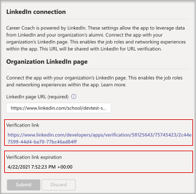

# 購買、設定及啟用職涯教練Microsoft Teams

職涯教練是一Microsoft Teams 教育版由 LinkedIn提供個人化指引的 App，為高教學生流覽其事業歷程提供個人化指引。 職涯教練為教育機構提供統一的生涯解決方案，讓學生探索其事業路徑、培養實際技能，以及將網路全部建在一個地方。

## 支援的語言

職涯教練語言進行當地語系化：

- 中文 (簡體、中國大陸) 
- 繁 (，臺灣) 
- 英文 (英文) 
- 英國 (英文) 
- 加拿大 (法文) 
- 法文 (法國) 
- 德文 (德文) 
- 日本 (日本) 
- 巴西 (葡萄牙文) 
- 西班牙文 (西班牙) 
- 墨西哥 (西班牙文) 

深入瞭解[職涯教練。](https://aka.ms/career-coach)

> [!TIP]
> 使用本指南中的最佳作法和實用秘訣，為學生、教職員職涯教練和教職員啟用此課程的功能。 請參閱 [快速規劃指南](https://support.microsoft.com/office/c5d0b934-bfcf-4fe7-8a85-ba7bbb1b6ad4) 文章。

## 審查需求

若要為職涯教練啟用應用程式，請複習讓應用程式啟動及運作所需的內容。

**技術需求**

- Office 365租使用者Azure Active Directory。

- Microsoft Teams。

- LinkedIn帳戶Azure Active Directory。

**許可證**

- 教師

- 學生

> [!IMPORTANT]
> 您必須職涯教練教職員授權給 IT 系統管理員，以完成此組定。

**教育機構的資料與檔案**

- 教育機構的標誌和圖形資產為必要的格式。

- 課程目錄資料。

- 提供的學習欄位清單。

- 教育機構的 LinkedIn [頁面](https://www.linkedin.com/help/linkedin/answer/40133/differences-between-a-linkedin-page-for-a-school-and-company?lang=en)。

- 教育機構的隱私權政策 URL。

- 教育機構連結至與職系相關的資源，例如職系服務和學生工作張貼 (選擇) 。

- LinkedIn Learning校園訂閱 (成為) 。

## 購買職涯教練授權

職涯教練 可透過教育版註冊解決方案 (EES) 、雲端服務提供者 (雲端解決方案提供者) ) 和 Microsoft 365 系統管理中心 (Web 直接) 提供適用于合格高等教育機構的 (以外的全球 (。 做為Microsoft Teams應用程式，客戶必須擁有 Microsoft 365 A3/A5 或 Office 365 A1/A3/A5 才能購買附加元件職涯教練授權。

### 指派應用程式授權給使用者

有關逐步指示，請參閱指派 [授權給使用者](/microsoft-365/admin/manage/assign-licenses-to-users)。

### 開啟LinkedIn帳戶連結

職涯教練 **要求** 教育機構的使用者能夠將他們的 Microsoft 365 帳戶與LinkedIn內便利的帳戶職涯教練。

1. 使用一個[Azure AD](https://aad.portal.azure.com/)組織全域系統管理員的帳戶，Azure AD管理中心。

2. 選取 **使用者**。

3. 在使用者 **頁面上** ，選取 使用者 **設定**。

4. **LinkedIn帳戶連結** 必須設為是或已選取 **群組，職涯教練** 正確設定。

   

   > [!NOTE]
   > 使用者同意連接其帳戶之前，不會共用任何資料。

   - 選取 **是** ，為教育機構的所有使用者啟用服務。

   - 選取 **選取的** 群組，僅針對教育機構中一群選取的使用者啟用服務。

詳細資訊，請參閱在 LinkedIn[中Azure Active Directory帳戶Azure Active Directory。](/azure/active-directory/enterprise-users/linkedin-integration)

## 存取 職涯教練 應用程式設定

使用 Microsoft Teams系統管理中心職涯教練教育機構的設定，並讓使用者啟用。

> [!IMPORTANT]
> 您必須是全域系統管理員Teams服務系統管理員才能存取頁面。

1. 請Teams **[系統管理中心](https://admin.teams.microsoft.com)**。

2. 在左側流覽中，選取 **Teams**  >  **[應用程式管理應用程式](https://admin.teams.microsoft.com/policies/manage-apps)**。  

3. 搜尋 **或流覽** 職涯教練。  

4. 選取 **職涯教練**，**然後選取** 設定。  

    

## 設定職涯教練應用程式設定

職涯教練有五種組組類別：

- [品牌和喜好設定](#brand-and-preferences) - 必填專案

- [LinkedIn -](#linkedin-connection) 需要

- [課程目錄](#course-catalog) - 必填

- [學習欄位](#fields-of-study) - 必填專案

- [定制](#customization)

> [!IMPORTANT]
> 品牌和喜好設定LinkedIn設定、課程目錄和學習領域，才能有效啟用適用于學生、教職員和教職員的應用程式。

### 品牌和喜好設定

自訂職涯教練，以配合教育機構的品牌。 您有責任尊重其他人的權利，包括著作權和商標權。

> [!IMPORTANT]
> 這是必要的一節-職涯教練提交品牌和喜好設定時，無法啟用此功能。

1. 請Teams **[系統管理中心](https://admin.teams.microsoft.com)**。

2. 選取 **Teams**  >  **[應用程式 管理應用程式職涯教練](https://admin.teams.microsoft.com/policies/manage-apps)**  >    >  **品牌和喜好設定**。

3. Upload **教育機構圖示**。 圖示會用於職涯教練教育機構所特有的內容、整個 App 的課程目錄資源，以及儀表板的實際體驗區段。 圖示的格式最好為：

    - 透明 PNG
    - 長寬比為 1：1
    - 最大大小為 64 px x 64 px

4. Upload **教育機構縮圖**。 當課程無法使用特定影像時，縮圖會用於整個 App 的課程目錄資源。 縮圖的格式最好為：

    - A PNG
    - 長寬比為 16：9
    - 最大大小為 360 px x 200 px

5. 新增 **教育機構的隱私權政策 URL。** 如果新增，機構隱私權政策將可供學生在 職涯教練 App 中校閱。

6. 選取 **提交**。

### LinkedIn連接

此LinkedIn組組會職涯教練的公開畢業生資料LinkedIn。

> [!IMPORTANT]
> 這是必要的節-職涯教練未驗證頁面連結LinkedIn啟用。

#### 新增LinkedIn頁面
  
1. 請Teams **[系統管理中心](https://admin.teams.microsoft.com)**。

2. 選取 **Teams**  >  **[應用程式 管理應用程式](https://admin.teams.microsoft.com/policies/manage-apps)**  >    >  **職涯教練LinkedIn連接**。

3. 在 LinkedIn上搜尋並選取學校篩選LinkedIn尋找該 **頁面** 。 或者，請連上職教職員成員，LinkedIn學校頁面的正確選項。 若要詳細資訊，請參閱 [如何識別LinkedIn頁面](https://www.linkedin.com/help/linkedin/answer/40133/differences-between-a-linkedin-page-for-a-school-and-company?lang=en)。

    

4. 新增LinkedIn頁面 URL。 URL 必須是學校頁面，而不是公司頁面，且格式一般為 `https://www.linkedin.com/school/willow-university/` 。

   

5. 選取 **提交**。
#### 驗證LinkedIn頁面 

> [!IMPORTANT]
> 驗證必須由教育機構的超級系統管理員LinkedIn完成。

1. 如果成功提交，頁面將會更新以顯示驗證 **連結** 和 **驗證連結到期**。 驗證連結會在 30 天后到期。

     

2. 複製驗證連結，並與您教育機構的LinkedIn系統管理員共用。在頁面管理檔中LinkedIn頁面超級系統管理員LinkedIn[角色。](https://www.linkedin.com/help/linkedin/answer/102672)

3. 系統LinkedIn系統管理員會使用唯一的驗證連結，職涯教練學校頁面建立關聯。 請參閱 [有關LinkedIn驗證的其他](https://www.linkedin.com/help/linkedin/answer/102672) 檔，以瞭解更多資訊。

   

### 課程目錄

課程目錄代表教育機構提供給學生的課程和課程。

> [!IMPORTANT]
> 這是必要的節-職涯教練課程目錄無法啟用。

這些課程在 App 中用於兩個區域：

- 課程會作為學習資源的一部分退回。  

- 課程和課程中繼資料 ，例如描述，可用來協助學生上傳文字記錄時識別其技能。  

若要建立課程目錄，請彙集教育機構所傳授的所有課程清單，並上傳為 CSV 檔案。 應用程式會從課程目錄繪製，以從學生的成績記錄中找出其技能，並建議要參加的課程。

#### 新增課程目錄

1. 請Teams **[系統管理中心](https://admin.teams.microsoft.com)**。

1. 選取 **Teams** &gt; **[管理應用程式](https://admin.teams.microsoft.com/policies/manage-apps)** &gt;  &gt; **職涯教練設定** &gt; **目錄**。  

2. Upload CSV 格式的課程，並包含必要的欄：courseId、title 和 sourceLink。 每一列都必須包含每個所需資料行的資料。 _包含建議的欄位可返回更好的搜尋結果和技能識別，改善學生的體驗。_

4. 選取 **提交**。

   

#### 課程目錄檔案格式和架構

檔必須採用 CSV 格式，大小上限為 18 MB。 檔必須包含必要的欄位課程 **標題**、**課程識別碼** 和 **課程 URL。** 

> [!TIP]
> 從範例課程 [目錄檔]( https://aka.ms/career-coach/docs/it-admins/sample-catalog) 開始，以確保正確的格式。 _包含建議的欄位可返回更好的搜尋結果和技能識別，改善學生的體驗。_

下表顯示課程目錄中要包含的專案：

| 名稱             | 地位      | 類型   | 描述                                                                    |
|------------------|-------------|--------|--------------------------------------------------------------------------------|
| courseId         | 必要    | 字串 | 課程識別碼通常 (會與文字記錄中產生的內容) 。 |
| 標題            | 必要    | 字串 | 通常是課程標題。                                                      |
| sourceLink       | 必要    | URL    | 課程頁面的網站連結。                                               |
| 描述      | 建議 | 字串 | 課程簡介文字。                                              |
| language         | 建議 | 字串 | 課程語言。 使用標準語言代碼。                           |
| 格式           | 建議 | 字串 | 線上、 (、個人或個人) 。                                   |
| 縮圖連結    | 建議 | URL    | 課程影像的縮圖連結。                                            |
| 縮圖AltText | 建議 | 字串 | 影像的協助工具替代文字                                           |
| educationLevel   | 建議 | 字串 | 學習層級，例如 文科/畢業生。                                       |
| 主題           | 建議 | 字串 | 與課程所傳授技巧相關聯的主題或標記。          |

### 學習領域

學習領域與主要興趣領域、學術專業和學位是同義字。 學生開始使用 App 並開始設定個人化設定檔時，會參照這些標題。

> [!IMPORTANT]
> 這是必填區段- 職涯教練沒有研究欄位清單，無法啟用此功能。

#### 新增學習欄位

1. 請Teams **[系統管理中心](https://admin.teams.microsoft.com)**。
1. 選取 **Teams** &gt; **[管理應用程式](https://admin.teams.microsoft.com/policies/manage-apps)** &gt; **職涯教練設定** &gt;  &gt; **學習欄位**。  

2. Upload CSV 格式的學習領域。

3. 選取 **提交**。

#### 研究檔案格式和架構的欄位

新增所有學生可用的學習欄位，例如工程、英文、商務等等。 欄位清單可讓學生探索可能感興趣的學習欄位，並新增其焦點區域至個人檔案。

> [!TIP]
> 從研究 [檔的範例欄位開始](https://aka.ms/career-coach/docs/it-admins/sample-fieldsofstudy) ，以確保正確的格式。

下表顯示要納入研究欄位的專案：

| 名稱          | 地位   | 類型   | 描述                    |
|---------------|----------|--------|--------------------------------|
| fieldsOfStudy | 必要 | 字串 | 學習欄位的名稱 |

### 定制

職涯教練可自訂為教育機構所獨一無二的自訂專案。 自訂支援新增體驗至儀表板。 建議您新增工作板、活動、職稱服務辦公室、職稱相關活動、學生俱樂部的連結，以及協助學生取得實際經驗的其他資源。

#### 新增自訂體驗

1. 請Teams **[系統管理中心](https://admin.teams.microsoft.com)**。

1. 選取 **Teams** &gt; **[應用程式 管理應用程式](https://admin.teams.microsoft.com/policies/manage-apps)** &gt;   >  **職涯教練設定** &gt; **自訂**。

2. 新增每個標題、URL 和簡短描述。  
  
3. 選取 **提交**。

## 讓職涯教練組織使用

現在職涯教練已針對貴組織進行配置。 請遵循下列步驟，職涯教練中組織Microsoft Teams。

### 啟用應用程式

完成組組後，請為學生和授權使用者啟用應用程式，以便他們存取職涯教練。  
  
> [!IMPORTANT]
> 您必須擁有全域或Teams管理員角色許可權。

1. 請Teams **[系統管理中心](https://admin.teams.microsoft.com)**。

1. 選取 **Teams 應用程式** &gt; **[管理應用程式](https://admin.teams.microsoft.com/policies/manage-apps)** &gt; **職涯教練。**

2. 將狀態切換 **開關移至** 允許 。  

   > [!NOTE]
   > **允許** 表示此 App 可供教育機構中的使用者使用。 封鎖表示學生無法使用 App。

### 新增職涯教練為已安裝的應用程式

> [!IMPORTANT]
> 此步驟可確保職涯教練為貴組織正確配置，並確保學生找到職涯教練。

1. 請Teams **[系統管理中心](https://admin.teams.microsoft.com)**。

2. 選取 **Teams** &gt; **設定政策**，然後選取您偏好的政策。
如果您不確定要使用哪一個策略，請參閱 Microsoft Teams 管理[檔](/microsoftteams/policy-packages-edu)，或使用教育策略[精靈](/microsoftteams/easy-policy-setup-edu?tabs=students%2Cstudent-settings)來設定適用于 Microsoft Teams。

3. 在安裝的應用程式下，選取 **新增應用程式**。

4. 在新增已安裝的應用程式窗格中，搜尋使用者啟動應用程式時要自動安裝Teams。 您也可以根據應用程式權限原則篩選應用程式。 當您選擇您的應用程式清單時，請選取 **新增**。

5. 選取 [儲存 **]**。

> [!NOTE]
> 編輯或指派策略可能需要數小時，變更才能生效。 在職涯教練完成之前，Microsoft Teams應用程式才能使用。

### 釘上應用程式

釘職涯教練可讓學生更容易使用及顯示應用程式。

1. 請Teams **[系統管理中心](https://admin.teams.microsoft.com)**。

2. 選取 **Teams** &gt; **設定政策**，然後選取您偏好的政策。
如果您不確定要使用哪一個策略，請參閱 Microsoft Teams 管理[檔](/microsoftteams/policy-packages-edu)，或使用教育策略[精靈](/microsoftteams/easy-policy-setup-edu?tabs=students%2Cstudent-settings)來設定適用于 Microsoft Teams。

3. 在 **釘選的 App** 下，選擇新增 **應用程式**。

4. 搜尋 **職涯教練**，**然後選取** 新增 。

5. 選擇應用程式顯示的順序， **然後選取** 儲存 。

> [!NOTE]
> 學生會收到已釘Microsoft Teams職涯教練通知。

請參閱 [在 Microsoft 中管理應用程式設定](/microsoftteams/teams-app-setup-policies) 政策以進一步詳細資料。

## 疑難排解

- 如果您在應用程式職涯教練看到「職涯教練已設定為您即將使用」，則職涯教練 __節__ 尚未完成。 下列 __各節__ 必須完成，才能使用 [職涯教練：品牌](#brand-and-preferences)和喜好設定 [、LinkedIn、](#linkedin-connection)課程目錄和學習 [領域](#fields-of-study)。

- 課程目錄和學習欄位的 CSV 具有必要的格式，且最大大小為 18 MB。 參照課程職涯教練[目錄檔架構，職涯教練](#course-catalog-document-format-and-schema)[學習檔架構](#fields-of-study-document-format-and-schema)的欄位，以確保正確配置。

- 在包含所需欄位的設定頁面上，如果欄位尚未完成，頁面將不會提交。 您不會看到警告訊息;頁面不會提交。

- 第一次設定職涯教練時，可能會出現錯誤橫幅，指出「我們無法更新應用程式的設定。」 再試一次。」 這很可能是因為租使用者正在職涯教練應用程式，最多可能需要 15 分鐘。 如果發生這種情況，請等候 15 分鐘再提交。

- 如果 職涯教練應用程式未顯示在 Microsoft Teams，則策略變更可能尚未生效。 策略變更可能需要數小時才能更新。 在職涯教練完成之前，Microsoft Teams應用程式才能使用。

## 移除租使用者資料

您的租使用者資料包含已上傳或產生為應用程式佈建的一部分的資訊。 若要刪除租使用者職涯教練內的所有資料，請讓租使用者全域系統管理員開啟支援票證，要求永久刪除租使用者的資料。 請注意，此程式無法反轉。 移除資料完成後，職涯教練 應用程式會針對所有使用者回到其預先設定的非個人化狀態，Teams 系統管理員必須再次設定應用程式，才能繼續使用。

下列說明刪除程式：

- 租使用者全域系統管理員必須提交支援票證，清楚說明永久刪除租使用者資料的要求。 **無法限制刪除的資料集或時間視窗**。

- 提交後，支援票證將在一周之後解決，以滿足合規性的最短保留政策。 您可以在此期間取消作業。

- 一周之後，職涯教練小組可確保刪除與租使用者相關的所有資料。 Microsoft 支援服務會監控票證，並將于刪除程式完成後通知您，且不超過 **30 天**。

## 資源

下列資源可協助規劃您的職涯教練應用程式。

- [歡迎使用 Microsoft Teams](Teams-overview.md)

- [如何推出 Teams](get-started-with-teams-resources-for-org-wide-rollout.md?tabs=SmallBusiness)

- [Microsoft Teams 中的團隊和頻道概覽](teams-channels-overview.md)

- [在系統管理中心Microsoft Teams應用程式](manage-apps.md)

- [線上虛擬方向套件](https://www.microsoft.com/education/remote-learning/virtual-orientation)

- [頻道的限制Teams規格](limits-specifications-teams.md)

- [開始使用系統管理訓練Microsoft Teams](ITAdmin-readiness.md)

- [Teams疑難排解](/microsoftteams/troubleshoot/teams-welcome)

- [在 Microsoft Teams 中管理應用程式權限原則](teams-app-permission-policies.md)
