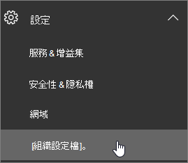
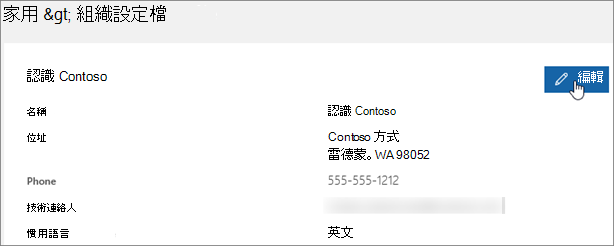

# 變更問候語和電子郵件的預設語言

如果您是 [全域系統管理員，](https://support.office.com/article/da585eea-f576-4f55-a1e0-87090b6aaa9d)您可以設定商務用 Skype 以其他語言播放其預設語音信箱問候語。 預設系統問候語類似「請為 John Smith 留言」。 在鈴聲之後，請錄製您的訊息。 錄製完成後，請掛斷或按井號鍵以尋找更多選項。」 
  
 **首先，請閱讀這項重要資訊：**
  
- **可用的語言** 是由貴組織的位置所決定。 例如，如果您的組織位於美國，您可以將預設語言設定為英文或西班牙文。 如果貴組織位於加拿大，您可以選擇英文和法文。 有關支援的語言清單，請參閱商務用 Skype 語音信箱問候語和 [訊息的語言](languages-for-voicemail-greetings-and-messages.md)。
    
- **變更個別使用者語音信箱問候語和語音信箱訊息的語言。** 您可以變更使用者偏好的 lanaguage，這將變更其語音信箱問候語和語音信箱訊息的語言，以至他們的 Outlook 信箱。 如需指示，請參閱 [如何設定 Microsoft 365 或 Office 365 的語言和地區設定] https://docs.microsoft.com/office365/troubleshoot/access-management/set-language-and-region) (。 
    
    > [!NOTE]
    > 使用者按照變更商務用[Microsoft 365](https://support.office.com/en-us/article/change-your-display-language-and-time-zone-in-microsoft-365-for-business-6f238bff-5252-441e-b32b-655d5d85d15b?ui=en-US&rs=en-US&ad=US)的顯示語言和時區中的指示，在登錄後，透過他們的設定來變更自己的問候語
  
- **您想要錄製外發語音信箱訊息嗎？** 請參閱 [檢查商務用 Skype 語音信箱和選項](https://support.office.com/article/2deea7f8-831f-4e85-a0d4-b34da55945a8)。 Microsoft Teams - 使用者可以從 Teams 桌面用戶端設定變更語音 [信箱設定](https://support.office.com/article/manage-your-call-settings-in-teams-456cb611-3477-496f-b31a-6ab752a7595f)

- **您想要變更語音信箱提示語言嗎？** 商務用 Skype -  [https://mysettings.lync.com/voicemail](https://mysettings.lync.com/voicemail) 並選擇提示語言下 **的新語言**。 Microsoft Teams - 使用者可以從 Teams 桌面用戶端設定變更語音 [信箱問候語](https://support.office.com/article/manage-your-call-settings-in-teams-456cb611-3477-496f-b31a-6ab752a7595f)
    
## 變更貴組織中每個人的系統語言

1. 使用全域系統管理員 [帳戶在](https://support.office.com/article/da585eea-f576-4f55-a1e0-87090b6aaa9d) 中登錄 [https://portal.office.com/adminportal/home](https://portal.office.com/adminportal/home) 。 
    
2. 在 Microsoft 365 系統管理中心中，選擇 **設定**  >  **設定**  >  **組織設定檔**。 
    
     
  
3. 選擇 **編輯**。
    
    
  
4. 從貴組織中每個人的 **偏好語言** 清單中選取語言。
    
5. 選擇 **儲存**。
    
## 適用于系統管理員的相關文章

- [電話系統和通話方案](calling-plan-landing-page.md)
    
- [設定通話方案](set-up-calling-plans.md)
    
- [在 Microsoft 365 或 Office 365 中規劃電話系統，在商務用 Skype Server 中使用內部部署 PSTN 連接](/skypeforbusiness/skype-for-business-hybrid-solutions/plan-your-phone-system-cloud-pbx-solution/plan-phone-system-with-on-premises-pstn-connectivity)
    
## 相關主題

- [變更 Microsoft 365 或商務用 Office 365 的顯示語言和時區](https://support.office.com/article/Change-your-display-language-and-time-zone-in-Office-365-for-Business-6f238bff-5252-441e-b32b-655d5d85d15b)
    
- [在 Office 2010](https://support.office.com/article/Add-a-language-or-set-language-preferences-in-Office-663d9d94-ca99-4a0d-973e-7c4a6b8a827d) 及稍後版本新增語言或設定語言喜好設定) 
    
- [啟用或變更鍵盤配置語言](https://support.office.com/article/Enable-or-change-a-keyboard-layout-language-1c2242c0-fe15-4bc3-99bc-535de6f4f258)
    
  
