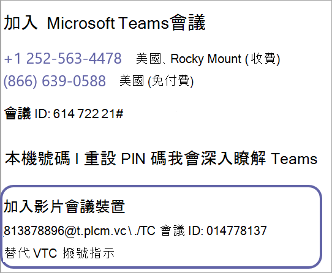

# 設定雲端視Microsoft TeamsSet up Cloud Video Interop for Microsoft Teams

選擇您的雲端視像交互操作合作夥伴 [ (](cloud-video-interop.md)) 之後，您必須規劃部署、設定與部署詳細資料及合作夥伴租使用者金鑰，以及同意貴組織的視像交互操作應用程式。After you have [chosen your Cloud Video Interop partner(s)](cloud-video-interop.md), you will need to plan your deployment, get set up with provisioning details and partner tenant key, and consent to the video interop app in your organization. 下圖概述程式。The following diagram outlines the process. 

## 規劃Plan

請參閱[雲端視Microsoft Teams](cloud-video-interop.md)交互操作，以尋找識別合作夥伴或合作夥伴以在貴組織中使用的資訊。See [Cloud Video Interop for Microsoft Teams](cloud-video-interop.md) for information about identifying a partner or partners to use in your organization. 

若要規劃使用者型/並行/全網站啟用：To plan for user based/concurrent/site wide enablement: 

- 挑選適合您使用的部署模型/託管模型Pick a deployment model/hosted model for your use
- 選取適用于貴組織之授權計畫。Select the license plan ideal for your organization. 
- 規劃虛擬機器的容量是託管視像基礎結構。Plan for capacity of VMs is you are hosting your video infrastructure.

## 配置Configure 

若要設定雲端視像交互操作，請遵循下列步驟。To configure Cloud Video Interop, follow these steps. 

1. 從您選擇的合作夥伴/合作夥伴取得 (金鑰、appId...) 。Obtain configuration info from the partner/partners you have chosen (tenant key, appIds…). 您可以在貴組織中使用一或多個視像交互操作合作夥伴You can use one or more video interop partners in your organization 

2. 請確保您的網路已正確配置。Ensure that your network is configured correctly. 設定標準型視像防火牆，讓周邊網路橫向移動支援。Configure your standards-based video firewall for perimeter network traversal to support. 例如：For example: 
    - Cisco VCS-eCisco VCS-e                  
    - Polycom RPADPolycom RPAD

3. 使用 Exchange 和 OTD 設定整合的會議室。Configure integrated rooms with exchange and OTD. 在大多數情況下，您的環境中需要設定和設定其他轉場。In most cases, additional relay would need to be set up and configured in your environment.

## 提供Provision
 
租使用者金鑰會撥入合作夥伴服務。The tenant key will be the dial out to the partner service. 在下列範例中，813878896@t.plcm.vc 是租使用者金鑰。In the following example, 813878896@t.plcm.vc is the tenant key. 

 

您必須執行下列 Cmdlet 來配置租使用者金鑰，同時啟用選取的使用者或整個組織，以視像交互操作座標建立會議。You will need to execute the following cmdlets to provision the tenant key, and also enable select users or your whole organization to create meetings with video interop coordinates.

 
- **[Get-CsTeamsVideoInteropServicepolicy](/powershell/module/skype/get-csteamsvideointeropservicepolicy)：** Microsoft 會針對每個支援的合作夥伴提供預先建構的政策，讓您指定 (使用) 雲端視像交互操作。**[Get-CsTeamsVideoInteropServicepolicy](/powershell/module/skype/get-csteamsvideointeropservicepolicy):** Microsoft provides pre-constructed policies for each of our supported partners that allow you to designate which partner(s) to use for cloud video interop.

    此 Cmdlet 可讓您識別可在貴組織中使用的預先建構策略。This cmdlet allows you to identify the pre-constructed policies that you can use in your organization. 您可以使用 Cmdlet，將這個Grant-CsTeamsVideoInteropServicePolicy指派給一或Grant-CsTeamsVideoInteropServicePolicy使用者。You can assign this policy to one or more of your users leveraging the Grant-CsTeamsVideoInteropServicePolicy cmdlet.
 
- **[Grant-CsTeamsVideoInteropServicePolicy：](/powershell/module/skype/grant-csteamsvideointeropservicepolicy)** Cmdlet Grant-CsTeamsVideoInteropServicePolicy Cmdlet 可讓您指派預先建構的策略，供貴組織使用，或將策略指派給特定使用者。**[Grant-CsTeamsVideoInteropServicePolicy](/powershell/module/skype/grant-csteamsvideointeropservicepolicy):** The Grant-CsTeamsVideoInteropServicePolicy cmdlet allows you to assign a pre-constructed policy for use in your organization or assign the policy to specific users.
 
- **[New-CsVideoInteropServiceProvider](/powershell/module/skype/new-csvideointeropserviceprovider)：** 使用 New-CsVideoInteropServiceProvider指定貴組織想使用之支援的 CVI 合作夥伴相關資訊。**[New-CsVideoInteropServiceProvider](/powershell/module/skype/new-csvideointeropserviceprovider):** Use the New-CsVideoInteropServiceProvider to specify information about a supported CVI partner your organization would like to use.
 
- **[Set-CsVideoInteropServiceProvider](/powershell/module/skype/set-csvideointeropserviceprovider)：** 使用 Set-CsVideoInteropServiceProvider更新貴組織使用之支援 CVI 合作夥伴的資訊。**[Set-CsVideoInteropServiceProvider](/powershell/module/skype/set-csvideointeropserviceprovider):** Use the Set-CsVideoInteropServiceProvider to update information about a supported CVI partner your organization uses.
 
- **[Get-CsVideoInteropServiceProvider](/powershell/module/skype/get-csvideointeropserviceprovider)：** 取得組織中所有已針對使用所配置的提供者。**[Get-CsVideoInteropServiceProvider](/powershell/module/skype/get-csvideointeropserviceprovider):** Get all of the providers that have been configured for use within the organization.
 
- **[Remove-CsVideoInteropServiceProvider：](/powershell/module/skype/remove-csvideointeropserviceprovider)** 使用 Remove-CsVideoInteropServiceProvider移除貴組織不再使用之提供者的所有提供者資訊。**[Remove-CsVideoInteropServiceProvider](/powershell/module/skype/remove-csvideointeropserviceprovider):** Use Remove-CsVideoInteropServiceProvider to remove all provider information about a provider that your organization no longer uses.  
 
## 同意Consent

您必須提供視距電話會議裝置的許可權同意， (RVC) 合作夥伴服務加入組織會議。You will need to provide permission consent for the video teleconferencing devices (VTCs) to join your organizations meetings via the partner service. 您的合作夥伴也會提供此同意連結。This consent link will also be provided by your partner.  
 
完成這些步驟後，透過上方的 Grant Cmdlet 個別啟用的使用者，或啟用租使用者時組織中所有使用者，都會在排程的所有 Teams 會議中擁有 VTC 座標。When these steps are complete, the users who are individually enabled via the Grant cmdlet above, or all of the users in the organization if the tenant is enabled, will have VTC coordinates in all the Teams meetings that they schedule. 任何 VTC 都可以透過這些座標加入這些會議。Any VTC can join these meetings via those coordinates.

|名稱Name|應用程式許可權簡短描述Application Permission Short Description| 描述Description|
|--|--|---|
|通話.JoinGroupCall.AllCalls.JoinGroupCall.All|以應用程式加入群組通話和會議 (預覽) Join Group Calls and Meetings as an app (preview)|允許應用程式加入貴組織的群組通話和排程會議，而不需要已登錄使用者。Allows the app to join group calls and scheduled meetings in your organization, without a signed-in user.  應用程式會以目錄使用者的許可權加入租使用者中的會議。The app will be joined with the privileges of a directory user to meetings in your tenant.|
|通話.JoinGroupCallasGuest.AllCalls.JoinGroupCallasGuest.All|以來賓使用者加入群組通話和會議 (預覽) Join Group Calls and Meetings as a guest user (preview)|允許應用程式以匿名方式加入貴組織的群組通話和排程會議，而不需要已登錄使用者。Allows the app to anonymously join group calls and scheduled meetings in your organization, without a signed-in user.  應用程式會以來賓的來賓加入租使用者中的會議。The app will be joined as a guest to meetings in your tenant.|
|通話.AccessMedia.AllCalls.AccessMedia.All|以 App 在通話中存取媒體流， (預覽) Access media streams in a call as an app (preview)|允許 App 直接存取通話中的媒體流，而不需要已登錄使用者。Allows the app to get direct access to media streams in a call, without a signed-in user.|
|OnlineMeetings.Read.AllOnlineMeetings.Read.All|閱讀線上會議詳細資料 (預覽) Read Online Meeting details (preview)|允許應用程式讀取貴組織的線上會議詳細資料，而不需要已登錄使用者。Allows the app to read Online Meeting details in your organization, without a signed-in user.|

## 附表Schedule

接下來，使用視Teams座標排程會議。Next, schedule Teams meeting with video interop coordinates. 啟用的使用者可以透過以下方式排程團隊會議：The enabled user can schedule teams meetings via:
- [Teams會議附加元件OutlookTeams Meeting add-in for Outlook](teams-add-in-for-outlook.md)
- Teams桌面和行動版Teams client desktop and mobile

## 加入Join

您可以使用 VTC Teams，以下列方式加入會議：You can join Teams meetings with your VTC devices in the following ways:
 
- IVR (互動式語音回應) IVR (Interactive voice Response)
    - 您可以使用電話號碼撥入合作夥伴的 IVR tenantkey@domain。You can dial in to the partner's IVR using the tenantkey@domain. 
    - 當您在合作夥伴 IVR 中時，系統會提示您輸入 VTC meetingId，然後將您Teams會議。Once you are in the partner IVR, you will be prompted to enter the VTC conferenceId, which will then connect you to the Teams meeting.
- 直撥Direct dial
    - 您可以直接撥入Teams，而不使用使用完整字串租使用者金鑰的直接撥號功能與合作夥伴的 IVR 互動。VTC ConferenceId@domain。You can directly dial into the Teams meeting without interacting with the partner’s IVR by using the direct dial feature using the full string of tenantkey.VTC ConferenceId@domain.
- 單鍵撥號One-touch dial
    - 如果您有整合式Teams，您可以使用合作夥伴提供的單鍵撥號功能 (不需要輸入任何撥號字串) 。If you have an integrated Teams room, you can use the one-touch dial capabilities offered by your partner (without needing to type any dial string).

最後，使用音訊、Teams和內容共用，與會議中的使用者互動。Finally, engage with Teams users in your meetings using audio, video, and content sharing.