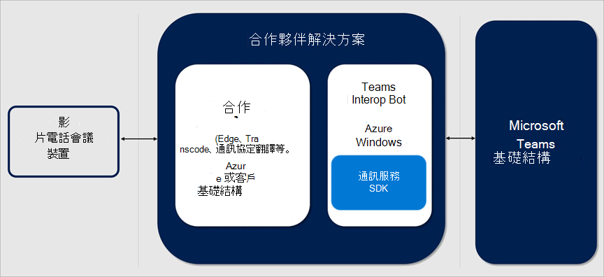
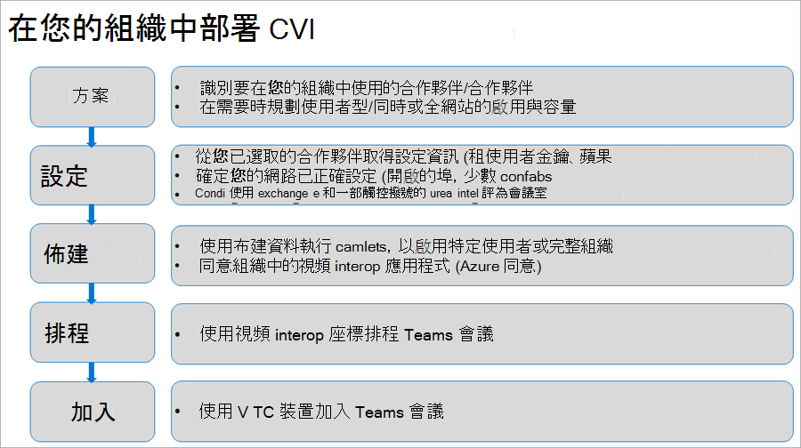

# Microsoft 團隊的雲端視頻互通性

雲端視頻 Interop （CVI）是 Microsoft 合格的協力廠商解決方案，可讓您使用協力廠商的會議會議室（telepresence）和個人視頻裝置（VTCs）加入 Microsoft 團隊會議。
 
透過 Microsoft 團隊，您可以在包含音訊、影片和內容共用的會議中，取得豐富的線上內容共同作業。 您可以透過桌面和 web 用戶端，以及透過與 Microsoft 團隊共同整合的許多合作夥伴裝置來欣賞這種情況。 不過，許多客戶已投資 teleconferencing 和個人視頻通訊裝置，這可能會導致升級成本較高。 雲端視頻 Interop 提供簡易的解決方案，可讓您繼續使用現有的解決方案，直到您準備好升級為止。

透過雲端視頻 Interop，Microsoft 團隊可為所有參與者（在會議室中或在團隊用戶端內）提供原生會議體驗。

### 我是雲端視頻交互操作嗎？

雲端視頻 Interop 會在您使用團隊端點轉換成完整的原生 Microsoft 團隊解決方案時，提供一個中間服務。 提供的服務應該是您遷移路徑的一部分。

雲端視頻 Interop 適用于符合下列準則的客戶：

- 大型部署會議室裝置和個人視頻裝置部署（50 + 裝置）不符合 Microsoft 團隊直接整合的資格
- 我們的其中一個雲端視頻互通性合作夥伴支援
- 在遷移到原生 Microsoft 團隊解決方案期間，想要保留其在目前會議機房裝置和個人視頻裝置中投資的價值

雖然雲端視頻互通性提供出色的中間方案，但我們鼓勵我們的客戶在長期使用我們的原生團隊會議解決方案（例如小組室系統）。 

### 針對 Microsoft 團隊認證的合作夥伴

下列合作夥伴有 Microsoft 團隊的視頻互通性解決方案。 您的公司可能會選擇在企業中與這些合作夥伴的任何組合搭配使用。 

|Partner|合作夥伴解決方案|
|----|---|
| | <a href="https://aka.ms/PolycomRealConnect" target="_blank">Polycom RealConnect Service</a> |
|| <a href="https://aka.ms/PexipInfinity" target="_blank">Microsoft 團隊的 Pexip 無窮大</a> | 
|| <a href="https://aka.ms/BluejeansGateway" target="_blank">Microsoft 團隊的 BlueJeans 閘道</a> |

### 雲端視頻互通性概述

雲端視頻 Interop 是由我們的合作夥伴提供的協力廠商服務，可讓您在現有的視訊會議和個人視頻裝置解決方案之間提供互通性，以及 Microsoft 團隊。

我們合作夥伴提供的解決方案是由可在內部部署完全以雲端為基礎或部分/完整的元件所組成。 
     
下圖顯示我們合作夥伴解決方案的高層結構。

## 部署雲端影片互通性

部署雲端影片互通性方案時，請務必瞭解您要部署合作夥伴解決方案。 下列圖表列出您部署雲端視頻交互操作應採取的一般步驟。

### 規劃

在方案階段中，您應該找出不會取代原生團隊裝置的裝置，並尋找可支援這些裝置的雲端視頻互通性合作夥伴。  

您也必須瞭解，對於每一個將排程會議的使用者，如果您想要加入雲端影片交互操作裝置，您都會需要一個授權。 請注意，您可以從雲端視頻互通性合作夥伴取得確切的授權需求。 在您開始進行部署前，請先確定這是清除的。

### 設定

您為 CVI 部署所選擇的合作夥伴將會提供完整的部署檔，由您在組織中成功部署所需的所有步驟所組成。 這會包括防火牆埠和 IP 範圍、裝置的設定變更，以及需要變更的其他設定。

### 布建  

在預置階段中，您將根據合作夥伴設定指南，將授權指派給適當的使用者。 您也需要完成 Azure 同意程式，才能提供合作夥伴對您團隊環境的存取權。 您可以在以下網址找到有關 Azure 同意流程的詳細資訊：https://docs.microsoft.com/en-us/azure/active-directory/develop/v2-permissions-and-consent 

### 表

在使用者啟用雲端視頻 Interop 之後，使用 Outlook 的團隊會議增益集或團隊用戶端安排的任何會議，都將會自動新增到 [團隊會議] 中的相關額外資訊，讓雲端影片交互操作相容的裝置可以加入這些會議。

### 起來

視合作夥伴方案而定，有幾種方式可以加入雲端視頻交互操作的會議。 確切的會議加入案例將由您的雲端視頻互通性合作夥伴提供。 我們已在下列範例中列出了一些範例：

- IVR （互動式語音回復） 
  - 您可以使用 tenantkey@domain 撥入夥伴的 IVR。
  - 當您在合作夥伴 IVR 中時，系統會提示您輸入 VTC conferenceId，這會將您連線至 [團隊會議]。
- 直接撥號 
  - 您可以直接撥入小組會議，而不需與夥伴的 IVR 互動，只要使用 [直接撥號] 功能，就能使用 tenantkey 的完整字串。VTC [ConferenceId@domain]。
- 單點觸控撥號 
  - 如果您有整合的小組聊天室，您可以使用合作夥伴提供的單一觸控式撥號功能（不需要輸入任何撥號字串）。

## 管理雲端視頻互通性

部署雲端視頻 Interop 之後，您可以使用合作夥伴提供的方案管理裝置。 每個合作夥伴都會為您提供一個系統管理介面，其中包含授權與裝置管理。 

您也可以直接從合作夥伴管理介面取得報告。 如需報告功能的詳細資訊，請聯絡您選擇的合作夥伴。 

### 雲端視頻互通性疑難排解

雲端視頻 Interop 是合作夥伴提供的服務。 如果您遇到問題，第一個步驟是將已安裝團隊用戶端的裝置連線，並將其連線到與引起問題之雲端視頻交互操作裝置相同的區段。 

如果團隊在這個區段上正常運作，而且您也已遵循合作夥伴提供的所有網路和配置指導方針，您必須與合作夥伴聯繫，以進一步排除問題。 

## 雲端視頻互通性的 PowerShell

您可以使用下列 PowerShell Cmdlet （部分）自動執行雲端影片互通性部署。

- **CsTeamsVideoInteropServicepolicy**： Microsoft 針對我們支援的每個合作夥伴提供預先構造的原則，可讓您指定要用於雲端影片互通性的合作夥伴。 這個 Cmdlet 可讓您識別您可以在組織中使用的預先構造原則。 您可以利用 Grant CsTeamsVideoInteropServicePolicy Cmdlet，將此原則指派給一或多個使用者。
- **授與 CsTeamsVideoInteropServicePolicy**：這個 Cmdlet 可讓您指派預先構造的原則供貴組織使用，或將原則指派給特定的使用者。
- **新-CsVideoInteropServiceProvider**：使用此 Cmdlet 來指定貴組織想要使用之受支援之 CVI 夥伴的相關資訊。
- **CsVideoInteropServiceProvider**：使用此 Cmdlet 來更新貴組織使用之受支援之 CVI 夥伴的相關資訊。
- **CsVideoInteropServiceProvider**：使用此 Cmdlet 來取得組織中已設定為使用的所有提供者。
- **移除-CsVideoInteropServiceProvider**：使用此 Cmdlet 來移除貴組織不再使用之提供者的所有提供者資訊。
