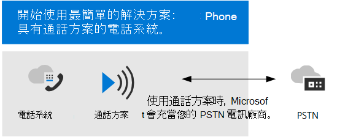
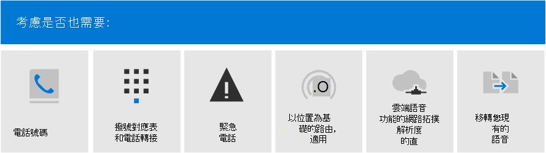
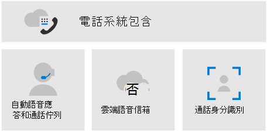

# 規劃您的Teams語音解決方案Plan your Teams voice solution 

本文可協助您決定適合貴組織的 Microsoft 語音解決方案。This article helps you decide which Microsoft voice solution is right for your organization. 在您決定之後，本文會提供內容藍圖，以便您執行您所選擇的解決方案。After you've decided, the article provides a roadmap to content that will enable you to implement your chosen solution.

> [!NOTE]
> 有關規劃 Teams 語音解決方案做為從 商務用 Skype Server 升級至 Teams 的整體計畫之一的指引，請參閱從 商務用 Skype 內部部署升級到 Teams 的[PSTN](upgrade-to-teams-on-prem-pstn-considerations.md)考慮。For guidance on planning a Teams voice solution as part as your overall plan to upgrade to Teams from Skype for Business Server, see [PSTN considerations for upgrading to Teams from Skype for Business on-premises](upgrade-to-teams-on-prem-pstn-considerations.md).

您可能會想要使用通話方案 &mdash; 電話系統最簡單的解決方案。You might want the simplest solution&mdash;Phone System with Calling Plan. 這是 Microsoft 的全雲端解決方案，提供私人分支 Exchange (PBX) 功能，並撥打到公用交換電話網路 (PSTN) ，如下圖所示。This is Microsoft's all-in-the-cloud solution that provides Private Branch Exchange (PBX) functionality and calls to the Public Switched Telephone Network (PSTN), as shown in the following diagram. 有了這個解決方案，Microsoft 就是您的 PSTN 電信公司。With this solution, Microsoft is your PSTN carrier.

如果您對下列專案回答是，電話系統通話方案是適合的解決方案：If you answer yes to the following, then Phone System with Calling Plan is the right solution for you:

- 地區提供通話方案。Calling Plan is available in your region.
- 您不需要保留目前的 PSTN 電信公司。You do not need to retain your current PSTN carrier.
- 您想要使用 Microsoft 管理的 PSTN 存取權。You want to use Microsoft-managed access to the PSTN.

不過，您的情況可能較為複雜。However, your situation might be more complex. 例如，您可能有辦公室位於沒有通話方案的位置。For example, you might have offices in locations where Calling Plan isn't available. 或者，您可能需要支援複雜、多國部署的組合解決方案，且不同的地理位置有不同的需求。Or you might need a combination solution that supports a complex, multi-national deployment, with different requirements for different geographic locations. Microsoft 支援一組解決方案：Microsoft supports a combination of solutions: 

- 電話系統通話方案Phone System with Calling Plan
- 電話系統具有運算子的 PSTN 電信連線 (目前僅適用于公用 **預覽版)**Phone System with your own PSTN carrier with Operator Connect (currently available only in **public preview**)
- 電話系統直接路由使用您自己的 PSTN 電信公司Phone System with your own PSTN carrier with Direct Routing
- 搭配通話方案使用電話系統組合解決方案電話系統運算子連線，以及/或電話系統直接路由A combination solution that uses Phone System with Calling Plan, Phone System with Operator Connect, and/or Phone System with Direct Routing

## 您需要閱讀哪些資訊？What do you need to read?

**全部為必填專案。****Required for all.** 本文中的部分章節與所有組織有關。Some of the sections in this article pertain to all organizations. 例如，每個人都應該閱讀電話系統並瞭解在 PSTN 中連接至公用交換電話網絡 (選項) 。For example, everyone should read about Phone System and understand the options for connecting to the Public Switched Telephone Network (PSTN). 

| 全部為必填專案Required for all | 說明Description |
| :------------|:-------|
| [**電話系統****Phone System**](#phone-system) | Microsoft 的技術可啟用通話控制和私人分支Exchange (PBX) 雲端Microsoft 365功能Microsoft Teams。Microsoft's technology for enabling call control and Private Branch Exchange (PBX) capabilities in the Microsoft 365 cloud with Microsoft Teams. |
| [**公用交換電話網絡 (PSTN) 連接選項****Public Switched Telephone Network (PSTN) connectivity options**](#public-switched-telephone-network-connectivity-options) | 使用 Microsoft 做為電話電信業者，或使用直接路由或電信業者Microsoft Teams電話電信業者連線。A choice between using Microsoft as your telephony carrier or connecting your own telephony carrier to Microsoft Teams by using Direct Routing or Operator Connect. PSTN 電話系統結合，可讓使用者撥打全球電話。Combined with Phone System, PSTN connectivity options enable your users to make phone calls all over the world.|

**視您的需求而不同。****Depending on your requirements.** 本文中的部分章節會根據您的現有部署和需求而相關。Some of the sections in this article are pertinent depending on your existing deployment and requirements. 例如，Location-Based不允許免付費路的地理位置中的直接路由客戶，才需要直接路由。For example, Location-Based Routing is only required for Direct Routing customers in geographic locations that do not allow toll bypass.

請考慮您可能需要的這些額外配置：Consider which of these additional configurations you might need:

| 根據您的需求Depending on your requirements | 說明Description |
| :------------|:-------|
| [**電話 Microsoft 的號碼****Phone numbers from Microsoft**](#phone-numbers-from-microsoft) | 如何取得和管理 Microsoft 的電話號碼，以及如何將現有號碼移轉至 Microsoft。How to get and manage phone numbers from Microsoft, and how to transfer existing numbers to Microsoft. 如果您需要取得 Microsoft 通話方案的電話號碼、轉接現有號碼、取得服務號碼等，請閱讀本文。Read this if you need to obtain phone numbers for Microsoft Calling Plan, transfer existing numbers, obtain service numbers, and so on. |
| [**撥號方案與通話路由****Dial plans and call routing**](#dial-plans-and-call-routing) | 如何設定及管理撥號方案，將撥號電話號碼轉換成替代格式 (通常是 E.164 格式) 電話授權和呼叫路由。How to configure and manage dial plans that translate dialed phone numbers into an alternate format (typically E.164 format) for call authorization and call routing. 如果您需要瞭解什麼是撥號方案，以及您是否需要為貴組織指定撥號方案，請閱讀本文。Read this if you need to understand what dial plans are and  whether you need to specify dial plans for your organization.|
| [**緊急電話****Emergency calling**](#emergency-calling) | 如何管理及設定緊急電話 &mdash; ，取決於您的 PSTN 連接選項。How to manage and configure emergency calling&mdash;depending on your PSTN connectivity option. 如果您使用的是 Microsoft 通話方案或直接路由，並需要瞭解如何管理組織的緊急電話，請閱讀本節。Read this section if you are using Microsoft Calling Plan or Direct Routing and need to understand how to manage emergency calling for your organization. |
| [**直接路由的基於位置的路由****Location-Based Routing for Direct Routing**](#location-based-routing-for-direct-routing) |如何使用 LBR Location-Based路由 (，) 使用者根據地理位置Microsoft Teams免付費路。How to use Location-Based Routing (LBR) to restrict toll bypass for Microsoft Teams users based on their geographic location. 如果貴組織在不允許免付費路的位置使用直接路由，請閱讀本節。Read this section if your organization is using Direct Routing at a location that does not allow toll bypass.
| [**雲端語音功能的網路拓撲****Network topology for cloud voice features**](#network-topology-for-voice-features) | 如果貴組織正在部署 Location-Based路由 (LBR) 直接路由或動態緊急電話，您必須設定網路設定，以在 Microsoft Teams 中與這些功能一Microsoft Teams。If your organization is deploying Location-Based Routing (LBR) for Direct Routing or dynamic emergency calling, you must configure network settings for use with these features in Microsoft Teams. 如果您正針對直接路由執行 LBR，或是使用通話方案或直接路由來實施動態緊急電話，請閱讀本節。Read this section if you are implementing LBR for Direct Routing, or if you are implementing dynamic emergency calling with Calling Plan or Direct Routing. |
| [**遷移現有的語音解決方案****Migrate your existing voice solution**](#migrate-your-existing-voice-solution-to-teams) | 當您將語音解決方案移向 Teams。What you need to think about when migrating your voice solution to Teams.  如果您要從現有的語音解決方案移向新的語音解決方案，請閱讀Teams。Read this section if you are migrating from an existing voice solution to Teams. 

> [!Important]
> 本文著重于語音解決方案與Microsoft Teams。This article focuses on voice solutions with Microsoft Teams. 雖然 microsoft 商務用 Skype 解決方案) 所述 (仍提供[商務用 Skype](/SkypeForBusiness/hybrid/msft-telephony-solutions) Online 解決方案，但必須瞭解 商務用 Skype Online 將于 2021 年 7 月 31 日停用。While solutions with Skype for Business Online are still available (as described in [Microsoft telephony solutions](/SkypeForBusiness/hybrid/msft-telephony-solutions)), it's important to understand that Skype for Business Online will be retired on July 31, 2021.  在此日期之後，商務用 Skype線上服務將無法再使用。After that date, the Skype for Business Online service will no longer be accessible. 此外，不再支援內部部署環境之間的 PSTN 連線商務用 Skype Server雲端連接器版本和 商務用 Skype Online 之間的 &mdash; &mdash; PSTN 連線。In addition, PSTN connectivity between your on-premises environment&mdash;whether through Skype for Business Server or Cloud Connector Edition&mdash;and Skype for Business Online will no longer be supported. 本文將介紹Teams語音解決方案，以及如何在必要時使用直接路由或運算子Teams內部部署電話網絡連線。This article introduces Teams voice solutions and how you can connect your on-premises telephony network, if necessary, to Teams by using Direct Routing or Operator Connect.

## 電話系統Phone System

電話系統 Microsoft 的技術，在 Microsoft 365 或 Office 365 雲端中啟用通話控制和私人分支 Exchange (PBX) 功能Microsoft Teams。Phone System is Microsoft's technology for enabling call control and Private Branch Exchange (PBX) capabilities in the Microsoft 365 or Office 365 cloud with Microsoft Teams.

電話系統用戶端Teams或商務用 Skype認證裝置。Phone System works with Teams or Skype for Business clients and certified devices. 電話系統可讓您將現有的 PBX 系統取代為一組直接從 Microsoft 365 或 Office 365。Phone System allows you to replace your existing PBX system with a set of features directly delivered from Microsoft 365 or Office 365. 

貴組織使用者之間的通話在內部處理電話系統，而且永遠不會前往 PSTN (電話) 。Calls between users in your organization are handled internally within Phone System, and never go to the Public Switched Telephone Network (PSTN). 這適用于貴組織中位於不同地理區域的使用者之間的通話，可移除這些內部通話的長途費用。This applies to calls between users in your organization located in different geographical areas, removing long-distance costs on these internal calls.

本文將介紹下列電話系統功能，以及您需要考慮的部署決策：This article introduces the following Phone System key features and functionality, and the deployment decisions you'll need to consider:

- [自動語音應答和通話佇列Auto attendants and call queues](#auto-attendants-and-call-queues)
- [雲端語音信箱Cloud Voicemail](#cloud-voicemail)
- [通話身分識別Calling identity](#calling-identity)

若要瞭解所有電話系統功能，以及如何設定電話系統，請參閱下列文章：For information about all Phone System features, and how to set up Phone System, see the following articles:

- [以下是可透過電話系統獲得的功能Here's what you get with Phone System](here-s-what-you-get-with-phone-system.md)
- [設定貴組織的 [電話系統]](setting-up-your-phone-system.md)[Set up Phone System in your organization](setting-up-your-phone-system.md) 
  說明如何購買及指派電話系統授權、管理電話號碼，以及設定免付費號碼的通訊信用額度。Describes how to buy and assign Phone System licenses, manage phone numbers, and set up communication credits for toll-free numbers. 

有關管理支援裝置的資訊，請參閱在Microsoft Teams Teams[管理您的裝置](https://www.microsoft.com/microsoft-365/microsoft-teams/across-devices?ms.url=officecomteamsdevices&rtc=1)。For information about managing supported devices, see [Manage your devices in Microsoft Teams](devices/device-management.md) and [Teams Marketplace](https://www.microsoft.com/microsoft-365/microsoft-teams/across-devices?ms.url=officecomteamsdevices&rtc=1).

### 自動電話機和通話佇列Auto attendants and Call queues

自動語音機允許您設定功能表選項，以根據來電者輸入路由通話。Auto attendants allow you to set up menu options to route calls based on caller input. 通話佇列正在等待來電者的區域。Call queues are waiting areas for callers. 自動語音回應和通話佇列一起使用，可以輕鬆地將來電者路由至貴組織中適當的人員或部門。Used together, auto attendants and call queues can easily route callers to the appropriate person or department in your organization.

有關自動電話機和通話佇列的資訊，請參閱下列文章：For information about auto attendants and call queues, see the following articles:

- [規劃自動Teams和通話佇列Plan for Teams auto attendants and call queues](plan-auto-attendant-call-queue.md)
- [設定自動話務員Set up an auto attendant](create-a-phone-system-auto-attendant.md)
- [建立通話佇列Create a call queue](create-a-phone-system-call-queue.md) 
- [Contoso 案例研究：自動電話機和通話佇列Contoso case study: Auto attendants and call queues](voice-case-study-call-queues.md) 
  說明一家虛構的多國公司 Contoso 如何實作自動語音語音和通話佇列，以尋求語音解決方案。Describes how a fictional multi-national corporation, Contoso, implemented auto attendants and call queues for their voice solution.

### 雲端語音信箱Cloud Voicemail

雲端語音信箱 Azure 語音信箱服務提供的支援，僅支援語音信箱Exchange信箱。Cloud Voicemail, powered by Azure Voicemail services, supports voicemail deposits to Exchange mailboxes only. 它不支援協力廠商電子郵件系統。It doesn't support third-party email systems. 

雲端語音信箱包括語音信箱抄錄，根據預設，它對組織中的所有使用者啟用。Cloud Voicemail includes voicemail transcription, which is enabled for all users in your organization by default. 您的業務需求可能會要求您針對特定使用者或整個組織的每一個人停用語音信箱翻譯。Your business needs might require that you disable voicemail transcription for specific users or everyone throughout the organization.

只有線上使用者雲端語音信箱，系統會在使用者獲得授權後，自動設定電話系統設定。For online only users, Cloud Voicemail is automatically set up and provisioned for users after they are assigned a Phone System license. 對於電話系統信箱的使用者Exchange，您必須執行額外的組組步驟。For Phone System users with an Exchange mailbox, you will need to perform extra configuration steps. 

有關雲端語音信箱及其組雲端語音信箱，請參閱下列文章：For more information about Cloud Voicemail and its configuration, see the following articles:

- [設定 [雲端語音信箱]](set-up-phone-system-voicemail.md)[Set up Cloud Voicemail](set-up-phone-system-voicemail.md)
- [在組織中設定語音信箱政策Set voicemail policies in your organization](set-up-phone-system-voicemail.md#setting-voicemail-policies-in-your-organization)

### 通話身分識別Calling identity

根據預設，所有外發通話會使用指派的電話號碼做為通話身分識別 (來電) 。By default, all outbound calls use the assigned phone number as calling identity (caller ID). 來電接收者可以快速識別來電者，並决定是否接聽或拒絕接聽來電。The recipient of the call can quickly identify the caller and decide whether to accept or reject the call. 有關設定本機號碼或變更或封鎖本機號碼的資訊，請參閱為使用者設定 [本機號碼](set-the-caller-id-for-a-user.md)。For information about configuring caller ID or to change or block the caller ID, see [Set the caller ID for a user](set-the-caller-id-for-a-user.md). 

## 公用交換電話網路連接選項Public Switched Telephone Network connectivity options

電話系統為貴組織提供完整的 PBX 功能。Phone System provides complete PBX capabilities for your organization. 不過，若要讓使用者在組織外撥打電話，您必須將電話電話系統到公用交換電話網絡 (PSTN) 。However, to enable users to make calls outside your organization, you need to connect Phone System to the Public Switched Telephone Network (PSTN). 若要電話系統 PSTN，您可以選擇下列其中一個選項：To connect Phone System to the PSTN, you can choose one of the following options:

- [**電話系統通話方案 。**](#phone-system-with-calling-plan)[**Phone System with Calling Plan**](#phone-system-with-calling-plan). 以 Microsoft 做為 PSTN 電信公司的全雲端解決方案。An all-in-the-cloud solution with Microsoft as your PSTN carrier.

- [**電話系統使用**](#phone-system-with-own-pstn-carrier-with-direct-routing)直接路由將您的內部部署環境連接到您的 PSTN 電信Teams。[**Phone System with your own PSTN carrier by using Direct Routing**](#phone-system-with-own-pstn-carrier-with-direct-routing) to connect your on-premises environment to Teams.

- [**電話系統您的 PSTN 電信公司使用運算子連線**](operator-connect-plan.md)，目前僅適用于公用 **預覽版。**[**Phone System with your own PSTN carrier by using Operator Connect**](operator-connect-plan.md), which is currently available only in **public preview.**  使用運算子連線，如果您現有的接線員是 Microsoft Operator 連線 計畫的參與者，他們可以管理將 PSTN 通話Teams。With Operator Connect, if your existing operator is a participant in the Microsoft Operator Connect program, they can manage the service for bringing PSTN calling to Teams. 有關運算子的權益和需求連線，以及參與此計畫的運算子清單，請參閱規劃運算子[連線。](operator-connect-plan.md)For information on the benefits and requirements of Operator Connect, and for a list of operators participating in this program, see [Plan Operator Connect](operator-connect-plan.md).

您也可以選擇選項群組合，以設計複雜環境的解決方案，或管理多步驟移 (移) 。You can also choose a combination of options, which enables you to design a solution for a complex environment, or manage a multi-step migration (more about migration later).

### 電話系統通話方案Phone System with Calling Plan 

如本文前面所述，電話系統通話方案是 Microsoft 針對使用者所使用之全雲端語音Teams解決方案。As described earlier in this article, Phone System with Calling Plan is Microsoft's all-in-the-cloud voice solution for Teams users. 這是將 Microsoft 電話 系統連接到公用交換電話網絡 (PSTN) 以啟用撥打全球有線電話和行動電話的最簡單選項。This is the simplest option that connects Microsoft Phone System to the Public Switched Telephone Network (PSTN) to enable calls to landlines and mobile phones around the world. 有了這個選項，Microsoft Exchange (PBX) 提供貴組織的功能，並做為 PSTN 電信者，如下圖所示：With this option, Microsoft provides Private Branch Exchange (PBX) functionality for your organization and acts as your PSTN carrier, as shown in the following diagram:

如果您對下列專案回答是，電話系統通話方案是適合的解決方案：If you answer yes to the following, then Phone System with Calling Plan is the right solution for you:

- 地區提供通話方案。Calling Plan is available in your region.
- 您不需要保留目前的 PSTN 電信公司。You do not need to retain your current PSTN carrier.
- 您想要使用 Microsoft 管理的 PSTN 存取權。You want to use Microsoft-managed access to the PSTN.

使用此選項：With this option: 

- 您可以Microsoft 電話國內或國際通話方案來使用系統，這些方案 (視全球授權服務等級) 。You get Microsoft Phone System with added Domestic or International Calling Plans that enable calling to phones around the world (depending on the level of service being licensed).

- 您不需要部署或維護內部部署，因為通話方案無法 &mdash; Microsoft 365 Office 365。You do not require deployment or maintenance of an on-premises deployment&mdash;because Calling Plan operates out of Microsoft 365 or Office 365.

- 注意：如有需要，您可以選擇透過直接路由連接支援的會話邊界控制器 (SBC) ，以與 SBC 支援的協力廠商 PBX、類比裝置和其他協力廠商電話設備進行互通性。Note: If necessary, you can choose to connect a supported Session Border Controller (SBC) through Direct Routing for interoperability with third-party PBXs, analog devices, and other third-party telephony equipment supported by the SBC.

此選項需要不間斷地Microsoft 365或Office 365。This option requires uninterrupted connection to Microsoft 365 or Office 365.

有關通話方案的資訊，請參閱下列文章：For more information about Calling Plan, see the following articles:

- [哪一個通話方案適合您？Which Calling Plan is right for you?](calling-plan-landing-page.md)
- [如何購買通話方案How to buy a Calling Plan](calling-plans-for-office-365.md)
- [通話方案的適用國家與地區Country and region availability for Calling Plan](./country-and-region-availability-for-audio-conferencing-and-calling-plans/country-and-region-availability-for-audio-conferencing-and-calling-plans.md)
- [設定通話方案Set up Calling Plan](set-up-calling-plans.md)

### 電話系統具有直接路由的 PSTN 電信公司Phone System with own PSTN carrier with Direct Routing

此選項使用直接路由Microsoft 電話將系統連接到您的電話網絡，如下圖所示：This option connects Microsoft Phone System to your telephony network by using Direct Routing, as shown in the following diagram: 

如果您對下列問題回答是，電話系統直接路由是適合的解決方案：If you answer yes to the following questions, then Phone System with Direct Routing is the right solution for you:

- 您想要在 Teams 中電話系統。You want to use Teams with Phone System.
- 您需要保留目前的 PSTN 電信公司。You need to retain your current PSTN carrier.
- 您想要混合路由，有些通話會透過通話方案進行，有些則透過您的電信公司進行。You want to mix routing, with some calls going through Calling Plan, some through your carrier.
- 您需要與協力廠商 PBX 和/或設備進行交互操作，例如架空傳呼機、類比裝置等。You need to interoperate with third-party PBXs and/or equipment such us overhead pagers, analog devices, and so on.

使用此選項：With this option:

- 您將自己支援的 SBC Microsoft 電話系統，而不需要其他內部部署軟體。You connect your own supported SBC to Microsoft Phone System without the need for additional on-premises software.

- 您幾乎可以在任何電話電信業者使用 Microsoft 電話 System。You can use virtually any telephony carrier with Microsoft Phone System.

- 您可以選擇設定及管理這個選項，也可以由您的電信公司或合作夥伴設定及管理 (詢問您的電信公司或合作夥伴是否提供此選項) 。You can choose to configure and manage this option, or it can be configured and managed by your carrier or partner (ask if your carrier or partner provides this option).

- 您可以設定電話設備之間的互通性，例如協力廠商 PBX 和類比裝置Microsoft 電話 &mdash; &mdash; 系統。You can configure interoperability between your telephony equipment&mdash;such as a third-party PBX and analog devices&mdash;and Microsoft Phone System.

此選項需要下列專案：This option requires the following:

- 不間斷地Microsoft 365或Office 365。Uninterrupted connection to Microsoft 365 or Office 365.

- 部署及維護支援的 SBC。Deploying and maintaining a supported SBC.

- 與協力廠商電信公司簽訂合約。A contract with a third-party carrier.
   (除非已部署為選項，為使用通話方案的使用者提供協力廠商 PBX、類比裝置或其他電話電話系統裝置) (Unless deployed as an option to provide connection to third-party PBX, analog devices, or other telephony equipment for users who are on Phone System with Calling Plan.)

有關直接路由的資訊，請參閱下列文章：For more information about Direct Routing, see the following articles:

- [電話系統直接路由Phone System Direct Routing](direct-routing-landing-page.md)
- [規劃直接路由Plan Direct Routing](direct-routing-plan.md)
- [設定直接路由Configure Direct Routing](direct-routing-configure.md)
- [管理語音路由策略，以用於直接路由Manage voice routing policies for use with Direct Routing](manage-voice-routing-policies.md)
- [規劃直接路由的依位置路由Plan Location-Based Routing for Direct Routing](location-based-routing-plan.md)
- [通過直接路由認證的工作階段邊界控制器清單List of Session Border Controllers certified for Direct Routing](direct-routing-border-controllers.md)

## 電話 Microsoft 的號碼Phone numbers from Microsoft

Microsoft 有兩種可用的電話號碼：訂閱者 *(* 使用者) 號碼，可指派給貴組織的使用者;以及服務號碼，以付費和免付費服務號碼提供。Microsoft has two types of telephone numbers available: *subscriber* (user) numbers, which can be assigned to users in your organization, and *service* numbers, available as toll and toll-free service numbers. 服務號碼的並行通話容量高於訂閱者號碼，並可以指派給音訊會議、自動語音服務或通話佇列等服務。Service numbers have higher concurrent call capacity than subscriber numbers and can be assigned to services such as Audio Conferencing, Auto Attendants, or Call Queues.

您必須決定：You will need to decide:

- 哪些使用者位置需要 Microsoft 的新電話號碼？Which user locations need new phone numbers from Microsoft?
- 我需要哪一 (或服務) 電話號碼？Which type of telephone number (subscriber or service) do I need? 
- 如何將現有的電話號碼Teams？How do I port existing phone numbers to Teams?

有關管理貴組織電話號碼 ，包括取得新號碼或移轉離職號碼等詳細資訊，請參閱下列文章：For more information about managing phone numbers in your organization, including getting new numbers or transferring exiting numbers, see the following articles:

- [管理貴組織的電話號碼Manage phone numbers for your organization](manage-phone-numbers-for-your-organization/manage-phone-numbers-for-your-organization.md) 
- [用於通話方案的各種電話號碼Different kinds of phone numbers used for Calling Plan](different-kinds-of-phone-numbers-used-for-calling-plans.md)
- [為您的使用者取得電話號碼Getting phone numbers for your users](getting-phone-numbers-for-your-users.md)
- [將電話號碼轉接到Microsoft TeamsTransfer phone numbers to Microsoft Teams](phone-number-calling-plans/transfer-phone-numbers-to-teams.md)

## 撥號方案與通話路由Dial plans and call routing

撥號方案是一組將撥號電話號碼轉換成替代格式的標準化規則 (通常是 E.164 格式) 電話授權和呼叫路由。A dial plan is a set of normalization rules that translate dialed phone numbers into an alternate format (typically E.164 format) for call authorization and call routing.

您必須決定下列事項：You will need to decide the following: 

- 我的組織需要自訂的撥號對應表？Does my organization need a customized dial plan?
- 哪些使用者需要自訂撥號方案？Which users require a customized dial plan?
- 應該為每個使用者指派哪一個租使用者撥號方案？Which tenant dial plan should be assigned to each user?

詳細資訊，請參閱下列文章：For more information, see the following articles: 

- [什麼是撥號對應表？What are dial plans?](what-are-dial-plans.md)
- [規劃租使用者撥號方案Plan for tenant dial plans](what-are-dial-plans.md#planning-for-tenant-dial-plans)
- [建立和管理撥號對應表Create and manage dial plans](create-and-manage-dial-plans.md)

## 緊急電話Emergency calling

您設定緊急電話方式會根據您的 PSTN 連接選項而不同：Microsoft 通話方案或直接路由。How you configure emergency calling differs depending on your PSTN connectivity option: Microsoft Calling Plan or Direct Routing. Microsoft 通話方案與直接路由的動態緊急電話系統提供設定及路由緊急電話的能力，並依據用戶端目前的位置通知Teams人員。Dynamic emergency calling for Microsoft Calling Plan and Phone System Direct Routing provides the capability to configure and route emergency calls and notify security personnel based on the current location of the Teams client. 若要進一步瞭解緊急電話概念和術語，以及如何設定動態緊急電話，請參閱下列文章：For more information about emergency calling concepts and terminology, and how to configure dynamic emergency calling, see the following articles:

- [管理緊急電話Manage emergency calling](what-are-emergency-locations-addresses-and-call-routing.md)
- [規劃和設定動態緊急電話Plan and configure dynamic emergency calling](configure-dynamic-emergency-calling.md)
- [Contoso 案例研究：緊急電話Contoso case study: Emergency calling](voice-case-study-emergency-calling.md) 
  說明一家虛構的多國公司 Contoso 如何為組織實作緊急電話。Describes how a fictional multi-national corporation, Contoso, implemented emergency calling for their organization.

## Location-Based直接路由的路由Location-Based Routing for Direct Routing

在一些國家和地區，若要降低長途電話費用， (PSTN) 通電話網絡不合法。In some countries and regions, it's illegal to bypass the Public Switched Telephone Network (PSTN) provider to decrease long-distance calling costs. Location-Based直接路由路由可讓您根據使用者Microsoft Teams限制付費旁路。Location-Based Routing for Direct Routing enables you to restrict toll bypass for Microsoft Teams users based on their geographic location. 若要進一步瞭解如何規劃及設定 LBR Location-Based路由 (，請參閱) 文章：For more information about how to plan and configure Location-Based Routing (LBR), see the following articles:

- [規劃直接路由的依位置路由Plan Location-Based Routing for Direct Routing](location-based-routing-plan.md)
- [設定依位置路由的網路設定Configure network settings for Location-Based Routing](location-based-routing-configure-network-settings.md)
- [啟用直接路由的依位置路由Enable Location-Based Routing for Direct Routing](location-based-routing-enable.md)
- [Contoso 案例研究：Location-Based路由Contoso case study: Location-Based Routing](voice-case-study-location-based-routing.md) 
  說明一家虛構的多國公司 Contoso 如何為Location-Based路由實作。Describes how a fictional multi-national corporation, Contoso, implemented Location-Based Routing for their organization.

## 語音功能的網路拓撲Network topology for voice features

如果您要部署動態緊急電話或直接路由Location-Based路由，您必須設定網路設定，以在 Microsoft Teams。If you are deploying dynamic emergency calling or Location-Based Routing for Direct Routing, you must configure network settings for use with these features in Microsoft Teams. 若要瞭解如何設定網路區域、網路網站、網路子網和受信任的 IP 位址的網路設定，請參閱下列文章：To learn how to configure network settings for network regions, network sites, network subnets, and trusted IP addresses, see the following articles:

- [雲端語音功能的網路設定Microsoft Teams概念和術語Network settings for cloud voice features in Microsoft Teams - Concepts and terminology](cloud-voice-network-settings.md)
- [管理雲端語音功能的網路拓撲Microsoft TeamsManage your network topology for cloud voice features in Microsoft Teams](manage-your-network-topology.md)

## 將現有的語音解決方案遷移到 TeamsMigrate your existing voice solution to Teams

對於升級至 Teams 的組織，最終的目標是將所有使用者移至 TeamsOnly 模式。For an organization that is upgrading to Teams, the ultimate goal is to move all users to TeamsOnly mode. 只有在電話系統 TeamsOnly Teams，才支援在 Teams 中使用應用程式。Using Phone System with Teams is only supported when the user is in TeamsOnly mode. 如果您需要升級至 Teams 的基本資訊，請從這裡開始：If you need basic information about upgrading to Teams, start here:

- [開始升級您的 Microsoft TeamsGetting started with your Microsoft Teams upgrade](upgrade-start-here.md)
- [關於升級架構About the upgrade framework](upgrade-framework.md)
- [IT 系統管理員的升級策略Upgrade strategies for IT administrators](upgrade-to-teams-on-prem-implement.md)

移移您的語音解決方案時，移至 TeamsOnly 模式時，有四種可能的通話案例：When migrating your voice solution, there are four possible calling scenarios when moving to TeamsOnly mode:

- [**使用 Microsoft 通話商務用 Skype Online 中的使用者**](upgrade-to-teams-on-prem-pstn-considerations.md#from-skype-for-business-online-with-microsoft-calling-plans)。[**A user in Skype for Business Online, with a Microsoft Calling Plan**](upgrade-to-teams-on-prem-pstn-considerations.md#from-skype-for-business-online-with-microsoft-calling-plans). 升級後，該使用者會繼續擁有 Microsoft 通話方案。Upon upgrade, this user will continue to have a Microsoft Calling Plan.

- **[透過內部商務用 Skype](upgrade-to-teams-on-prem-pstn-considerations.md#from-skype-for-business-online-with-on-premises-voice)** 或雲端連接器版本使用內部部署語音功能的使用者商務用 Skype Online 中的使用者。**[A user in Skype for Business Online, with on-premises voice functionality](upgrade-to-teams-on-prem-pstn-considerations.md#from-skype-for-business-online-with-on-premises-voice) through Skype for Business on-premises or Cloud Connector Edition**. 使用者的升級至Teams使用者移向直接路由，以確保 TeamsOnly 使用者具有 PSTN 功能。The user’s upgrade to Teams needs to be coordinated with migration of the user to Direct Routing to ensure the TeamsOnly user has PSTN functionality.

- 使用 商務用 Skype 內部部署的使用者 **[企業語音，](upgrade-to-teams-on-prem-pstn-considerations.md#from-skype-for-business-server-on-premises-with-enterprise-voice-to-direct-routing)** 該使用者將會移往線上並保持內部部署 PSTN 連線。**[A user in Skype for Business on-premises with Enterprise Voice](upgrade-to-teams-on-prem-pstn-considerations.md#from-skype-for-business-server-on-premises-with-enterprise-voice-to-direct-routing), who will be moving to online and keeping on-premises PSTN connectivity**. 將此使用者移Teams需要將使用者的內部部署 商務用 Skype 帳戶移至雲端，並協調使用者移轉至直接路由。Migrating this user to Teams requires moving the user’s on-premises Skype for Business account to the cloud, and coordinating that move with migration of the user to Direct Routing. 

- 使用 商務用 Skype 內部部署 **[的使用者企業語音，](upgrade-to-teams-on-prem-pstn-considerations.md#from-skype-for-business-server-on-premises-with-enterprise-voice-to-microsoft-calling-plan)** 該使用者將會移往線上，並且使用 Microsoft 通話方案。**[A user in Skype for Business on-premises with Enterprise Voice](upgrade-to-teams-on-prem-pstn-considerations.md#from-skype-for-business-server-on-premises-with-enterprise-voice-to-microsoft-calling-plan), who will be moving to online and using a Microsoft Calling plan**.  將該使用者移轉至 Teams 需要將使用者的內部部署 商務用 Skype 帳戶移至雲端，並協調該移動與 A) 該使用者電話號碼的埠到 Microsoft 通話方案，或 B) 從可用區域指派新的訂閱者號碼。Migrating this user to Teams requires moving the user’s on-premises Skype for Business account to the cloud, and coordinating that move with either A) the port of that user’s phone number to a Microsoft Calling Plan or B) assigning a new subscriber number from available regions.

若要進一步瞭解如何針對這些案例執行語音移移，包括何時需要設定混合式連接，以及如何將具有內部部署語音功能的使用者移向直接路由的資訊，請參閱 &mdash; &mdash; 下列文章：For more information about how to implement your voice migration for each of these scenarios&mdash;including information about when you need to set up hybrid connectivity and how to migrate users with on-premises voice functionality to Direct Routing&mdash;see the following articles:

- [升級至適用于 IT 系統管理員的 PSTN Teams PSTN 考慮PSTN considerations when upgrading to Teams — for IT administrators](upgrade-to-teams-on-prem-pstn-considerations.md)

- [Contoso 語音移移案例研究Contoso voice migration case study](voice-case-study-overview.md) 
  案例研究說明一家虛構的多國公司 Contoso 如何為組織Teams語音解決方案。The case study describes how a fictional multi-national corporation, Contoso, implemented a Teams voice solution for their organization. 它包含下列文章：It contains the following articles:

  - [Teams升級方案Teams upgrade plan](voice-case-study-migration-plan.md)
  - [電話系統 PSTN 連接選項Phone System and PSTN connectivity options](voice-case-study-phone-system.md)
  - [位置式路由實現Location-Based Routing implementation](voice-case-study-location-based-routing.md)
  - [緊急電話Emergency calling](voice-case-study-emergency-calling.md)
  - [自動語音應答和通話佇列Auto attendants and call queues](voice-case-study-call-queues.md)
  - [音訊會議Audio Conferencing](voice-case-study-audio-conferencing.md)