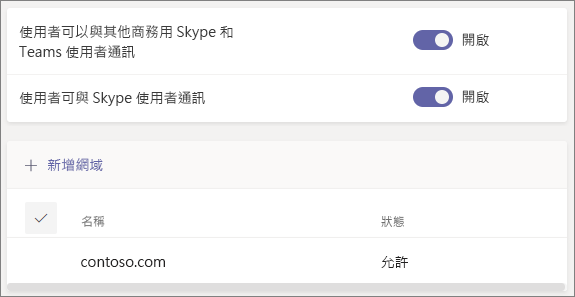

# 在 Microsoft Teams 中與來自組織外部的人員通話、聊天和共同作業Call, chat, and collaborate with people outside your organization in Microsoft Teams

當您需要與組織外部的人員通訊和共同作業時，Microsoft Teams 提供您兩個選項：When you need to communicate and collaborate with people outside your organization, Microsoft Teams has two options:

- **外部存取** - 一種同盟類型，可讓使用者尋找、通話及與其他組織中的人員聊天。**External access** - A type of federation that allows users to find, call, and chat with people in other organizations. 除非他們受邀成為來賓，否則無法將這些人新增至小組。These people cannot be added to teams unless they are invited as guests.
- **來賓存取** - 來賓存取可讓您邀請組織外部的人員加入小組。**Guest access** - Guest access allows you to invite people from outside your organization to join a team. 受邀的人員會在 Azure Active Directory 中取得一個來賓帳戶。Invited people get a guest account in Azure Active Directory.

請注意，Teams 允許您邀請組織外部的人員參加會議。Note that Teams allows you to invite people outside your organization to meetings. 這不需要設定外部或來賓存取。This does not require external or guest access to be configured.

## 外部存取 (同盟)External access (federation)

如果您需要尋找、通話、聊天以及設定與使用 Teams、商務用 Skype (線上或內部部署) 或 Skype 的組織外部人員的會議，請設定外部存取。Set up external access if you need to find, call, chat, and set up meetings with people outside your organization who use Teams, Skype for Business (online or on premises) or Skype. 

預設會對所有網域啟用外部存取。By default, external access is enabled for all domains. 您可以透過允許或封鎖特定網域來限制外部存取，或將它關閉。You can restrict external access by allowing or blocking specific domains or by turning it off.

若要設定外部存取，請參閱[管理外部存取](manage-external-access.md)。To configure external access, see [Manage external access](manage-external-access.md). 

## 來賓存取Guest access

使用來賓存取將來自組織外部的人員新增至小組，他們可在其中聊天、通話、開會及就檔案共同作業。Use guest access to add a person from outside your organization to a team, where they can chat, call, meet, and collaborate on files. 來賓幾乎擁有與原生小組成員相同的所有 Teams 功能。A guest can be given nearly all the same Teams capabilities as a native team member.

來賓會以 B2B 使用者的身分新增至組織的 Azure Active Directory 中，且必須使用其來賓帳戶登入 Teams。Guests are added to your organization's Azure Active Directory as B2B users and must sign in to Teams using their guest account. 這表示他們可能必須登出自己的組織，才能登入您的組織。This means that they may have to sign out of their own organization to sign in to your organization.

若要為 Teams 設定來賓存取，請參閱[在小組中與來賓共同作業](https://docs.microsoft.com/microsoft-365/solutions/collaborate-as-team)。To configure guest access for Teams, see [Collaborate with guests in a team](https://docs.microsoft.com/microsoft-365/solutions/collaborate-as-team).

## 比較外部和來賓存取Compare external and guest access

下表顯示使用外部存取 (同盟) 和來賓之間的差異。The following tables show the differences between using external access (federation) and guests. 在這兩個情況下，系統會將組織外部的人員向您的使用者識別為外部。In both cases, people outside your organization are identified to your users as being external.

### 您的使用者可以執行的動作Things your users can do

| 使用者可以Users can | 外部存取使用者External access users | 來賓Guests |
|---------|-----------------------|--------------------|
| 與其他組織中的人員聊天Chat with someone in another organization | 是Yes | 是Yes |
| 與另一個組織中的人員通話Call someone in another organization | 是Yes | 是Yes |
| 查看來自另一個組織的人員是否可以通話或聊天See if someone from another organization is available for call or chat | 是Yes | 是1Yes1 |
| 搜尋其他組織中的人員Search for people in other organizations | 是2Yes2 | 否No |
| 共用檔案Share files | 否No | 是Yes |
| 查看其不在辦公室訊息See the out-of-office message of | 否No | 是Yes |
| 封鎖另一個組織中的人員Block someone in another organization someone in another organization | 否No | 是Yes |
| 使用 @ 提及Use @mentions | 是3Yes3 | 是Yes |

### 組織外部的人員可以執行的動作Things people outside your organization can do

| 組織外部的人員可以People outside your organization can | 外部存取使用者External access users | 來賓Guests |
|---------|-----------------------|--------------------|
| 存取 Teams 資源Access Teams resources | 否No | 是Yes |
| 被新增至群組聊天Be added to a group chat | 否No | 是Yes |
| 受邀參加會議Be invited to a meeting | 是Yes | 是Yes |
| 可進行私人通話Make private calls | 是Yes | 是5Yes5 |
| 檢視撥入會議參與者的電話號碼View the phone number for dial-in meeting participants | 否4No4 | 是Yes |
| 使用 IP 視訊Use IP video | 是Yes | 是5Yes5 |
| 使用螢幕畫面分享Use screen sharing | 是3Yes3 | 是5Yes5 |
| 使用立即開會Use meet now | 否No | 是5Yes5 |
| 編輯已傳送的訊息Edit sent messages | 是3Yes3 | 是5Yes5 |
| 刪除已傳送的訊息Delete sent messages | 是3Yes3 | 是5Yes5 |
| 在交談中使用 GiphyUse Giphy in conversation | 是3Yes3 | 是5Yes5 |
| 在交談中使用 MemeUse memes in conversation | 是3Yes3 | 是5Yes5 |
| 在交談中使用貼圖Use stickers in conversation | 是3Yes3 | 是5Yes5 |
| 會顯示目前狀態Presence is displayed | 是Yes | 是Yes |
| 使用 @ 提及Use @mentions | 是3Yes3 | 是Yes |

 

1 前提是已將使用者新增為來賓，並使用來賓帳戶登入。1 Provided that the user has been added as a guest and is signed with the guest account. 
2 僅透過電子郵件或工作階段初始通訊協定 (SIP) 位址。2 Only by email or Session Initiation Protocol (SIP) address. 
3 支援來自兩個不同組織的僅 Teams 到僅 Teams 使用者的一對一聊天。3 Supported for 1:1 chat for Teams Only to Teams Only users from two different organizations.  
4 依預設，外部參與者無法查看撥入參與者的電話號碼。4 By default, external participants can't see the phone numbers of dialed-in participants. 如果您想要維護這些電話號碼的隱私權，請選取 [進入/退出宣告類型] 的 [音調] (這可避免 Teams 將號碼朗讀出來)。If you want to maintain the privacy of these phone numbers, select **Tones** for **Entry/exit announcement type** (this prevents the numbers from being read out by Teams). 若要深入了解，請參閱[開啟或關閉 Microsoft Teams 中會議的進入和退出宣告](turn-on-or-off-entry-and-exit-announcements-for-meetings-in-teams.md)。To learn more, read [Turn on or off entry and exit announcements for meetings in Microsoft Teams](turn-on-or-off-entry-and-exit-announcements-for-meetings-in-teams.md).  
5 預設會允許，但可以由 Teams 系統管理員關閉5 Allowed by default, but can be turned off by the Teams admin

## 相關主題Related topics

[Teams 中的外部存取External access in Teams](manage-external-access.md)

[Teams 中的來賓存取Guest access in Teams](guest-access.md)

