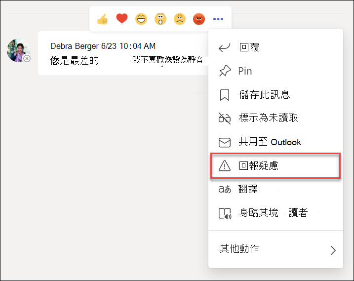
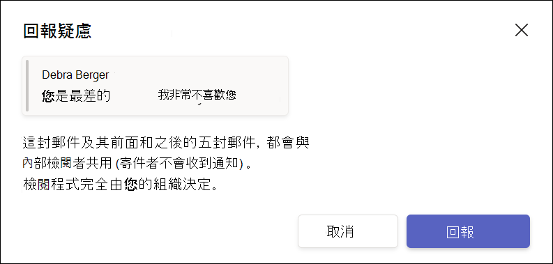

# 與Microsoft Teams的通訊合規性

通訊合規性是Microsoft 365中的測試人員風險解決方案，可協助您偵測、擷取及處理貴組織中的不當訊息，以協助將通訊風險降到最低。

對於Microsoft Teams，通訊合規性可協助識別Teams頻道、私人Teams頻道或 1：1 和群組聊天中的[下列類型的](/microsoft-365/compliance/communication-compliance-feature-reference)不當內容：

- 令人反感、不當和騷擾的語言
- 成人、活潑和 Gory 影像
- 共用機密資訊

如需有關通訊合規性以及如何為貴組織設定原則的詳細資訊，請參閱[Microsoft 365中的通訊合規性](/microsoft-365/compliance/communication-compliance)。 如需Microsoft 365包含通訊合規性的訂閱的相關資訊，請參閱[測試人員風險解決方案](/microsoft-365/compliance/insider-risk-solution-overview#communication-compliance)。

## 如何在 Microsoft Teams 中使用通訊合規性

通訊合規性和Microsoft Teams緊密整合，有助於將貴組織中的通訊風險降到最低。 設定第一個通訊合規性原則之後，您可以主動管理不當Microsoft Teams會自動標幟為警示的郵件和內容。

### 快速入門

開始使用Microsoft Teams中的通訊合規性，從[規劃](/microsoft-365/compliance/communication-compliance-plan)和建立預先定義或自訂的原則開始著手，以識別Teams頻道或 1：1 和群組中的不當使用者活動。 請記住，您需要在設定程式中 [設定](/microsoft-365/compliance/communication-compliance-configure) 一些許可權和基本先決條件。

Teams系統管理員可以在下列層級設定通訊合規性原則：

- **使用者層級**：此層級的原則適用于個別Teams使用者，或可能套用至貴組織中的所有Teams使用者。 這些原則涵蓋這些使用者可能會在一對一或群組聊天中傳送的訊息。 使用者的聊天通訊會自動監視使用者所屬的所有Microsoft Teams。
- **Teams層級**：此層級的原則適用于Microsoft Teams頻道，包括私人頻道。 這些原則僅涵蓋Teams通道中傳送的訊息。

### 在 Microsoft Teams 中回報疑慮

>[!NOTE]
>自 2022 年 5 月起，使用者回報的訊息將開始提供給授權遵守[通訊](/microsoft-365/compliance/communication-compliance-configure#subscriptions-and-licensing)及Microsoft Teams的組織使用。 此功能應于 2022 年 8 月 31 日之前提供給所有授權組織使用。

預設會啟用Teams郵件中的 [*回報疑慮*] 選項，並可透過系統管理中心的Teams傳訊原則 [控制Teams](/microsoftteams/manage-teams-in-modern-portal)。 這可讓貴組織中的使用者提交不當訊息，供通訊合規性檢閱者檢閱原則。 如需有關通訊合規性中使用者回報訊息的詳細資訊，請參閱 [通訊合規性原則](/microsoft-365/compliance/communication-compliance-policies#user-reported-messages-policy)。

提交郵件供檢閱後，使用者會在Microsoft Teams中收到提交者的確認。 聊天中的其他參與者不會看到此通知。

除非您建立並指派自訂原則，否則貴組織中的使用者會自動取得全域原則。 編輯全域原則中的設定，或建立並指派一或多個自訂原則來開啟或關閉此功能。 如需詳細資訊，請參閱[管理Teams中的訊息原則](/microsoftteams/messaging-policies-in-teams)。

### 在 Microsoft Teams 中對不當的郵件採取行動

在您設定原則並收到Microsoft Teams郵件的通訊合規性警示之後，組織中的合規性檢閱者就可以對這些郵件採取行動。 如果您的組織已啟用，這也會包含使用者回報的訊息。 檢閱者可以檢閱通訊合規性警示，並從檢視中移除已標幟的郵件，以協助保護貴組織Microsoft Teams。

已移除的郵件和內容會取代為檢視者的通知，以說明郵件或內容已移除，以及移除原則。 已移除郵件或內容的寄件者也會收到移除狀態的通知，並提供與其移除相關內容的原始郵件內容。 寄件者也可以檢視移除郵件時所適用的特定原則條件。

寄件者看到的原則提示範例：

寄件者看到的原則通知範例：

收件者看到的原則提示範例：

