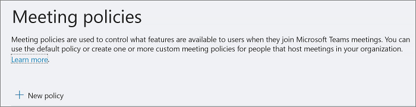
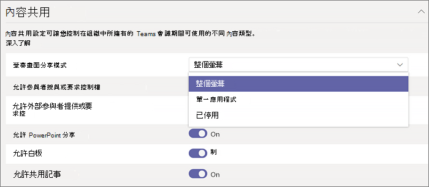

在 Microsoft Teams 中設定桌面共用
============================================

桌面共用可讓使用者在會議或聊天時顯示螢幕畫面或應用程式。 系統管理員可以在 Microsoft Teams 中設定螢幕畫面分享，讓使用者共用整個畫面、應用程式或檔案。 您可以讓使用者授與或要求控制權、允許 PowerPoint 共用、新增白板，並允許共用筆記。 您也可以設定匿名或外部使用者是否可以要求共用畫面的控制權。

若要設定螢幕畫面分享，請建立新的會議原則，然後將它指派給您要管理的使用者。

**在 [Microsoft Teams 系統管理中心](https://admin.teams.microsoft.com/)**

1. 選取**會議** > **會議原則**。

    

2. 在**會議原則** 頁面上，選取**新原則**。

    

3. 為您的原則指定唯一的標題，然後輸入簡短的描述。

4. 在 **內容共用**底下，從下拉式清單中選擇 **螢幕畫面分享模式**：

   - **整個螢幕**：讓使用者共用整個桌面。
   - **單一應用程式**：讓使用者將螢幕畫面分享限制在單一使用中的應用程式。
   - **已停用**：關閉螢幕畫面分享。

    

5. 開啟或關閉下列設定：

    - **允許參與者授與或要求控制權**：讓小組成員可以授與或要求簡報者的桌面或應用程式控制權。
    - **允許外部參與者授與或要求控制**：可讓來賓與外部 (同盟) 使用者對簡報者的桌面或應用程式授與或要求控制權。
    - **允許 PowerPoint 分享**：讓使用者建立可讓 PowerPoint 簡報上傳並共用的會議。
    - **允許使用白板**：讓使用者共用白板。
    - **允許共用的筆記**：讓使用者記共用筆記。

6. 按一下 [儲存]****。

## 使用 PowerShell 來設定共用桌面

您也可以使用 [Set-CsTeamsMeetingPolicy](https://docs.microsoft.com/powershell/module/skype/set-csteamsmeetingpolicy?view=skype-ps) Cmdlet 來控制桌面共用。 設定下列參數：

- 描述
- ScreenSharingMode
- AllowParticipantGiveRequestControl
- AllowExternalParticipantGiveRequestControl
- AllowPowerPointSharing
- AllowWhiteboard
- AllowSharedNotes

[深入瞭解如何使用 csTeamsMeetingPolicy Cmdlet](https://docs.microsoft.com/powershell/module/skype/set-csteamsmeetingpolicy?view=skype-ps)。

