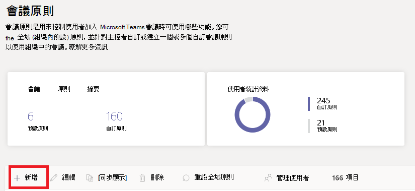

# 在 Microsoft Teams 中設定桌面共用

桌面共用可讓使用者在會議或聊天時顯示螢幕畫面或應用程式。 系統管理員可以在 Microsoft Teams 中設定螢幕畫面共用，讓使用者共用整個畫面、應用程式或檔案。 您可以讓使用者授與或要求控制權、允許 PowerPoint 共用、新增白板，並允許共用筆記。 您也可以設定匿名或外部使用者是否可以要求共用畫面的控制權。 Teams 會議的外部參與者可依如下分類：

- 匿名使用者
- 來賓使用者
- B2B 使用者
- 同盟使用者

若要設定螢幕畫面共用，請建立新的會議原則，然後將它指派給您要管理的使用者。

**在 [Microsoft Teams 系統管理中心](https://admin.teams.microsoft.com/)**

1. 選取 [會議] > [會議原則]。

    

2. 在 [ **會議原則]** 頁面上，選取 [ **新增]**。

    

3. 為您的原則指定唯一的標題，然後輸入簡短的描述。

4. 在 [內容共用] 底下，從下拉式清單中選擇 [螢幕畫面分享模式]：

   - **整個螢幕**：讓使用者共用整個桌面。
   - **單一應用程式**：讓使用者將螢幕畫面分享限制在單一使用中的應用程式。
   - **已停用**：關閉螢幕畫面分享。

    

  > [!Note]
  > 您不需要啟用通話原則，使用者就可以使用聊天中的螢幕畫面分享。 不過，他們的音訊會關閉，直到他們自行取消靜音為止。 此外，共用螢幕的使用者可以按一下 [ **新增音訊** ] 來啟用音訊。 如果通話原則已停用，使用者將無法從聊天會話將音訊新增至螢幕共用。

5. 開啟或關閉下列設定：

    - **允許參與者授與或要求控制權** ，讓小組成員授與或要求簡報者桌面或應用程式的控制權。
    - **允許外部參與者授與或要求控制權** –這是個別使用者的原則。 不論會議召集人的設定為何，無論組織是否為使用者設定此選項，都無法控制外部參與者可以執行的動作。 此參數會根據分享者在其組織的會議原則中所設定的內容，是否可以授與外部參與者控制或要求控制分享者的螢幕畫面。
    - **允許 PowerPoint 分享**：讓使用者建立可讓 PowerPoint 簡報上傳並共用的會議。
    - **允許使用白板**：讓使用者共用白板。
    - **允許共用記事**：讓使用者記共用記事。

6. 按一下 [儲存]。

## 使用 PowerShell 來設定共用桌面

您也可以使用 [Set-CsTeamsMeetingPolicy](/powershell/module/skype/set-csteamsmeetingpolicy) Cmdlet 來控制桌面共用。 設定下列參數：

- 描述
- ScreenSharingMode
- AllowPrivateCalling
- AllowParticipantGiveRequestControl
- AllowExternalParticipantGiveRequestControl
- AllowPowerPointSharing
- AllowWhiteboard
- AllowSharedNotes

[深入了解如何使用 csTeamsMeetingPolicy Cmdlet](/powershell/module/skype/set-csteamsmeetingpolicy) (英文)。