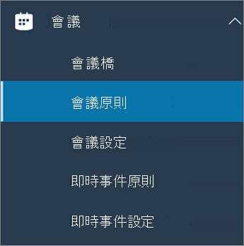

在 Microsoft Teams 中設定桌面共用Configure desktop sharing in Microsoft Teams
============================================

桌面共用可讓使用者在會議或聊天時顯示螢幕畫面或應用程式。Desktop sharing lets users present a screen or app during a meeting or chat. 系統管理員可以在 Microsoft Teams 中設定螢幕畫面共用，讓使用者共用整個畫面、應用程式或檔案。Admins can configure screen sharing in Microsoft Teams to let users share an entire screen, an app, or a file. 您可以讓使用者授與或要求控制權、允許 PowerPoint 共用、新增白板，並允許共用筆記。You can let users give or request control, allow PowerPoint sharing, add a whiteboard, and allow shared notes. 您也可以設定匿名或外部使用者是否可以要求共用畫面的控制權。You can also configure whether anonymous or external users can request control of the shared screen.

若要設定螢幕畫面共用，請建立新的會議原則，然後將它指派給您要管理的使用者。To configure screen sharing, you create a new meetings policy and then assign it to the users you want to manage.

**在 [Microsoft Teams 系統管理中心](https://admin.teams.microsoft.com/)****In the [Microsoft Teams admin center](https://admin.teams.microsoft.com/)**

1. 選取 [會議]\*\*\*\* > [會議原則]\*\*\*\*。Select **Meetings** > **Meeting policies**.

    

2. 在 [會議原則]\*\*\*\* 頁面上，選取 [新原則]\*\*\*\*。On the **Meeting policies** page, select **New policy**.

    

3. 為您的原則指定唯一的標題，然後輸入簡短的描述。Give your policy a unique title and enter a brief description.

4. 在 [內容共用]\*\*\*\* 底下，從下拉式清單中選擇 [螢幕畫面分享模式]\*\*\*\*：Under **Content sharing**, choose a **Screen sharing mode** from the drop-down list:

   - **整個螢幕**：讓使用者共用整個桌面。**Entire screen** – lets users share their entire desktop.
   - **單一應用程式**：讓使用者將螢幕畫面分享限制在單一使用中的應用程式。**Single application** – lets users limit screen sharing to a single active application.
   - **已停用**：關閉螢幕畫面分享。**Disabled** – Turns off screen sharing.

    

5. 開啟或關閉下列設定：Turn the following settings on or off:

    - [**允許參與者授與要求控制**]：讓小組成員可以授與要求控制簡報者的桌面或應用程式。**Allow a participant to give or request control** – lets members of the team give or request control of the presenter's desktop or application.
    - **允許外部參與者授與要求控制權**（這是每個使用者的原則）。**Allow an external participant to give or request control** – This is a per-user policy. 組織是否有此組使用者無論會議召集人已設定的內容，都不會控制外部參與者所能執行的動作。Whether an organization has this set for a user doesn't control what external participants can do, regardless of what the meeting organizer has set. 這個參數會控制外部參與者是否可以受到控制或要求對共用者的螢幕進行控制，這要視共用資源在組織的會議原則中所設定的內容而定。This parameter controls whether external participants can be given control or request control of the sharer's screen, depending on what the sharer has set within their organization's meeting policies.
    - **允許 PowerPoint 分享**：讓使用者建立可讓 PowerPoint 簡報上傳並共用的會議。**Allow PowerPoint sharing** - lets users create meetings that allow PowerPoint presentations to be uploaded and shared.
    - **允許使用白板**：讓使用者共用白板。**Allow whiteboard** – lets users share a whiteboard.
    - **允許共用記事**：讓使用者記共用記事。**Allow shared notes** – lets users take shared notes.

6. 按一下 [儲存]\*\*\*\*。Click **Save**.

## 使用 PowerShell 來設定共用桌面Use PowerShell to configure shared desktop

您也可以使用 [Set-CsTeamsMeetingPolicy](https://docs.microsoft.com/powershell/module/skype/set-csteamsmeetingpolicy?view=skype-ps) Cmdlet 來控制桌面共用。You can also use the [Set-CsTeamsMeetingPolicy](https://docs.microsoft.com/powershell/module/skype/set-csteamsmeetingpolicy?view=skype-ps) cmdlet to control desktop sharing. 設定下列參數：Set the following parameters:

- 描述Description
- ScreenSharingModeScreenSharingMode
- AllowParticipantGiveRequestControlAllowParticipantGiveRequestControl
- AllowExternalParticipantGiveRequestControlAllowExternalParticipantGiveRequestControl
- AllowPowerPointSharingAllowPowerPointSharing
- AllowWhiteboardAllowWhiteboard
- AllowSharedNotesAllowSharedNotes

[深入了解如何使用 csTeamsMeetingPolicy Cmdlet](https://docs.microsoft.com/powershell/module/skype/set-csteamsmeetingpolicy?view=skype-ps) (英文)。[Learn more about using the csTeamsMeetingPolicy cmdlet](https://docs.microsoft.com/powershell/module/skype/set-csteamsmeetingpolicy?view=skype-ps).

