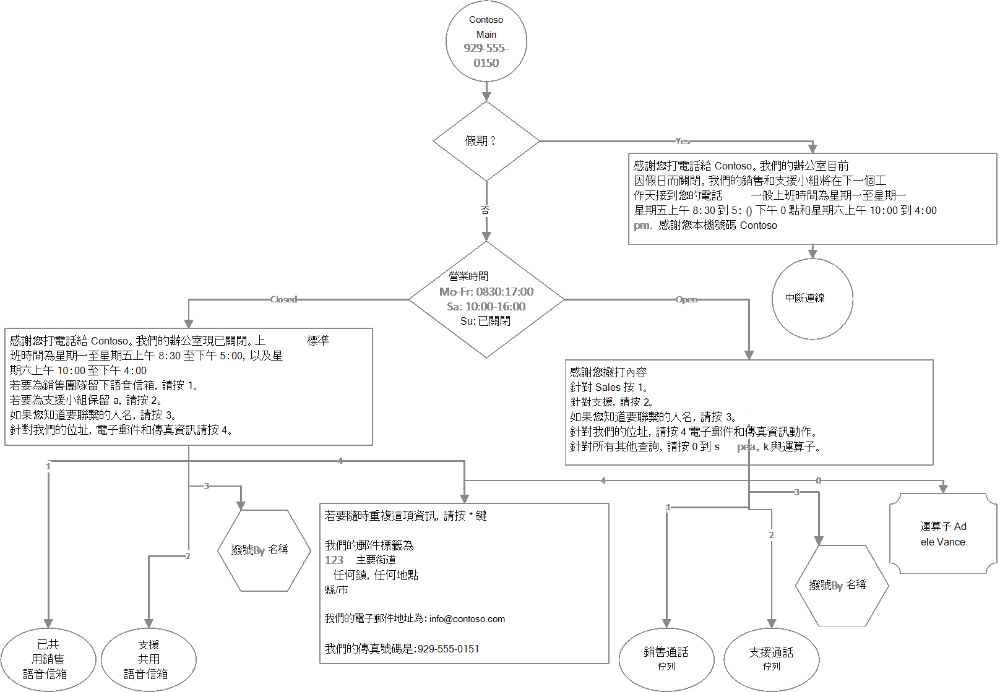

# <a name="create-an-auto-attendant-via-cmdlets"></a>透過 Cmdlet 建立自動語音應答

## <a name="assumptions"></a>假設

1. PowerShell 已安裝在您的電腦上

   - 設定您的電腦以[進行Windows PowerShell](/SkypeForBusiness/set-up-your-computer-for-windows-powershell/set-up-your-computer-for-windows-powershell)
   - 已安裝 MSTeams 模組

     ```PowerShell
     Install-Module -Name MicrosoftTeams -Force -AllowClobber
     ```

   - 已安裝 MSOnline 模組

     ```powershell
     Install-Module -Name MSOnline -Force -AllowClobber
     ```

2. 您擁有租使用者管理許可權
3. 您已購買 Microsoft Teams 電話
4. 在 [使用 PowerShell Cmdlet 建立通話佇列](create-a-phone-system-call-queue-via-cmdlets.md) 指南之後，已經設定下列的通話佇列。

**注意**：下列部分參照的 Cmdlet 可能是 Teams PowerShell 模組的公開預覽版本的一部分。 如需詳細資訊，請參閱 [安裝 Teams PowerShell 公開預覽](teams-powershell-install.md) ，並參閱 [Microsoft Teams PowerShell 版本資訊](teams-powershell-release-notes.md)。

已安裝 MicrosoftTeams 模組的使用者應 `Update-Module MicrosoftTeams` 確保已安裝最新版本。

## <a name="scenario"></a>案例

下列自動語音應答通話流程將會建立：



其他設定資訊：

- 自動語音應答：Contoso Main
  - 運算子：Adele Vance
  - 啟用語音輸入：關閉
  - 目錄搜尋：無
  - 假期：
    - 2022 年 1 月 1 日
    - 2022 年 12 月 24 日
    - 2022 年 12 月 25 日

- 自動語音應答：Contoso Dial 依名稱
  - 運算子：Adele Vance
  - 時區：UTC
  - 語言：美國英文
  - 啟用語音輸入：開啟
  - 問候語：無
  - 功能表：TTS，「請說出或輸入您要連絡的人員名稱。 若要返回上一個功能表，請按 9」
  - 目錄搜尋：依名稱撥號
  - 撥號範圍：銷售&支援成員

## <a name="login"></a>登錄

系統會提示您輸入 Teams 系統管理員認證。

```PowerShell
$credential = Get-Credential
Connect-MicrosoftTeams -Credential $credential
Connect-MsolService -Credential $credential
```

## <a name="get-operator-information"></a>取得運算子資訊

```PowerShell
$operatorID = (Get-CsOnlineUser -Identity "sip:adele@contoso.com").Identity

$operatorEntity = New-CsAutoAttendantCallableEntity -Identity $operatorID -Type User
```

## <a name="dial-by-name-auto-attendant---resource-account-creation"></a>依名稱撥號自動語音應答 - 資源帳戶建立

**注意**：在這裡建立資源帳戶，以便在主要自動語音應答上參照。 日後會建立實際的 [依名稱撥號] 自動語音應答。

### <a name="get-license-types"></a>取得授權類型

```PowerShell
Get-MsolAccountSku
```

### <a name="create-and-assign-resource-account"></a>建立及指派資源帳戶

**注意**：此處不需要電話號碼，因為自動語音應答會在通話佇列前面結束

- ApplicationID
  - 自動語音應答：ce933385-9390-45d1-9512-c8d228074e07
  - 通話佇列：11cd3e2e-fccb-42ad-ad00-878b93575e07

```PowerShell
New-CsOnlineApplicationInstance -UserPrincipalName ContosoDialByNameAA-RA@contoso.com -DisplayName "Contoso Dial By Name AA" -ApplicationID "ce933385-9390-45d1-9512-c8d228074e07"

Set-MsolUser -UserPrincipalName "ContosoDialByNameAA-RA@contoso.com" -UsageLocation US

Set-MsolUserLicense -UserPrincipalName "ContosoDialByNameAA-RA@contoso.com" -AddLicenses "contoso:PHONESYSTEM_VIRTUALUSER"

$dialByNameApplicationInstanceID = (Get-CsOnlineUser "ContosoDialByNameAA-RA@contoso.com").ObjectID
```

## <a name="contoso-main-menu-auto-attendant"></a>Contoso 主功能表自動語音應答

### <a name="create-holiday-schedules"></a>建立假日排程

```PowerShell
$dtr = New-CsOnlineDateTimeRange -Start "24/12/2022" -End "25/12/2022"

$christmasSchedule = New-CsOnlineSchedule -Name "Christmas" -FixedSchedule -DateTimeRanges @($dtr)

$dtr = New-CsOnlineDateTimeRange -Start "01/01/2022" -End "02/01/2022"

$newyearSchedule = New-CsOnlineSchedule -Name "New Year" -FixedSchedule -DateTimeRanges @($dtr)
```

### <a name="create-address-fax-and-email-information-prompt"></a>建立位址、傳真和Email資訊提示

```PowerShell
$addressPrompt = New-CsAutoAttendantPrompt -TextToSpeechPrompt "To repeat this information at any time press the * key. Our mailing address is: 123 Main Street, Any town, Any Place, County. Our email address is: info@contoso.com. Our fax number is: 929-555-0151"
```

### <a name="create-holiday-prompts-and-menu-options"></a>建立佳節提示和功能表選項

```PowerShell
$christmasGreetingPrompt = New-CsAutoAttendantPrompt -TextToSpeechPrompt "Thank you for calling Contoso. Our offices ae currently closed for the Christmas holiday. Our Sales and Support teams will be happy to take your call on the next business day. Regular business hours are Monday through Friday from 8:30 am to 5:00 pm and Saturday from 10:00 am to 4:00 pm eastern time. Thank you for calling Contso."

$christmasMenuOption = New-CsAutoAttendantMenuOption -Action DisconnectCall -DtmfResponse Automatic

$christmasMenu = New-CsAutoAttendantMenu -Name "Christmas Menu" -MenuOptions @($christmasMenuOption)

$christmasCallFlow = New-CsAutoAttendantCallFlow -Name "Christmas" -Greetings @($christmasGreetingPrompt) -Menu $christmasMenu

$christmasCallHandlingAssociation = New-CsAutoAttendantCallHandlingAssociation -Type Holiday -ScheduleId $christmasSchedule.Id -CallFlowId $christmasCallFlow.Id

$newyearGreetingPrompt = New-CsAutoAttendantPrompt -TextToSpeechPrompt "Thank you for calling Contoso. Our offices ae currently closed for the New Year's holiday. Our Sales and Support teams will be happy to take your call on the next business day. Regular business hours are Monday through Friday from 8:30 am to 5:00 pm and Saturday from 10:00 am to 4:00 pm eastern time. Thank you for calling Contso."

$newyearMenuOption = New-CsAutoAttendantMenuOption -Action DisconnectCall -DtmfResponse Automatic

$newyearMenu = New-CsAutoAttendantMenu -Name "New Year Menu" -MenuOptions @($newyearMenuOption)

$newyearCallFlow = New-CsAutoAttendantCallFlow -Name "New Year" -Greetings @($newyearGreetingPrompt) -Menu $newyearMenu

$newyearCallHandlingAssociation = New-CsAutoAttendantCallHandlingAssociation -Type Holiday -ScheduleId $newyearSchedule.Id -CallFlowId $newyearCallFlow.Id
```

### <a name="create-after-hours-schedules"></a>建立下班時間排程

```PowerShell
$timerangeMoFr = New-CsOnlineTimeRange -Start 08:30 -end 17:00

$timerangeSa = New-CsOnlineTimeRange -Start 10:00 -end 16:00

$afterHoursSchedule = New-CsOnlineSchedule -Name "After Hours Schedule" -WeeklyRecurrentSchedule -MondayHours @($timerangeMoFr) -TuesdayHours @($timerangeMoFr) -WednesdayHours @($timerangeMoFr) -ThursdayHours @($timerangeMoFr) -FridayHours @($timerangeMoFr) -SaturdayHours @($timerangeSa) -Complement
```

### <a name="create-after-hours-prompts-and-menu-options"></a>建立 [下班後提示] 和 [功能表選項]

```PowerShell
$afterHoursGreetingPrompt = New-CsAutoAttendantPrompt -TextToSpeechPrompt "Thank you for calling Contoso. Our offices are now closed. Regular business hours are Monday through Friday from 8:30 am to 5:00 pm and Saturday from 10:00 am to 4:00 pm eastern time."

$afterHoursMenuPrompt = New-CsAutoAttendantPrompt -TextToSpeechPrompt "To leave a voicemail for our sales team press 1.To leave a message for our support team press 2.If you know the name of the person you would like to reach, press 3.For our address, email and fax information press 4."

$afterHoursMenuOption1Target = (Get-Team -displayname "Sales").GroupID

$afterHoursMenuOption1Entity = New-CsAutoAttendantCallableEntity -Identity $afterHoursMenuOption1Target -Type SharedVoiceMail -EnableTranscription -EnableSharedVoicemailSystemPromptSuppression

$afterHoursMenuOption1 = New-CsAutoAttendantMenuOption -Action TransferCallToTarget -DtmfResponse Tone1 -CallTarget $afterHoursMenuOption1Entity

$afterHoursMenuOption2Target = (Get-Team -displayname "Support").GroupID

$afterHoursMenuOption2Entity = New-CsAutoAttendantCallableEntity -Identity $afterHoursMenuOption2Target -Type SharedVoicemail -EnableTranscription -EnableSharedVoicemailSystemPromptSuppression

$afterHoursMenuOption2 = New-CsAutoAttendantMenuOption -Action TransferCallToTarget -DtmfResponse Tone2 -CallTarget $afterHoursMenuOption2Entity

$dialbynameAAOption3Target = (Get-CsOnlineUser -Identity "ContosoDialByNameAA-RA@contso.com").Identity

$dialbynameAAMenuOption3Entity = New-CsAutoAttendantCallableEntity -Identity $dialbynameAAOption3Target -Type applicationendpoint

$dialbynameAAMenuOption3 = New-CsAutoAttendantMenuOption -Action TransferCallToTarget -DtmfResponse Tone3 -CallTarget $dialbynameAAMenuOption3Entity

$afterHoursMenuOption4 = New-CsAutoAttendantMenuOption -Action Announcement -DtmfResponse Tone4 -Prompt $addressPrompt
```

### <a name="create-after-hours-menu-and-call-flow"></a>建立 [下班時間] 功能表和 [通話流程]

```PowerShell
$afterHoursMenu = New-CsAutoAttendantMenu -Name "After Hours Menu" -MenuOptions @($afterHoursMenuOption1, $afterHoursMenuOption2, $dialbynameAAMenuOption3, $afterHoursMenuOption4) -Prompt $afterHoursMenuPrompt

$afterHoursCallFlow = New-CsAutoAttendantCallFlow -Name "After Hours Call Flow" -Greetings @($afterHoursGreetingPrompt) -Menu $afterHoursMenu

$afterHoursCallHandlingAssociation = New-CsAutoAttendantCallHandlingAssociation -Type AfterHours -ScheduleId $afterHoursSchedule.Id -CallFlowId $afterHoursCallFlow.Id
```

### <a name="create-open-hours-prompts-and-menu-options"></a>建立 [上班時間提示] 和 [功能表選項]

```PowerShell
$openHoursGreetingPrompt = New-CsAutoAttendantPrompt -TextToSpeechPrompt " Thank you for calling Contoso."

$openHoursMenuPrompt = New-CsAutoAttendantPrompt -TextToSpeechPrompt "For Sales press 1. For Support press 2. If you know the name of the person you would like to reach, press 3. For our address, email and fax information, press 4. For all other inquiries press 0 to speak with the operator."

$openHoursMenuOption1Target = (Get-CsOnlineUser "Sales-RA@contoso.com").ObjectID

$openHoursMenuOption1Entity = New-CsAutoAttendantCallableEntity -Identity $openHoursMenuOption1Target -Type applicationendpoint

$openHoursMenuOption1 = New-CsAutoAttendantMenuOption -Action TransferCallToTarget -DtmfResponse Tone1 -CallTarget $openHoursMenuOption1Entity

$openHoursMenuOption2Target = (Get-CsOnlineUser "Support-RA@contoso.com").ObjectID

$openHoursMenuOption2Entity = New-CsAutoAttendantCallableEntity -Identity $openHoursMenuOption2Target -Type applicationendpoint

$openHoursMenuOption2 = New-CsAutoAttendantMenuOption -Action TransferCallToTarget -DtmfResponse Tone2 -CallTarget $openHoursMenuOption2Entity

$openHoursMenuOption4 = New-CsAutoAttendantMenuOption -Action Announcement -DtmfResponse Tone4 -Prompt $addressPrompt

$openHoursMenuOption0 = New-CsAutoAttendantMenuOption -Action TransferCallToOperator -DtmfResponse Tone0
```

### <a name="create-open-hours-menu"></a>建立 [上班時間] 功能表

```PowerShell
$openHoursMenu = New-CsAutoAttendantMenu -Name "Open Hours Menu" -MenuOptions @($openHoursMenuOption1, $openHoursMenuOption2, $dialbynameAAMenuOption3, $openHoursMenuOption4, $openHoursMenuOption0) -Prompt $openHoursMenuPrompt

$openHoursCallFlow = New-CsAutoAttendantCallFlow -Name "Open Hours Call Flow" -Greetings @($openHoursGreetingPrompt) -Menu $openHoursMenu
```

### <a name="create-auto-attendant"></a>建立自動語音應答

```PowerShell
$autoAttendant = New-CsAutoAttendant -Name "Contoso Main" -DefaultCallFlow $openHoursCallFlow -CallFlows @($afterHoursCallFlow, $christmasCallFlow, $newyearCallFlow) -CallHandlingAssociations @($afterHoursCallHandlingAssociation, $christmasCallHandlingAssociation, $newyearCallHandlingAssociation) -LanguageId "en-US" -TimeZoneId "Eastern Standard Time" -Operator $operatorEntity
```

### <a name="get-license-types"></a>取得授權類型

```PowerShell
Get-MsolAccountSku
```

### <a name="create-and-assign-resource-account"></a>建立及指派資源帳戶

- ApplicationID
  - 自動語音應答：ce933385-9390-45d1-9512-c8d228074e07
  - 通話佇列：11cd3e2e-fccb-42ad-ad00-878b93575e07

```PowerShell
New-CsOnlineApplicationInstance -UserPrincipalName ContosoMainAA-RA@contoso.com -DisplayName "Contoso Main AA" -ApplicationID "ce933385-9390-45d1-9512-c8d228074e07"

Set-MsolUser -UserPrincipalName "ContosoMainAA-RA@contoso.com" -UsageLocation US

Set-MsolUserLicense -UserPrincipalName "ContosoMainAA-RA@contoso.com" -AddLicenses "contoso:PHONESYSTEM_VIRTUALUSER"

$applicationInstanceID = (Get-CsOnlineUser "ContosoMainAA-RA@contoso.com").Identity

$autoAttendantID = (Get-CsAutoAttendant -NameFilter "Contoso Main").Identity

New-CsOnlineApplicationInstanceAssociation -Identities @($applicationInstanceID) -ConfigurationID $autoAttendantID -ConfigurationType AutoAttendant
```

### <a name="get-list-of-unassigned-service-numbers"></a>取得未指派的服務號碼清單

```PowerShell
Get-CsPhoneNumberAssignment -PstnAssignmentStatus Unassigned -CapabilitiesContain VoiceApplicationAssignment
```

#### <a name="assign-available-phone-number"></a>指派可用的電話號碼
注意：指派給電話號碼的使用位置必須符合指派給資源帳戶的使用位置。

```PowerShell
Set-CsPhoneNumberAssignment -Identity ContosoMainAA-RA@contoso.com -PhoneNumber +{spare number from output of above command} -PhoneNumberType CallingPlan
```

## <a name="dial-by-name-auto-attendant---completion"></a>依名稱撥號自動語音應答 - 完成

### <a name="create-dial-scope"></a>建立撥號範圍

```PowerShell
$salesGroupID = Find-CsGroup -SearchQuery "Sales" | % { $_.Id }

$supportGroupID = Find-CsGroup -SearchQuery "Support" | % { $_.Id }

$dialScope = New-CsAutoAttendantDialScope -GroupScope -GroupIds @($salesGroupID, $supportGroupID)
```

### <a name="create-prompts-and-menu-options"></a>建立提示和功能表選項

```PowerShell
$dialByNameMenuPrompt = New-CsAutoAttendantPrompt -TextToSpeechPrompt "Please say or enter the name of the person you would like to reach. To return to the previous menu press 9"

$dialByNameMenuOption9Target = (Get-CsOnlineUser "ContosoMainAA-RA@contoso.com").Identity

$dialByNameMenuOption9Entity = New-CsAutoAttendantCallableEntity -Identity $dialByNameMenuOption9Target -Type applicationendpoint

$dialByNameMenuOption9 = New-CsAutoAttendantMenuOption -Action TransferCallToTarget -DtmfResponse Tone9 -CallTarget $dialByNameMenuOption9Entity

$dialByNameMenu = New-CsAutoAttendantMenu -Name "Contoso Dial By Name AA" -MenuOptions @($dialByNameMenuOption9) -Prompt $dialByNameMenuPrompt

$dialByNameMenu = New-CsAutoAttendantMenu -Name "Contoso Dial By Name AA" -MenuOptions @($dialByNameMenuOption9) -Prompt $dialByNameMenuPrompt -EnableDialByName -DirectorySearchMethod ByName

$dialByNameCallFlow = New-CsAutoAttendantCallFlow -Name "Contoso Dial By Name Call Flow" -Menu $dialByNameMenu

$dialByNameAutoAttendant = New-CsAutoAttendant -Name "Contoso Dial By Name" -DefaultCallFlow $dialByNameCallFlow -LanguageId "en-US" -TimeZoneId "UTC" -Operator $operatorEntity -EnableVoiceResponse -InclusionScope $dialScope
```

### <a name="assign-resource-account"></a>指派資源帳戶

```PowerShell
New-CsOnlineApplicationInstanceAssociation -Identities @($dialByNameApplicationInstanceID) -ConfigurationID $dialByNameAutoAttendant.Id -ConfigurationType AutoAttendant
```
