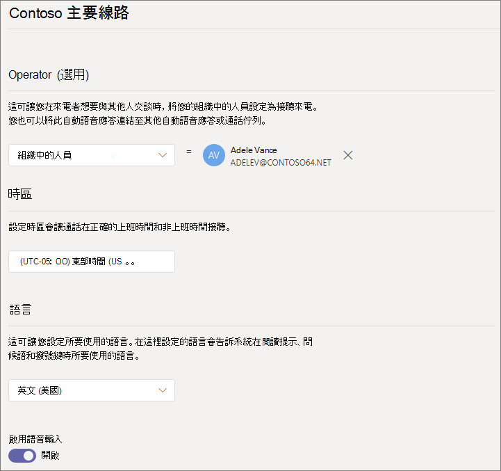
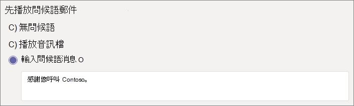
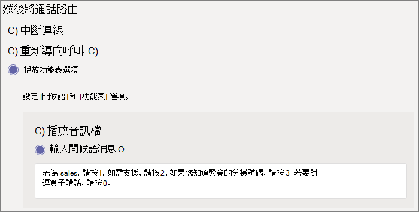
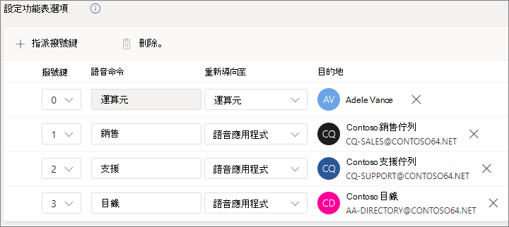
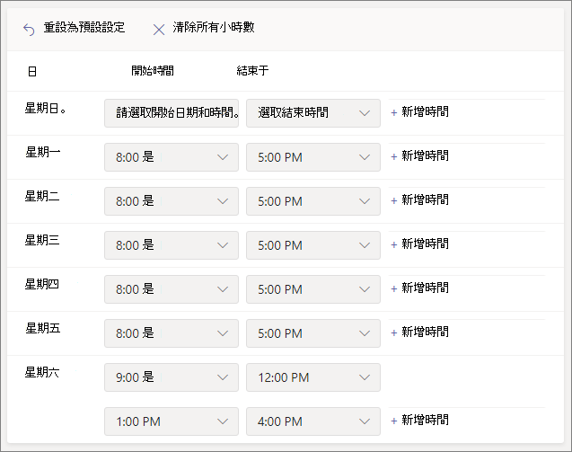
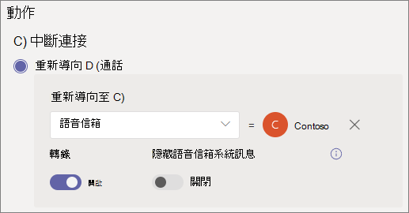
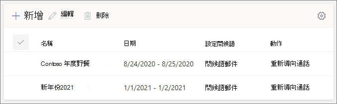
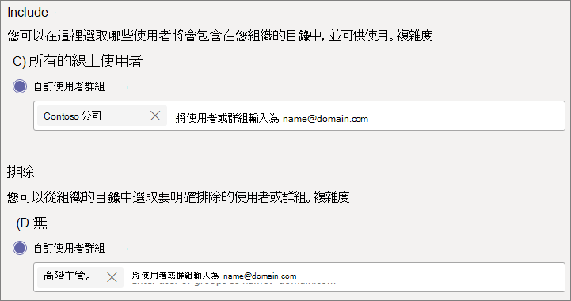
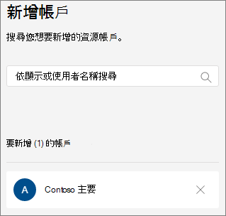
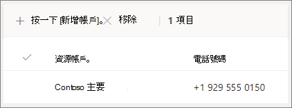

# 設定自動語音應答

自動語音應答讓其他人打電話給您的組織，並流覽功能表系統，以與正確的部門通話、呼叫佇列、人員或接線員。 您可以使用 Microsoft 團隊系統管理中心或 PowerShell，為您的組織建立自動語音應答。 

請確定您已閱讀 [小組自動語音應答] [和 [呼叫佇列](plan-auto-attendant-call-queue.md) ] 的 [規劃]，然後依照本文 [中的程式](plan-auto-attendant-call-queue.md#getting-started) 執行。

自動語音應答可以根據來電者的輸入，將呼叫定向至下列其中一個目的地： 

- **組織中的人員** -您組織中能夠接聽語音通話的人員。 這可以是線上使用者，或使用商務用 Skype Server 託管內部部署的使用者。
- **語音 app** -另一個自動語音應答或通話佇列。  (選擇 [選擇此目的地時，與自動語音應答或通話佇列] 相關聯的資源帳戶。 ) 
- **外部電話號碼** -任何電話號碼。  (查看 [外部轉接技術詳細資料](create-a-phone-system-auto-attendant.md#external-phone-number-transfers---technical-details)) 。
- **語音信箱** -與您指定的 Microsoft 365 群組相關聯的語音信箱。
- **Operator** -為自動語音應答定義的運算子。 定義運算子是選擇性的。 操作員可以定義為此清單中的任何其他目的地。

當您設定自動語音應答時，系統會提示您在各個階段選擇其中一個選項。

若要設定自動語音應答，請在 [小組管理中心] 中，展開 [語音]，按一下 [ **自動****語音** ]，然後按一下 [ **新增** ]。

## 一般資訊

1. 在頂端方塊中輸入自動語音應答的名稱。

2. 如果您想要指派運算子，請指定呼叫操作員的目的地。 這是選擇性 (但建議) 。 您可以設定 [ **運算子** ] 選項，讓呼叫者中斷功能表並向指定的人朗讀。

3. 指定此自動語音應答的時區。 如果您在 [下班後建立單獨的通話流程](#call-flow-for-after-hours)，則會使用時區來計算上班時間。

4. 指定此自動語音應答的語言。 這是將用於系統產生的語音提示的語言。

5. 選擇是否要啟用語音輸入。 啟用時，每個功能表選項的名稱都會變成語音辨識關鍵字。 例如，來電者可以說「一」，選取對應至鍵1的功能表選項，或者說「銷售」來選取名為「銷售」的功能表選項。

6. 按一下 **[下一步]** 。

## 通話流程

選擇當自動語音接聽來電時，是否要播放問候語。

如果您選取 [ **播放音訊** 檔]，您可以使用 [ **上傳** 檔案] 按鈕，上傳儲存為音訊的錄製問候語訊息。WAV，。[MP3] 或。WMA 格式。 錄製不能大於 5 MB。

如果您選取 [ **輸入問候語** ]，系統將會朗讀您在其中輸入文字的文字， (最多1000個字元) 當自動語音接聽來電時。

選擇您要路由通話的方式。

如果您選取 **[中斷連線]** ，自動語音應答就會掛斷通話。

如果您選取 [重新 **導向通話** ]，您可以選擇其中一個呼叫路由目標。

如果您選取 [ **播放] 功能表選項** ，您可以選擇 **播放音訊** 檔案或 **輸入問候語** ，然後選擇 [功能表選項] 和 [目錄搜尋]。

### 功能表選項

針對撥號選項，您可以將電話鍵台的0-9 金鑰指派給其中一個呼叫路由目標。  (按鍵 \* (重複) ，而 \# (返回) 是由系統保留，且無法重新指派。 ) 

金鑰組應不一定是連續的。 例如，您可以建立一個鍵0、1及3對應至選項的功能表，而不使用2鍵。

如果您已設定一個，我們建議將0鍵對應至運算子。 如果運算子未設定為任何鍵，語音命令 "Operator" 也會停用。 

針對每個功能表選項，指定下列各項：

- **撥號鍵** -電話鍵臺上的按鍵可存取此選項。 如果有可用的語音輸入，呼叫者也可以說此號碼來存取此選項。

- **Voice 命令** -定義來電者可提供的語音命令來存取此選項（如果已啟用語音輸入）。 它可以包含多個字詞，例如「客戶服務」或「作業與不限」。 例如，來電者可以按2、說「二」或說「銷售」，選取對應至2鍵的選項。 此文字也會由針對服務確認提示的文字轉換語音，可能是「將您的電話轉接到銷售」之類的內容。

- [ **重定向至** ]-呼叫路由目的地（在來電者選擇此選項時使用）。 如果您要重新導向自動語音應答或通話佇列，請選擇與其關聯的資源帳戶。

### 目錄搜尋

如果您指派撥號鍵至目的地，我們建議您選擇 [ **無** ] 進行 **目錄搜尋** 。 如果來電者嘗試使用指派給特定目的地的金鑰來撥打名稱或分機，可能會在完成輸入名稱或副檔名之前，意外地路由到目的地。 我們建議您為目錄搜尋建立一個單獨的自動語音應答，並透過撥號鍵讓您的主要自動語音應答連結。

如果您沒有指派撥號鍵，請選擇 [ **目錄搜尋** ] 的選項。

**依名稱撥號** -如果您啟用此選項，則呼叫者可以說出使用者的名稱，或在電話鍵臺上輸入密碼。 使用電話系統授權的任何線上使用者，或任何使用商務用 Skype Server 主機內部部署的使用者，都是合格的使用者，而且可以使用 [撥號者名稱] 找到。  (您可以在 [ [撥號作用域](#dial-scope) ] 頁面上設定目錄中的人員，且不會包含在目錄中。 ) 

[透過 **分機撥號** ]-如果您啟用此選項，則呼叫者可以撥打電話給您組織中的使用者。 使用電話系統授權的任何線上使用者，或任何使用商務用 Skype Server 主機內部部署的使用者，都是符合資格的使用者，而且可透過 **分機** 找到。  (您可以在 [ [撥號作用域](#dial-scope) ] 頁面上設定目錄中的人員，且不會包含在目錄中。 ) 

您想要讓撥打電話使用的使用者必須將延伸指定為下列其中一個電話屬性（在 Active Directory 或 Azure Active Directory 中定義），如需詳細資訊，請參閱 [新增使用者或大量](https://docs.microsoft.com/microsoft-365/admin/add-users/add-users) (。 ) 

- OfficePhone
- HomePhone
- 行動/MobilePhone
- Telephonenumber 相同/PhoneNumber
- OtherTelephone

在 [使用者電話號碼] 欄位中輸入副檔名所需的格式是 *+ <phone number> ext = <extension>* 或 *+ <phone number> x <extension>* 。

您可以在 [Microsoft 365 系統管理中心](https://admin.microsoft.com/) 或 [Azure Active Directory 系統管理中心](https://aad.portal.azure.com)中設定延伸。 [自動語音應答] 和 [呼叫佇列] 可使用變更前需要12小時的時間。

> [!NOTE]
> 如果您想要同時使用 [ **撥號者名稱** ] 和 [透過 **撥** 打電話] 功能，您可以在主自動語音應答上指派撥號鍵，即可透過 **名稱撥打** 自動語音應答。 在該自動語音應答中，您可以將沒有任何與它相關聯之字母的1金鑰 (指派) 來透過分機自動語音應答來取得 **撥號** 。

選取 **目錄搜尋** 選項之後，請按 **[下一步]** 。

## 下班時間的通話流程

每個自動語音應答的上班時間都可以設定。 如果未設定上班時間，則當天的所有日期和所有的時間都被視為「上班時間」，因為預設會設定24/7 排程。 您可以在一天中使用時段來設定上班時間，而且所有未設為「上班時間」的小時都會被視為時間。 您可以設定不同的來電處理選項和問候語（在下班後）。

視您設定自動語音應答及呼叫佇列的方式而定，您可能只需要使用直接電話號碼，指定自動語音接聽的時間呼叫路由。

如果您想要在下班後的呼叫者單獨撥打通話路線，請指定每天的上班時間。 按一下 [ **新增時間** ]，為指定日期指定多組小時數（例如指定午餐時間）。

指定上班時間之後，請選擇您的通話路線選項，以供下班時間使用。 對於您在上述指定的商務時間呼叫路由，您可以使用相同的選項。

完成後，請按 **[下一步]** 。

## 假日期間的通話流程

您的自動語音應答可以針對 [您設定](set-up-holidays-in-teams.md)的每一個假日進行通話流程。 您最多可以將20個排定的假日新增至每個自動語音應答。

1. 在 [假日通話設定] 頁面上，按一下 [ **新增** ]。

2. 輸入此假日設定的名稱。

3. 從 [ **假日** ] 下拉式清單中，選擇您要使用的假日。

4. 選擇您要使用的問候類型。

    

5. 選擇您是否要 **中斷** 連線，或重新 **導向** 通話。

6. 如果您選擇 [重新導向]，請選擇通話的呼叫傳送目的地。

7. 按一下 [儲存]  。

視需要針對每個額外的假日重複程式。

當您新增完所有假日之後，請按 **[下一步]** 。

## 撥號作用中

*撥號作用* 中定義來電者使用按名稱撥號或撥號延伸時，在目錄中可使用的使用者。 **所有線上使用者** 的預設值都是您組織中所有以電話系統授權或主機內部部署的使用者（使用商務用 Skype 伺服器）。

您可以選取 [ **包括** ] 或 [ **排除** ] 底下的 [ **自訂使用者組** ]，然後選擇一或多個 Microsoft 365 群組、通訊群組清單或安全性群組，以包含或排除特定的使用者。 例如，您可能想要將貴組織中的主管從撥號目錄中排除。  (如果使用者同時位於兩個清單中，則會將其從目錄中排除。 ) 

> [!NOTE]
> 最多可能需要36小時，才能讓新使用者將其名稱列在目錄中。

完成設定撥號作用中的範圍之後，請按 **[下一步]** 。

## 資源帳戶

所有自動語音應答都必須有關聯的資源帳戶。  第一層自動語音應答將至少需要一個有相關服務號碼的資源帳戶。 如果您想要的話，您可以將多個資源帳戶指派給自動語音應答，每個都有不同的服務號碼。

若要新增資源帳戶，請按一下 [ **新增帳戶** ]，然後搜尋您要新增的帳戶。 按一下 [ **新增** ]，然後按一下 [ **新增** ]。

完成新增服務帳戶後，請按一下 [ **提交** ]。 這會完成自動助理設定。

## 外部電話號碼傳輸-技術詳細資料

當您將來電轉接至外部電話號碼時，與自動語音應答或通話佇列相關聯的資源帳戶必須有電話號碼和 Microsoft 365 電話系統-虛擬使用者授權。 此外

- 針對含有通話方案編號的資源帳戶，請指派 [通話方案](calling-plans-for-office-365.md) 授權。
- 針對有直接傳送號碼的資源帳戶，請指派 [線上語音路由策略](manage-voice-routing-policies.md)。

顯示的輸出電話號碼是由以下所示：

  - 針對通話方案編號，會顯示原始來電者的電話號碼。
  - 針對直接銀行代號，傳送的數位是以 P 斷言身分識別 (PAI 在 SBC 上) 設定，如下所示：
    - 如果設定為 [停用]，則會顯示原始來電者的電話號碼。 這是預設及建議的設定。
    - 如果設定為 [啟用]，則會顯示資源帳戶的電話號碼。

不支援通話方案 trunks 和直接路由 trunks 之間的轉移。

在混合式環境中，若要透過商務用 Skype PSTN 整合將自動語音來電轉接至 PSTN，請建立一個新的內部部署使用者，並將來電轉接設定為 PSTN 號碼。 使用者必須啟用企業語音並指派語音原則。 若要深入瞭解，請參閱 [自動通話轉接至 PSTN](https://docs.microsoft.com/SkypeForBusiness/plan/exchange-unified-messaging-online-migration-support#auto-attendant-call-transfer-to-pstn)。

### 使用 PowerShell 建立自動助理

您也可以使用 PowerShell 來建立及設定自動語音應答。 以下是您需要管理自動語音應答的 Cmdlet：

- [新-CsAutoAttendant](https://docs.microsoft.com/powershell/module/skype/new-csautoattendant?view=skype-ps)  
- [Set-CsAutoAttendant](https://docs.microsoft.com/powershell/module/skype/set-csautoattendant?view=skype-ps)
- [CsAutoAttendant](https://docs.microsoft.com/powershell/module/skype/get-csautoattendant?view=skype-ps)
- [CsAutoAttendantHolidays](https://docs.microsoft.com/powershell/module/skype/get-csautoattendantholidays?view=skype-ps)
- [移除-CsAutoAttendant](https://docs.microsoft.com/powershell/module/skype/remove-csautoattendant?view=skype-ps)
- [新-CsAutoAttendantMenu](https://docs.microsoft.com/powershell/module/skype/new-csautoattendantmenu?view=skype-ps)
- [新-CsOnlineAudioFile](https://docs.microsoft.com/powershell/module/skype/new-CsOnlineAudioFile?view=skype-ps)
- [新-CsAutoAttendantCallFlow](https://docs.microsoft.com/powershell/module/skype/New-CsAutoAttendantCallFlow?view=skype-ps)
- [Export-CsAutoAttendantHolidays](https://docs.microsoft.com/powershell/module/skype/export-csorganizationalautoattendantholidays?view=skype-ps)
- [新-CsOnlineTimeRange](https://docs.microsoft.com/powershell/module/skype/new-csonlinetimerange?view=skype-ps)
- [新-CsOnlineDateTimeRange](https://docs.microsoft.com/powershell/module/skype/new-csonlinedatetimerange?view=skype-ps)
- [新-CsOnlineSchedule](https://docs.microsoft.com/powershell/module/skype/New-CsOnlineSchedule?view=skype-ps)
- [CsAutoAttendantSupportedTimeZone](https://docs.microsoft.com/powershell/module/skype/Get-CsAutoAttendantSupportedTimeZone?view=skype-ps)
- [新-CsAutoAttendantCallHandlingAssociation](https://docs.microsoft.com/powershell/module/skype/New-CsAutoAttendantCallHandlingAssociation?view=skype-ps)
- [CsAutoAttendantSupportedLanguage](https://docs.microsoft.com/powershell/module/skype/Get-CsAutoAttendantSupportedLanguage?view=skype-ps)
- [匯入-CsAutoAttendantHolidays](https://docs.microsoft.com/powershell/module/skype/import-csautoattendantholidays?view=skype-ps)
- [新-CsAutoAttendantCallableEntity](https://docs.microsoft.com/powershell/module/skype/New-CsAutoAttendantCallableEntity?view=skype-ps)

## 相關主題

[以下是可透過電話系統獲得的功能](/MicrosoftTeams/here-s-what-you-get-with-phone-system)

[取得服務電話號碼](/microsoftteams/getting-service-phone-numbers)

[音訊會議與通話方案的適用國家/地區](/microsoftteams/country-and-region-availability-for-audio-conferencing-and-calling-plans/country-and-region-availability-for-audio-conferencing-and-calling-plans)

[小型企業範例-設定自動助手](/microsoftteams/tutorial-org-aa) 

[Windows PowerShell 與 Lync Online 的簡介](/SkypeForBusiness/set-up-your-computer-for-windows-powershell/set-up-your-computer-for-windows-powershell)
