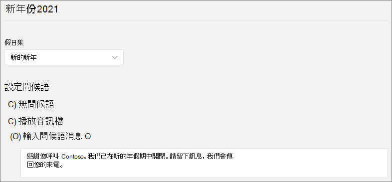

# 設定自動 attendant

自動 attendants 可讓人打電話給您的組織，並流覽功能表系統，與正確的部門、通話佇列、人員或接線生通話。 您可以使用 Microsoft Teams 系統管理中心或 PowerShell 為貴組織建立自動 Attendant。

遵循本文中的程式之前，請務必先閱讀[Teams](plan-auto-attendant-call-queue.md)自動 Attendant 和通話佇列的規劃，並遵循開始使用的步驟。

自動語音機可以根據來電者的輸入，將電話直接撥打到下列其中一個目的地： 

- **運算子** - 為自動 attendant 定義的運算子。 定義運算子是選擇性的。 運算子可以定義為清單中任何其他目的地。
- **組織中可接聽** 語音通話的人。 這可以是線上使用者，或使用商務用 Skype Server 託管于內部部署的使用者。
- **語音應用程式** - 另一個自動語音留言機或通話佇列。  (選擇此目的地.) 
- **語音** 信箱 - 與您指定的 Microsoft 365 群組相關聯的語音信箱。
- **外部電話號碼** - 任何電話號碼。  (外部[移轉技術詳細資料) 。](create-a-phone-system-auto-attendant.md#external-phone-number-transfers---technical-details)
- **宣告** - 播放音訊檔案。 您上傳的已錄製公告訊息，儲存為音訊。Wav。MP3 或 。WMA 格式。 錄製內容不能大於 5 MB。 系統會播放公告，然後返回自動 Attendant 功能表。
- **公告** - 在訊息中輸入。 這是您希望系統朗讀的文字。 您可以輸入最多 1000 個字元。 系統會播放公告，然後返回自動 Attendant 功能表。

當您設定自動語音回應時，系統會提示您于不同階段選擇其中一個選項。

若要設定自動語音留言，請在 Teams 系統管理中心展開 **語音**，選取 **自動語音** 機， **然後選取新增**。

## 一般資訊

1. 在頂端方塊中輸入自動 attendant 的名稱。

2. 如果您想要指定運算子，請指定撥打給該運算子的目的地。 這是選擇性選項 (，但建議您) 。 您可以 **設定運算子選項** ，讓來電者離開功能表，並和指定的人員通話。

3. 指定此自動 Attendant 的時區。 如果您為上班時間建立個別的通話流程，時區會用來 [計算上班時間](#call-flow-for-after-hours)。

4. 指定 [此自動 Attendant](create-a-phone-system-auto-attendant-languages.md) 的支援語言。 這是系統產生的語音提示所使用的語言。

5. 選擇是否要啟用語音輸入。 啟用時，每個功能表選項的名稱都會變成語音辨識關鍵字。 例如，來電者可以說「One」以選取對應到按鍵 1 的功能表選項，或說出「銷售」以選取名為「銷售」的功能表選項。

> [!NOTE]
> 如果您在步驟 4 中選擇不支援語音輸入的語言，此選項將會停用。

6. 選取下 **一步**。

## 通話流程

選擇當自動回應接聽來電時，是否要播放問候語。

如果您選取了 **播放音訊檔案，** 您可以使用上傳 **檔案按鈕來** 上傳儲存為音訊的錄製問候語訊息。Wav。MP3 或 。WMA 格式。 錄製內容不能大於 5 MB。

如果您選取了輸入問候語 **訊息** ，當自動 (自動回應接聽來電時) 會朗讀您輸入的文字。

選擇通話的路由方式。

如果您選取中斷 **連接**，自動電話機會掛斷通話。

如果您選取重新 **導向通話**，您可以選擇其中一個呼叫路由目的地。

如果您選取了播放 **功能表選項**，您可以選擇播放音訊檔案或輸入問候語訊息，然後選擇功能表選項和目錄搜尋。

### 功能表選項

針對撥號選項，您可以將電話鍵臺上的 0-9 鍵指派給其中一個呼叫路由目的地。  (系統 (重複)  (Back) 的按鍵，且無法重新指派 \* \# 。) 

金鑰映射不必是連續的。 例如，可以建立一個功能表，其中按鍵 0、1 和 3 對應到選項，而兩個按鍵則沒有使用。

如果您已經將零鍵與運算子進行比對，建議您將零鍵與運算子進行比對。 如果運算子未設定為任何按鍵，也會停用語音命令「運算子」。

針對每個功能表選項，指定下列設定：

- **撥號鍵** - 電話鍵臺上的按鍵，可存取此選項。 如果語音輸入可以使用，來電者也可以說出這個號碼來存取選項。

- **語音命令** - 定義來電者可給予存取此選項的語音命令 ，如果已啟用語音輸入。 它可以包含多個字詞，例如「客戶服務」或「營運與理由」。 例如，來電者可以按 2、說「2」，或說「銷售」以選取對應到兩個按鍵的選項。 此文字也會以服務確認提示的文字轉語音顯示，例如「將通話轉接至銷售」。

- **重新導向** 至 - 來電者選擇此選項時所使用的通話路由目的地。 如果您要重新導向到自動 Attendant 或通話佇列，請選擇與其相關聯的資源帳戶。

### 目錄搜尋

如果您將撥號鍵指派給目的地，建議您選擇搜尋 **目錄** 時選擇 **None。** 如果來電者嘗試使用指派給特定目的地的按鍵撥號名稱或分機，他們可能會在您完成輸入名稱或分機之前，未預期地路由至目的地。 建議您為目錄搜尋建立個別的自動 Attendant，並透過撥號鍵提供主要的自動總機連結。

如果您未指派撥號鍵，請選擇目錄 **搜尋選項**。

**按名稱** 撥號 - 如果您啟用此選項，來電者可以說出使用者的名稱，或在電話鍵台輸入。 任何線上使用者或任何使用商務用 Skype Server 在內部部署託管的使用者，都是合格的使用者，而且可以使用撥號名稱找到。  (您可以設定撥號範圍頁面上的目錄中包含和不包含哪些人。) 

**分機號碼** - 如果您啟用此選項，來電者可以撥打其電話分機，與貴組織的使用者聯繫。 任何線上使用者或任何使用商務用 Skype Server 託管于內部部署的使用者，都是符合資格的使用者，而且可撥打分機 **號碼。**  (您可以設定撥號範圍頁面上的目錄中包含和不包含哪些人。) 

想要提供撥號分機服務的使用者，必須擁有在 Active Directory 或 Azure Active Directory 中定義的下列其中一個電話屬性的擴充功能 (請參閱個別或大量新增使用者以瞭解更多資訊。) 

- OfficePhone
- HomePhone
- Mobile/MobilePhone
- TelephoneNumber/PhoneNumber
- OtherTelephone

在使用者電話號碼欄位中輸入分機所需的格式為：

- *+\<phone number>;ext=\<extension>*
- *+\<phone number>X\<extension>*
- *X\<extension>*

- 範例 1：Set-MsolUser -UserPrincipalName usern@domain.com -Phonenumber "+1555555678;ext=5678"
- 範例 2：Set-MsolUser -UserPrincipalName usern@domain.com -Phonenumber "+15555555678x5678"
- 範例 3：Set-MsolUser -UserPrincipalName usern@domain.com -Phonenumber "x5678"

您可以在 [Microsoft 365](https://admin.microsoft.com/) 系統管理中心或 Azure [Active Directory](https://aad.portal.azure.com)系統管理中心設定擴充功能。 最多可能需要 12 小時，自動電話機和通話佇列才能使用變更。

> [!NOTE]
> 如果您想要同時使用按名稱撥號和按分機撥號的功能，您可以在主自動轉音器上指派撥號鍵，以使用已啟用撥號名稱的自動轉 **音機**。 您可以在該自動 attendant 中指派 1 個按鍵 (沒有與其關聯的字母，) **分機自動** 總機。

選取目錄搜尋選項 **之後** ，請選取下 **一步**。

## 數小時後的通話流程

您可以針對每個自動 Attendant 設定上班時間。 如果未設定上班時間，則一天中所有天及所有時數會視為上班時間，因為預設會設定 24/7 排程。 上班時間可以設定為一天中的休息時間，而未設定為上班時間的所有時數會視為上班時間。 您可以設定不同的來電處理選項和上班時間的問候語。

根據您如何配置自動電話機和通話佇列，您可能只需要為具有直接電話號碼的自動電話機指定後通話路由。

如果您想要為上班時間來電者分別進行通話路由，請指定每天的上班時間。 選取 **新增時間** 以指定指定一天的多組時數，例如，指定午餐休息時間。

指定上班時間後，請選擇上班時間的通話路由選項。 這些選項與上述指定的上班時間通話路由相同。

完成 **時** 選取下一步。

## 假日期間通話流量

您的自動電話機可以針對您設定的每個 [假日提供通話流程](set-up-holidays-in-teams.md)。 您可以在每個自動 Attendant 中新增最多 20 個排定的假日。

1. 在假日通話設定頁面上 **，選取新增**。

2. 輸入此假日設定的名稱。

3. 從 **假日** 下拉拉，選擇您想要使用的假日。

4. 選擇您想要使用的問候語類型。

    

5. 選擇是否要中斷 **連接或****重新導向** 通話。

6. 如果您選擇重新導向，請選擇通話的呼叫路由目的地。

7. 選取 **儲存**。

針對每一個額外的假日，請根據需要重複這個程式。

當您新增所有假日時，請選取下 **一步**。

## 撥號範圍

撥號 *範圍* 會定義當來電者使用撥號或撥號分機時，哪些使用者可以在目錄中使用。 根據預設 **，所有線上** 使用者會包含貴組織的所有使用者，這些使用者都是線上使用者，或是使用商務用 Skype Server 託管于內部部署。

您可以選取包含或排除下的自訂使用者群組，並選擇一或多個Microsoft 365 群組、通訊群組清單或安全性群組，以包含或排除特定使用者。  例如，您可能會想要將貴組織的高主管排除在撥號目錄中。  (如果使用者同時在兩個清單中，就會從目錄.) 

> [!NOTE]
> 新使用者最多可能需要 36 小時，才能將他們的名稱列在目錄中。

設定好撥號範圍後，請選取下 **一步**。

## 資源帳戶

所有自動 attendant 都必須有相關聯的資源帳戶。  第一層自動 attendant 至少需要一個擁有相關聯服務號碼的資源帳戶。 您可以根據需要，將多個資源帳戶指派給自動 Attendant，每個帳戶都有個別的服務號碼。

若要新增資源帳戶，請選取 **新增帳戶** ，然後搜尋您想要新增的帳戶。 選取 **新增**， **然後選取新增**。

完成新增服務帳戶後，請選取 **提交** 以完成自動 attendant 組選。

## 外部電話號碼傳輸 - 技術詳細資料

請參閱先決條件 [，](plan-auto-attendant-call-queue.md#prerequisites) 以允許自動電話機將電話轉接至外部。  另外：

- 對於具有通話方案號碼的資源帳戶，外部轉接電話號碼必須以 E.164 格式輸入 (+[國碼][區碼][電話號碼]) 。

- 對於具有直接路由號碼的資源帳戶，外部移轉電話號碼格式取決於會話邊界控制器 ([SBC) ](direct-routing-connect-the-sbc.md) 設定。

顯示外發電話號碼的判定方式如下：

  - 針對通話方案號碼，會顯示原始來電者的電話號碼。
  - 針對直接路由號碼，傳送的號碼是根據 SBC 上的 P-就地識別 (PAI) 設定，如下所示：
    - 如果設為停用，會顯示原始來電者的電話號碼。 這是預設及建議設定。
    - 如果設為啟用，會顯示資源帳戶電話號碼。

在商務用 Skype 混合式環境中，若要將自動 attendant 通話轉接到 PSTN，請建立一個新的內部部署使用者，將來電轉接設定為 PSTN 號碼。 使用者必須啟用企業語音，並指派語音策略。 若要深入瞭解，請參閱[自動將電話轉接到 PSTN。](https://docs.microsoft.com/SkypeForBusiness/plan/exchange-unified-messaging-online-migration-support#auto-attendant-call-transfer-to-pstn)

### 使用 PowerShell 建立自動 Attendant

您也可以使用 PowerShell 來建立和設定自動 Attendant。 以下是管理自動 attendant 所需的 Cmdlet：

- [New-CsAutoAttendant](https://docs.microsoft.com/powershell/module/skype/new-csautoattendant)  
- [Set-CsAutoAttendant](https://docs.microsoft.com/powershell/module/skype/set-csautoattendant)
- [Get-CsAutoAttendant](https://docs.microsoft.com/powershell/module/skype/get-csautoattendant)
- [Get-CsAutoAttendantHolidays](https://docs.microsoft.com/powershell/module/skype/get-csautoattendantholidays)
- [Remove-CsAutoAttendant](https://docs.microsoft.com/powershell/module/skype/remove-csautoattendant)
- [New-CsAutoAttendantMenu](https://docs.microsoft.com/powershell/module/skype/new-csautoattendantmenu)
- [New-CsOnlineAudioFile](https://docs.microsoft.com/powershell/module/skype/new-CsOnlineAudioFile)
- [New-CsAutoAttendantCallFlow](https://docs.microsoft.com/powershell/module/skype/New-CsAutoAttendantCallFlow)
- [Export-CsAutoAttendantHolidays](https://docs.microsoft.com/powershell/module/skype/export-csorganizationalautoattendantholidays)
- [New-CsOnlineTimeRange](https://docs.microsoft.com/powershell/module/skype/new-csonlinetimerange)
- [New-CsOnlineDateTimeRange](https://docs.microsoft.com/powershell/module/skype/new-csonlinedatetimerange)
- [New-CsOnlineSchedule](https://docs.microsoft.com/powershell/module/skype/New-CsOnlineSchedule)
- [Get-CsAutoAttendantSupportedTimeZone](https://docs.microsoft.com/powershell/module/skype/Get-CsAutoAttendantSupportedTimeZone)
- [New-CsAutoAttendantCallHandlingAssociation](https://docs.microsoft.com/powershell/module/skype/New-CsAutoAttendantCallHandlingAssociation)
- [Get-CsAutoAttendantSupportedLanguage](https://docs.microsoft.com/powershell/module/skype/Get-CsAutoAttendantSupportedLanguage)
- [Import-CsAutoAttendantHolidays](https://docs.microsoft.com/powershell/module/skype/import-csautoattendantholidays)
- [New-CsAutoAttendantCallableEntity](https://docs.microsoft.com/powershell/module/skype/New-CsAutoAttendantCallableEntity)

## 相關主題

[以下是可透過電話系統獲得的功能](/MicrosoftTeams/here-s-what-you-get-with-phone-system)

[取得服務電話號碼](/microsoftteams/getting-service-phone-numbers)

[音訊會議與通話方案的適用國家/地區](/microsoftteams/country-and-region-availability-for-audio-conferencing-and-calling-plans/country-and-region-availability-for-audio-conferencing-and-calling-plans)

[Windows PowerShell 與 Lync Online 的簡介](/SkypeForBusiness/set-up-your-computer-for-windows-powershell/set-up-your-computer-for-windows-powershell)
