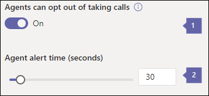

# <a name="create-a-cloud-call-queue"></a>建立雲端通話佇列

雲端通話佇列可以提供：

- 問候訊息。
- 當人員正在等候時，請播放音樂。
- 在已啟用郵件的通訊群組清單和安全性群組中，將呼叫重新導向至呼叫代理程式。
- 設定不同的參數，例如佇列大小上限、超時及呼叫處理選項。
- 呼叫者的共用語音信箱，可為組織留下訊息。

您不會直接將電話號碼與通話佇列進行關聯，而是將電話號碼與[資源帳戶](manage-resource-accounts.md)相關聯。 通話佇列可以直接撥號，或由自動語音應答上的選取進行存取。

來電者在暫停時，會聽到音樂，且通話會連線至呼叫代理程式 *（先進先出*（FIFO）訂單）。

佇列中的所有通話都是透過下列其中一種方法傳送給代理：

- 使用 [傳送助理] 時，佇列中的第一個呼叫會同時響鈴所有的 agent。
- 在串列路由中，佇列中的第一個呼叫會逐一響鈴一個呼叫代理程式。
- 使用迴圈法，傳入通話的路由會平衡，讓每個呼叫代理程式從佇列取得相同數量的呼叫。

您可以設定呼叫處理選項，例如代理程式加入宣告/自願退出、目前狀態的路線、通話等待時間，以及使用上述任何一種方法呼叫超時選項。

一次只有一個來電通知（適用于佇列頭的呼叫）會傳送給呼叫代理程式。 通話代理程式接受通話之後，佇列中的下一個來電就會開始撥打通話代理程式。

> [!NOTE]
> 本文適用于 Microsoft 團隊和商務用 Skype Online。

## <a name="step-1--get-started"></a>步驟1：快速入門

若要開始使用通話佇列，請務必記住以下幾點：

- 需要通話佇列，才能擁有關聯的資源帳戶。 如需資源帳戶的詳細資訊，請參閱[管理團隊中的資源帳戶](manage-resource-accounts.md)。
- 當您將電話號碼指派給資源帳戶時，您現在可以使用 [免付費電話系統[虛擬使用者授權](teams-add-on-licensing/virtual-user.md)]。 [電話系統] 可讓組織階層的電話號碼與低成本的自動語音應答及呼叫佇列服務搭配使用。

> [!NOTE]
> 僅限 Microsoft 團隊使用者和代理程式支援電話佇列的直接路由服務號碼。

> [!NOTE]
> 若要將來電重新導向至貴組織中的線上人員，他們必須具備**電話系統**授權，且可供企業語音使用或擁有 Office 365 通話方案。 請參閱[指派 Microsoft 團隊附加元件授權](teams-add-on-licensing/assign-teams-add-on-licenses.md)。 若要啟用企業語音，您可以使用 Windows PowerShell。 例如，執行：`Set-CsUser -identity "Amos Marble" -EnterpriseVoiceEnabled $true`

- 若要深入瞭解 Office 365 通話方案，請參閱[手機系統和通話方案](calling-plan-landing-page.md)與[Office 365 的通話方案](calling-plans-for-office-365.md)。

- 您只能將雲端電話列隊指派給您在**Microsoft 團隊系統管理中心**取得或從其他服務提供者轉接的免付費服務電話號碼。 免付費服務號碼需要通訊點數。

    > [!NOTE]
    > 無法將使用者（訂閱者）電話號碼指派給呼叫佇列-只有服務付費電話或免付費電話號碼可供使用。

- 下列用戶端支援與雲端通話佇列相關聯的通話代理程式：

  - 商務用 Skype desktop 用戶端2016（32位與64位版本）

  - Lync 桌面用戶端2013（32位與64位版本）

  - Microsoft 團隊支援的所有 IP 電話模型。 請參閱[取得商務用 Skype Online 的電話](/skypeforbusiness/what-is-phone-system-in-office-365/getting-phones-for-skype-for-business-online/getting-phones-for-skype-for-business-online)。

  - Mac 商務用 Skype 用戶端（版本16.8.196 及更新版本）

  - Android 版商務用 Skype 用戶端（版本6.16.0.9 及更新版本）

  - iPhone 商務用 Skype 用戶端（版本6.16.0 及更新版本）

  - iPad 商務用 Skype 用戶端（版本6.16.0 及更新版本）

  - Microsoft 團隊 Windows 用戶端（32位與64位版本）

  - Microsoft 團隊 Mac 用戶端

  - Microsoft 團隊 iPhone 應用程式

  - Microsoft 團隊 Android 應用程式

    > [!NOTE]
    > 指派直接傳送號碼的通話佇列不支援商務用 Skype 用戶端、Lync 用戶端或商務用 Skype IP 手機做為代理程式。

## <a name="step-2--get-or-transfer-toll-or-toll-free-service-phone-numbers"></a>步驟2：取得或轉移付費或免付費服務電話號碼

您必須先取得或轉讓現有的付費或免付費服務號碼，才能建立及設定通話佇列。 若要取得您的服務號碼，請參閱[取得服務電話號碼](getting-service-phone-numbers.md)，或者如果您想要轉移現有的服務號碼，請參閱[將電話號碼轉移至 Office 365](phone-number-calling-plans/transfer-phone-numbers-to-teams.md)。 在您取得付費或免付費服務電話號碼之後，就會顯示在**Microsoft 團隊系統管理中心** > **的語音** > **電話號碼**中。 [免付費電話號碼] 會以**數位類型**的**服務列出（免付費電話）**。

> [!NOTE]
> 如果您在美國以外，您就無法使用 Microsoft 團隊系統管理中心來取得服務號碼。 移至 [[管理貴組織的電話號碼](manage-phone-numbers-for-your-organization/manage-phone-numbers-for-your-organization.md)]，瞭解如何從美國以外的地區進行。

當您設定多個自動語音應答時，通常會將電話號碼指派給主要的自動助理資源帳戶。 與嵌套自動語音應答或通話佇列相關聯的資源帳戶通常不需要電話號碼。 即使沒有電話號碼，該自動語音應答也可以將呼叫者指引至您的通話佇列或嵌套自動語音應答。 在這些情況下，您可以在系統中建立所有自動語音應答及呼叫佇列，而無需指派撥號鍵台選項，然後在稍後編輯設定。 通話佇列或自動語音應答必須存在，才能設定為功能表選項。

## <a name="step-3--create-a-call-queue"></a>步驟3：建立通話佇列

[!INCLUDE [updating-admin-interfaces](includes/updating-admin-interfaces.md)]

> [!IMPORTANT]
> 每個通話佇列都必須有一個相關聯的[資源帳戶](manage-resource-accounts.md)。 您必須先建立資源帳戶，然後才能將它與通話佇列建立關聯。

### <a name="use-the-microsoft-teams-admin-center"></a>使用 Microsoft 團隊系統管理中心

在**Microsoft 團隊系統管理中心**、**語音** > **通話佇列**中，按一下 [ **+ 新增**]：

### <a name="set-the-display-name-and-resource-account"></a>設定顯示名稱和資源帳戶


* * *


**名稱**中參照標注輸入通話佇列的描述性顯示名稱。 這個名稱是必要的，而且最多可以包含64個字元，包括空格。

 此名稱會顯示在撥入通話的通知中。

* * *


中參照標注 [**新增帳戶**] 會選取資源帳戶。 所有通話佇列都必須有資源帳戶。 資源帳戶不需要擁有服務付費或免付費電話號碼。

如果沒有列出任何資料，請先取得服務號碼，然後將其指派給資源帳戶，然後再建立通話佇列，如前文所述。 若要取得您的服務號碼，請參閱[取得服務電話號碼](getting-service-phone-numbers.md)。 如需如何指派電話號碼的詳細資訊，請參閱[管理團隊中的資源帳戶](manage-resource-accounts.md)。

> [!NOTE]
> 如果您想要或需要指派**網域**，您可以將它指派給通話佇列的資源帳戶。

### <a name="set-the-greeting-and-music-played-while-on-hold"></a>設定保留時播放的問候語和音樂


* * *


**問候語**中參照標注，對於呼叫佇列號碼的人而言，會播放選用的問候語。

您可以上傳音訊檔（.wav、mp3 或 .wma 格式）。


中參照標注 [**暫停**] 您可以在通話佇列中使用預設的音樂保留。 您也可以將音訊檔案上傳成 .wav、mp3 或 .wma 格式，以供您的自訂音樂保留時使用。

* * *

### <a name="select-the-call-answering-options"></a>選取呼叫應答選項


中的標注**呼叫代理程式和群組**，以直接新增個別的代理程式，而不將其新增至群組，請按一下 [**新增使用者**]。 將個別的代理放在您想要他們接聽通話的順序。 您最多可以新增20個獨立的代理程式（若要新增20個以上的專案，請將它們放在群組中）。

呼叫會先路由到個別的 agent，然後路由到群組中的代理程式。 

您最多可以選取200呼叫代理程式，其屬於下列任何一種郵寄清單或群組：

- Office 365 群組
- 安全性群組
- 通訊群組清單

所選取的通話代理程式必須是下列其中一項：

- 已啟用手機系統授權和企業語音的線上使用者
- 使用通話方案的線上使用者
- 內部部署商務用 Skype 伺服器使用者

  > [!NOTE]
  > 如果您想要將來電重新導向至組織中線上的人員，也適用這種情況。 這些人必須具備**手機系統**授權和企業語音功能，*或是*有通話方案。 如需詳細資訊，請參閱[指派商務用 Skype 授權](https://docs.microsoft.com/skypeforbusiness/skype-for-business-and-microsoft-teams-add-on-licensing/assign-skype-for-business-and-microsoft-teams-licenses)、[指派 Microsoft 團隊授權](https://docs.microsoft.com/microsoftteams/teams-add-on-licensing/assign-teams-add-on-licenses)，或適合[您的通話計畫？](https://docs.microsoft.com/microsoftteams/calling-plan-landing-page)

 若要啟用企業語音的代理程式，您可以使用 Windows PowerShell。 例如，執行：`Set-CsUser -identity "Amos Marble" -EnterpriseVoiceEnabled $true`

- 已新增至 Office 365 群組的**電話系統**授權或通話方案的使用者;已啟用郵件的通訊群組清單;或 [安全性群組]。 當您將通訊群組清單或安全群組中的代理程式新增為通話佇列代理程式時，第一次呼叫到貨最多可能需要3小時的時間。 新建立的通訊群組清單或安全性群組可能需要長達48小時才能與通話佇列搭配使用。 新建立的 Microsoft 365 群組幾乎會立即提供給您。

- 如果您的代理正在使用 Microsoft 團隊 app 進行通話佇列通話，則必須在 TeamsOnly 模式中。


**路由方法**中的標注，您可以選擇 [傳送 **]、[****串口**] 或 [**迴圈**] 作為散佈方式。 所有新的和現有的通話佇列都會依預設選取 [助理] 路由。 使用 [接聽] 路由時，佇列中的第一次呼叫會同時響鈴所有呼叫代理程式。 第一個呼叫代理程式接聽電話，即可取得通話。

- [行事鈴**路由**] 會讓佇列中的第一個呼叫同時撥打所有通話代理程式。 第一個呼叫代理程式接聽電話，即可取得通話。
- 從撥號代理程式清單的開始，**串列路由**撥出電話會逐一撥打所有呼叫代理程式。 無法在通話代理程式清單中排序代理程式。 如果代理程式關閉或沒接聽來電，該通話會撥打下一個代理程式，並嘗試所有的代理程式，直到它被挑選或超時為止。
- **迴圈**平衡：將來電進行路由，讓每個通話代理程式從佇列取得相同數目的呼叫。 這在入站銷售環境中可能是您想要的，以確保所有通話代理程式之間有同等的機會。


**先前螢幕擷取畫面目前狀態路由**狀態路由中的標注：使用通話代理程式的可用性狀態，判斷是否應將工程師納入所選路由方法的通話路由清單中。 [通話傳送] 清單中包含 [**提供給可用**] 的呼叫代理程式，並可接聽來電。 其可用性狀態設定為任何其他狀態的代理會從 [呼叫傳送清單] 中排除，而且在其可用性狀態變更回 [**可用**] 之前，將不會收到來電。

您可以使用任何一種路由方法來啟用目前狀態的呼叫路由。

如果代理程式無法取得來電，無論其可用性狀態為何，都不會包含在通話傳送清單中。

> [!IMPORTANT]
> 啟用商務用 Skype 用戶端的代理程式不會包含在 [通話] 路由清單中（無論其可用性狀態為何）。 不在通話傳送清單中的工程師將不會收到來電。 如果您有使用商務用 Skype 的代理商，請不要啟用目前狀態的呼叫路由。

### <a name="select-an-agent-opt-out-option"></a>選取代理退出宣告選項



* * *


**代理程式**中參照標注，即可選擇不取得來電：啟用此選項，即可允許呼叫佇列代理程式退出宣告來自特定佇列的呼叫。

啟用此選項可讓此佇列中的所有代理程式從該呼叫佇列開始或停止接聽通話。 您隨時都可以取消選取核取方塊，讓代理程式再次自動加入此佇列（所有代理的預設設定），以隨時撤銷代理自願退出許可權。

若要存取退出宣告選項，工程師可以：

 1. 開啟其桌面商務用 Skype 用戶端中的**選項**。
 2. 在 [**來電轉接**] 索引標籤上，按一下 [**編輯線上編輯設定**] 連結。
 3. 在 [使用者設定] 頁面上，按一下 [**通話佇列**]，然後清除核取方塊以退出宣告佇列。

    > [!NOTE]
    > 使用商務用 Skype Desktop 以外的 app 或端點的代理程式可從 [使用者設定] 入口網站[https://aka.ms/cqsettings](https://aka.ms/cqsettings)存取 [退出宣告] 選項。
    >
    > 如果代理程式位於 Microsoft 團隊桌面用戶端，則他們可以使用通話設定退出宣告。 


的 [警示]**設定**中的標注

這會定義在串列或迴圈路由方法移至下一個代理程式之前，收到呼叫通知代理程式的持續時間。

預設設定為30秒，但最多可設定3分鐘。

* * *

### <a name="set-the-call-overflow-and-timeout-handling-options"></a>設定通話溢位與超時處理選項


* * *


中的標注**最大通話數上限**，使用此設定可以同時在佇列中等候的最大通話數。 預設值為50，但範圍可以是0到200。 達到這個限制之後，就會按照您在 [**達到最大通話數**] 設定時所設定的方式來處理通話。

* * *


使用 [佇列] 設定中的 [**最大通話**數] 設定）時，參照上一個螢幕擷取畫面中的標注，您可以選擇新的來電所要採取**的**動作。

- **中斷**連線通話中斷連線。
- 重新**導向至**當您選擇此選項時，請選取下列其中一項：

  - **貴公司中的人員**具備**電話系統**授權且可供企業語音使用或有通話方案的線上使用者。 您可以設定它，讓來電者可以傳送給語音信箱。 若要這樣做，請選取**貴公司中的人員**，並將其呼叫權直接轉寄給語音信箱。

  若要瞭解語音信箱所需的授權，請參閱[設定雲端語音信箱](set-up-phone-system-voicemail.md)。

  - **語音應用程式**選取與已建立之通話佇列或自動助理相關聯的資源帳戶名稱。

* * *


通話超時中參照標注 **：最長等待時間**您也可以決定該通話在超時前的保留時間，以及需要重新導向或中斷連線。 重新導向的位置，取決於您設定**通話超時**設定的方式。 您可以設定從0到45分鐘的時間。

超時值可以設定為以秒為單位，以15秒為間隔。 這可讓您以較精細的細微性操作通話流程。 例如，您可以指定在30秒內未由代理程式接聽的任何通話移至目錄搜尋自動語音應答。

![數位4的圖示：當來電達到您在 [佇列]](media/teamscallout4.png)
設定中所設定的**電話**撥入時，您可以選擇來電時，會參照前**一個螢幕擷取畫面**中的標注：

- **中斷**連線通話中斷連線。
- **將此通話重新導向至**當您選擇此選項時，您可以使用下列選項：
  - **貴公司中的人員**具備**電話系統**授權且可供企業語音或有通話方案的線上使用者。 若要設定它，讓撥入的人能傳送給語音信箱，請選取**貴公司中的人員**，並將其呼叫設定為直接轉接至語音信箱。

  若要瞭解語音信箱所需的授權，請參閱[設定雲端語音信箱](set-up-phone-system-voicemail.md)。

  - **語音應用程式**選取與您已建立之通話佇列或自動助理相關聯之資源帳戶的名稱。

## <a name="change-caller-id-for-outbound-calls"></a>變更撥出電話的本機號碼

若要保護通話代理程式的身分識別，請將本機號碼撥打電話給來電佇列、自動語音應答，或使用**新的 CsCallingLineIdentity** Cmdlet 的任何服務號碼，如下列範例所示：

``` Powershell
New-CsCallingLineIdentity -Identity "UKSalesQueue" -CallingIdSubstitute "Service" -ServiceNumber 14258828080 -EnableUserOverride $False -Verbose
```

然後使用**授與 CallingLineIdentity** Cmdlet 將原則套用到使用者，如下例所示： 

``` Powershell
Grant-CsCallingLineIdentity -PolicyName UKSalesQueue -Identity "AmosMarble@contoso.com"
```

如需詳細資訊，請參閱[如何在您的組織中使用來電](/microsoftteams/how-can-caller-id-be-used-in-your-organization)顯示。

## <a name="call-queue-cmdlets"></a>通話佇列 Cmdlet

您也可以使用 Windows PowerShell 來建立及設定通話佇列。 以下是您用來管理通話佇列的 Cmdlet。

- [新-CsCallQueue](https://docs.microsoft.com/powershell/module/skype/new-CsCallQueue?view=skype-ps)

- [Set-CsCallQueue](https://docs.microsoft.com/powershell/module/skype/set-CsCallQueue?view=skype-ps)

- [CsCallQueue](https://docs.microsoft.com/powershell/module/skype/get-CsCallQueue?view=skype-ps)

- [移除-CsCallQueue](https://docs.microsoft.com/powershell/module/skype/remove-CsCallQueue?view=skype-ps)

### <a name="more-about-windows-powershell"></a>深入瞭解 Windows PowerShell

- Windows PowerShell 全部說明如何管理使用者，以及允許或不允許的使用者執行。 在 Windows PowerShell 中，您可以使用單一管理點管理 Office 365 和 Microsoft 團隊。 當您有多個工作需要執行時，它可以簡化日常作業。 若要開始使用 Windows PowerShell，請參閱以下主題：

  - [Windows PowerShell 與 Lync Online 的簡介](/SkypeForBusiness/set-up-your-computer-for-windows-powershell/set-up-your-computer-for-windows-powershell)

  - [為什麼需要使用 Office 365 PowerShell](https://docs.microsoft.com/office365/enterprise/powershell/why-you-need-to-use-office-365-powershell)

- 當您一次為多位使用者進行變更時，Windows PowerShell 的速度、簡潔性和生產率都有許多優點。 請參閱下列主題，瞭解這些優點：

  - [使用 Windows PowerShell 管理 Office 365](https://docs.microsoft.com/office365/enterprise/powershell/manage-office-365-with-office-365-powershell)

  - [設定 Windows PowerShell 電腦](https://docs.microsoft.com/SkypeForBusiness/set-up-your-computer-for-windows-powershell/set-up-your-computer-for-windows-powershell)

## <a name="related-topics"></a>相關主題

[以下是您在 Office 365 中使用電話系統所取得的結果](here-s-what-you-get-with-phone-system.md)

[取得服務電話號碼](getting-service-phone-numbers.md)

[音訊會議與通話方案的適用國家/地區](country-and-region-availability-for-audio-conferencing-and-calling-plans/country-and-region-availability-for-audio-conferencing-and-calling-plans.md)

[新-CsOnlineApplicationInstance](https://docs.microsoft.com/powershell/module/skype/new-csonlineapplicationinstance?view=skype-ps)
