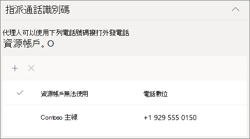
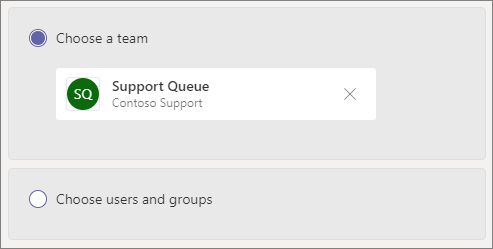
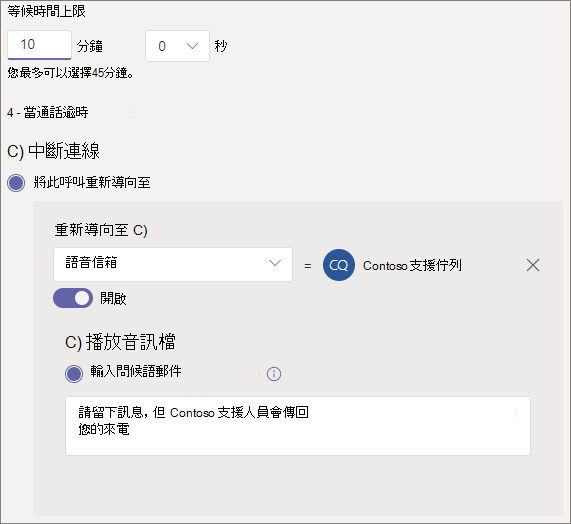

# 建立通話佇列Create a call queue

通話佇列提供將來電者路由給組織中可協助處理特定問題或問題的人的方法。Call queues provide a method of routing callers to people in your organization who can help with a particular issue or question. 通話會一次一次分散給佇列中 (稱為 *代理人) 。*Calls are distributed one at a time to the people in the queue (who are known as *agents*). 

> [!TIP]
> 本文適用于大型組織。This article is for large organizations. 如果貴組織是小型企業，請改為閱讀建立通話 [佇列 - 小型企業](/microsoftteams/business-voice/create-a-phone-system-call-queue-smb) 教學課程。If your organization is a small business, read [Create a call queue - small business tutorial](/microsoftteams/business-voice/create-a-phone-system-call-queue-smb) instead.

通話佇列提供：Call queues provide:

- 問候訊息。A greeting message.

- 當其他人在佇列中等候時播放音樂。Music while people are waiting on hold in a queue.

- 呼叫路由 - 在 *FIFO (* 中，) 呼叫路由 - 給代理人。Call routing - in *First In, First Out* (FIFO) order - to agents.

- 處理佇列溢出和超時的選項。Handling options for queue overflow and timeout.

請務必先閱讀自動Teams和通話佇列的規劃，並遵循開始使用的步驟，然後再遵循本文中的程式。Be sure you have read [Plan for Teams auto attendants and call queues](plan-auto-attendant-call-queue.md) and followed the [getting started steps](plan-auto-attendant-call-queue.md#getting-started) before you follow the procedures in this article.

## 影片示範Video demonstration

這段影片顯示如何在 Teams 中建立通話佇列的基本Teams。This video shows a basic example of how to create a call queue in Teams.

> [!VIDEO https://www.microsoft.com/videoplayer/embed/RWCF23?autoplay=false]

## 建立通話佇列Create the call queue

若要設定通話佇列，請在系統管理中心Teams[**語音** 與通話佇列>，然後按一下 [**新增**。To set up a call queue, in the Teams admin center, expand **Voice**, click **Call queues**, and then click **Add**.

輸入通話佇列的名稱。Type a name for the call queue.

### 資源帳戶Resource accounts

按一下 **[新增帳戶**，搜尋要用於此通話佇列的資源帳戶;按一下 [ **新增**，然後按一下 [ **新增**> 。Click **Add accounts**, search for the resource account that you want to use with this call queue, click **Add**, and then click **Add**.  (代理人收到來電時，會看到資源帳戶名稱。) (Agents will see the resource account name when they receive an incoming call.)

### 指派通話識別碼Assign calling ID

如果您打算為呼叫代理Teams通道，您可以指定一或多個具有電話號碼的資源帳戶，為代理人指派外發本機號碼號碼。If you plan to use a Teams channel for your call agents, you can assign an outbound caller ID number for the agents by specifying one or more resource accounts with a phone number.

按一下 **[新增**，搜尋您想要允許代理人在撥打外接電話時用於通話識別碼的資源帳戶;按一下 [ **新增**，然後按一下 [ **新增**> 。Click **Add**, search for the resource accounts that you want to allow agents to for calling ID purposes when making outbound calls, click **Add**, and then click **Add**.

如果您不是使用 Teams通道來控制代理人成員資格，請考慮直接將通話佇列成員的本機號碼設定為通話佇列的服務號碼或適當的自動語音回應。If you are not using a Teams channel to control agent membership, consider directly setting the caller ID for members of the call queue to the service number of the call queue or appropriate auto attendant. 請參閱[在 Microsoft Teams](caller-id-policies.md)管理本機號碼政策以瞭解更多資訊。See [Manage caller ID policies in Microsoft Teams](caller-id-policies.md) for more information.

### 語言Language

選擇支援 [的語言](create-a-phone-system-call-queue-languages.md)。Choose a [supported language](create-a-phone-system-call-queue-languages.md). 如果您啟用語音提示，系統產生的語音提示和語音信箱 (語音信箱) 。This language will be used for system-generated voice prompts and voicemail transcription (if you enable them).

### 佇列中保留的問候語和音樂Greetings and music on hold in queue

指定當來電者抵達佇列時，是否要播放問候語。Specify if you want to play a greeting to callers when they arrive in the queue. 您必須上傳包含您想要播放的問候語的 MP3、WAV 或 WMA 檔案。You must upload an MP3, WAV, or WMA file containing the greeting that you want to play.

Teams在佇列中保留來電者時，提供預設音樂。Teams provides default music to callers while they are on hold in a queue. 如果您想要播放特定的音訊檔案，請選擇播放音訊檔案並上傳 MP3、WAV 或 WMA 檔案。If you want to play a specific audio file, choose **Play an audio file** and upload an MP3, WAV, or WMA file.

> [!NOTE]
> 上傳的錄製不能大於 5 MB。The uploaded recording can be no larger than 5 MB.
> 在通話佇列Teams中提供的預設音樂，不含貴組織支付的任何版稅。The default music supplied in Teams call queues is free of any royalties payable by your organization. 

### 通話代理人Call agents

檢查 [將代理人新加入通話佇列的先決條件](plan-auto-attendant-call-queue.md#prerequisites)。Review the [prerequisites for adding agents to a call queue](plan-auto-attendant-call-queue.md#prerequisites).

##### Teams頻道Teams channel

您可以透過頻道新增最多 200 Teams代理。You can add up to 200 agents via a Teams channel.

如果您想要使用頻道 [Teams](https://support.microsoft.com/office/9f07dabe-91c6-4a9b-a545-8ffdddd2504e)佇列，請選取 [選擇團隊選項，然後按一下 [**新增頻道**> 。 If you want to [use a Teams channel to manage the queue](https://support.microsoft.com/office/9f07dabe-91c6-4a9b-a545-8ffdddd2504e), select the **Choose a team** option and click **Add a channel**. 搜尋您想要使用的團隊，選取該團隊，然後按一下 [ **新增**。Search for the team that you want to use, select it, and click **Add**. 選取您想要使用的頻道，然後按一下 **[Apply.**Select the channel that you want to use and click **Apply**. 您必須是團隊的成員，或是頻道的建立者或擁有者。You must be a member of the team or the creator of or an owner of the channel.

在通話佇列使用Teams支援下列用戶端：The following clients are supported when using a Teams channel for call queues: 

  - Microsoft Teams Windows用戶端Microsoft Teams Windows client
  - Microsoft TeamsMac 用戶端Microsoft Teams Mac client

##### 使用者和群組Users and groups

您可以個別新增最多 20 個代理程式，並透過群組新增最多 200 個代理程式。You can add up to 20 agents individually and up to 200 agents via groups.

如果您想要將個別使用者或群組新排入佇列，請選取選擇 **使用者和群組** 選項。If you want to add individual users or groups to the queue, select the **Choose users and groups** option. 

若要將使用者新增到佇列，請按一下 [ **新增** 使用者、搜尋使用者、按一下 [ **新增**」，然後按一下 [ **新增**。To add a user to the queue, click **Add users**, search for the user, click **Add**, and then click **Add**.

若要將群組新增到佇列，請按一下 [ **新增** 群組、搜尋群組、按一下 [ **新增**」，然後按一下 [ **新增**。To add a group to the queue, click **Add groups**, search for the group, click **Add**, and then click **Add**. 您可以使用通訊群組清單、安全性群組及Microsoft 365群組或Microsoft Teams小組。You can use distribution lists, security groups, and Microsoft 365 groups or Microsoft Teams teams.

> [!NOTE]
> 新使用者新加入群組最多可能需要八小時，才能第一次通話到達。New users added to a group can take up to eight hours for their first call to arrive.

### 通話路由Call routing

**會議模式** 可大幅縮短在代理人接受通話後，來電者與代理人進行連接所花的時間。**Conference mode** significantly reduces the amount of time it takes for a caller to be connected to an agent, after the agent accepts the call. 若要讓會議模式運作，通話佇列中的代理人必須使用下列其中一個用戶端：For conference mode to work, agents in the call queue must use one of the following clients:

  - 最新版桌面Microsoft Teams Android App 或 iOS 應用程式The latest version of the Microsoft Teams desktop client, Android app, or iOS app
  - Microsoft Teams 1449/1.0.94.2020051601 或更新版本Microsoft Teams phone version 1449/1.0.94.2020051601 or later
  
代理人Teams帳戶必須設為Teams模式。Agents' Teams accounts need to be set to Teams-only mode. 不符合要求的代理人不會包含在通話路由清單中。Agents who don't meet the requirements aren't included in the call routing list. 如果您的代理人都使用相容的用戶端，我們建議您為通話佇列啟用會議模式。We recommend enabling conference mode for your call queues if your agents are all using compatible clients.

> [!NOTE]
> 如果電話從已啟用位置路由的直接路由閘道路由至佇列，則不支援會議模式。Conference mode is not supported if phone calls are routed to the queue from a Direct Routing gateway that is enabled for Location Based Routing.

**路由方法** 會決定代理程式從佇列接收來電的順序。**Routing method** determines the order in which agents receive calls from the queue. 從這些選項中選擇：Choose from these options:

- **話務員路由** 會同時響鈴佇列中的所有代理程式。**Attendant routing** rings all agents in the queue at the same time. 第一個接電話的代理人會接到電話。The first call agent to pick up the call gets the call.

- **連續路由** 會以呼叫代理程式清單中指定的順序，一個接一個地撥打所有 **呼叫** 代理程式。**Serial routing** rings all call agents one by one in the order specified in the **Call agents** list. 如果客服人員關閉或不接電話，來電會撥打給下一個代理人，並嘗試所有代理人，直到被接回或打出電話。If an agent dismisses or does not pick up a call, the call will ring the next agent and will try all agents until it is picked up or times out.

- **輪循** 機制會平衡來電的路由，讓每個通話代理程式從佇列取得相同數量的通話。**Round robin** balances the routing of incoming calls so that each call agent gets the same number of calls from the queue. 在內入銷售環境中，這可能是理想的選擇，以確保所有通話代理人之間享有同等的機會。This may be desirable in an inbound sales environment to assure equal opportunity among all the call agents.

- **最長空閒** 時間會路由每個通話給閒置時間最長的代理人。**Longest idle** routes each call to the agent who has been idle the longest time. 如果代理的目前狀態為可用，或其目前狀態為離開狀態少於 10 分鐘，則視為閒置狀態。An agent is considered idle if their presence state is Available or if their presence state has been Away for less than 10 minutes. 目前狀態超過 10 分鐘的代理人不會被視為閒置狀態，且在將目前狀態變更為可用之前，將不符合接聽電話資格。Agents whose presence state has been Away for more than 10 minutes are not considered idle and will not be eligible to receive calls until they change their presence to Available. 

**目前狀態路由** 會使用呼叫代理程式的可用性狀態，判斷該代理人是否應該包含在所選路由方法的通話路由清單中。**Presence-based routing** uses the availability status of call agents to determine whether an agent should be included in the call routing list for the selected routing method. 其可用性狀態設為可用的通話 **代理人會包含在** 通話路由清單中，而且可以接聽來電。Call agents whose availability status is set to **Available** are included in the call routing list and can receive calls. 其可用性狀態設定為任何其他狀態的代理人會排除在通話路由清單中，且不會接聽來電，直到其可用性狀態變更回可用 **。**Agents whose availability status is set to any other status are excluded from the call routing list and won't receive calls until their availability status changes back to **Available**. 

您可以使用任何路由方法啟用目前狀態型通話路由。You can enable presence-based call routing with any of the routing methods.

> [!NOTE]
> 當 **選取了最長** 閒置時間做為路由方法時，需要以目前狀態為基礎的路由，並自動啟用，即使目前狀態型路由切換開關會關閉且呈灰色。When **Longest idle** is selected as the routing method, presence-based routing is required and automatically enabled even though the Presence-based routing toggle will be **Off** and grayed out.

如果代理人選擇不接聽來電，無論他們的可用性狀態設定為什麼，通話路由清單也不會包含他們。If an agent opts out of getting calls, they won't be included in the call routing list regardless of what their availability status is set to. 

> [!NOTE]
> 啟用目前狀態商務用 Skype用戶端的代理人不會包含在通話路由清單中。Agents who use the Skype for Business client aren't included in the call routing list when presence-based routing is enabled. 如果您有使用電話商務用 Skype，請勿啟用目前狀態型通話路由。If you have agents who use Skype for Business, don't enable presence-based call routing.

**代理人通知** 時間會指定在佇列將通話重新導向至下一個代理人之前，代理人的電話會響鈴多久。**Agent alert time** specifies how long an agent's phone will ring before the queue redirects the call to the next agent.

建議使用下列設定：The following settings are recommended:

- **會議模式** 至 **自動****Conference mode** to **Auto**
- **將路由方法** 路由至 **Round robin** 或 **最長閒置時間****Routing method** to **Round robin** or **Longest idle**
- **目前狀態路由至** **On****Presence-based routing** to **On**
- **代理人警示時間：\*\*\*\*至 20 秒****Agent alert time:** to **20 seconds**

> [!NOTE]
> 如果未啟用目前狀態路由，且佇列中有多個通話，系統會同時向代理人顯示這些通話，而不管其目前狀態如何。If presence-based routing is not enabled and there are multiple calls in the queue, the system will present these calls simultaneously to the agents regardless of their presence status. 這將會有多個通知給代理人，尤其是當某些代理人沒有接聽他們收到的初始通話時。This will result in multiple call notifications to agents, particularly if some agents don’t answer the initial call presented to them.

### 呼叫溢出處理Call overflow handling

**佇列中的通話上限** 會指定在任何指定時間可在佇列中等候的通話數上限。**Maximum calls in the queue** specifies the maximum number of calls that can wait in the queue at any given time. 預設值為 50，但範圍從 0 到 200。The default is 50, but it can range from 0 to 200. 達到此限制時，通話會依照達到通話次數上限設定所 **指定的方式處理** 。When this limit is reached, the call is handled as specified by the **When the maximum number of calls is reached** setting.

您可以選擇中斷通話，或重新導向到任何通話路由目的地。You can choose to disconnect the call or redirect it to any of the call routing destinations. 例如，您可能讓來電者為佇列中的代理人留下語音信箱。For example, you might have the caller leave a voicemail for the agents in the queue. 如需外部傳輸，請參閱先決條件和外部電話號碼傳輸[- 數位](create-a-phone-system-auto-attendant.md#external-phone-number-transfers---technical-details)格式的技術詳細資料。For external transfers, please refer to [Prerequisites](plan-auto-attendant-call-queue.md#prerequisites) and the [external phone number transfers - technical details](create-a-phone-system-auto-attendant.md#external-phone-number-transfers---technical-details) for number formatting.

> [!NOTE]
> 如果通話數上限設為 0，則問候語訊息將不會播放。If the maximum number of calls is set to 0 then the greeting message will not play.

### 通話超時處理Call timeout handling

**通話超時：最長等待時間** 會指定通話在重新導向或中斷連接前，在佇列中可以保留的最大時間。**Call Timeout: maximum wait time** specifies the maximum time a call can be on hold in the queue before it is redirected or disconnected. 您可以指定 0 秒到 45 分鐘的值。You can specify a value from 0 seconds to 45 minutes.

您可以選擇中斷通話，或重新導向到其中一個通話路由目的地。You can choose to disconnect the call or redirect it to one of the call routing destinations. 例如，您可能讓來電者為佇列中的代理人留下語音信箱。For example, you might have the caller leave a voicemail for the agents in the queue. 如需外部傳輸，請參閱先決條件和外部電話號碼傳輸[- 數位](create-a-phone-system-auto-attendant.md#external-phone-number-transfers---technical-details)格式的技術詳細資料。For external transfers, please refer to [Prerequisites](plan-auto-attendant-call-queue.md#prerequisites) and the [external phone number transfers - technical details](create-a-phone-system-auto-attendant.md#external-phone-number-transfers---technical-details) for number formatting.

當您已選取通話超時選項時，請按一下 [**儲存。**When you have selected your call timeout options, click **Save**.

## 支援的用戶端Supported clients

通話佇列中的通話代理程式支援下列用戶端：The following clients are supported for call agents in a call queue:

  - 商務用 Skype桌面用戶端 2016 (32 位和 64 位版本) Skype for Business desktop client 2016 (32-bit and 64-bit versions)
  - Lync 桌面用戶端 2013 (32 位和 64 位版本) Lync desktop client 2013 (32-bit and 64-bit versions)
  - 支援所有 IP 電話Microsoft Teams。All IP phone models supported for Microsoft Teams. 請參閱[取得適用于 商務用 Skype Online 的電話](/skypeforbusiness/what-is-phone-system-in-office-365/getting-phones-for-skype-for-business-online/getting-phones-for-skype-for-business-online)。See [Getting phones for Skype for Business Online](/skypeforbusiness/what-is-phone-system-in-office-365/getting-phones-for-skype-for-business-online/getting-phones-for-skype-for-business-online).
  - Mac 商務用 Skype用戶端 (版本 16.8.196 及更新版本) Mac Skype for Business Client (version 16.8.196 and later)
  - Android 商務用 Skype用戶端 (版本 6.16.0.9 及更新版本) Android Skype for Business Client (version 6.16.0.9 and later)
  - iPhone 商務用 Skype用戶端 (版本 6.16.0 及更新版本) iPhone Skype for Business Client (version 6.16.0 and later)
  - iPad 商務用 Skype用戶端 (版本 6.16.0 及更新版本) iPad Skype for Business Client (version 6.16.0 and later)
  - Microsoft Teams Windows 32 位 (64 位版本的用戶端) Microsoft Teams Windows client (32-bit and 64-bit versions)
  - Microsoft TeamsMac 用戶端Microsoft Teams Mac client
  - Microsoft Teams[虛擬](/microsoftteams/teams-for-vdi)桌面基礎結構上的 (Windows虛擬桌面、奇思和 V3) Microsoft Teams on [Virtualized Desktop Infrastructure](/microsoftteams/teams-for-vdi) (Windows Virtual Desktop, Citrix, and VMware)
  - Microsoft Teams iPhone應用程式Microsoft Teams iPhone app
  - Microsoft TeamsAndroid 應用程式Microsoft Teams Android app

    > [!NOTE]
    > 指派直接路由號碼的通話佇列不支援商務用 Skype、Lync 用戶端或 IP 電話商務用 Skype代理。Call queues that are assigned a direct routing number don't support Skype for Business clients, Lync clients, or Skype for Business IP Phones as agents.

## 通話佇列 CmdletCall queue cmdlets

您也可以使用Windows PowerShell來建立和設定通話佇列。You can also use Windows PowerShell to create and set up call queues. 以下是您用於管理通話佇列的 Cmdlet。Here are the cmdlets that you use to manage a call queue.

- [New-CsCallQueueNew-CsCallQueue](/powershell/module/skype/new-CsCallQueue)

- [Set-CsCallQueueSet-CsCallQueue](/powershell/module/skype/set-CsCallQueue)

- [Get-CsCallQueueGet-CsCallQueue](/powershell/module/skype/get-CsCallQueue)

- [Remove-CsCallQueueRemove-CsCallQueue](/powershell/module/skype/remove-CsCallQueue)

## 相關主題Related topics

[以下是可透過電話系統獲得的功能Here's what you get with Phone System](here-s-what-you-get-with-phone-system.md)

[取得服務電話號碼Getting service phone numbers](getting-service-phone-numbers.md)

[音訊會議與通話方案的適用國家/地區Country and region availability for Audio Conferencing and Calling Plans](country-and-region-availability-for-audio-conferencing-and-calling-plans/country-and-region-availability-for-audio-conferencing-and-calling-plans.md)

[New-CsOnlineApplicationInstanceNew-CsOnlineApplicationInstance](/powershell/module/skype/new-csonlineapplicationinstance)

[Windows PowerShell 與 Lync Online 的簡介An introduction to Windows PowerShell and Skype for Business Online](/SkypeForBusiness/set-up-your-computer-for-windows-powershell/set-up-your-computer-for-windows-powershell)
