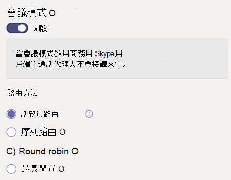

# 建立通話佇列

通話佇列提供將來電者路由給組織中可協助處理特定問題或問題的人的方法。 通話會一次一次分散給佇列中 (稱為 *代理人) 。* 

> [!TIP]
> 本文適用于大型組織。 如果貴組織是小型企業，請改為閱讀建立通話 [佇列 - 小型企業](/microsoftteams/business-voice/create-a-phone-system-call-queue-smb) 教學課程。

通話佇列提供：

- 問候訊息。

- 當其他人在佇列中等候時播放音樂。

- 呼叫路由 - 在 *FIFO (* 中，) 呼叫路由 - 給代理人。

- 處理佇列溢出和超時的選項。

請務必先閱讀自動Teams和通話佇列的規劃，並遵循開始使用的步驟，然後再遵循本文中的程式。

## 影片示範

這段影片顯示如何在 Teams 中建立通話佇列的基本Teams。

> [!VIDEO https://www.microsoft.com/videoplayer/embed/RWCF23?autoplay=false]

## 建立通話佇列

若要設定通話佇列，請在系統管理中心Teams展開 **[語音**，按一下通話 **佇列**，然後按一下 [**新增**。

輸入通話佇列的名稱。

## 資源帳戶

按一下 **[新增帳戶**>、搜尋要用於此通話佇列的資源帳戶、按一下 [ **新增**，然後按一下 [ **新增**> 。  (代理人收到來電時，會看到資源帳戶名稱。) 

詳細資訊，請參閱管理[Teams帳戶](manage-resource-accounts.md)。

### 指派通話識別碼

如果您打算為呼叫代理Teams通道，您可以指定一或多個具有電話號碼的資源帳戶，為代理人指派外發本機號碼號碼。

按一下 **[新增**，搜尋您想要允許代理人在撥打外線通話時用於通話識別碼的資源帳戶;按一下 [新增，然後按一下 **[新增**> 。****

如果您不是使用 Teams通道來控制代理人成員資格，請考慮將通話佇列成員的本機號碼直接設定為通話佇列的服務號碼或適當的自動語音回應。 詳細資訊，請參閱在 Microsoft Teams[中管理來電Microsoft Teams](caller-id-policies.md)。

> [!NOTE]
> 用於通話識別碼的資源帳戶必須Microsoft Teams 電話系統虛擬使用者授權，並指派下列其中一項：
>
> - 已指派通話方案授權和電話號碼
> - 已指派連線電話號碼的接線員
> - 使用直接路由 (時，線上語音路由) 

## 語言

選擇支援 [的語言](create-a-phone-system-call-queue-languages.md)。 如果您啟用系統產生的語音提示和語音信箱 (，就會使用) 。

## 佇列中保留的問候語和音樂

指定當來電者抵達佇列時，是否要播放問候語。 您必須上傳包含您想要播放的問候語的 MP3、WAV 或 WMA 檔案。 上傳的錄製不能大於 5 MB。

Teams在佇列中保留來電者時，提供預設音樂。 在通話佇列Teams中提供的預設音樂，不含貴組織支付的任何版稅。 如果您想要播放特定的音訊檔案，請選擇播放音訊檔案並上傳 MP3、WAV 或 WMA 檔案。

> [!NOTE]
> 您有責任獨立清除及保護在 Microsoft Teams 服務中使用任何音樂或音訊檔案的一切必要權利與許可權，其中可能包含來自所有相關權利擁有者之音樂、音效、音訊、品牌、名稱及其他內容之智慧財產權及其他權利，包括美術師、參與者、 演出者、音樂人、歌曲作者、作曲者、記錄標籤、音樂發行者、同盟、行會、版權社團、集體管理組織，以及擁有、控制或授權音樂著作權、音效、音訊和其他智慧財產權的其他各方。

## 通話代理程式

檢查 [將代理人新加入通話佇列的先決條件](plan-auto-attendant-call-queue.md#prerequisites)。

##### Teams頻道

您可以透過頻道新增最多 200 Teams代理程式。 您必須是團隊的成員，或是頻道的建立者或擁有者，以將頻道新增到佇列。

如果您想要使用頻道 [Teams](https://support.microsoft.com/office/9f07dabe-91c6-4a9b-a545-8ffdddd2504e)佇列，請選取 [選擇團隊選項，然後按一下 [**新增頻道**。**** 搜尋您想要使用的團隊，選取該團隊，然後按一下 [ **新增**。 選取您 (只支援標準頻道的) ，然後按一下 [**) 。** 

在通話佇列使用Teams支援下列用戶端： 

  - Microsoft Teams Windows用戶端
  - Microsoft Teams Mac 用戶端

> [!NOTE]
> 如果您使用此選項，通話佇列最多可能需要 24 小時才能完全運作。

##### 使用者和群組

您可以個別新增最多 20 個代理程式，並透過群組新增最多 200 個代理程式。

如果您想要新增個別使用者或群組至佇列，請選取選擇 **使用者和群組** 選項。 

若要將使用者新增到佇列，請按一下 [ **新增** 使用者、搜尋使用者、按一下 [ **新增**」，然後按一下 [ **新增**。

若要將群組新增到佇列，請按一下 [ **新增** 群組、搜尋群組、按一下 [ **新增**」，然後按一下 [ **新增**。 您可以使用通訊群組清單、安全性群組，以及Microsoft 365群組或Microsoft Teams小組。

> [!NOTE]
> 新加入群組的使用者最多可能需要八小時，才能第一次通話到達。

## 通話路由

**會議模式** 可大幅縮短在代理人接受通話後，來電者與代理人進行連接所花的時間。 若要讓會議模式運作，通話佇列中的代理人必須使用下列其中一個用戶端：

  - 最新版桌面Microsoft Teams Android App 或 iOS 應用程式
  - Microsoft Teams 電話版本 1449/1.0.94.2020051601 或更新版本
  
代理人Teams帳戶必須設為Teams模式。 不符合要求的代理人不會包含在通話路由清單中。 如果您的代理人都使用相容的用戶端，我們建議您為通話佇列啟用會議模式。

> [!NOTE]
> 如果電話從已啟用位置路由的直接路由閘道路由至佇列，則不支援會議模式。

> [!TIP]
> 建議 **將會議模式** 設定為 **On** 。

**路由方法** 會決定代理程式從佇列接收來電的順序。 從這些選項中選擇：

- **話務員路由** 會同時響鈴佇列中的所有代理程式。 第一個接電話的代理人會接到電話。

- **連續路由** 會以呼叫代理程式清單中指定的順序，一個接一個地撥打所有 **呼叫** 代理程式。 如果客服人員關閉或不接電話，來電會撥打下一個代理人，並嘗試所有代理人，直到被接回或打出電話。

- **輪循** 機制會平衡來電的路由，讓每個通話代理程式從佇列取得相同數量的通話。 在內入銷售環境中，這可能是理想的選擇，以確保所有通話代理人之間享有同等的機會。

- **最長空閒** 時間會路由每個通話給閒置時間最長的代理人。 如果代理的目前狀態為可用，則視為閒置狀態。 目前狀態為 Not Available 的代理人在將目前狀態變更為可用之前，將不符合接聽通話資格。 

> [!TIP]
> 建議 **將路由方法** 設定 **為 Round robin** 或 **最長** 閒置時間。

> [!NOTE]
> 如果 [代理程式](teams-recording-policy.md) 已啟用合規性錄製，則不支援會議 **模式** 和 **Attendant 路由** 的組合。 如果您需要使用會議 **模式，** 請選取序列 **路由**、 **迴圈** 路由或 **最長** 閒置時間做 **為路由方法**。 如果您需要使用 Attendant **路由，** 請設定 **會議模式** 為 **關閉**。
> 
> 當使用 **最長時間空閒** ，且佇列中的通話少於可用的代理程式時，只有前兩個最長空閒的代理程式會以來自佇列的通話顯示。
> 
> 使用 **最長空閒** 時間時，有時代理人在無法使用後，可能立即收到來自佇列的來電，或是在空閒後收到來自佇列的通話有一段短暫的延遲。

**目前狀態路由** 會使用呼叫代理程式的可用性狀態，判斷該代理人是否應該包含在所選路由方法的通話路由清單中。 其可用性狀態設為可用的通話 **代理人會包含在** 通話路由清單中，而且可以接聽來電。 其可用性狀態設定為任何其他狀態的代理人會從通話路由清單中排除，且不會接聽來電，直到其可用性狀態變更回可用 **。** 

您可以使用任何路由方法啟用目前狀態型通話路由。

如果代理人選擇不接聽來電，無論他們的可用性狀態設定為什麼，通話路由清單也不會包含他們。 

> [!NOTE]
> 當 **選取了最長** 閒置時間做為路由方法時，需要以目前狀態為基礎的路由，並自動啟用，即使目前狀態型路由切換開關會關閉且呈灰色。
>
> 如果未啟用目前狀態路由，且佇列中有多個通話，系統會同時向代理人顯示這些通話，而不管其目前狀態如何。 這將會有多個通知給代理人，尤其是當某些代理人沒有接聽他們收到的初始通話時。
> 
> 啟用目前狀態商務用 Skype用戶端的代理人不會包含在通話路由清單中。 如果您有使用電話商務用 Skype，請勿啟用目前狀態型通話路由。

> [!TIP]
> 建議 **將目前狀態路由設定** 為 **On** 。

**代理人通知** 時間會指定在佇列將通話重新導向至下一個代理人之前，代理人的電話會響鈴多久。

> [!TIP]
> 建議 **將代理程式警示時間** 設定為 **20** 秒。

## 呼叫溢出處理

**佇列中的通話上限** 會指定在任何指定時間可在佇列中等候的通話數上限。 預設值為 50，但範圍從 0 到 200。 達到此限制時，通話會依照達到通話次數上限設定所 **指定的方式處理** 。

您可以選擇中斷通話，或重新導向到任何通話路由目的地。 例如，您可能讓來電者為佇列中的代理人留下語音信箱。 有關外部傳輸，請參閱 [先決條件](plan-auto-attendant-call-queue.md#prerequisites) 和 [外部電話號碼傳輸 - 數位](create-a-phone-system-auto-attendant.md#external-phone-number-transfers---technical-details) 格式的技術詳細資料。

> [!NOTE]
> 如果通話數上限設為 0，則問候語訊息將不會播放。

## 通話超時處理

**通話超時：最長等待時間** 會指定通話在重新導向或中斷連接前，在佇列中可以保留的最大時間。 您可以指定 0 秒到 45 分鐘的值。

您可以選擇中斷通話，或重新導向到其中一個通話路由目的地。 例如，您可能讓來電者為佇列中的代理人留下語音信箱。 如需外部傳輸，請參閱先決條件和外部電話號碼傳輸[- 數位](create-a-phone-system-auto-attendant.md#external-phone-number-transfers---technical-details)格式的技術詳細資料。

當您已選取通話超時選項時，請按一下 [ **儲存**。

## 建議的通話佇列設定摘要

建議使用下列設定：

- **會議模式** 至 **On**
- **將路由方法****路由至 Round robin** 或 **最長閒置時間**
- **目前狀態路由至** **On**
- **代理人警示時間：****至 20 秒**

## 支援的用戶端

通話佇列中的通話代理程式支援下列用戶端：

  - 商務用 Skype桌面用戶端 2016 (32 位和 64 位版本) 
  - Lync 桌面用戶端 2013 (32 位和 64 位版本) 
  - 支援所有 IP 電話Microsoft Teams。 請參閱[取得適用于線上商務用 Skype手機](/skypeforbusiness/what-is-phone-system-in-office-365/getting-phones-for-skype-for-business-online/getting-phones-for-skype-for-business-online)。
  - Mac 商務用 Skype用戶端 (版本 16.8.196 及更新版本) 
  - Android 商務用 Skype用戶端 (版本 6.16.0.9 及更新版本) 
  - iPhone 商務用 Skype用戶端 (版本 6.16.0 及更新版本) 
  - iPad 商務用 Skype用戶端 (版本 6.16.0 及更新版本) 
  - Microsoft Teams Windows 32 位 (64 位版本的用戶端) 
  - Microsoft Teams Mac 用戶端
  - Microsoft Teams[虛擬](/microsoftteams/teams-for-vdi)桌面基礎結構 (Windows虛擬桌面、Citrix 和 V3 應用程式) 
  - Microsoft Teams iPhone應用程式
  - Microsoft Teams Android 應用程式

    > [!NOTE]
    > 指派直接路由號碼的通話佇列不支援商務用 Skype、Lync 用戶端或 IP 電話商務用 Skype代理。 Teams用戶端僅支援只有兩者共存Teams[模式](/microsoftteams/setting-your-coexistence-and-upgrade-settings)。

## 通話佇列 Cmdlet

Windows PowerShell可讓您透過命令列以批次或程式設計的方式建立和管理通話佇列。

下列 Cmdlet 允許您管理通話佇列：

- [New-CsCallQueue](/powershell/module/skype/New-CsCallQueue)
- [Get-CsCallQueue](/powershell/module/skype/Get-CsCallQueue)
- [Set-CsCallQueue](/powershell/module/skype/Set-CsCallQueue)
- [Remove-CsCallQueue](/powershell/module/skype/Remove-CsCallQueue)

管理將用於通話佇列的使用者、資源帳戶、Microsoft Teams 電話授權、電話號碼、音訊檔案和支援的語言，還需要下列其他 Cmdlet：

使用者/Teams

- 使用者
- - [Get-CsOnlineUser](/powershell/module/skype/Get-CsOnlineUser)

- Teams： 
- - [Get-Team](/powershell/module/teams/Get-Team)
- - [Get-TeamChannel](/powershell/module/teams/Get-TeamChannel)

資源帳戶：

- [New-CsOnlineApplicationInstance](/powershell/module/skype/New-CsOnlineApplicationInstance)
- [Find-CsOnlineApplicationInstance](/powershell/module/skype/Find-CsOnlineApplicationInstance)
- [Get-CsOnlineApplicationInstance](/powershell/module/skype/Get-CsOnlineApplicationInstance)
- [Set-CsOnlineApplicationInstance](/powershell/module/skype/Set-CsOnlineApplicationInstance)
- [New-CsOnlineApplicationInstanceAssociation](/powershell/module/skype/New-CsOnlineApplicationInstanceAssociation)
- [Get-CsOnlineApplicationInstanceAssociation](/powershell/module/skype/Get-CsOnlineApplicationInstanceAssociation)
- [Remove-CsOnlineApplicationInstanceAssociation](/powershell/module/skype/Remove-CsOnlineApplicationInstanceAssociation)
- [Get-CsOnlineApplicationInstanceAssociationStatus](/powershell/module/skype/Get-CsOnlineApplicationInstanceAssociationStatus)

虛擬Teams 電話授權：

- [Get-MsolAccountSku](/powershell/module/msonline/get-msolaccountsku)
- [Set-MsolUserLicense](/powershell/module/msonline/set-msoluserlicense)

電話數位指派：

- [Get-CsOnlineTelephoneNumber](/powershell/module/skype/Get-CsOnlineTelephoneNumber)
- [Set-CsPhoneNumberAssignment](/powershell/module/teams/Set-csphonenumberassignment)

音訊檔案

- [Get-CsOnlineAudioFile](/powershell/module/skype/Get-CsOnlineAudioFile)
- [Import-CsOnlineAudioFile](/powershell/module/skype/Import-CsOnlineAudioFile)
- [Export-CsOnlineAudioFile](/powershell/module/skype/Export-CsOnlineAudioFile)
- [Remove-CsOnlineAudioFile](/powershell/module/skype/Remove-CsOnlineAudioFile)

支援語言清單

- [Get-CsAutoAttendantSupportedLanguage](/powershell/module/skype/Get-CsAutoAttendantSupportedLanguage)

有關使用 PowerShell 建立通話佇列的逐步指南，請參閱使用 [PowerShell Cmdlet 建立通話佇列](create-a-phone-system-call-queue-via-cmdlets.md)

## 通話佇列診斷工具

如果您是系統管理員，您可以使用下列診斷工具來驗證通話佇列是否能夠接聽來電：

1. 選取 **[執行測試]** 以在 Microsoft 365 系統管理中心填入診斷。 

   > [!div class="nextstepaction"]
   > [執行測試：Teams通話佇列](https://aka.ms/TeamsCallQueueDiag)

2. 在執行診斷窗格中，在使用者名稱或電子郵件欄位中輸入資源帳戶，然後選取執行 **測試**。

3. 測試會返回解決任何租使用者、策略和資源帳戶組配置的最佳下一個步驟，以驗證通話佇列是否能夠接聽來電。

## 相關主題

[以下是您取得Microsoft Teams 電話](here-s-what-you-get-with-phone-system.md)

[取得服務電話號碼](getting-service-phone-numbers.md)

[音訊會議與通話方案的適用國家/地區](country-and-region-availability-for-audio-conferencing-and-calling-plans/country-and-region-availability-for-audio-conferencing-and-calling-plans.md)
