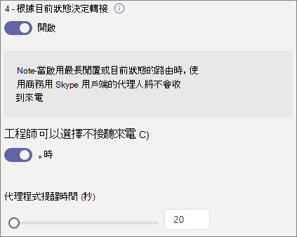

# 建立通話佇列

通話佇列提供將來電者路由給組織中可協助處理特定問題或問題的人的方法。 通話會一次一次發佈給佇列 (稱為代理 *程式) 。* 

通話佇列提供：

- 問候語訊息。

- 當人員在佇列中等候時播放音樂。

- 呼叫路由 - *在 FIFO (* 中，先) - 到代理程式。

- 佇列溢位和超時的處理選項。

遵循本文中的程式之前，請務必先閱讀[Teams](plan-auto-attendant-call-queue.md)自動 Attendant 和通話佇列的規劃，並遵循開始使用的步驟。

若要設定通話佇列，請在 Teams 系統管理中心展開 **語音**，按一下通話 **佇列**，然後按一下 [ **新增**。

## 資源帳戶和語言

1. 輸入通話佇列的名稱。

2. 按一下 **[新增** 帳戶;搜尋要用於此通話佇列的資源帳戶;按一下 **[** 新增，然後按一下 **新增。**  (代理程式收到來電時，會看到資源帳戶名稱。) 

3. 選擇 [支援的語言](create-a-phone-system-call-queue-languages.md)。 如果您啟用系統產生的語音提示和語音 (，就會使用這個) 。

## 佇列等候的問候語和音樂

指定當來電者到達佇列時，是否要播放問候語。 您必須上傳包含要播放之問候語的 MP3、WAV 或 WMA 檔案。

當來電者在佇列中等候時，Teams 會提供預設音樂。 如果您想要播放特定的音訊檔案，請選擇播放音訊檔案，然後上傳 MP3、WAV 或 WMA 檔案。

> [!NOTE]
> 上傳的錄製內容不能大於 5 MB。
> Teams 通話佇列提供的預設音樂是免費的，貴組織可支付任何權利金。 

## 通話代理程式

請參閱先決條件 [，](plan-auto-attendant-call-queue.md#prerequisites) 以將代理程式新增到通話佇列。

您可以個別新增最多 20 個代理程式，並透過群組新增最多 200 個代理程式。

若要將使用者新增到佇列，請按一下[新增使用者;搜尋使用者;按一下 **[新增**，然後按一下 **新增**。

若要將群組新增到佇列，請按一下 [ **新增** 群組;搜尋群組;按一下 **[新增**，再按一下 **新增**。 您可以使用通訊群組清單、安全性群組和 Microsoft 365 群組或 Microsoft Teams 團隊。

> [!NOTE]
> 新加入群組的使用者最多可能需要八小時的時間，才能第一次通話到達。

## 通話路由

**會議模式** 可大幅縮短當代理人接受來電後，來電者與代理人連上的時間。 若要讓會議模式運作，通話佇列中的代理程式必須使用下列其中一個用戶端：

  - 最新版本的 Microsoft Teams 桌面用戶端、Android App 或 iOS 應用程式
  - Microsoft Teams 手機版本 1449/1.0.94.2020051601 或更新版本
  
代理人的 Teams 帳戶必須設定為 Teams 模式。 不符合需求的代理人不會包含在通話路由清單中。 如果您的代理人都使用相容的用戶端，建議您為通話佇列啟用會議模式。

**路由方法** 會決定代理程式從佇列接收呼叫的順序。 從這些選項中選擇：

- **Attendant 路由** 會同時為佇列中的所有代理程式響鈴。 第一個接電話的代理人會接到來電。

- **連續路由** 會以呼叫代理程式清單中指定的順序，一個接一個地撥打所有 **呼叫** 代理程式。 如果客服人員拒絕或未接電話，來電會撥打給下一位客服人員，並嘗試所有代理人，直到電話取貨或打退。

- **四輪** 路由會平衡來電的路由，讓每個通話代理程式從佇列獲得相同的通話數目。 在內入銷售環境中，這是理想的情況，以確保所有呼叫代理程式之間有相同的機會。

- **最長閒置** 時間會路由每通電話給閒置時間最長的代理人。 如果代理人的目前狀態為線上，或者其目前狀態在離開狀態不到 10 分鐘，則視為閒置中。 目前狀態超過 10 分鐘的代理人不視為閒置中，且在將目前狀態變更為線上之前，將不符合接聽來電資格。 

**目前狀態式路由** 會使用呼叫代理程式的可用性狀態，來判斷所選路由方法的呼叫路由清單中是否應該包含代理程式。 將顯示狀態設為可用的呼叫代理程式會包含在通話路由清單中，而且可以接聽來電。 其顯示狀態設定為任何其他狀態的代理人會從通話路由清單中排除，而且不會接收通話，直到其顯示狀態變更回可用 **。** 

您可以使用任何路由方法啟用目前狀態型呼叫路由。

如果代理人選擇不接聽電話，無論他們的顯示狀態設定為什麼，通話路由清單不會包含他們。 

> [!NOTE]
> 啟用目前狀態式路由時，使用商務用 Skype 用戶端的代理程式不會包含在通話路由清單中。 如果您有使用商務用 Skype 的代理程式，請勿啟用目前狀態型通話路由。

**代理人通知** 時間會指定在佇列將來電重新導向到下一個代理人之前，代理人的電話會響鈴多久。

建議使用下列設定：

- **會議模式** 為 **自動**
- **將路由方式** 四 **分位或****最長閒置時間**
- **以目前狀態為基礎的路由** 到 **On**
- **代理人警示時間****：20 秒**

> [!NOTE]
> 如果未啟用目前狀態路由，且佇列中有多個通話，無論代理程式目前狀態如何，系統都會同時向代理程式顯示這些呼叫。 這會導致多個來電通知給代理程式，特別是當某些代理程式無法接聽他們接到的初始通話時。

## 呼叫溢位處理

**佇列中的通話上限** 會指定在任何指定時間可在佇列中等候的通話數量上限。 預設值為 50，但範圍從 0 到 200。 達到此限制時，會依照達到通話數量上限的設定來處理 **通話** 。

您可以選擇中斷通話，或重新導向至任何通話路由目的地。 例如，您可能會讓來電者在佇列中為代理人留下語音信箱。 針對外部移轉，請參閱先決條件和外部電話號碼移轉[- 數位](create-a-phone-system-auto-attendant.md#external-phone-number-transfers---technical-details)格式的技術詳細資料。

> [!NOTE]
> 如果通話數量上限設定為 0，則問候語訊息將不會播放。

## 通話超時處理

**通話超時：最長等待時間** 會指定在重新導向或中斷連接前，通話在佇列中可以保留的最大時間。 您可以指定 0 秒到 45 分鐘的值。

您可以選擇中斷通話，或重新導向到其中一個通話路由目的地。 例如，您可能會讓來電者在佇列中為代理人留下語音信箱。 針對外部移轉，請參閱先決條件和外部電話號碼移轉[- 數位](create-a-phone-system-auto-attendant.md#external-phone-number-transfers---technical-details)格式的技術詳細資料。

當您選取通話超時選項時，請按一下 **[儲存**。

## 外線通話的本機號碼

由於通話佇列的代理程式可能會撥出電話以傳回客戶電話，因此請考慮將通話佇列成員的本機號碼設定為適當的自動語音機服務號碼。 請參閱 [在 Microsoft Teams 中管理本機號碼](caller-id-policies.md) 政策以瞭解更多資訊。

## 支援的用戶端

通話佇列中的呼叫代理程式支援下列用戶端：

  - 商務用 Skype 桌面用戶端 2016 (32 位和 64 位版本) 
  - Lync 桌面用戶端 2013 (32 位和 64 位版本) 
  - Microsoft Teams 支援的所有 IP 電話型號。 請參閱 [取得商務用 Skype Online 的電話](/skypeforbusiness/what-is-phone-system-in-office-365/getting-phones-for-skype-for-business-online/getting-phones-for-skype-for-business-online)。
  - Mac 商務用 Skype 用戶端 (版本 16.8.196 及更新版本) 
  - Android 商務用 Skype 用戶端 (版本 6.16.0.9 及更新版本) 
  - iPhone 商務用 Skype 用戶端 (版本 6.16.0 及更新版本) 
  - iPad 商務用 Skype 用戶端 (版本 6.16.0 及更新版本) 
  - Microsoft Teams Windows 用戶端 (32 位和 64 位版本) 
  - Microsoft Teams Mac 用戶端
  - Microsoft Teams iPhone 應用程式
  - Microsoft Teams Android 應用程式

    > [!NOTE]
    > 指派直接路由號碼的通話佇列不支援商務用 Skype 用戶端、Lync 用戶端或商務用 Skype IP 電話代理程式。

## 通話佇列 Cmdlet

您也可以使用 Windows PowerShell 建立及設定通話佇列。 以下是您用於管理通話佇列的 Cmdlet。

- [New-CsCallQueue](https://docs.microsoft.com/powershell/module/skype/new-CsCallQueue)

- [Set-CsCallQueue](https://docs.microsoft.com/powershell/module/skype/set-CsCallQueue)

- [Get-CsCallQueue](https://docs.microsoft.com/powershell/module/skype/get-CsCallQueue)

- [Remove-CsCallQueue](https://docs.microsoft.com/powershell/module/skype/remove-CsCallQueue)

## 相關主題

[以下是可透過電話系統獲得的功能](here-s-what-you-get-with-phone-system.md)

[取得服務電話號碼](getting-service-phone-numbers.md)

[音訊會議與通話方案的適用國家/地區](country-and-region-availability-for-audio-conferencing-and-calling-plans/country-and-region-availability-for-audio-conferencing-and-calling-plans.md)

[New-CsOnlineApplicationInstance](https://docs.microsoft.com/powershell/module/skype/new-csonlineapplicationinstance)

[Windows PowerShell 與 Lync Online 的簡介](/SkypeForBusiness/set-up-your-computer-for-windows-powershell/set-up-your-computer-for-windows-powershell)
