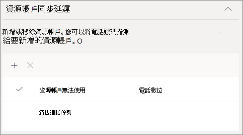

# 建立通話佇列

通話佇列提供將來電者路由給組織中可協助解決特定問題或問題的人員的方法。 通話會一次分配給佇列中 (稱為 *專員*) 的人員。 

> [!TIP]
> 本文適用于大型組織。 如果您的組織是小型企業，請改為閱讀 [建立通話佇列 - 小型企業教學課程](/microsoftteams/business-voice/create-a-phone-system-call-queue-smb) 。

通話佇列提供：

- 問候語訊息。

- 當人們等候佇列中的保留時播放音樂。

- 呼叫路由 - 在 [ *第一筆]、[第一次取出* ] 中， () 訂單中的 FIFO - 給專員。

- 佇列溢出和逾時的處理選項。

請確定您已閱讀[規劃Teams自動語音應答和通話佇列](plan-auto-attendant-call-queue.md)，並遵循[開始步驟](plan-auto-attendant-call-queue.md#getting-started)，再依照本文中的程式進行。

**如需詳細資訊，請參閱下方的 [通話佇列功能相容性](#call-queue-feature-compatibility) 矩陣。**

## 視訊示範

這段影片示範如何在 Teams 中建立通話佇列的基本範例。

> [!VIDEO https://www.microsoft.com/videoplayer/embed/RWCF23?autoplay=false]

## 建立通話佇列

若要設定通話佇列，請在Teams系統管理中心展開 **[語音**]，按一下 [**通話佇列]**，然後按一下 [**新增]**。

輸入通話佇列的名稱。

## 資源帳戶

按一下 **[新增帳戶**]，搜尋您要用於此通話佇列的資源帳戶，按一下 [ **新增**]，然後按一下 [ **新增]**。  (專員會在收到來電時看到資源帳戶名稱。) 

如需詳細資訊，請參閱[管理Teams資源帳戶](manage-resource-accounts.md)。

## 動態本機號碼

**適用于Teams頻道/共同作業通話桌面使用者，以及標準通話佇列Teams行動用戶端使用者**

您可以指定一或多個使用電話號碼的資源帳戶，為代理程式指派撥出來電號碼。 專員可以選取要用於每個撥出電話的撥出來電號碼。

按一下 **[新增**]，搜尋您要允許代理程式在撥打撥出電話時用於來電者識別碼的資源帳戶，按一下 [ **新增**]，然後按一下 [ **新增]**。

**標準通話佇列**

對於Teams桌面使用者和標準通話佇列，請考慮將通話佇列成員的來電識別碼直接設定為通話佇列的服務號碼或適當的自動語音應答。 如需詳細資訊，請參閱[在 Microsoft Teams 中管理來電者識別碼原則](caller-id-policies.md)。

> [!NOTE]
> 用於通話識別碼的資源帳戶必須具備Microsoft Teams 電話系統虛擬使用者授權，以及下列其中一項指派：
>
> - 通話方案授權和指派的電話號碼
> - 已指派電信業者連線電話號碼
> - 使用直接路由) 時，選擇性地指派電話號碼 (線上語音路由原則

## 語言

選擇 [支援的語言](create-a-phone-system-call-queue-languages.md)。 如果您啟用) ，系統產生的語音提示和語音信箱轉譯 (將使用此語言。

## 佇列中保留問候語和音樂

指定您是否要在來電者到達佇列時播放問候語。 您必須上傳包含您要播放的問候語的 MP3、WAV 或 WMA 檔案。 上傳的錄製不得大於 5 MB。

Teams會在來電者在佇列中保留時，為來電者提供預設音樂。 Teams通話佇列中提供的預設音樂不含貴組織支付的任何稅金。 如果您想要播放特定音訊檔案，請選擇 **[播放音訊檔案** ] 並上傳 MP3、WAV 或 WMA 檔案。

> [!NOTE]
> 貴使用者必須負責獨立清除及保護所有必要的權利與許可權，以搭配您的Microsoft Teams服務使用任何音樂或音訊檔案，其中可能包含所有相關權利持有者之音訊檔案中的智慧財產權及其他權利，包括演出者、演出者、 演出者、專輯、演出者、作曲者、記錄標籤、音樂發行者、廠商、商標、權利召集人、集體管理組織，以及擁有、控制或授權音樂著作權、音效、音訊及其他智慧財產權的任何其他當事人。

## 撥號專員

檢閱將 [專員新增至通話佇列的先決條件](plan-auto-attendant-call-queue.md#prerequisites)。

##### Teams通道

您最多可以透過Teams通道新增 200 個代理程式。 您必須是團隊成員或頻道的建立者或擁有者，才能將頻道新增至佇列。

如果您想要 [使用Teams頻道管理佇列](https://support.microsoft.com/office/9f07dabe-91c6-4a9b-a545-8ffdddd2504e)，請選取 **[選擇團隊**] 選項，然後按一下 [**新增頻道]**。 搜尋您要使用的團隊，選取該團隊，然後按一下 [ **新增]**。 選取您要使用的頻道 (只支援標準通道) ，然後按一下 [ **套用]**。 

使用Teams頻道進行通話佇列時，支援下列用戶端： 

  - Microsoft Teams Windows用戶端
  - Microsoft Teams Mac 用戶端

> [!NOTE]
> 如果您使用此選項，通話佇列最多可能需要 24 小時才能完全運作。

##### 使用者和群組

您最多可以透過群組個別新增 20 個代理程式和最多 200 個代理程式。

如果您想要將個別使用者或群組新增至佇列，請選取 [ **選擇使用者和群組]** 選項。 

若要將使用者新增至佇列，請按一下 [ **新增使用者]**、搜尋使用者、按一下 [ **新增**]，然後按一下 [ **新增]**。

若要將群組新增至佇列，請按一下 [ **新增群組**]、搜尋群組、按一下 [ **新增**]，然後按一下 [ **新增]**。 您可以使用通訊群組清單、安全性群組和Microsoft 365群組或Microsoft Teams小組。

> [!NOTE]
> 新增至群組的新使用者最多可能需要八小時，才能收到他們的第一個通話。

## 通話路由

**會議模式** 會大幅減少來電者接聽來電者接聽電話之後，與代理人連線所需的時間。 若要讓會議模式正常運作，通話佇列中的代理程式必須使用下列其中一個用戶端：

  - Microsoft Teams桌面用戶端、Android應用程式或iOS應用程式的最新版本
  - Microsoft Teams 電話版本 1449/1.0.94.2020051601 或更新版本
  
專員的Teams帳戶必須設定為僅Teams模式。 不符合需求的代理程式不包含在通話路由清單中。 如果您的代理程式都使用相容的用戶端，建議您為通話佇列啟用會議模式。

> [!NOTE]
> 如果電話從已啟用以位置為基礎的路由的直接路由閘道路由到佇列，則不支援會議模式。
>
> 如果Teams使用者需要在通話佇列中查閱/轉接電話，則必須使用會議模式。

> [!TIP]
> 建議的設定是將 **會議模式** 設定為 [ **開** 啟]。

**路由方法** 會決定代理程式從佇列接聽來電的順序。 從這些選項中選擇：

- **語音應答路由** 會同時響鈴佇列中的所有代理程式。 接聽電話的第一個撥號專員會接聽來電。

- **串列路由** 會以 [通話專員] 清單中指定的順序，逐一撥打所有 **通話代理程式** 。 如果專員解除或未接聽來電，通話會撥打下一位專員。 這將會重複，直到接聽來電或逾時為止。

- **Round 方會** 平衡來電的路由，讓每個來電代理程式從佇列取得相同數目的來電。 在輸入銷售環境中，這種路由方式可能很理想，以確保所有來電代理商都能享有相同的商機。

- **最長閒置** 時間將每通電話路由給閒置時間最長的代理人。 如果專員的目前狀態可供使用，就會被視為閒置。 在專員將目前狀態變更為 [線上] 之前，他們將不符合接聽來電的資格。 

> [!TIP]
> 建議您將 **路由方法** 設定為 **Round 畫過** 或 **最長閒置** 時間。

> [!NOTE]
> 如果代理程式已啟用 [合規性錄製](teams-recording-policy.md) ，則不支援 **會議模式** 和 **Attendant 路由** 的組合。 如果您需要使用 **會議模式**，請選取 **[串列路由**]、[ **圓形長圈**] 或 [ **最長閒置時間** ] 做為 **路由方法**。 如果您需要使用 **Attendant 路由**，請將 **會議模式** 設為 **[關閉]**。
> 
> 使用 **最長閒置** 時間，且佇列中的通話少於可用代理程式時，只有前兩個最長的閒置代理程式會顯示來自佇列的來電。
> 
> 使用 **最長閒置** 時間時，有時專員在無法使用後很快收到來自佇列的來電，或在有空後接到佇列來電的短暫延遲。
> 
> 代理程式的通話佇列通話簡報可能會與位置路由限制發生衝突。 在此情況下，專員會收到快顯通知，但無法接聽電話。 此條件會繼續執行，直到有其他專員可以接聽電話、來電者掛斷或發生通話佇列逾時條件為止。  

**目前狀態路由** 使用通話代理程式的顯示狀態，判斷是否應將所選路由方法的呼叫路由清單中包含專員。 通話代理程式的顯示狀態設為 [ **線上** ]，會包含在通話路由清單中，並可接聽來電。 將顯示狀態設定為任何其他狀態的代理程式會從通話路由清單中排除，而且在顯示狀態變更回 [ **線上**] 之前不會接聽來電。 

您可以使用任何路由方法啟用目前狀態型通話路由。

如果專員選擇不接聽電話，無論他們的顯示狀態設定為何，都不會將他們納入通話路由清單中。 

> [!NOTE]
> 當選取 **[最長閒置** 時間] 做為路由方法時，即使目前狀態型路由切換開關為 **[關閉** ] 且呈現灰色，仍需要並自動啟用目前狀態路由。
>
> 如果未啟用目前狀態路由，且佇列中有多個通話，系統會同時向代理程式顯示這些通話，不論其目前狀態為何。 這會導致專員收到多個來電通知，特別是某些專員未接聽給專員的初始通話時。
>
> 使用 **目前狀態路由** 時，有時專員可能會在無法使用後很快收到來自佇列的來電，或在有空後收到來自佇列的來電的短暫延遲。
> 
> 啟用目前狀態型路由時，使用商務用 Skype用戶端的代理程式不會包含在通話路由清單中。 如果您有使用商務用 Skype的專員，請勿啟用目前狀態型通話路由。

> [!TIP]
> 建議您將 **目前狀態路由設定****為 [** 開啟]。

**專員警示時間** 指定專員的電話會在佇列重新導向至下一位專員之前響鈴多久。

> [!TIP]
> 建議將 **專員警示時間** 設定為 **20 秒** 。

> [!NOTE]
> [通話逾時處理](#call-timeout-handling)設定的優先順序會超出專員警示時間。 如果已達到通話逾時處理設定的最大佇列時間，通話將會從代理人 (的) 取回，即使尚未達到專員的警示時間限制。

## 呼叫溢位處理

**佇列中的通話數目** 上限可指定在任何指定時間在佇列中等候的通話數目上限。 預設值為 50，但範圍從 0 到 200。 達到此限制時，會依照達到 **通話數上限** 時的設定來處理通話。

您可以選擇中斷通話，或將其重新導向至任何呼叫路由目的地。 例如，您可能會讓來電者為佇列中的代理程式留下語音信箱。 如需外部傳輸，請參閱 [必要條件](plan-auto-attendant-call-queue.md#prerequisites) 和 [外部電話號碼移轉 -](create-a-phone-system-auto-attendant.md#external-phone-number-transfers---technical-details) 數位格式設定的技術詳細資料。

> [!NOTE]
> 如果將通話數上限設為 0，則問候語訊息將無法播放。
>
> 重新導向至共用語音信箱時，請確定已針對Microsoft 365 系統管理中心的小組/群 **組，讓組織外部的人員傳送電子郵件給此小組**。

## 呼叫逾時處理

**通話逾時：等待時間上限** 可指定電話在佇列中保留的時間上限，才能重新導向或中斷連線。 您可以指定 0 秒到 45 分鐘的值。

您可以選擇中斷通話，或將其重新導向至其中一個呼叫路由目的地。 例如，您可能會讓來電者為佇列中的代理程式留下語音信箱。 針對外部傳輸，請參閱 [必要條件](plan-auto-attendant-call-queue.md#prerequisites) 和 [外部電話號碼移轉 -](create-a-phone-system-auto-attendant.md#external-phone-number-transfers---technical-details) 數位格式設定的技術詳細資料。

> [!NOTE]
> 重新導向至共用語音信箱時，請確定已針對Microsoft 365 系統管理中心的小組/群 **組，讓組織外部的人員傳送電子郵件給此小組**。

當您已選取通話逾時選項時，請按一下 [ **儲存]**。

## 建議通話佇列設定摘要

建議使用下列設定：

- **會議模式** 為 **[開啟]**
- **路由方式** 轉為 **Round 畫過** 或 **最長閒置**
- **以目前狀態為基礎的路由** 至 [ **開啟]**
- **專員警示時間：** 到 **20 秒**

## 通話佇列功能相容性

|功能                          |Teams桌面1 |Teams行動裝置版 2 |Lync |IP Phone | 標準通話佇列 |頻道型通話佇列 | 評論 |
|:--------------------------------|:------------------------:|:-----------------------:|:---:|:--------:|:--------------------:|:------------------------:|:-------------|
|**代理程式路由方法**        |                          |                         |     |          |                      |                          |              |
|`Attendant Routing`              |Y                         |Y                        |Y    |Y         |Y                     |Y                         |*預設*     |
|`Longest Idle`3       |Y                         |Y                        |N    |Y         |Y                     |Y                         |*建議* |
|`Round Robin`                    |Y                         |Y                        |Y    |Y         |Y                     |Y                         |*建議* |
|`Serial`                         |Y                         |Y                        |Y    |Y         |Y4         |Y4             |              |
|**專員路由選項**        |                          |                         |     |          |                      |                          |              |
|`Presence Based Routing`3|Y                        |Y                        |N    |Y         |Y                     |Y                         |*建議* |
|`Agents can Opt-out`               |Y                         |Y                        |Y7|Y7|Y          |Y                         |*預設*     |
|**傳輸模式**               |                          |                         |     |          |                      |                          |              |
|`Conference Mode`5    |Y                         |Y                        |N    |Y6|Y                  |Y                         |*建議* |
|`Transfer Mode`                  |Y                         |Y                        |Y    |Y         |Y                     |Y                         |*預設*              |
|**共同作業通話**        |                          |                         |     |          |                      |                          |              |
|`Channel Based Queues`             |Y                         |N                        |N    |N         |n/a                   |Y8             |              |
|**動態來電者識別碼**            |                          |                         |     |          |                      |                          |              |
|`Standard call queue`            |N                         |Y                        |N    |N         |Y                     |n/a                       |              |
|`Channel based call queue`       |Y                         |n/a                      |n/a  |n/a       |n/a                   |Y                         |              |
|**PSTN 連線方法**    |                          |                         |     |          |                      |                          |請參閱附注 10   |
|`Calling Plans`                  |Y                         |Y                        |Y    |Y         |Y                     |Y                         |              |
|`Direct Routing`                 |Y                         |Y                        |N    |N         |Y                     |Y                         |              |
|`Operator Connect`               |Y                         |Y                        |     |          |Y                     |Y                         |              |
|**雜項**    |                          |                         |     |          |                      |                          |請參閱附注 10   |
|`Call toast shows Resource Account Name` |Y9       |Y                        |Y    |          |Y                     |Y                         |              |

附註：
1. Microsoft Teams Windows用戶端、Microsoft Teams Mac 用戶端、虛擬化桌面基礎結構上的 Microsoft Teams、Microsoft Teams Web 用戶端。
2. Microsoft Teams iPhone應用程式，Microsoft Teams Android應用程式。
3. 針對代理程式路由方法選取 [最長閒置時間] 會自動啟用以目前狀態為基礎的路由。
4. 只能設定將個別使用者新增為標準通話佇列的一部分時的順序。 使用通訊群組清單或Teams通道時，順序會依字母順序排列。
5. 如果電話從已啟用以位置為基礎的路由的直接路由閘道路由到佇列，則不支援會議模式。
6. 僅Microsoft Teams手機。
7. 透過 [使用者設定入口網站頁面：https://aka.ms/vmsettings
8. 僅支援公用頻道。
9. 不包含Teams Web 用戶端。
10. 自動語音應答和通話佇列無法在 PSTN 連線方法之間轉接來電。

## 支援的用戶端

通話佇列中的通話代理程式支援下列用戶端：

  - 商務用 Skype桌面用戶端 2016 (32 位和 64 位版本) 
  - Lync 桌面用戶端 2013 (32 位和 64 位版本) 
  - 支援Microsoft Teams的所有 IP 手機型號。 請參閱[在線上取得商務用 Skype電話](/skypeforbusiness/what-is-phone-system-in-office-365/getting-phones-for-skype-for-business-online/getting-phones-for-skype-for-business-online)。
  - Mac 商務用 Skype用戶端 (版本 16.8.196 及更新版本) 
  - Android 商務用 Skype用戶端 (版本 6.16.0.9 及更新版本) 
  - iPhone 商務用 Skype Client (版本 6.16.0 及更新版本) 
  - iPad 商務用 Skype用戶端 (版本 6.16.0 及更新版本) 
  - Microsoft Teams Windows用戶端 (32 位和 64 位版本) 
  - Microsoft Teams Mac 用戶端
  - Microsoft Teams[虛擬桌面基礎](/microsoftteams/teams-for-vdi)結構 (Windows虛擬桌面、Citrix 和 VMware) 
  - Microsoft Teams iPhone應用程式
  - Microsoft Teams Android應用程式

    > [!NOTE]
    > 指派直接路由號碼的通話佇列不支援商務用 Skype用戶端、Lync 用戶端或以代理程式商務用 Skype IP 電話。 Teams用戶端僅支援[共存模式Teams。](/microsoftteams/setting-your-coexistence-and-upgrade-settings)

## 通話佇列 Cmdlet

Windows PowerShell可讓您以批次或程式設計的方式，透過命令列建立及管理通話佇列。

下列 Cmdlet 可讓您管理通話佇列：

- [New-CsCallQueue](/powershell/module/skype/New-CsCallQueue)
- [Get-CsCallQueue](/powershell/module/skype/Get-CsCallQueue)
- [Set-CsCallQueue](/powershell/module/skype/Set-CsCallQueue)
- [Remove-CsCallQueue](/powershell/module/skype/Remove-CsCallQueue)

下列的額外 Cmdlet 也需要管理使用者、資源帳戶、Microsoft Teams 電話授權、電話號碼、音訊檔案，以及搭配通話佇列使用的支援語言：

使用者/Teams

- 使用者
- - [Get-CsOnlineUser](/powershell/module/skype/Get-CsOnlineUser)

- Teams： 
- - [Get-Team](/powershell/module/teams/Get-Team)
- - [Get-TeamChannel](/powershell/module/teams/Get-TeamChannel)

資源帳戶：

- [New-CsOnlineApplicationInstance](/powershell/module/skype/New-CsOnlineApplicationInstance)
- [Find-CsOnlineApplicationInstance](/powershell/module/skype/Find-CsOnlineApplicationInstance)
- [Get-CsOnlineApplicationInstance](/powershell/module/skype/Get-CsOnlineApplicationInstance)
- [Set-CsOnlineApplicationInstance](/powershell/module/skype/Set-CsOnlineApplicationInstance)
- [New-CsOnlineApplicationInstanceAssociation](/powershell/module/skype/New-CsOnlineApplicationInstanceAssociation)
- [Get-CsOnlineApplicationInstanceAssociation](/powershell/module/skype/Get-CsOnlineApplicationInstanceAssociation)
- [Remove-CsOnlineApplicationInstanceAssociation](/powershell/module/skype/Remove-CsOnlineApplicationInstanceAssociation)
- [Get-CsOnlineApplicationInstanceAssociationStatus](/powershell/module/skype/Get-CsOnlineApplicationInstanceAssociationStatus)

虛擬Teams 電話授權：

- [Get-MsolAccountSku](/powershell/module/msonline/get-msolaccountsku)
- [Set-MsolUserLicense](/powershell/module/msonline/set-msoluserlicense)

電話編號指派：

- [Get-CsOnlineTelephoneNumber](/powershell/module/skype/Get-CsOnlineTelephoneNumber)
- [Set-CsPhoneNumberAssignment](/powershell/module/teams/Set-csphonenumberassignment)

音訊檔案

- [Get-CsOnlineAudioFile](/powershell/module/skype/Get-CsOnlineAudioFile)
- [Import-CsOnlineAudioFile](/powershell/module/skype/Import-CsOnlineAudioFile)
- [Export-CsOnlineAudioFile](/powershell/module/skype/Export-CsOnlineAudioFile)
- [Remove-CsOnlineAudioFile](/powershell/module/skype/Remove-CsOnlineAudioFile)

支援語言清單

- [Get-CsAutoAttendantSupportedLanguage](/powershell/module/skype/Get-CsAutoAttendantSupportedLanguage)

如需使用 PowerShell 建立通話佇列的逐步指南，請參閱 [使用 PowerShell Cmdlet 建立通話佇列](create-a-phone-system-call-queue-via-cmdlets.md)

## 通話佇列診斷工具

如果您是系統管理員，您可以使用下列診斷工具驗證通話佇列是否能夠接聽來電：

1. 選取 [執行測試]**** 以在 Microsoft 365 系統管理中心填入診斷。 

   > [!div class="nextstepaction"]
   > [執行測試：Teams通話佇列](https://aka.ms/TeamsCallQueueDiag)

2. 在 [執行] 診斷窗格中，在 [ **使用者名稱] 或 [電子郵件** ] 欄位中輸入 [資源帳戶]，然後選取 [ **執行測試]**。

3. 測試會傳回解決任何租使用者、原則和資源帳戶設定的最佳後續步驟，以驗證通話佇列是否能夠接聽來電。

## 相關主題

[以下是您可以透過Microsoft Teams 電話](here-s-what-you-get-with-phone-system.md)

[取得服務電話號碼](getting-service-phone-numbers.md)

[音訊會議與通話方案的適用國家/地區](country-and-region-availability-for-audio-conferencing-and-calling-plans/country-and-region-availability-for-audio-conferencing-and-calling-plans.md)
