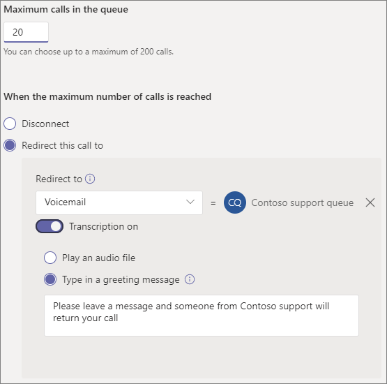

# 建立通話佇列Create a call queue

通話佇列提供將來電者路由給組織中可協助解決特定問題之人員的方法。Call queues provide a method of routing callers to people in your organization who can help with a particular issue or question. 通話會一次分配一個給佇列 (代理程式 *人員) 。*Calls are distributed one at a time to the people in the queue (who are known as *agents*). 

通話佇列提供：Call queues provide:

- 問候語訊息。A greeting message.

- 當人員正在等候佇列時播放音樂。Music while people are waiting on hold in a queue.

- 呼叫路由 - *在 First In， First Out (* FIFO) - 到代理程式。Call routing - in *First In, First Out* (FIFO) order - to agents.

- 佇列溢出和超時的處理選項。Handling options for queue overflow and timeout.

按照本文中的程式操作之前，請務必先閱讀[Teams](plan-auto-attendant-call-queue.md)自動撥打和通話佇列的規劃，並遵循入門步驟。Be sure you have read [Plan for Teams auto attendants and call queues](plan-auto-attendant-call-queue.md) and followed the [getting started steps](plan-auto-attendant-call-queue.md#getting-started) before you follow the procedures in this articles.

若要設定通話佇列，請在 Teams 系統管理中心展開[語音，按一下通話 **佇列**，然後按一下 [**新增**。To set up a call queue, in the Teams admin center, expand **Voice**, click **Call queues**, and then click **Add**.

## 資源帳戶及語言Resource account and language

1. 輸入通話佇列的名稱。Type a name for the call queue. 當代理人收到來自佇列的來電時，會看到此名稱。Agents will see this name when they receive an incoming call from the queue.

2. 按一下 **[新增** 帳戶，搜尋要用於此通話佇列的資源帳戶;按一下 [新增，然後按一下 **新增。**Click **Add accounts**, search for the resource account that you want to use with this call queue, click **Add**, and then click **Add**.

3. 選擇語言。Choose a language. 如果您啟用系統產生的語音提示和語音信箱抄 (，就會使用這個) 。This language will be used for system-generated voice prompts and voicemail transcription (if you enable them).

## 佇列中保留的問候語和音樂Greetings and music on hold in queue

指定是否要在來電者到達佇列時播放問候語。Specify if you want to play a greeting to callers when they arrive in the queue. 您必須上傳包含要播放之問候語的 MP3、WAV 或 WMA 檔案。You must upload an MP3, WAV, or WMA file containing the greeting that you want to play.

當來電者排入佇列時，Teams 會提供預設音樂給來電者。Teams provides default music to callers while they are on hold in a queue. 如果您想要播放特定的音訊檔案，請選擇播放音訊檔案，然後上傳 MP3、WAV 或 WMA 檔案。If you want to play a specific audio file, choose **Play an audio file** and upload an MP3, WAV, or WMA file.

> [!NOTE]
> 上傳的錄製不能大於 5 MB。The uploaded recording can be no larger than 5 MB.
> Teams 通話佇列提供的預設音樂可免收貴組織應付的任何權利金。The default music supplied in Teams call queues is free of any royalties payable by your organization. 

## 通話代理程式Call agents

請參閱先決條件 [，](plan-auto-attendant-call-queue.md#prerequisites) 以將代理人新增到通話佇列。Please refer to the [Prerequisites](plan-auto-attendant-call-queue.md#prerequisites) in order to be able to add agents to a call queue.

您可以透過群組個別新增最多 20 個代理程式，以及最多 200 個代理程式。You can add up to 20 agents individually and up to 200 agents via groups.

若要將使用者新增到佇列，請按一下[新增使用者，搜尋使用者，按一下 [**新增**，然後按一下新增 **。**To add a user to the queue, click **Add users**, search for the user, click **Add**, and then click **Add**.

若要將群組新增到佇列，請按一下 [**新增** 群組;搜尋群組;按一下[新增，然後按一下 [**新增**。To add a group to the queue, click **Add groups**, search for the group, click **Add**, and then click **Add**. 您可以使用通訊群組清單、安全性群組，以及 Microsoft 365 群組或 Microsoft Teams 團隊。You can use distribution lists, security groups, and Microsoft 365 groups or Microsoft Teams teams.

> [!NOTE]
> 新加入群組的新使用者最多可能需要八小時的時間，才能到達第一個通話。New users added to a group can take up to eight hours for their first call to arrive.

## 通話路由Call routing

**在代理人** 接受通話後，會議模式可大幅縮短來電者與代理人聯繫的時間。**Conference mode** significantly reduces the amount of time it takes for a caller to be connected to an agent, after the agent accepts the call. 若要讓會議模式運作，通話佇列中的代理人必須使用下列其中一個用戶端：For conference mode to work, agents in the call queue must use one of the following clients:

  - 最新版本的 Microsoft Teams 桌面用戶端、Android App 或 iOS 應用程式The latest version of the Microsoft Teams desktop client, Android app, or iOS app
  - Microsoft Teams 手機版本 1449/1.0.94.2020051601 或更新版本Microsoft Teams phone version 1449/1.0.94.2020051601 or later
  
代理人的 Teams 帳戶必須設定為 Teams-only 模式。Agents' Teams accounts need to be set to Teams-only mode. 不符合需求的代理人不會包含在通話路由清單中。Agents who don't meet the requirements aren't included in the call routing list. 如果您的代理人都使用相容的用戶端，建議您為通話佇列啟用會議模式。We recommend enabling conference mode for your call queues if your agents are all using compatible clients.

> [!NOTE]
> 會議模式不支援忙碌中。Busy on Busy is not supported by conference mode. 若未啟用目前狀態式路由，非通話佇列通話的代理程式仍可能會顯示通話佇列通話。Agents on non-call queue calls may still be presented with a call queue call if presence-based routing is not enabled.

**路由方法** 會決定代理程式從佇列接收呼叫的順序。**Routing method** determines the order in which agents receive calls from the queue. 請從這些選項中選擇：Choose from these options:

- **Attendant 路由** 會同時呼叫佇列的所有代理程式。**Attendant routing** rings all agents in the queue at the same time. 第一位接電話的代理人會接到來電。The first call agent to pick up the call gets the call.

- **串連路由** 會以通話代理程式清單中指定的順序，一個接一個撥打 **給所有通話** 代理程式。**Serial routing** rings all call agents one by one in the order specified in the **Call agents** list. 如果代理人拒絕或不接電話，來電會撥打給下一位代理人，並嘗試所有代理人，直到來電接回或停止通話。If an agent dismisses or does not pick up a call, the call will ring the next agent and will try all agents until it is picked up or times out.

- **圓形平衡** 呼叫的路由，讓每個通話代理程式從佇列獲得相同數目的通話。**Round robin** balances the routing of incoming calls so that each call agent gets the same number of calls from the queue. 這是在內入銷售環境中確保所有通話代理人均能有相等機會的做法。This may be desirable in an inbound sales environment to assure equal opportunity among all the call agents.

- **最長閒置** 時間路由每個通話給閒置時間最長之代理人。**Longest idle** routes each call to the agent who has been idle the longest time. 如果代理人的目前狀態為線上，或者其目前狀態已離開少於 10 分鐘，則視為閒置中。An agent is considered idle if their presence state is Available or if their presence state has been Away for less than 10 minutes. 目前狀態超過 10 分鐘的代理程式視為閒置中，且除非其目前狀態變更為線上，才能接聽來電。Agents whose presence state has been Away for more than 10 minutes are not considered idle and will not be eligible to receive calls until they change their presence to Available. 

**目前狀態式路由** 會使用通話代理程式的可用性狀態，來判斷所選路由方法的通話路由清單中是否應該包含代理人。**Presence-based routing** uses the availability status of call agents to determine whether an agent should be included in the call routing list for the selected routing method. 其顯示狀態設定為可用的通話代理程式會包含在通話路由清單中，而且可以接聽來電。Call agents whose availability status is set to **Available** are included in the call routing list and can receive calls. 其可用性狀態設定為任何其他狀態的代理人會排除在通話路由清單中，而且不會接聽來電，直到其顯示狀態變更回可用 **。**Agents whose availability status is set to any other status are excluded from the call routing list and won't receive calls until their availability status changes back to **Available**. 

您可以使用任何路由方法啟用目前狀態式通話路由。You can enable presence-based call routing with any of the routing methods.

如果代理人選擇不接聽來電，無論其顯示狀態設定為何種狀態，他們將不會包含在通話路由清單中。If an agent opts out of getting calls, they won't be included in the call routing list regardless of what their availability status is set to. 

> [!NOTE]
> 啟用目前狀態式路由時，使用商務用 Skype 用戶端的代理人不會包含在通話路由清單中。Agents who use the Skype for Business client aren't included in the call routing list when presence-based routing is enabled. 如果您有使用商務用 Skype 的代理人，請勿啟用目前狀態通話路由。If you have agents who use Skype for Business, don't enable presence-based call routing.

**代理人警示** 時間會指定代理人的電話在佇列將來電重新導向到下一個代理人前會響鈴多久。**Agent alert time** specifies how long an agent's phone will ring before the queue redirects the call to the next agent.

針對大量佇列，我們建議進行下列設定：For high volume queues, we recommend the following settings:

- **會議模式** 為 **自動****Conference mode** to **Auto**
- **Attendant** 路由 **的路由方法****Routing method** to **Attendant routing**
- **以目前狀態為基礎的路由** 至 **On****Presence-based routing** to **On**
- **代理人警示時間\*\*\*\*：20 秒****Agent alert time:** to **20 seconds**

## 呼叫溢出處理Call overflow handling

**佇列中的通話數目上限** 指定在任何指定時間都可以在佇列中等候的通話數目上限。**Maximum calls in the queue** specifies the maximum number of calls that can wait in the queue at any given time. 預設值為 50，但範圍從 0 到 200。The default is 50, but it can range from 0 to 200. 達到此限制時，會依照達到通話數上限設定所指定的處理 **通話。**When this limit is reached, the call is handled as specified by the **When the maximum number of calls is reached** setting.

您可以選擇中斷通話的中斷，或是將電話重新導向至任何通話路由目的地。You can choose to disconnect the call or redirect it to any of the call routing destinations. 例如，您可能會要求來電者在佇列中為代理人留下語音信箱。For example, you might have the caller leave a voicemail for the agents in the queue. 針對外部移轉，請參閱先決條件和外部電話號碼移轉[-](create-a-phone-system-auto-attendant.md#external-phone-number-transfers---technical-details)號碼格式的技術詳細資料。For external transfers, please refer to [Prerequisites](plan-auto-attendant-call-queue.md#prerequisites) and the [external phone number transfers - technical details](create-a-phone-system-auto-attendant.md#external-phone-number-transfers---technical-details) for number formatting.

> [!NOTE]
> 如果通話數上限設定為 0，將不會播放問候語訊息。If the maximum number of calls is set to 0 then the greeting message will not play.

## 通話超時處理Call timeout handling

**通話超時：最大等待時間** 可指定通話在重新導向或中斷連接前可保留佇列中的時間上限。**Call Timeout: maximum wait time** specifies the maximum time a call can be on hold in the queue before it is redirected or disconnected. 您可以指定 0 秒到 45 分鐘的值。You can specify a value from 0 seconds to 45 minutes.

您可以選擇中斷通話的中斷，或是將電話重新導向至其中一個通話路由目的地。You can choose to disconnect the call or redirect it to one of the call routing destinations. 例如，您可能會要求來電者在佇列中為代理人留下語音信箱。For example, you might have the caller leave a voicemail for the agents in the queue. 針對外部移轉，請參閱先決條件和外部電話號碼移轉[-](create-a-phone-system-auto-attendant.md#external-phone-number-transfers---technical-details)號碼格式的技術詳細資料。For external transfers, please refer to [Prerequisites](plan-auto-attendant-call-queue.md#prerequisites) and the [external phone number transfers - technical details](create-a-phone-system-auto-attendant.md#external-phone-number-transfers---technical-details) for number formatting.

當您已選取通話超時選項時，請按一下 **[儲存**。When you have selected your call timeout options, click **Save**.

## 外電來電的本機號碼Caller ID for outbound calls

由於通話佇列的代理人可以撥出以傳回客戶電話，因此請考慮將通話佇列成員的本機號碼設定為適當自動語音回應的服務號碼。Since agents in a call queue may dial out to return a customer call, consider setting the caller ID for members of a call queue to the service number of an appropriate auto attendant. 詳細資訊 [請參閱 Microsoft Teams 中的管理來電](caller-id-policies.md) 顯示政策。See [Manage caller ID policies in Microsoft Teams](caller-id-policies.md) for more information.

## 支援的用戶端Supported clients

通話佇列的通話代理程式支援下列用戶端：The following clients are supported for call agents in a call queue:

  - 商務用 Skype 桌面用戶端 2016 (32 位和 64 位版本) Skype for Business desktop client 2016 (32-bit and 64-bit versions)
  - Lync 桌面用戶端 2013 (32 位和 64 位版本) Lync desktop client 2013 (32-bit and 64-bit versions)
  - Microsoft Teams 支援的所有 IP 電話型號。All IP phone models supported for Microsoft Teams. 請參閱 [取得商務用 Skype Online 的電話](/skypeforbusiness/what-is-phone-system-in-office-365/getting-phones-for-skype-for-business-online/getting-phones-for-skype-for-business-online)。See [Getting phones for Skype for Business Online](/skypeforbusiness/what-is-phone-system-in-office-365/getting-phones-for-skype-for-business-online/getting-phones-for-skype-for-business-online).
  - Mac 商務用 Skype 用戶端 (版本 16.8.196 及更新版本) Mac Skype for Business Client (version 16.8.196 and later)
  - Android 商務用 Skype 用戶端 (6.16.0.9 及更新版本) Android Skype for Business Client (version 6.16.0.9 and later)
  - iPhone 商務用 Skype 用戶端 (6.16.0 及更新版本) iPhone Skype for Business Client (version 6.16.0 and later)
  - iPad 商務用 Skype 用戶端 (6.16.0 及更新版本) iPad Skype for Business Client (version 6.16.0 and later)
  -  (32 位和 64 位版本的 Microsoft Teams Windows 用戶端) Microsoft Teams Windows client (32-bit and 64-bit versions)
  - Microsoft Teams Mac 用戶端Microsoft Teams Mac client
  - Microsoft Teams iPhone 應用程式Microsoft Teams iPhone app
  - Microsoft Teams Android 應用程式Microsoft Teams Android app

    > [!NOTE]
    > 指派直接路由號碼的通話佇列不支援商務用 Skype 用戶端、Lync 用戶端或商務用 Skype IP 電話代理程式。Call queues that are assigned a direct routing number don't support Skype for Business clients, Lync clients, or Skype for Business IP Phones as agents.

## 通話佇列 CmdletCall queue cmdlets

您也可以使用 Windows PowerShell 來建立和設定通話佇列。You can also use Windows PowerShell to create and set up call queues. 以下是您用於管理通話佇列的 Cmdlet。Here are the cmdlets that you use to manage a call queue.

- [New-CsCallQueueNew-CsCallQueue](https://docs.microsoft.com/powershell/module/skype/new-CsCallQueue)

- [Set-CsCallQueueSet-CsCallQueue](https://docs.microsoft.com/powershell/module/skype/set-CsCallQueue)

- [Get-CsCallQueueGet-CsCallQueue](https://docs.microsoft.com/powershell/module/skype/get-CsCallQueue)

- [Remove-CsCallQueueRemove-CsCallQueue](https://docs.microsoft.com/powershell/module/skype/remove-CsCallQueue)

## 相關主題Related topics

[以下是可透過電話系統獲得的功能Here's what you get with Phone System](here-s-what-you-get-with-phone-system.md)

[取得服務電話號碼Getting service phone numbers](getting-service-phone-numbers.md)

[音訊會議與通話方案的適用國家/地區Country and region availability for Audio Conferencing and Calling Plans](country-and-region-availability-for-audio-conferencing-and-calling-plans/country-and-region-availability-for-audio-conferencing-and-calling-plans.md)

[New-CsOnlineApplicationInstanceNew-CsOnlineApplicationInstance](https://docs.microsoft.com/powershell/module/skype/new-csonlineapplicationinstance)

[Windows PowerShell 與 Lync Online 的簡介An introduction to Windows PowerShell and Skype for Business Online](/SkypeForBusiness/set-up-your-computer-for-windows-powershell/set-up-your-computer-for-windows-powershell)
