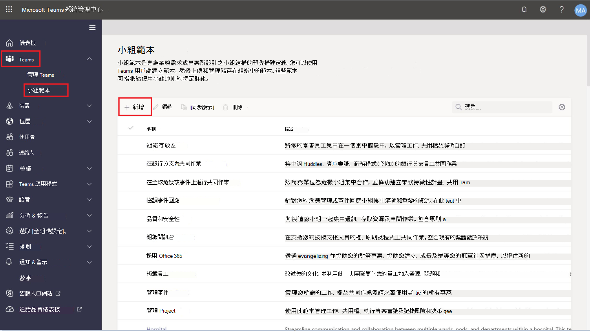
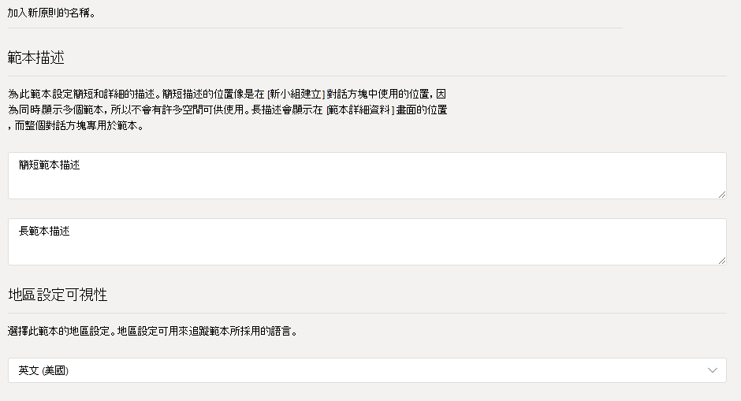

# 在範本中建立自訂Microsoft Teams

**EDU 客戶尚不支援自訂範本。**

自訂小組範本是預先定義的團隊結構，包含一組頻道、定位字元和應用程式。 您可以開發範本，説明您快速建立正確的共同合作空間。 您的自訂小組範本會使用您偏好的設定。  

 

> [!VIDEO https://www.microsoft.com/en-us/videoplayer/embed/RE4P5rx]

若要開始使用：

1. 登入 Teams 系統管理中心。

2. 在左側流覽中，展開 **Teams**  >  **範本**。

3. 選取 [新增 **]**。

    

4. 在小組 **範本區** 段，選取 **建立全新的範本**。

5. 在範本 **設定區** 段，完成下欄欄位，然後選取下 **一步**：
    - 範本名稱
    - 範本簡短和長描述
    - 地區設置可見度  

    

6. 在 **頻道、定位字元和應用程式** 區段，新增小組所需的任何頻道和應用程式。

    1. 在頻道 **區** 段 **，選取** 新增 。
    2. 在 [ **新增」** 對話方塊中，為頻道命名。
    3. 新增描述。
    4. 決定是否應該預設顯示頻道。
    5. 搜尋要新加入頻道的應用程式名稱。
    6. 完成 **時選取 Apply。**

    

8. 選取 **完成時** 提交。

您的新範本會顯示在小組 **範本** 清單中。 範本可用來在 Teams 中建立Teams。

> [!Note]
> 團隊使用者最多可能需要 24 小時，才能在圖庫中查看自訂範本變更。

## 自訂網站 Tab 應用程式

> [!Note]
> 此功能在早期預覽中

您可能會想要在自訂小組範本中為頻道的網站標籤指定 URL。 使用範本建立團隊的終端使用者會擁有預先設定為指定網站 URL 的網站標籤。

若要開始使用：

1. 建立新的小組範本或編輯現有的小組範本。

2. 在頻道區段，新增頻道或選取現有的頻道， **然後選取** 編輯 。

3. 在新增 **此範本的應用程式區** 段，新增網站應用程式。

    

4. 選取編輯圖示，然後輸入您所選擇的 URL。

    

5. 選取 **儲存** 您的 Tab 應用程式編輯，然後 **選取應用程式以** 儲存您的變更。

## 已知問題

**問題**：如果您從包含其他自訂定位字元的自訂範本建立團隊，您可能會在自訂的選項卡 App 中看到空白的定位停駐點。 您的預設 (，例如 **文章、****檔案** 和 **Wiki**) 會顯示如預期。

**解決方案**：若要修正此問題，請移除自訂定位點，並使用相同的應用程式新增定位點。 如果您沒有許可權移除自訂定位停駐點並新增新定位停駐點，請聯絡團隊擁有者以尋求協助。

我們目前正在為從自訂範本建立的未來團隊開發修正程式。

**問題**：在瀏覽器中Teams時，某些網站不支援在 Teams 中呈現。

解決方案：如果您無法檢視網站選項卡的內容，系統將會重新導向您以另一個網頁開啟該選項卡，或改為在桌面應用程式中開啟 Teams 來檢視您的網站 Tab 應用程式。

## 相關主題

- [在系統管理中心開始使用小組範本](get-started-with-teams-templates-in-the-admin-console.md)
- [從現有小組建立範本](create-template-from-existing-team.md)
- [從現有的小組範本建立小組範本](create-template-from-existing-template.md)
