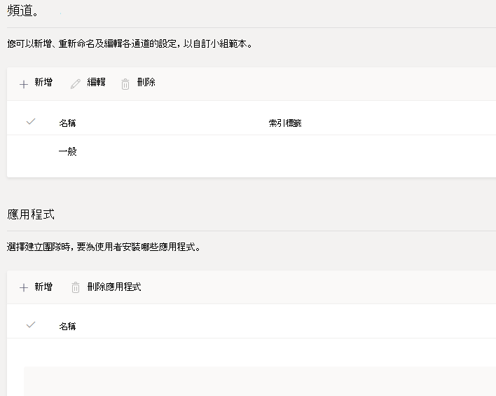
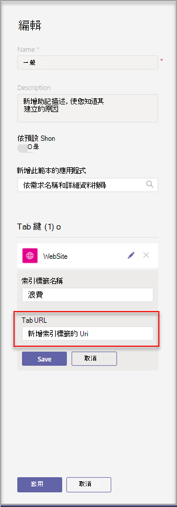
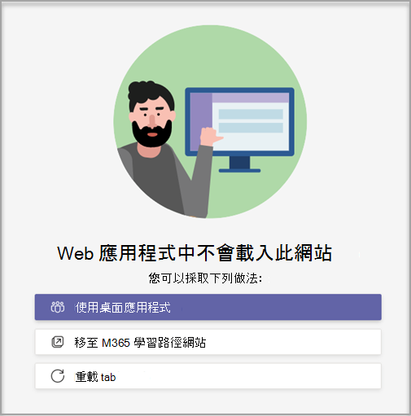

# 在 Microsoft Teams 中建立自訂團隊範本

**EDU 客戶尚未支援自訂範本。**

自訂團隊範本是具有一組頻道、索引標籤和應用程式的預先定義團隊結構。 您可以開發範本，協助您快速建立正確的共同作業空間。 您的自訂團隊範本會使用您慣用的設定。  

 

> [!VIDEO https://www.microsoft.com/en-us/videoplayer/embed/RE4P5rx]

若要開始使用：

1. 登入 Teams 系統管理中心。

2. 在左側導覽中，展開 **[Teams**  >  **Team 範本]**。

3. 選取 [新增 **]**。

    ![[團隊範本] 對話方塊的影像，其中醒目提示 [新增]。](media/team-templates-new.png)

4. 在 [ **團隊範本** ] 區段中，選取 [ **建立全新的範本]**。

5. 在 [ **範本設定** ] 區段中，完成下欄欄位，然後選取 [ **下一步]**：
    - 範本名稱
    - 範本簡短且冗長的描述
    - 地區設定可見度  

    ![[團隊範本設定] 命名對話方塊的影像。](media/template-add-a-name.png)

6. 在 [ **頻道、索引標籤和應用程式]** 區段中，新增團隊需要的任何頻道和應用程式。

    1. 在 [頻道 **]** 區段中，選取 [ **新增]**。
    2. 在 [ **新增** ] 對話方塊中，命名頻道。
    3. 新增描述。
    4. 決定通道是否應預設為顯示。
    5. 搜尋您要新增至頻道的應用程式名稱。
    6. 完成時，選取 **[套** 用]。

    

8. 完成時，選 **取 [送** 出]。

您的新範本會顯示在 **[團隊範本** ] 清單中。 範本可用來在 Teams 中建立團隊。

> [!Note]
> 團隊使用者最多可能需要 24 小時才能在圖庫中看到自訂範本變更。

## 自訂網站索引標籤應用程式

> [!Note]
> 這項功能處於早期預覽階段

建議您為自訂團隊範本中的頻道指定網站索引標籤的 URL。 使用範本建立小組的使用者，會擁有預設為指定網站 URL 的網站索引標籤。

若要開始使用：

1. 建立新的團隊範本或編輯現有的團隊範本。

2. 在 [頻道] 區段中，新增頻道或選取現有的頻道，然後選取 **[編輯]**。

3. 在 [ **為此範本新增應用程式** ] 區段中，新增網站應用程式。

    ![[新增此範本的應用程式] 選項。](media/add-an-app-template.png)

4. 選取編輯圖示並輸入您選擇的 URL。

    

5. 選 **取 [儲存** ] 以進行索引標籤應用程式編輯，然後選取 [ **套** 用] 以儲存變更。

## 已知的問題

**問題**：如果您是從包含其他自訂索引標籤的自訂範本建立小組，您可能會看到空白索引標籤取代自訂索引標籤應用程式。 您的預設索引標籤 (例如 **[文章**]、 **[檔案**] 和 [ **Wiki**) 會如預期般顯示。

**解決方案**：若要修正此問題，請移除自訂索引標籤，並使用相同的應用程式新增索引標籤。 如果您沒有移除自訂索引標籤並新增索引標籤的許可權，請連絡團隊擁有者以取得協助。

我們目前正在針對從自訂範本建立的未來團隊開發修正程式。

**問題**：在瀏覽器中使用Teams時，某些網站不支援在Teams索引標籤中顯示。

**解決方案**：如果您無法檢視網站索引標籤的內容，系統會將您重新導向至在另一個網頁中開啟索引標籤，或改為在傳統型應用程式中開啟Teams，以檢視您的網站索引標籤應用程式。

## 相關主題

- [在系統管理中心使用小組範本開始](get-started-with-teams-templates-in-the-admin-console.md)
- [從現有團隊建立範本](create-template-from-existing-team.md)
- [從現有的團隊範本建立團隊範本](create-template-from-existing-template.md)
