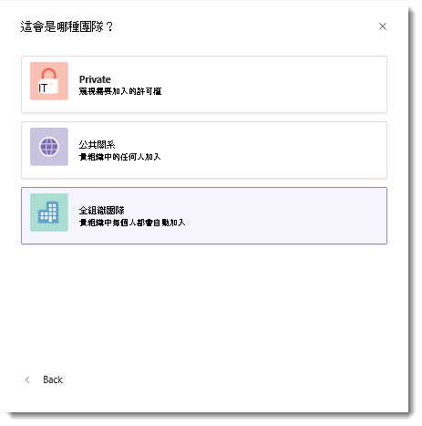

# 在 Microsoft Teams 中建立全組織小組Create an org-wide team in Microsoft Teams

全組織小組提供自動化方式，讓中小型組織中的每個人都成為單一小組的一部分來進行共同作業。Org-wide teams provide an automatic way for everyone in a small to medium-sized organization to be a part of a single team for collaboration.

透過全組織小組，全域系統管理員可以輕鬆建立一個公開的小組，將組織中的每個使用者都拉入，當使用者加入和離開組織時，讓成員資格能隨著 Active Directory 保持在最新狀態。With org-wide teams, global admins can easily create a public team that pulls in every user in the organization and keeps the membership up to date with Active Directory as users join and leave the organization. 只有全域管理員才能建立整個組織的團隊，而且目前組織範圍的小組僅限於5000使用者以外的組織。Only global admins can create org-wide teams and currently, an org-wide team is limited to organizations with no more than 5,000 users. 另外還有一個限制是，每個租用戶只能有五個全組織小組。There's also a limit of five org-wide teams per tenant. 如果符合這些需求，在建立小組時，全域系統管理員選取 [從頭建置小組]\*\*\*\* 時會看到 [全組織]\*\*\*\* 這個選項。If these requirements are met, global admins will see **Org-wide** as an option when they select **Build a team from scratch** when creating a team. 

建立組織範圍的小組後，所有全域管理員和團隊服務系統管理員都會新增為團隊擁有者，而所有作用中的使用者都會新增為小組成員。When an org-wide team is created, all global admins and Teams service administrators are added as team owners and all active users are added as team members. 未授權的使用者也會新增至小組。Unlicensed users are also added to the team. 未授權的使用者第一次登入小組時，系統會為該使用者指派 Microsoft 團隊探索性授權。The first time an unlicensed user signs in to Teams, the user is assigned a Microsoft Teams Exploratory license. 若要深入瞭解探索授權，請參閱 [管理 Microsoft 團隊探索性授權](teams-exploratory.md)。To learn more about the Exploratory license, check out [Manage the Microsoft Teams Exploratory license](teams-exploratory.md). 

您的全組織小組將不會新增下列帳戶類型：These types of accounts won't be added to your org-wide team:

- 被封鎖而無法登入的帳戶Accounts that are blocked from sign in
- 來賓使用者Guest users
- 服務帳戶Service accounts
- 會議室或設備帳戶Room or equipment accounts
- 共用信箱支援的帳戶Accounts backed by a shared mailbox

當貴組織的目錄更新為包含新的作用中使用者，或如果使用者已經不在您的公司工作，且已停用其帳戶時，則會自動同步處理變更，將使用者新增到小組中或從小組中移除。As your organization's directory is updated to include new active users or if users no longer work at your company and their account is disabled, changes are automatically synced and the users are added or removed from the team. 小組成員不能離開全組織小組。Team members can't leave an org-wide team. 如果您是小組擁有者，可以視需要手動新增或移除使用者。As a team owner, you can manually add or remove users if needed.

> [!NOTE]
> - 如果您在建立小組時沒有看到 **組織範圍** 選項，而您是全域系統管理員，則您可能已達到5個組織範圍的小組限制，或貴組織的目前大小限制超過5000個成員。If you don't see the **Org-wide** option when creating a team and you're a global admin, you might have reached the five org-wide teams limit, or your organization might have more than the current size limit of 5,000 members. 我們預計在未來增加這個限制。We're looking to increase this limit in the future. Teams 教育版目前無法使用全組織小組。Org-wide teams aren't yet available for Teams for Education.
> - 您可能將不屬於會議室清單、設備和資源帳戶的會議室新增或同步處理到全組織小組。Rooms that aren't a part of a room list, equipment, and resource accounts might be added or synced to the org-wide team. 小組擁有者可輕鬆地從小組移除這些帳戶。Team owners can easily remove these accounts from the team.
> - 系統新增或移除成員的所有動作會張貼在 [一般] 頻道。All actions by the system to add or remove members are posted in the General channel. 頻道也會標示為在 Teams 用戶端中有新的活動。The channel will also be marked as having new activity in the Teams client.
> - 如果貴組織剛開始使用 Teams，且具有不超過 5000 個使用者，我們會自動為貴組織建立全組織小組。We'll automatically create an org-wide team for your organization if your organization is new to Teams and has no more than 5,000 users. 小組名稱會反映租用戶名稱，並擁有 [一般] 頻道。The team name will reflect the tenant name and will have a General channel. 全域系統管理員可以像其他任何小組一樣編輯這個小組。Global admins can edit this team like any other team. 

## 最佳做法Best practices

為了充分發揮您的全組織小組功能，我們建議小組擁有者執行下列動作。To get the most out of your org-wide team, we recommend team owners do the following.

### 只允許小組擁有者張貼到 [一般] 頻道Allow only team owners to post to the General channel

只允許小組擁有者張貼到 [一般] 頻道，以減少頻道「紛擾」。Reduce channel noise by having only team owners post to the General channel. 移至團隊，找出 [一般] 頻道，然後選取 [ **̇̇̇其他選項**]  >  **管理頻道**。Go to the team, locate the General channel, and then select **˙˙˙ More options** > **Manage channel**. 按一下 [ **頻道設定** ] 索引標籤上的 [ **許可權**]，然後選取 [ **只有擁有者可以張貼郵件**]。On the **Channel settings** tab, click **Permissions**, and then select **Only owners can post messages**.

### 關閉 @team 和 @[小組名稱] 提及項目Turn off @team and @[team name] mentions

 降低 @mentions 使其不會讓整個組織超載。Reduce @mentions to keep them from overloading the entire organization. 移至小組，然後按一下 [更多選項]\*\*\*\*  >  [管理小組]\*\*\*\*。Go to the team and click **˙˙˙ More options** > **Manage Team**. 在 [設定]\*\*\*\* 索引標籤上，按一下 [@mentions]<strong></strong> > 關閉 [向成員顯示 @team 或 @[小組名稱] 選項]\*\*\*\*。On the **Settings** tab, click <strong>@mentions</strong> > turn off **Show members the option to @team or @[team name]**. 

### 自動顯示重要頻道Automatically show important channels

顯示重要的頻道以確保組織中的所有人都參與特定交談。Show important channels to ensure everyone in your organization engages in specific conversations. 如需深入了解，請參閱[自動將頻道加入我的最愛方便整個團隊使用](https://support.office.com/article/auto-favorite-channels-for-the-whole-team-a948272c-5aa5-429c-863c-4e1e1cd6b0f6)。To learn more, see [Auto-favorite channels for the whole team](https://support.office.com/article/auto-favorite-channels-for-the-whole-team-a948272c-5aa5-429c-863c-4e1e1cd6b0f6). 

### 設定頻道裁決Set up channel moderation

請考量設定頻道裁決，並為特定小組成員提供仲裁者功能。Consider setting up channel moderation and giving moderator capabilities to certain team members. (設定仲裁時，會自動將仲裁者功能提供給小組擁有者。) 仲裁者能控制頻道中誰可以開始新文章、新增和移除仲裁者、控制小組成員是否可以回覆現有的頻道訊息，以及控制 Bot 和連接器是否可以提交頻道訊息。(When moderation is set up, team owners are given moderator capabilities automatically.) Moderators can control who can start a new post in a channel, add and remove moderators, control whether team members can reply to existing channel messages, and control whether bots and connectors can submit channel messages. 如需詳細資訊，請參閱[在 Microsoft Teams 中設定和管理頻道仲裁](manage-channel-moderation-in-teams.md)。For more information, see [Set up and manage channel moderation in Microsoft Teams](manage-channel-moderation-in-teams.md).

### 移除可能不屬於的帳戶Remove accounts that might not belong

即使成員不能離開組織內的小組（作為小組擁有者），您還是可以移除不屬於的帳戶來管理團隊名單。Even though members can't leave an org-wide team, as a team owner, you can manage the team roster by removing accounts that don't belong. **請確認您使用 Teams 移除全組織小組中的使用者**。**Make sure you use Teams to remove users from your org-wide team**. 如果您使用其他方法 (例如 Microsoft 365 系統管理中心或從 Outlook 中的群組) 移除使用者，有可能會不小心將該使用者新增回全組織小組。If you use another way to remove a user, such as the Microsoft 365 admin center or from a group in Outlook, the user might be added back to the org-wide team.

## 常見問題集FAQ

### 有沒有使用 Teams 用戶端以外的建立全組織小組方法？Is there a way to create an org-wide team other than using the Teams client?

全域系統管理員只能使用 Teams 用戶端建立全組織小組。Global admins can only create an org-wide team by using the Teams client. 如果貴組織將建立小組限制為使用 PowerShell，建議的因應措施是將您的全域系統管理員新增至可建立小組的使用者安全性群組。If your organization limits creating teams to using PowerShell, the recommended workaround is to add your global admins to the security group of users who can create a team. 如需詳細資訊，請參閱 [管理可以建立群組的人員](https://docs.microsoft.com/microsoft-365/admin/create-groups/manage-creation-of-groups)。For more information, see [Manage who can create groups](https://docs.microsoft.com/microsoft-365/admin/create-groups/manage-creation-of-groups).

如果這不是選項，您可以使用 PowerShell 來建立公用小組，並將全域系統管理員新增為小組擁有者。If this isn't an option, you can use PowerShell to create a public team and add a global admin as the team owner. 然後，讓全域系統管理員按一下小組名稱旁的 [更多選項]\*\*\*\*，按一下 [編輯小組]\*\*\*\*，然後將隱私權變更為 [全組織 - 貴組織中的所有人都會自動新增]\*\*\*\*。Then, have the global admin click **More options** next to the team name, click **Edit team**, and then change the privacy to **Org-wide - Everyone in your organization will be automatically added**. 請注意，只有小組擁有者可以存取 [編輯小組]\*\*\*\* 選項，而且只有全域系統管理員才能查看 [全組織]\*\*\*\* 選項。Note that only team owners can access the **Edit team** option and only global admins can see the **Org-wide** option.

### 有沒有方法可以將現有的小組轉換成全組織小組？Is there a way to convert an existing team to an org-wide team?

全域系統管理員可以在 Teams 用戶端中編輯現有的小組，將其轉換成全組織小組。Global admins can convert an existing team to an org-wide team by editing it in Teams client. 移至小組名稱，按一下 [更多選項]\*\*\*\*  >  [編輯小組]\*\*\*\*。Go to the team name, click **More options** > **Edit team**.

### 我可以使用小組範本建立組織範圍的團隊嗎？Can I create an org-wide team using a team template?

小組範本不能用來建立整個組織的小組。Team templates can't be used to create an org-wide team. 目前正在進行此功能的工作。Work for this feature is currently in progress. 

## 另請參閱See also

觀看有關 [在 Microsoft 團隊中建立整個公司小組](https://support.office.com/article/037bb27a-bcc9-48fe-8d72-44d9482420a3)的影片。Watch a video about [creating a company-wide team in Microsoft Teams](https://support.office.com/article/037bb27a-bcc9-48fe-8d72-44d9482420a3).
