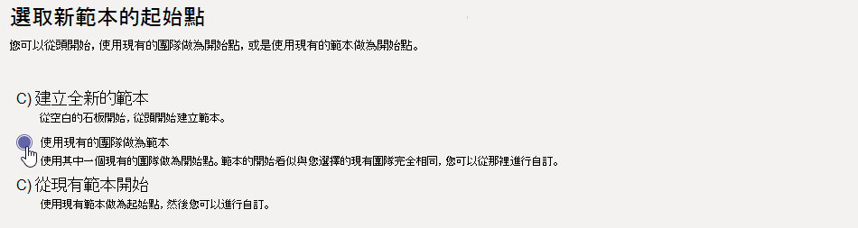

# 從現有的小組在 Microsoft TeamsCreate a team template from an existing team in Microsoft Teams

[!INCLUDE [preview-feature](includes/preview-feature.md)]

**EDU 客戶尚不支援自訂範本。****Custom templates are not yet supported for EDU customers.**

Microsoft Teams可讓您從現有的小組建立範本，該範本可以儲存及修改，以滿足您特定的組織需求。Microsoft Teams lets you create a template from an existing team that can be saved and modified to meet your particular organizational needs.

1. 登入 Teams 系統管理中心。Sign in to the Teams admin center.

2. 在左側流覽中，展開 **Teams**  >  **範本**。In the left navigation, expand **Teams** > **Team templates**.

3. 選取 [新增 **]**。Select **Add**.

4. 選取 **使用現有的團隊做為範本**，然後選取 下 **一步**。Select **Use an existing team as a template**, and select **Next**.

 

5. 選取團隊名稱旁的以做為起點的小組，然後選取下一 **步**。Select a team to use as a starting point by selecting next to the team name, and then select **Next**.

6. 在範本 **設定區** 段，完成下欄欄位，然後選取下 **一步**：In the **Template settings** section, complete the following fields and then select **Next**:
    - 範本名稱Template name
    - 範本簡短和長描述Template short and long descriptions
    - 地區設置可見度Locale visibility  
  
7. 在 **頻道、定位字元和應用程式** 區段，新增小組所需的任何頻道和應用程式。In the **channels, tabs, and apps** section, add any channels and apps that your team needs.

    1. 在頻道 **區** 段 **，選取** 新增 。In the **Channels** section, select **Add**.
    2. 在 [ **新增」** 對話方塊中，為頻道命名。In the **Add** dialog, name the channel.
    3. 新增描述。Add a description.
    4. 決定是否應該預設顯示頻道。Decide if the channel should be shown by default.
    5. 搜尋要新加入頻道的應用程式名稱。Search for an app name that you want to add to the channel.
    6. 完成 **時選取 Apply。**Select **Apply** when finished.

8. 選取 **提交** 以儲存您的變更。Select **Submit** to save your changes.

您的新範本會顯示在小組 **範本** 清單中。Your new template is displayed in the **Team templates** list. 範本可用來在 Teams 中建立Teams。The template can be used to create a team in Teams.

> [!Note]
> 團隊使用者最多可能需要 24 小時，才能在圖庫中查看自訂範本。It can take up to 24 hours for teams users to see a custom template in the gallery.

## 相關文章Related articles

- [在系統管理中心開始使用小組範本Get started with team templates in the admin center](get-started-with-teams-templates-in-the-admin-console.md)
- [從現有的小組範本建立範本Create a template from an existing team template](create-template-from-existing-template.md)
- [建立小組範本Create a team template](create-a-team-template.md)
