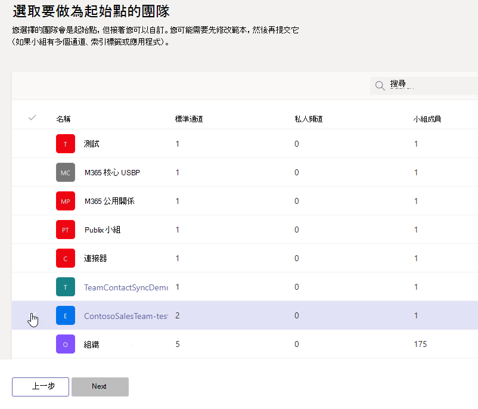

# 從 Microsoft 團隊中的現有小組建立範本Create a template from an existing team in Microsoft Teams

[!INCLUDE [template](includes/preview-feature.md)]

**EDU 客戶尚不支援自訂範本。****Custom templates are not yet supported for EDU customers.**

Microsoft 團隊可讓您從現有的小組建立範本，以符合您特定組織的需求。Microsoft Teams lets you create a template from an existing team that can be saved and modified to meet your particular organizational needs.

1. 登入 [小組] 管理中心。Log in to the Teams admin center.

2. 在左側導覽中，展開 [**團隊**  >  **小組範本**]。In the left navigation, expand **Teams** > **Team templates**.

3. 按一下 [ **新增**]。Click **Add**.

4. 選取 [ **使用現有的團隊做為範本**]，然後按 **[下一步]**。Select **Use an existing team as a template**, and click **Next**.

 

5. 按一下團隊名稱旁的，然後按一下 **[下一步]**，選取要做為起點的團隊。Select a team to use as a starting point by clicking next to the team name, and then click **Next**.

6. 在 [ **範本設定** ] 區段中，填寫下欄欄位，然後按 **[下一步]**：In the **Template settings** section, complete the following fields and then click **Next**:
    - 範本名稱Template name
    - 範本簡要與詳細描述Template short and long descriptions
    - 地區可視性Locale visibility  
  
7. 在 [ **頻道]、[索引標籤] 和 [應用程式]** 區段中，新增您團隊所需的任何通道和 app。In the **channels, tabs, and apps** section, add any channels and apps that your team needs.

    1. 在 [ **頻道** ] 區段中，按一下 [ **新增**]。In the **Channels** section, click **Add**.
    2. 在 [ **新增** ] 對話方塊中，命名頻道。In the **Add** dialog, name the channel.
    3. 新增描述。Add a description.
    4. 決定是否要依預設顯示頻道。Decide if the channel should be shown by default.
    5. 搜尋您想要 addd 到頻道的 app 名稱。Search for an app name that you want to addd to the channel.
    6. 完成 **後，按一下 [** 套用]。Click **Apply** when finished.

8. 按一下 [ **提交** ] 以儲存您的變更。Click **Submit** to save your changes.

您的新範本會顯示在 [ **團隊範本** ] 清單中。Your new template is displayed in the **Team templates** list. 範本可用於在團隊中建立團隊。The template can be used to create a team in Teams.

## 相關文章Related articles

- [在系統管理中心開始使用團隊範本Get started with team templates in the admin center](get-started-with-teams-templates-in-the-admin-console.md)
- [從現有的小組範本建立範本Create a template from an existing team template](create-template-from-existing-template.md)
- [建立小組範本Create a team template](create-a-team-template.md)
