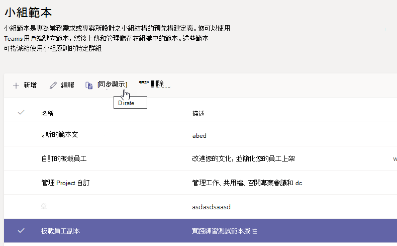

# 從現有的小組範本在 Microsoft TeamsCreate a new team template from an existing team template in Microsoft Teams

**EDU 客戶尚不支援自訂範本。****Custom templates are not yet supported for EDU customers.**

Microsoft Teams提供預先建建的範本，您可以儲存及修改範本，以滿足您特定的組織需求。Microsoft Teams provides pre-built templates that can be saved and modified to meet your particular organizational needs.

1. 登入 Teams 系統管理中心。Sign in to the Teams admin center.

2. 在左側流覽中，展開 **Teams**  >  **範本**。In the left navigation, expand **Teams** > **Team templates**.

3. 在小組 **範本區** 段，選取您想要複製的團隊範本旁，以將其突顯。In the **Team templates** section, select next to a team template that you want to duplicate to highlight it.

4. 選取 **重複**。Select **Duplicate**.

 (，您也可以選取使用現有範本新增開始，以開啟 選取要作為起點的範本  > \ \*\*\**。) (Alternatively, you can select **Add** > **Start with an existing template** to open **Select the template to use as a starting point**.)

5. 在選取 **要作為起點的** 範本畫面中，選取下 **一步**。In the **Select the template to use as a starting point** screen, select **Next**.

    複製的範本隨即開啟， **而複製一** 詞會附加到名稱中。The duplicated template opens, and the word **Copy** is appended to the name.

6. 完成下欄欄位，然後選取下 **一步**：Complete the following fields and then select **Next**:
    - 範本名稱Template name
    - 範本簡短和長描述Template short and long descriptions
    - 地區設置可見度Locale visibility  

7. 在頻道 **、選項卡和應用程式** 區段，修改小組需要的任何現有頻道和應用程式。In the **channels, tabs, and apps** section, modify any existing channels and apps that your team needs.

    1. 選取要編輯的頻道， **然後選取** 編輯 。Select a channel to edit, and select **Edit**.
    2. **完成** 時，請申請變更。**Apply** your changes when finished.

8. 新增小組所需的任何頻道或應用程式。Add any channels or apps that your team needs.

    1. 在頻道 **區** 段 **，選取** 新增 。In the **Channels** section, select **Add**.
    2. 在 [ **新增」** 對話方塊中，為頻道命名。In the **Add** dialog, name the channel.
    3. 新增描述。Add a description.
    4. 決定是否應該預設顯示頻道。Decide if the channel should be shown by default.
    5. 搜尋要新加入頻道的應用程式名稱。Search for an app name that you want to add to the channel.
    6. 完成 **時選取 Apply。**Select **Apply** when finished.

7. 當您 **完成新增** 頻道和應用程式時，請選取提交。Select **Submit** when you're finished adding channels and apps.

    新範本會儲存至範本庫。The new template is saved to the template library.

> [!Note]
> 團隊使用者最多可能需要 24 小時，才能在圖庫中查看自訂範本。It can take up to 24 hours for teams users to see a custom template in the gallery.

## 相關文章Related articles

- [在系統管理中心開始使用小組範本Get started with team templates in the admin center](get-started-with-teams-templates-in-the-admin-console.md)
- [從現有的小組建立範本Create a template from an existing team](create-template-from-existing-team.md)
- [建立小組範本Create a team template](create-a-team-template.md)