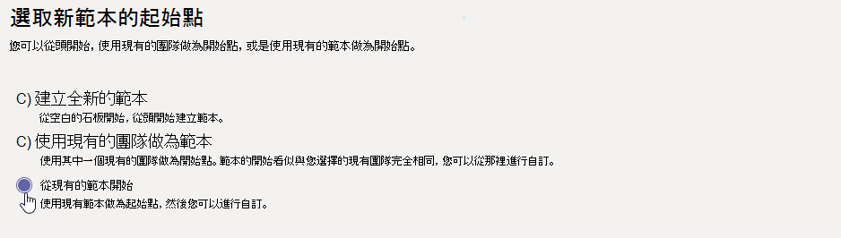

# 從 Microsoft 團隊中的現有小組範本建立新範本Create a new template from an existing team template in Microsoft Teams

[!INCLUDE [template](includes/preview-feature.md)]

**EDU 客戶尚不支援自訂範本。****Custom templates are not yet supported for EDU customers.**

Microsoft 團隊提供預先建立的範本，可供您儲存及修改以符合您特定的組織需求。Microsoft Teams provides pre-built templates that can be saved and modified to meet your particular organizational needs.

1. 登入 [小組] 管理中心。Log in to the Teams admin center.

2. 在左側導覽中，展開 [**團隊**  >  **小組範本**]。In the left navigation, expand **Teams** > **Team templates**.

3. 在 [ **小組範本** ] 區段中，按一下您要複製之範本旁邊的，以醒目提示該範本。In the **Team templates** section, click next to a template that you want to duplicate to highlight it.

4. 按一下 [ **複製**]。Click **Duplicate**.

![[團隊範本] 對話方塊的影像，其中醒目提示 [新增]。](media/template-duplicate.png)

 (或者，您可以按一下**Add**  >  **現有範本的**[新增開始]，開啟 [**選取要用來做為起點的範本**] 畫面。 ) (Alternatively, you can click **Add** > **Start with an existing template** to open the **Select the template to use as a starting point** screen.)

5. 在 [ **選取要用來做為起點的範本** ] 畫面中，按一下 **[下一步]**。In the **Select the template to use as a starting point** screen, click **Next**.

    重複的範本隨即開啟，並將 [ **複本** ] 附加到名稱上。The duplicated template opens, and the word **Copy** is appended to the name.

6. 完成下欄欄位，然後按 **[下一步]**：Complete the following fields and then click **Next**:
    - 範本名稱Template name
    - 範本簡要與詳細描述Template short and long descriptions
    - 地區可視性Locale visibility  

7. 在 [ **頻道]、[索引標籤] 和 [應用程式]** 區段中，修改您團隊所需的任何現有通道和應用程式。In the **channels, tabs, and apps** section, modify any existing channels and apps that your team needs.

    1. 選取要編輯的頻道，然後按一下 [ **編輯**]。Select a channel to edit, and click **Edit**.
    2. **在完成時套用您的** 變更。**Apply** your changes when finished.

8. 新增您團隊所需的任何頻道或應用程式。Add any channels or apps that your team needs.

    1. 在 [ **頻道** ] 區段中，按一下 [ **新增**]。In the **Channels** section, click **Add**.
    2. 在 [ **新增** ] 對話方塊中，命名頻道。In the **Add** dialog, name the channel.
    3. 新增描述。Add a description.
    4. 決定是否要依預設顯示頻道。Decide if the channel should be shown by default.
    5. 搜尋您想要 addd 到頻道的 app 名稱。Search for an app name that you want to addd to the channel.
    6. 完成 **後，按一下 [** 套用]。Click **Apply** when finished.

7. 完成新增頻道和應用程式後，請按一下 [ **提交** ]。Click **Submit** when you're finished adding channels and apps.

    新範本會儲存在範本庫中。The new template is saved to the template library.

## 相關文章Related articles

- [在系統管理中心開始使用團隊範本Get started with team templates in the admin center](get-started-with-teams-templates-in-the-admin-console.md)
- [從現有團隊建立範本Create a template from an existing team](create-template-from-existing-team.md)
- [建立小組範本Create a team template](create-a-team-template.md)