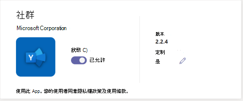

# 在貴組織的 Teams store 中自訂應用程式的外觀

Microsoft Teams 可讓系統管理員自訂 Teams 應用程式，以增強 Microsoft Store 體驗並遵守組織品牌。 應用程式開發人員可以允許 Teams 系統管理員自訂其應用程式。接著，您可以在 Teams 系統管理中心的 [管理應用程式] 頁面中，根據組織需求更新應用程式屬性。 您可以自訂的詳細資料如下：

* 簡短名稱
* 簡短描述
* 完整描述
* 隱私權原則 URL
* 網站 URL
* 使用規定 URL
* 應用程式圖示
* 圖示的大綱色彩
* 強調色

如需應用程式各種中繼資料欄位的資訊，請參閱開發人員文件中的 [Teams 資訊清單結構描述](/microsoftteams/platform/resources/schema/manifest-schema)。

> [!NOTE]
> 您無法在任何組織中自訂側載的應用程式。 您無法在政府社群雲端進階版 (GCCH) 或美國國防部 (DoD) 雲端中自訂任何應用程式。

## 自訂應用程式的詳細資料

若要自訂應用程式，請完成下列步驟：

1. 登入 Teams 系統管理中心。

1. 展開 **[Teams 應用程式]**，然後選取 **[[管理應用程式]](https://admin.teams.microsoft.com/policies/manage-apps)**。

1. 檢查應用程式清單的 **[可自訂]** 欄位，並依可自訂的應用程式排序。

   

   存取自訂功能有三個進入點：

   * 在要自訂的應用程式旁進行選取，然後選取 **[自訂]**。

     

   * 選取應用程式名稱，然後在 **[可自訂]** 中選取編輯圖示。

     

   * 選取應用程式名稱，按一下 **溢位功能表**，將游標停留在 **[動作]** 上，然後選取自訂。

     

1. 展開 **[詳細資料]** 區段並自訂下列一或多個欄位。 您就會看見由開發人員指定為可自訂的欄位。

    * 簡短名稱
    * 簡短描述
    * 完整描述
    * 網站
    * 隱私權原則 URL
    * 使用規定 URL

   

1. 展開 **[圖示]** 區段。

1. 上傳圖示。 使用 PNG 格式的圖示 (192 x 192 像素)。

1. 選擇圖示外框色彩。 使用 PNG 格式的透明外框 (32 x 32 像素)。

1. 選取符合圖示的應用程式輔色。

   

1. 自訂應用程式之後，選取 **[套用]**。

1. 選取 **[發佈]** 以發佈自訂的應用程式。

   自訂的應用程式現在會列在您的 **[管理應用程式]** 頁面中。 您將只擁有單一個版本的應用程式，因為自訂的應用程式功能無法建立應用程式的複本。

現在，您的 Teams 使用者可以在用戶端中看到自訂的應用程式。

   

請注意下列關於自訂應用程式的詳細資料：

* 當您自訂應用程式，以及與應用程式相關的任何描述時，請確定您遵循任何由應用程式開發人員在其文件或使用規定中所提供的自訂指導方針。 您也有責任尊重其他人對於您可能使用之任何協力廠商影像的權利。

* 管理員所提供的自訂資料會儲存在最接近的地區。

* 您有責任確保使用規定或隱私權原則的連結有效。

* 如果應用程式開發人員不再允許可自訂欄位，應用程式詳細資料頁面上會出現一則訊息，通知系統管理員無法再自訂的欄位。 對該欄位進行的所有變更將會還原為原始值。

* 建議您先在 Teams 測試租用戶中測試應用程式自訂變更，然後才在生產環境中進行這些變更。

* 品牌變更可能需要最多 24 小時的時間，才能傳播至所有使用者。

* 開發人員可以提供應用程式的新版本，讓應用程式可以自訂。 您上傳新版本，並移除舊版的應用程式。 如果您已自訂並發布應用程式，使用應用程式自訂功能自訂的新應用程式無法取代目前的應用程式。

* Teams 系統管理中心的 [應用程式使用情況報告](teams-analytics-and-reports/app-usage-report.md) 會顯示發行者所提供的應用程式原始名稱。

* Microsoft Graph 權限同意對話方塊會顯示發行者所提供的應用程式原始名稱。 它可協助您正確識別應用程式，同時提供其權限。

## 檢視應用程式詳細資料

您可能會想要查看應用程式詳細資料以檢閱資訊。

1. 登入 Teams 系統管理中心。

1. 展開 **[Teams 應用程式]**，然後選取 **[[管理應用程式]](https://admin.teams.microsoft.com/policies/manage-apps)**。

1. 選取應用程式名稱。

1. 檢視應用程式詳細資料，包括原始應用程式名稱 **發行者的簡短名稱**。

   

   只有當您已變更應用程式的簡短名稱時，才會顯示 **[來自發行者的簡短名稱]** 欄位。

## 將應用程式詳細資料重設為預設值

您可以將應用程式詳細資料重設為應用程式開發人員提供的原始值。 此選項僅適用於您自訂的應用程式。

1. 在 Teams 系統管理中心，存取 **Teams 應用程式** > **[管理應用程式](https://admin.teams.microsoft.com/policies/manage-apps)**。

1. 選取應用程式名稱。

1. 從 **[動作]** 功能表選取 **[重設為預設值]**。

   ![選取已醒目提示的 [重設為預設值]。](media/select-reset.png)

## 相關文章

* [管理應用程式](manage-apps.md)
* [打造貴組織的應用程式市集](customize-your-app-store.md)
* [重塑您的應用程式](https://techcommunity.microsoft.com/t5/microsoft-teams-blog/rebrand-apps-to-your-own-organization-s-branding-with-app/ba-p/2376296)
