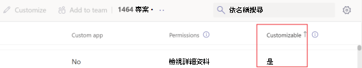
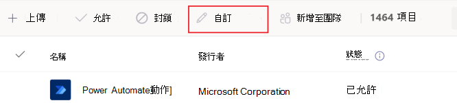
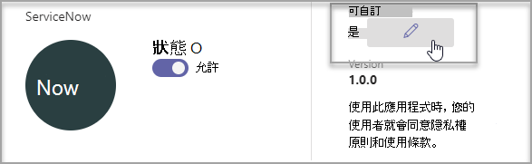
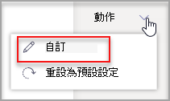
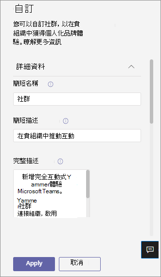
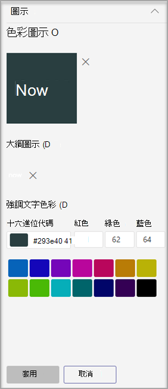
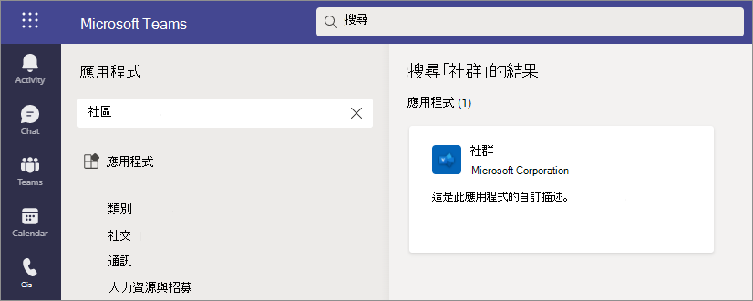
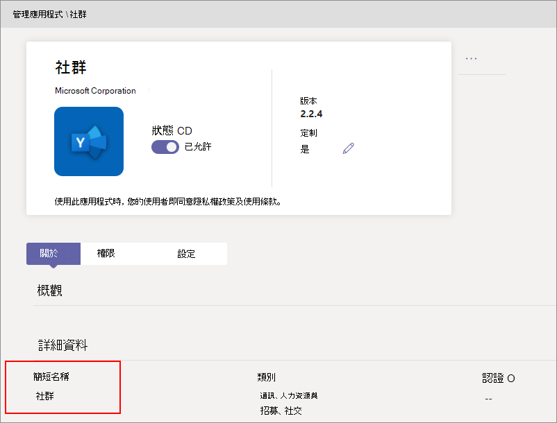
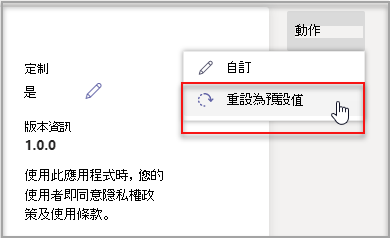

# 在應用程式中自訂Microsoft TeamsCustomize apps in Microsoft Teams

 Microsoft Teams應用程式自訂功能，以增強Teams體驗。Microsoft Teams provides app customization to enhance the Teams experience. 有些應用程式開發人員允許系統管理員自訂Teams應用程式。管理員可以使用系統管理中心管理應用程式頁面，根據組織需求自訂或重新Teams **應用程式** 屬性。Some app developers allow an app to be customized by the Teams admin. The admin can customize or rebrand the app properties based on the organizational needs using the Teams admin center **Manage apps** page. 您可以自訂的詳細資訊有：The details you can customize are:

- 簡短名稱Short name
- 簡短描述Short description
- 完整描述Full description
- 隱私權政策 URLPrivacy policy URL
- 網站 URLWebsite URL
- 使用條款 URLTerms of use URL
- 色彩圖示Color icon
- 大綱圖示Outline icon
- 強調色彩Accent color

請參閱Teams清單[架構](https://docs.microsoft.com/microsoftteams/platform/resources/schema/manifest-schema)，以瞭解有關您可以自訂之欄位的詳細資訊。See the [Teams Manifest schema](https://docs.microsoft.com/microsoftteams/platform/resources/schema/manifest-schema) for details about the fields that you can customize.

> [!NOTE]
> 目前，在 政府社群雲端 GCCH (或) DoD (不支援自訂應用程式) 。Customizing apps isn't supported in Government Community Cloud High (GCCH) or Department of Defense (DoD) at this time.

## 自訂應用程式詳細資料Customize the app's details

若要開始自訂應用程式，請完成下列步驟：To start customizing an app, complete the following steps:

1. 登入 Teams 系統管理中心。Sign in to the Teams admin center.
2. 展開 **Teams應用程式**，然後選取 **管理應用程式**。Expand **Teams Apps** and select **Manage apps**.
3. 檢查應用程式 **清單** 的可自訂欄，並按可自訂的應用程式排序。Check the **Customizable** column of the apps list and sort by apps that are customizable.

   

   有三個進入點可存取自訂功能：There are three entry points to access the customize feature:

   - 選取要自訂之應用程式旁的 ， **然後選取** 自訂 。Select next to the app that you want to customize, and then select **Customize**.

     

   - 選取應用程式名稱，然後選取可 **自訂**。Select the app name and then **Customizable**.

     

   - 選取應用程式名稱， **然後從動作** 下拉下拉選取 **自訂** 。Select the app name, and then select **Customize** from the **Actions** dropdown.

     

4. 展開詳細 **資料** 區段並自訂下欄欄位：Expand the **Details** section and customize the following fields:

    - 簡短名稱Short name
    - 簡短描述Short description
    - 完整描述Full description
    - 網站Website
    - 隱私權政策 URLPrivacy policy URL
    - 使用條款 URLTerms of use URL

   

> [!Note]
> 只會顯示 App 開發人員指派為可自訂的欄位。Only the fields that the app developer has assigned as customizable will be visible.

5. 展開圖示 **區** 段。Expand the **Icon** section.

   a.a. Upload圖示。Upload an icon. 在 PNG 格式的 192x192 (圖元) 全色圖示。Use one full-color icon (192x192) pixel in PNG format.

   b.b. 選擇圖示外邊框色彩。Choose an icon outline color. 使用一個 32x32 (32x32) PNG 格式的透明外邊框。Use one transparent outline (32x32) pixel in PNG format.

   C。c. 選取符合圖示的應用程式強調色彩。Select an app accent color that matches the icon.

    

6. 自訂應用程式之後，請選取 **Apply**。Once your app has been customized, select **Apply**.

7. 選取 **發佈** 以發佈自訂的應用程式。Select **Publish** to publish the customized app.

   自訂的應用程式現在會列在您的管理 **應用程式頁面中** 。The customized app is now listed in your **Manage apps** page. 由於自訂應用程式功能不會建立應用程式的副本，因此您只會擁有一個版本的應用程式。You'll have only one version of the app, since customizing the app features doesn't create a copy of the app.

現在您的Teams使用者可以開啟其Teams用戶端以查看自訂的應用程式。Now your Teams end users can open their Teams client to see the customized app.

   

### 自訂應用程式的特殊考慮Special considerations for customizing an app

下列附注包含自訂應用程式的重要詳細資料。The following note includes important details about customizing an app.

> [!Note]
> - 當您自訂應用程式，以及任何與應用程式相關的描述時，請確保遵循應用程式發行者在檔或使用條款中提供的任何自訂指導方針。When you customize apps, and any description related to an app, ensure that you follow any customization guidelines if provided by the app publisher in their documentation or terms of use. 您也有責任尊重其他人對於您可能使用之任何協力廠商影像的權利。You're also responsible for respecting the rights of others regarding any third-party images you might use.
> - 系統管理提供的自訂資料會儲存在最近的地區。Admin-provided customization data is stored in the nearest region.
> - 您負責確保使用條款或隱私權政策的連結有效。You are responsible for ensuring that links to terms of use or privacy policy are valid.
> - 如果應用程式發行者不再允許欄位可自訂，應用程式詳細資料頁面上會出現一則訊息，通知系統管理員無法再自訂的欄位。In case the app publisher no longer allows a field to be customizable, a message appears on the app details page notifying the admin about the fields that can't be customized any longer. 對該欄位進行的所有變更都會還原為原始值。All the changes made to that field will be reverted to the original values.
> - 變更商標可能需要最多 24 小時，使用者才能看到變更。Changes to branding might require up to 24 hours for the users to see the changes.

## 查看應用程式詳細資料Review app details

您可能會想要查看應用程式詳細資料，以檢查資訊。You might want to see the app details to review the information.

1. 登入 Teams 系統管理中心。Sign in to the Teams admin center.

2. 展開 [Teams 應用程式 **]**，然後選取 [管理應用程式 **]**。Expand **Teams apps** and select **Manage apps**.

3. 選取應用程式名稱。Select the app name.

4. 查看應用程式詳細資料，包括原始應用程式名稱 **Publisher 的簡短名稱**。View the app details, including the original app name **Short name from publisher**.

   

   只有 **您變更了** 應用程式的簡短名稱，才能看到來自發行者欄位的簡短名稱。The **Short name from publisher** field is only visible if you've changed the app's short name.

## 將應用程式詳細資料重設為預設值Reset app details to default

您隨時都可以將應用程式詳細資料重設為原始設定。At any time, you can reset the app details to the original settings.

1. 登入 Teams 系統管理中心。Sign in to the Teams admin center.

2. 展開 **Teams應用程式**，然後選取 **管理應用程式**。Expand **Teams Apps** and select **Manage apps**.

3. 選取應用程式名稱。Select the app name.

4. 從 **動作下拉下** 拉選取預設值。Select **Reset to default** from the **Actions** dropdown.

   

## 常見問題集Frequently asked questions

**我的使用者需要多久時間查看自訂的應用程式？****How long will it take for my users to see the customized app?**

雖然系統管理員可以在系統管理中心Teams變更，但使用者最多可能需要 24 小時才能看到變更。Although the admin can immediately see the changes in Teams Admin Center, it might take up to 24 hours for the end users to see the changes.  

**應用程式提供者可以為客戶自訂應用程式嗎？****Can the app provider customize the app for its customers?**

 否，租使用者系統管理員需要使用系統管理中心自訂租使用者Teams應用程式。No, the admin of a tenant needs to customize the app for their tenant using the Teams Admin Center.

**自訂的應用程式會自動部署以取代租使用者中的目前自訂應用程式嗎？****Will the customized app automatically get deployed to replace my current custom app in a tenant?**

否，租使用者系統管理員必須手動移除任何自訂應用程式，併發布自訂版本的應用程式。No, the tenant admins will have to manually remove any custom app and publish the customized version of the app. 如果您自訂應用程式並將其發佈為自訂應用程式，使用 App 自訂功能自訂的新應用程式無法取代目前的自訂應用程式。If you have customized an app and published it as a custom app, the new app customized using the app customization feature won't replace the current custom app.  

**應用程式使用方式報告也會顯示自訂的值 ，例如自訂的簡短名稱嗎？****Will the app usage report also show the customized values such as customized short name?**

 否，應用程式使用方式報告仍然會顯示從發行者寄來的應用程式原始名稱。No, the app usage report will still show the original name of the app sent from the publisher.

**我可以使用應用程式自訂功能自訂哪些應用程式？****Which apps can I customize using the app customization feature?**

您只可以自訂應用程式發行者允許可自訂的應用程式。You can only customize apps that have been allowed to be customizable by the app publisher. 應用程式發行者必須加入宣告，允許其客戶自訂應用程式。The app publisher will need to opt in to allow its customers to customize the app.

**自訂屬性會顯示在圖形許可權同意畫面上嗎？****Will the customized properties show up on the graph permission consent screen?**

否，許可權同意畫面仍然會顯示發行者所寄的原始值。No, the permission consent screen will still show the original value sent by the publisher.

## 相關文章Related article

- [管理應用程式Manage apps](manage-apps.md)
- [自訂您的 App StoreCustomize your app store](customize-your-app-store.md)
