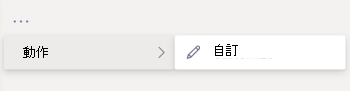
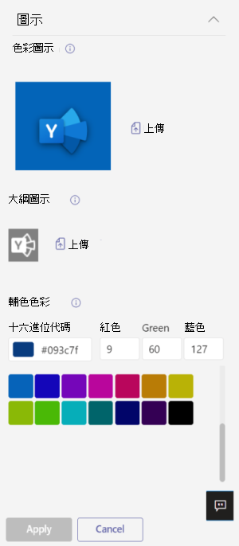

# 在應用程式中自訂Microsoft Teams

 Microsoft Teams應用程式自訂功能，以增強Teams體驗。 有些應用程式開發人員允許系統管理員自訂Teams應用程式。管理員可以使用系統管理中心管理應用程式頁面，根據組織需求自訂或重新Teams **應用程式** 屬性。 您可以自訂的詳細資訊有：

- 簡短名稱
- 簡短描述
- 完整描述
- 隱私權政策 URL
- 網站 URL
- 使用條款 URL
- 色彩圖示
- 大綱圖示
- 強調色彩

請參閱Teams清單[架構](/microsoftteams/platform/resources/schema/manifest-schema)，以瞭解有關您可以自訂之欄位的詳細資訊。

> [!NOTE]
> 目前不支援在 政府社群雲端 (GCCH) 或 (DoD) 自訂應用程式。

## 自訂應用程式詳細資料

若要開始自訂應用程式，請完成下列步驟：

1. 登入 Teams 系統管理中心。
2. 展開 **Teams 應用程式**，然後選取 **管理應用程式**。
3. 檢查應用程式 **清單** 的可自訂欄，並按可自訂的應用程式排序。

   

   有三個進入點可存取自訂功能：

   - 選取要自訂之應用程式旁的 ， **然後選取** 自訂 。

     

   - 選取應用程式名稱，然後選取可 **自訂**。

     

   - 選取應用程式名稱， **然後從動作** 下拉下拉選取 **自訂** 。

     

4. 展開詳細 **資料** 區段並自訂下欄欄位：

    - 簡短名稱
    - 簡短描述
    - 完整描述
    - 網站
    - 隱私權政策 URL
    - 使用條款 URL

   

> [!Note]
> 只有應用程式開發人員已指派為可自訂的欄位才能顯示。

5. 展開圖示 **區** 段。

   a. Upload圖示。 在 PNG 格式的 192x192 (圖元) 全色圖示。

   b. 選擇圖示外邊框色彩。 使用一個 32x32 (32x32) PNG 格式的透明外邊框。

   C。 選取符合圖示的應用程式強調色彩。

    

6. 自訂應用程式之後，請選取 **Apply**。

7. 選取 **發佈** 以發佈自訂的應用程式。

   自訂的應用程式現在會列在您的管理 **應用程式頁面中** 。 由於自訂應用程式功能不會建立應用程式的副本，因此您只會擁有一個版本的應用程式。

現在您的Teams使用者可以開啟其Teams用戶端以查看自訂的應用程式。

   

### 自訂應用程式的特殊考慮

下列附注包含自訂應用程式的重要詳細資料。

> [!Note]
> - 當您自訂應用程式，以及任何與應用程式相關的描述時，請確保遵循應用程式發行者在檔或使用條款中提供的任何自訂指導方針。 您也有責任尊重其他人對於您可能使用之任何協力廠商影像的權利。
> - 系統管理提供的自訂資料會儲存在最近的地區。
> - 您負責確保使用條款或隱私權政策的連結有效。
> - 如果應用程式發行者不再允許欄位可自訂，應用程式詳細資料頁面上會出現一則訊息，通知系統管理員無法再自訂的欄位。 對該欄位進行的所有變更都會還原為原始值。
> - 我們建議您在測試租使用者Teams測試應用程式自訂變更，然後再在生產環境中進行這些變更。
> - 變更商標可能需要最多 24 小時，使用者才能看到變更。

## 查看應用程式詳細資料

您可能會想要查看應用程式詳細資料，以檢查資訊。

1. 登入 Teams 系統管理中心。

2. 展開 [Teams 應用程式 **]**，然後選取 [管理應用程式 **]**。

3. 選取應用程式名稱。

4. 查看應用程式詳細資料，包括原始應用程式名稱 **Publisher 的簡短名稱**。

   

   只有 **您變更了** 應用程式的簡短名稱，才能看到來自發行者欄位的簡短名稱。

## 將應用程式詳細資料重設為預設值

您隨時都可以將應用程式詳細資料重設為原始設定。

1. 登入 Teams 系統管理中心。

2. 展開 **Teams 應用程式**，然後選取 **管理應用程式**。

3. 選取應用程式名稱。

4. 從 **動作下拉下** 拉選取預設值。

   

## 常見問題集

**我的使用者需要多久時間查看自訂的應用程式？**

雖然系統管理員可以在系統管理中心Teams變更，但使用者最多可能需要 24 小時才能看到變更。  

**應用程式提供者可以為客戶自訂應用程式嗎？**

 否，租使用者系統管理員需要使用系統管理中心自訂租使用者Teams應用程式。

**自訂的應用程式會自動部署以取代租使用者中的目前自訂應用程式嗎？**

否，租使用者系統管理員必須手動移除任何自訂應用程式，併發布自訂版本的應用程式。 如果您自訂應用程式並將其發佈為自訂應用程式，使用 App 自訂功能自訂的新應用程式無法取代目前的自訂應用程式。  

**應用程式使用方式報告也會顯示自訂的值 ，例如自訂的簡短名稱嗎？**

 否，應用程式使用方式報告仍然會顯示從發行者寄來的應用程式原始名稱。

**我可以使用應用程式自訂功能自訂哪些應用程式？**

您只可以自訂應用程式發行者允許可自訂的應用程式。 應用程式發行者必須加入宣告，允許其客戶自訂應用程式。

**自訂屬性會顯示在圖形許可權同意畫面上嗎？**

否，許可權同意畫面仍然會顯示發行者所寄的原始值。

## 相關文章

- [管理應用程式](manage-apps.md)
- [自訂您的 App Store](customize-your-app-store.md)
- [重新品牌您的應用程式](https://techcommunity.microsoft.com/t5/microsoft-teams-blog/rebrand-apps-to-your-own-organization-s-branding-with-app/ba-p/2376296)
