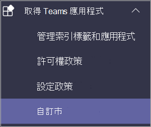
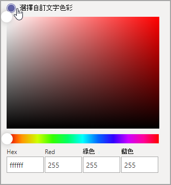
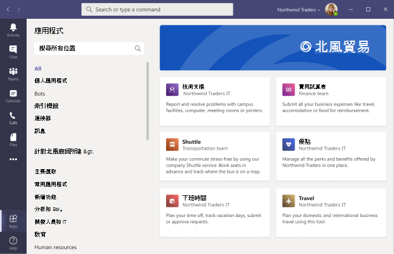

# 自訂應用程式儲存在 Microsoft Teams

現在，您可以新增標誌、自訂背景和自訂文字色彩，以在 Teams 中自訂貴組織的應用程式存放區，使其更吸引使用者。

> [!Note]
> 品牌變更需要 24 小時才能生效。

您可以選取自訂應用程式自訂市Teams **管理中心**  >  **中的自訂市場**。

  

本文將說明自訂應用程式儲存功能，以及如何使用這些功能。

## 自訂貴組織標誌

<!-- Bookmark used by Context Sensitive Help (CSH). Do not delete. -->

<!-- Do not remove the bookmark link above. -->

您可以在這裡上傳貴組織標誌。 選取的商標會出現在 Teams租使用者版 **應用程式**  >  **頁面中** 的用戶端中。

當您選取選擇 **圖片選項** 時，您可以上傳您所選擇的檔案。 標誌應為 240x60，否則會縮放至該大小。 它不應大於 5 MB。 支援的格式為：

- .svg
- .png
- .jpg

標誌會顯示在市集的租使用者應用程式目錄的右上角Teams顯示。

## 自訂您的小標誌

<!-- Bookmark used by Context Sensitive Help (CSH). Do not delete. -->

<!-- Do not remove the bookmark link above. -->

貴組織標誌或小型標誌是代表貴組織品牌且不包含公司名稱的影像或符號。 愛心標記可協助小組成員識別 App Store。 選取的標誌會出現在應用程式頁面的 Teams用戶端中。

當您選取選擇 **圖片選項** 時，您可以上傳您所選擇的檔案。 標誌標記應為 32x32 圖元，否則會縮放至該大小。 它不應大於 5 MB。 支援的格式為：

- .svg
- .png
- .jpg

小型標誌會顯示在市/市登陸頁面的 Teams租使用者區段標題旁邊。

## 自訂背景色彩

<!-- Bookmark used by Context Sensitive Help (CSH). Do not delete. -->

<!-- Do not remove the bookmark link above. -->

請確定背景與文字有足夠的對比，讓使用者能清楚閱讀文字。 背景會出現在租使用者頁Teams的 **App**  >  **中**。

您的選擇包括︰

- 使用Teams用戶端預設背景主題
- 選擇圖片。 當您選取背景圖片時，您可以上傳您所選擇的檔案。 背景應為 1212x100 圖元，否則會縮放至該大小。 它不應大於 5 MB。 支援的格式為：
  - .svg
  - .png
  - .jpg
- 選擇自訂背景。 當您選取選擇 **自訂色彩時**，色彩選擇器隨即開啟。 調整色彩選擇器縮放比例，以選取您想要的色彩。

背景影像或色彩會用來做為租使用者應用程式目錄中Teams橫幅的背景。

## 自訂您名稱的文字色彩

<!-- Bookmark used by Context Sensitive Help (CSH). Do not delete. -->

<!-- Do not remove the bookmark link above. -->

請確定文字色彩與背景有足夠的對比，讓使用者能清楚閱讀貴組織的名稱。 文字會顯示在適用于租使用者Teams ****  >  **的 App 中的用戶端** 中。

當您選取選擇 **自訂色彩時**，色彩選擇器隨即開啟。 調整色彩選擇器縮放比例，以選取您想要的色彩。

 

## 完成小組應用程式存放區自訂

完成自訂應用程式存放區後，請務必 **選取儲存以** 儲存變更。
若要預覽您的變更，請選取 **預覽應用程式存放** 區，以查看自訂 App Store 的呈現。

> [!Note]
> 呈現方式可能會與自訂應用程式存放區的最終版本不同，因為某些預設色彩會根據您的使用者版本的 Teams用戶端。

## 相關文章

[管理您的應用程式](manage-apps.md)
