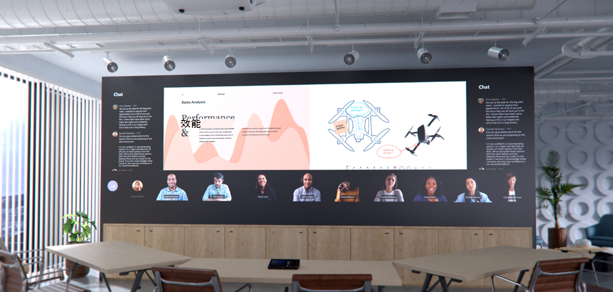
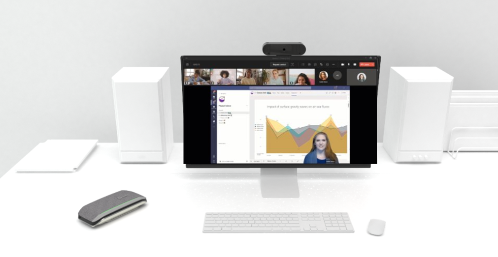
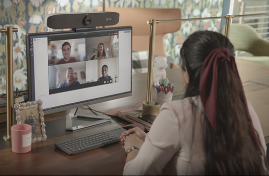
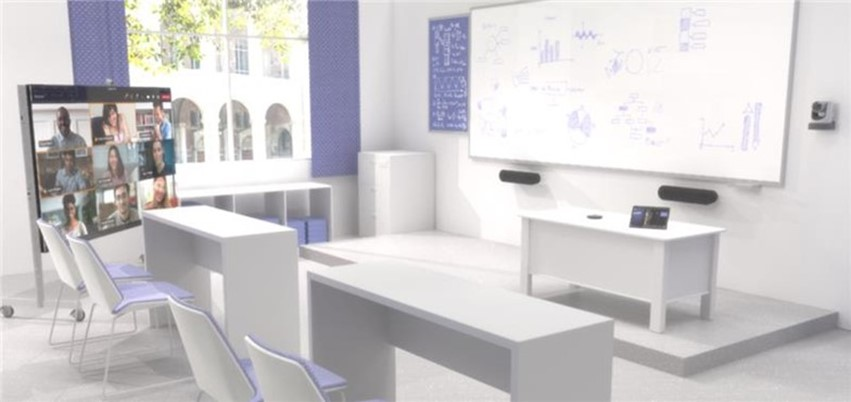
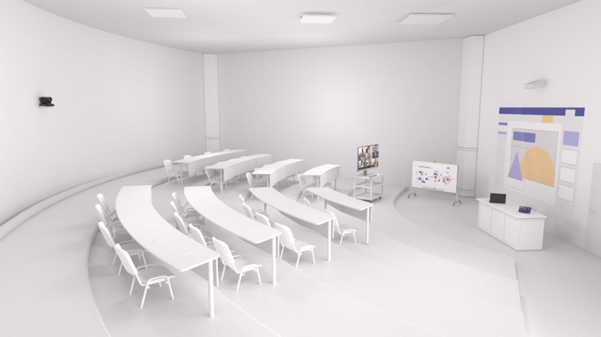

# Teams教育版裝置

## 概觀

### 混合式和混合式教育在這裡可以保持

Learning未來將會混合並混合。 授課者和學生都需要在一系列空格上獲得流暢的體驗，而且在學習進行的方式和地點時，都需要有彈性的動力。 教育不會局限于實體教室或嚴格虛擬環境;遠端參與將和親自學習一樣動態。 混合式學習和混合式學習提供的彈性雖然並非全部新手，但對許多人而言都是新手，而且會產生深遠的影響。

現代化的混合式教室將無邊界。 學生和授課者將透過同步和非同步學習，以及針對每一種情況中符合每一個學生需求而設計的互動式多態互動來獲得授權。 Teams裝置的設計目的是支援一系列空格，讓您聽不出任何聲音。

### 學生和授課者都具備Microsoft Teams 會議室

- Microsoft Teams 會議室啟用安全、安全且以學生為導向的學習，從教室整合到分組討論區，以便進行更專注的共同作業，甚至是一對一，以滿足特定的學生需求和問題。

- 在數位或混合式學習環境中使用個人和共用裝置，可協助學生進行社交活動，並取得他們一生會使用的重要技能。

- Teams功能不限於教室。 授課者與系統管理員可以輕鬆地從同一所學校或整個學區中，從他們家中、辦公室或其環境優化的任何地方，與其他教職員聯繫。 透過Teams，隨時隨地都能存取專業發展。

### 為實體空間帶來數位彈性

為了確保遠端工作的學生和授課者可以完全參與群組共同作業和會議，教育工作區將需要技術來協助分隔舊的親自模型和新的混合式和遠端空間。

*此影像代表未來的技術。*

## 為什麼要選擇原生Teams體驗？

Microsoft Teams認證的周邊設備和會議室是專為您打造的原生通話和會議解決方案，可在Teams認證的第一方和協力廠商硬體上提供完整的Teams會議體驗，以及高畫質音訊和視訊。

當我們說「用途內建和原生」時，我們表示此體驗是由 Microsoft 為Teams使用者特別且精心設計。

Teams 會議室提供獨一無二的會議室功能，例如單點連接、內容攝影機以智慧方式將實體白板共用至會議，以及像是順暢地將Teams會議從個人裝置移轉至會議室等近接式功能，以超越個人裝置上的Teams功能。

依賴外部服務或隨身攜帶裝置連線的非原生和自我建置系統，永遠不會真正符合原生Teams空間的便於使用或沈浸式品質。

**專為Teams而建置**：

進階音訊和視訊及共用

**適用于任何房間的寬度裝置組合**：

從Android或Windows作業系統的完整模組化或整合式表單因素中選取

**重新構想的會議室體驗**：

加入Teams會議，以參與學生和授課者的包容性共同作業會議

**從單一位置輕鬆管理**：

在 Teams 管理員 中心完整管理和讓裝置保持在最新狀態並準備就緒，並啟用 Microsoft 提供的 24x7 主動管理與Microsoft Teams 會議室進階版

## 空間考慮

### 空間的作用是什麼？

實體空間是專為容納將會在該處發生的活動類型而設計。 不同類型的活動或連線可能會促進不同的會議行為。 例如，教室會發現與會議室的行為差異很多。

傢俱可協助定義空間的使用方式。 對於教室或會議空間的效果而言，傢俱和表面設計非常重要。

對於現有的空間，技術應與會議室的現有版面配置對齊。 例如，如果為簡報和親自指示設定表格和椅子，則技術應遵循。 麥克風和相機必須在會議室中放置最佳位置，而非只在符合大小的任何位置新增，而不需考慮會議室的使用方式。 遠端參與者必須以親自參與者的清楚方式查看簡報內容。

對於新的空間，預定使用房間時應同時考慮傢俱與技術。 例如，設計一個旨在促進多種用途 (例如個別工作和群組互動) 的聊天室時，空間應分成兩個不同的區域，以獲得最大效率。

下列影像將說明現有教室空間中優化Teams設定 (頂端) 以及位於底部 (新多用途空間) ：

 

### 空間的函數為何？

*空間中的活動會著重于共同作業共同建立嗎？*

創意需要以使用者共同作業為中心的版面配置和技術部署。 適當的空間可協助使用者與技術間順暢地工作，甚至能排除大多數新手使用者的摩擦力。 Teams裝置的設計可讓年幼學生順暢地流覽，並讓授課者從初次使用開始控制和自訂。

*當內容與遠端參與者共用是優先順序的空格時，該怎麼辦？*

每個內容共用和遠端共同作業都需要不同的實體版面配置和技術體驗。 適當的空間可促進討論，並讓每個人都能輕鬆查看及檢閱共用的內容。 無論您具備何種空間，從休眠空間到講堂，都必須Teams啟用。

## 技術考慮

正確的音訊和視訊技術選項可協助使用者充分利用Microsoft Teams會議。

*音訊*：

音訊考慮對於確保可清楚聽到和理解遠端和會議室參與者至關重要。 麥克風和喇叭涵蓋範圍必須包含會議室中的每一個座位，而不需留下間距。

### 哪些音訊裝置適合每個空間？

為每個空格配對正確的麥克風和喇叭，可讓您在不受干擾的情況下清楚聆聽，獲得最佳的可能結果。

- 在可能吵雜的空間中，例如家中的一般會議室或教室中的桌面，耳機只能限制會議參與者的音效，以提供最佳的可能體驗。 耳機麥克風的設計目的是只挑選會議語音，而喇叭則包含在內，因此只有會議出席者可以聽見進行中的內容。

- 在更多私人設定 (例如，學生的臥房) ，裝置選擇可以展開以包含個人免持聽筒等專案。 這些個人裝置允許的交談品質與耳機相同，但不含必須穿戴裝置的限制。

- 在共用空間中，選項會展開，但仍維持相同的原則：會議參與者必須清楚聽取並聆聽其他人的意見。
  - 萬一音訊裝置是適用于較小空間的簡單部署、高品質選項，只有少數參與者坐著相對靠近音訊裝置。
  - 在較大的空間中，麥克風和喇叭會分開，以確保所有參與者在空間中的涵蓋範圍最大。 許多中型大型會議室的解決方案都可做為不需要設定之套件的一部分，只提供麥克風和喇叭的實體安裝。
  - 在最大且最複雜的空間中，可以使用各種不同的麥克風和喇叭類型，例如從大型大廳擷取答錄機和觀眾的聲音，同時為每個人傳送通話。 當 [Microsoft 合作夥伴](https://cloudpartners.transform.microsoft.com/teams-mrpp) 在設計和部署涉及更多技術的解決方案方面具有專長時，這些解決方案可獲得最佳成效。

*影片*：

視訊與音訊一樣重要。 擷取如臉部表情或手勢等實體非口頭通訊，與課堂或會議內容一樣重要，以確保最大參與度和理解。 會議室必須配備適當的顯示大小，這樣每個人才能在會議室或遠端正常體驗會議。 會議室也需要具備正確的相機涵蓋範圍和檢視欄位 (FOV) ，才能有效擷取所有從遠端加入的會議參與者。

### 每個空間的相機最適合什麼？

高品質影片是現代化Teams共同作業的必要條件。 相機技術有了大幅的進階，高品質的相機現在可供所有空間使用。

- 膝上型電腦與平板電腦等裝置中隨附的相機是參與視訊通話的使用者使用的好起點。 對於想要為個人空間提供更豐富的視訊體驗的使用者，外部攝影機代表內嵌裝置的上一步，可在更多案例和設定中使用，確保通話參與者能分享自己的最佳品質檢視。 這些裝置可透過在每個電腦上找到的簡易 USB 連線輕鬆安裝。

- 在共用空間中，選項和功能會展開。 較小的會議室可能會被音訊欄等一體音訊裝置內的相機所覆蓋。 這些相機通常具有廣泛的視野，可確保在一次拍攝中擷取空間中的每一位參與者。 其中許多相機也具有智慧型影像架構 (功能，因此相機只會顯示會議中的人員，而非空白的椅子) 來追蹤和瞭解空間使用量。

- 在較大的會議室中，相機採用可在不同距離的不同位置擷取參與者所需的技術。 這些相機可以擷取群組或聚焦于特定個人，同時保持絕佳的視覺清晰度。 只能追蹤並只使用主動式喇叭的裝置，會經常在較大的空間中使用，讓許多參與者在參與整個會議時，都能在參與會議時個別受到精選。

### 如何在視訊串流之外進行虛擬互動？

Teams會議不只適用于參與者的音訊和視訊通話。 有多種不同的方式可以分享內容並與之動態互動。

常見的情況是直接從參與者的裝置共用內容。 個別使用者可以從個別應用程式或其畫面的整個內容直接共用完整的音訊和視覺體驗到會議，讓每個人都能檢視。 這會延伸至所有已安裝裝置的共用空間。 Microsoft Teams 會議室也可以選擇使用有線監視器連線，讓參與者共用，即使他們無法個別加入會議。

對於來自實體世界的內容，具有Microsoft Teams會議室系統的空格可以處理白板或檔相機，以便從空間協調檢閱及討論內容。

為獲得完全互動式的體驗，互動式顯示器 (例如Surface Hub系列產品和 Microsoft 數位白板) 讓您輕鬆以互動方式為親身學生及遠端學生建立內容。

## 範例空格

### 公用空間

公用空間，例如家庭家中的一般會議室或文件庫中的表格，通常表示使用者必須使用雜音、缺少永久性工作區，以及其他可能的干擾。

*顯示的解決方案為：*

搭配已認證Teams頭戴式裝置使用的個人電腦裝置。

*為什麼這個版面配置和裝置類型？*

執行Teams的膝上型電腦可確保使用者不會被限制在一個工作區域，而且不需要登入和登出任何會議即可移動其設定。 配備內建麥克風的耳機會將音訊限制為會議參與者，並篩選背景雜音。 膝上型電腦的內建相機可確保所有會議參與者都能看到使用者。

*範例**裝置：*

- [HP Laptop – 14t-dq200](https://www.hp.com/shop/pdp/hp-laptop-14t-dq200-touch-optional-2d129av-1?jumpid=ma_intel-optane_product-tile_clamshell-laptops_1_2d129av-1_hp-laptop---14t-dq20)

- 其他膝上型電腦選項包括：
  - [Microsoft Surface Laptop 4](https://www.microsoft.com/d/surface-laptop-4/946627FB12T1?OCID=AID2200083_SEM_6341646f18fa14c7e4d80565e0debe72%3aG%3as&ef_id=6341646f18fa14c7e4d80565e0debe72%3aG%3as&s_kwcid=AL!4249!10!79302431130415!79302713431201&msclkid=6341646f18fa14c7e4d80565e0debe72&activetab=pivot%3aoverviewtab) - 更高教育版
  - [Microsoft Surface Go Laptop](https://www.microsoft.com/d/surface-laptop-go/94FC0BDGQ7WV?OCID=AID2200083_SEM_215e2d5fa8281476bdd84c555fcf1fad%3aG%3as&ef_id=215e2d5fa8281476bdd84c555fcf1fad%3aG%3as&s_kwcid=AL!4249!10!78890114459337!78890368468596&msclkid=215e2d5fa8281476bdd84c555fcf1fad&activetab=pivot%3aoverviewtab) – 最適合 K-12

- [EPOS Sennheiser Headset – Adapt 560](https://www.microsoft.com/microsoft-teams/across-devices/devices/product/epos-sennheiser-adapt-560/467)

*安裝或設定此解決方案是：*

很簡單。 使用者只要使用經過認證的耳機來進行音訊和視訊通話，就可以完全由使用者來處理此問題。

### 個人空間

個人空間可以是任何專案，從學生的臥房到授課者辦公室。 個人空間通常表示使用者在其工作或學習環境中擁有隱私權，以及專用的工作區。

*範例 A：*

*顯示的解決方案為：*

配備高品質 USB 相機和個別 USB 免持聽筒音訊裝置的個人電腦。

*為什麼這個版面配置和裝置類型？*

較小、更安靜、更專注的個人空間表示使用者不會因為公用共用空間或傳統教室而分心。 執行Teams的電腦可使用專用工作區，而 USB 攝影機可確保使用者在會議中看到高品質。 免持聽筒裝置最適合在會議音訊不需要與其他噪音和干擾相互競爭的私人空間中使用。

*顯示的裝置：*

- 配備Windows 10和外部顯示器的個人電腦

- [Yealink USB Webcam – UVC20](https://www.microsoft.com/microsoft-teams/across-devices/devices/product/yealink-uvc20/854)

- [Poly Speakerphone – 同步處理 20](https://www.microsoft.com/microsoft-teams/across-devices/devices/product/poly-sync-20/825)

*範例 B：*

*顯示的解決方案為：*

內含一對一相機、麥克風和喇叭聲列的個人電腦。

*為什麼這個版面配置和裝置類型？*

此解決方案與範例 A 的用途相同，可解決焦點式的個人空間。 執行Teams的電腦可將專用工作區與 USB 相機、麥克風和喇叭音效列組合在一起。

*顯示的裝置：*

- 配備Windows 10和外部顯示器的個人電腦

- [Poly Soundbar – Studio P15](https://www.microsoft.com/microsoft-teams/across-devices/devices/product/poly-studio-p15/821)

*安裝或設定此解決方案是：*

很簡單。 使用者可以透過將電腦與經過認證的 USB 周邊設備連線，完全由使用者來處理此問題。 相機和個人聲列可以輕鬆地安裝在顯示器上方。

### 教室

教室，包括傳統教室和反向教室，需要在場的每個人進行主動參與。 多方之間的有效指示、討論和共同作業是關鍵。

*顯示的解決方案為：*

專為親自和遠端學生參與者設計的教室，其配置可讓單一授課者同時處理這兩個群組。

*為什麼這個版面配置和裝置類型？*

大型顯示器可讓遠端參與者在會議室內有實體目前狀態，並可讓所有參與者聽到他們的聲音，即使是來源最遠的辦公桌也能聽到他們的聲音。 麥克風位於會議室的前方，讓所有教師和學生都能聽到。 可擷取會議室系統中的傳統類比內容白板，並與會議室內和遠端參與者共用。 數位Microsoft Whiteboard也是遠端學生和親自共同作業以及課程後參考的好解決方案。

*顯示的裝置：*

- 會議室系統 - [Microsoft Surface Hub 2S](https://www.microsoft.com/microsoft-teams/across-devices/devices/product/microsoft-surface-hub-2s/822)
  - 請注意，Surface Hub解決方案代表共同作業和互動式使用方式的進階體驗。 與大型顯示器配對[的Microsoft Teams會議室解決方案](https://www.microsoft.com/microsoft-teams/across-devices/devices/category/teams-rooms/20?page=1&filterIds=)，可在此相同案例中做為替代方案。

- 類比白板擷取 – [Logitech Brio Content 相機 Kit](https://www.microsoft.com/microsoft-teams/across-devices/devices/product/logitech-brio-content-camera-kit/349)

- 相機和音訊 - [Logitech 方塊加號套件](https://www.logitech.com/products/video-conferencing/room-solutions/rally-ultra-hd-conferencecam.html)

- 適用于會議室控制項的觸控主控台 – [登入點選](https://www.logitech.com/products/video-conferencing/room-solutions/tap.html?crid=1691)

*安裝或設定此解決方案是：*

複雜。 此聊天室具有實體安裝，包括連接，需要知識知識庫的 AV 部署合作夥伴妥善規劃及部署相機和音訊解決方案，以便為空間中的使用者順暢地工作。

### 講堂

與教室非常類似，講堂包含許多學生，他們必須專注于授課者，以及他們所展示的任何資訊。 不過，講堂通常不需要學生之間的相同互動量。 焦點會放在資訊上，而不是共同作業上。

*顯示的解決方案為：*

專為親自和遠端學生參與者設計的講堂，其配置可讓單一授課者同時處理這兩個群組，以及從觸控表面建立和標注內容。

*為什麼這個版面配置和裝置類型？*

遠端參與者可以看到與親自參與者透過已安裝的相機所擁有的相同檢視欄位。 學生可以透過他們的相機在顯示器螢幕上看到遠端學生。 專用的簡報畫面和用於白板的觸控式螢幕，會為所有人顯示助讀程式的教育資料。 有吊頂磚的麥克風和功能強大的喇叭，可確保清楚聽到學生的問題和學生的問題。

*顯示的裝置：*

- 會議室系統 – 提供配備已安裝投影機和以購物車為基礎的顯示器[的 Teams 版 Cres括住 C100](https://www.crestron.com/Products/Workspace-Solutions/Unified-Communications/Crestron-Flex-Integrator-Kits/UC-C100-T)

- 選用的數位白板 - [Microsoft Surface Hub 2S](https://www.microsoft.com/microsoft-teams/across-devices/devices/product/microsoft-surface-hub-2s/822)

- 相機 – [AVer CAM520 Pro](https://www.microsoft.com/microsoft-teams/across-devices/devices/product/aver-cam520-pro-standard/575)

- 已安裝的音訊 – [適用于大型會議室的 QSC 和 Sennheiser](https://www.microsoft.com/microsoft-teams/across-devices/devices/product/qsc-meeting-room-audio-in-ceiling-speakers/701)

*安裝或設定此解決方案是：*

非常複雜。 此聊天室的實體安裝需要知識知識庫的 AV 部署合作夥伴，以正確規劃及部署相機和音訊解決方案，以便為空間中的使用者順暢地工作。 安裝需要與Microsoft Teams會議室系統及相關Surface Hub 2 裝置的佈線、音訊設定以及正確設定相關的專業知識。

### 多重用途空格

Teams幾乎可以在任何您能想到的教育或多用途空間中實作。 媒體櫃、混合使用簡報和共同作業空間、咖啡廳空間和開放式空格都可以使用Teams系統或Teams裝置進行裝管。

*顯示的解決方案為：*

會議室系統，內含大型投影機式前方顯示器、可操作的多部觸控主控台，以及多部Surface Hub 2 部裝置，可供各種用途使用。

*顯示的裝置：*

- 會議室系統 – 配備已安裝投影機[的 Teams 版 Cres要彈性 C100](https://www.crestron.com/Products/Workspace-Solutions/Unified-Communications/Crestron-Flex-Integrator-Kits/UC-C100-T)

- 選用雙數位白板 - [Microsoft Surface Hub 2S](https://www.microsoft.com/microsoft-teams/across-devices/devices/product/microsoft-surface-hub-2s/822)

- 相機 – [Yealink UVC84](https://www.yealink.com/product/camera-uvc84)

- 已安裝的音訊 – [適用于大型會議室的 QSC 和 Sennheiser](https://www.microsoft.com/microsoft-teams/across-devices/devices/product/qsc-meeting-room-audio-in-ceiling-speakers/701)

*安裝或設定此解決方案是：*

非常複雜。 如所述，多用途空間需要知識熟知的 AV 部署合作夥伴，以正確規劃及部署投影機型顯示器、相機和音訊解決方案，以及正確設定Microsoft Teams會議室系統以及相關聯的Surface Hub 2 裝置，以便在空間中順暢地為使用者工作。

## 別忘了安全性

確保您的解決方案能安全地抵禦網路威脅至關重要。 使用Teams 會議室系統或裝置時，Microsoft 會使用最新 AI 和自動化來保護資料和私人資訊的安全。 保護您的學校或機構首先透過Intune/AutoPilot) ，透過Azure Active Directory) 和裝置管理 (身分識別及存取管理 (。

## 詳細資訊

檢視下列頁面以深入瞭解Teams裝置和合作夥伴：

[Microsoft Teams 教育版](https://www.microsoft.com/education/products/teams)– 在教育版中使用Microsoft Teams的絕佳資訊來源

[Microsoft Teams認證的裝置](https://www.microsoft.com/microsoft-teams/across-devices/devices/product/poly-sync-20/825)– 通過Microsoft Teams認證之裝置的完整清單

[深入瞭解Microsoft Teams 會議室](/microsoftteams/rooms)– Microsoft Teams 會議室指南，涵蓋規劃、部署和使用方式

[Teams 會議室合作夥伴計畫](https://cloudpartners.transform.microsoft.com/teams-mrpp)– 全球合作夥伴清單，可協助您規劃及部署Teams會議室系統
