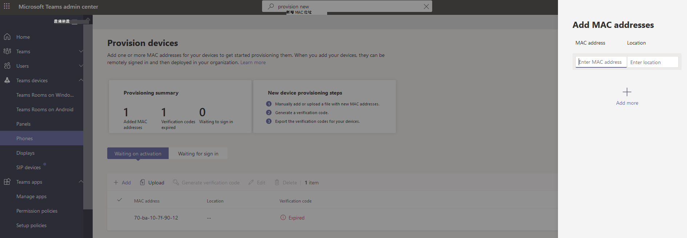

# 遠端布建和登入 Teams Android 裝置

IT 系統管理員可以遠端布建並登入 Teams Android 裝置。 若要遠端布建裝置，系統管理員必須上傳所布建之裝置的 MAC 識別碼，並建立驗證碼。 整個程式都可以從 Teams 系統管理中心遠端完成。

## 檢閱支援的裝置

下列清單顯示 Android 裝置韌體需求。

|裝置類別|裝置型號|韌體版本|
|---|---|---|
|Teams 手機|Yealink T55/T56/T58|58.15.0.124|
|Teams 手機|Yealink VP59|91.15.0.58|
|Teams 手機|Yealink CP960|73.15.0.117|
|Teams 手機|Yealink MP56/MP54/MP58|122.15.0.36|
|Teams 手機|Cres 要點 UC-2|1.0.3.52|
|Teams 手機|Poly Trio C60|7.0.2.1071|
|Teams 手機|CCX400/CCX500/CCX600 |7.0.2.1072|
|Teams 手機|音訊代碼 C448HD/C450HD/C470HD|1.10.120|
|Teams 面板|Cres要 770/1070|1.004.0115|
|在 Android 上Teams 會議室|Logitech 欄 Mini|1.2.982|
|在 Android 上Teams 會議室|Logitech 方塊|1.2.982|
|在 Android 上Teams 會議室|AudioCodes RXV80|1.13.361|
|在 Android 上Teams 會議室|EPOS EXPAND Vision 3T|1.2.2.21182.10|
|在 Android 上Teams 會議室|Yealink 會議列 A30|133.15.0.60|
|在 Android 上Teams 會議室|Yealink 會議列 A20|133.15.0.60|
|在 Android 上Teams 會議室|Yealink CTP18 觸控主控台|137.15.0.37|
|在 Android 上Teams 會議室|Poly Studio X30|3.5.0.344025|
|在 Android 上Teams 會議室|Poly Studio X50|3.5.0.344025|
|在 Android 上Teams 會議室|Poly TC8 觸控主控台 |3.5.0.210489|
|在 Android 上Teams 會議室|Yealink VC210|118.15.0.54|

## 新增裝置 MAC 位址

完成下列步驟以布建新裝置。

1. 登入 Teams 系統管理中心。
2. 展開 **Teams 裝置**。
3. 從 [**動作**] 索引標籤選取 **[布建新裝置**]。

在 [ **布建新裝置** ] 視窗中，您可以手動新增 MAC 位址或上傳檔案。

### 手動新增裝置 MAC 位址

1. 從 [ **等待啟用] 索引** 標籤選取 **[新增 MAC 識別碼]**。

   

1. 輸入 MAC 識別碼。
1. 輸入可協助技術人員識別裝置安裝位置的位置。
1. 完成時，選取 **[套** 用]。

### 上傳檔案以新增裝置 MAC 位址

1. 從 [ **等待啟用] 索引** 標籤選取 **[上傳 MAC 識別碼]**。
2. 下載檔案範本。
3. 輸入 MAC 識別碼和位置，然後儲存檔案。
4. **選取 [檔案**]，然後選取 [ **上傳]**。

## 產生驗證碼

您需要裝置的驗證碼。 驗證碼會大量產生，或在裝置層級產生，有效期為 24 小時。

1. 從 [ **等待啟用] 索引** 標籤選取現有的 MAC 識別碼。
   系統會為 MAC 位址建立密碼，並顯示在 [ **驗證碼** ] 欄中。

2. 提供 MAC 識別碼清單和驗證碼給現場技術人員。 您可以直接將檔案中的詳細資料匯出，並與執行實際安裝工作的技術人員共用檔案。

## 布建裝置

當裝置已開機並聯機到網路時，技術人員會將裝置安放在一起。 這些步驟已在 Teams 裝置上完成。

1. 技術人員從 [設定] 中選取 [**布建裝置****]**。  

   ![[動作] 索引標籤中的 [布建新裝置] 選項。](../media/provision-device1.png)
  
2. 技術人員會在提供的輸入欄位中輸入裝置特定的驗證碼。

   

   一旦成功布建裝置，租使用者名稱就會顯示在登入頁面上。

   

## 第一次遠端登入

布建的裝置會出現在 [ **等待登入** ] 索引標籤中。選取個別裝置，開始遠端登入程式。

1. 從 [ **等待登入** ] 索引標籤選取裝置。

   

2. 依照登入 **使用者中的** 指示操作，然後選取 **[關閉]**。

   ![個別裝置的 [登入使用者] 視窗。](../media/sign-in-user.png)

## 相關文章

- [在 Teams 中管理裝置](device-management.md)
- [遠端登入並登出](remote-sign-in-and-sign-out.md)
- [遠端更新 Teams 裝置](remote-update.md)
