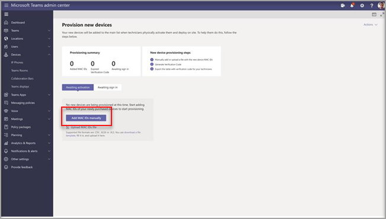
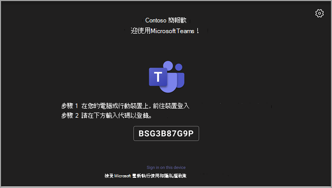
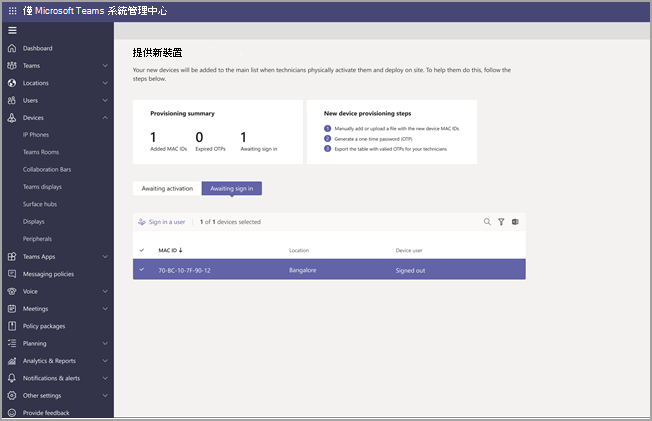
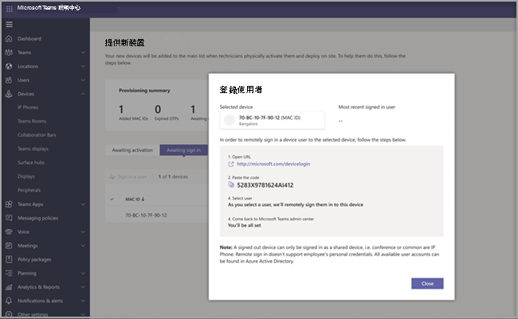

# 在 Android 裝置上遠端Teams和登錄

IT 系統管理員可以在 Android 裝置上遠端Teams並登錄。 若要遠端置備裝置，系統管理員必須上傳所配置之裝置之 MAC ID，並建立驗證碼。 整個程式可以從系統管理中心Teams完成。

## 檢查支援的裝置

下列清單顯示 Android 裝置固件需求。

|裝置類別|裝置模型|固件版本|
|-|-|-|
|Teams手機|Yealink T55/T56/T58|58.15.0.124|
|Teams手機|Yealink VP59|91.15.0.58|
|Teams手機|Yealink CP960|73.15.0.117|
|Teams手機|Yealink MP56/MP54/MP58|122.15.0.36|
|Teams手機|Cresron UC-2|1.0.3.52|
|Teams手機|  Poly Trio C60|  7.0.2.1071|
|Teams手機|  CCX400/CCX500/CCX600    |7.0.2.1072|
|Teams手機|  音訊代碼 C448HD/C450HD/C470HD|   1.10.120|

## 新增裝置 MAC 位址

完成下列步驟以配置新裝置。

1. 登入 Teams 系統管理中心。
2. 展開 **裝置**。
3. 從 **動作選項卡選取** 置 **備新** 裝置。

在安裝 **新裝置** 視窗中，您可以手動新增 MAC 位址或上傳檔案。

### 手動新增裝置 MAC 位址

1. 從等待 **啟用的** 選項卡中，選取 **新增 MAC 識別碼**。

   

1. 輸入 MAC 識別碼。
1. 輸入位置，協助技術人員識別安裝裝置的位置。
1. 完成 **時選取 Apply。**

### Upload檔案以新增裝置 MAC 位址

1. 從等待 **啟用的** 選項卡中，選取 **Upload MAC ID。**
2. 下載檔案範本。
3. 輸入 MAC 識別碼和位置，然後儲存檔案。
4. **選取檔案**，**然後選取** Upload。

## 產生驗證碼

您需要裝置驗證碼。 驗證碼會大量產生或在裝置層級產生，且有效 24 小時。

1. 從等待 **啟用的** 選項卡中，選取現有的 MAC 識別碼。
   MAC 位址會建立密碼，且會顯示在驗證 **碼欄中** 。

2. 提供 MAC ID 和驗證碼清單給現場技術人員。 您可以直接在檔案中匯出詳細資料，並與執行實際安裝工作的技術人員共用檔案。

## 置備裝置

當裝置已電源開啟並連接至網路時，技術人員會配置裝置。 這些步驟在裝置上Teams完成。

1. 技術人員 **會從裝置** 上選取 **設定。**  

   
  
2. 技術人員在提供的輸入欄位中輸入裝置專用驗證碼。

   

   成功配置裝置後，租使用者名稱會顯示在登錄頁面上。

   

## 遠端登入

已置備的裝置會顯示在等待 **登錄的選項卡** 中。選取個別裝置以啟動遠端登入程式。

1. 從等待登錄的 **選項卡中選取** 裝置。

   

2. 請遵循使用者登錄 **中的指示，** 然後選取 **關閉**。

   

## 相關文章

- [在 Teams 中管理裝置](device-management.md)
- [遠端Teams更新裝置](remote-update.md)
