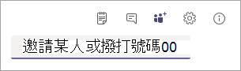

# 從 Microsoft Teams 會議撥出，讓其他人可以加入會議

作為會議召集人，您可以使用 Teams 應用程式撥出，讓其他人使用他們的電話加入同一個會議。

當您撥出給某人時，建議您使用他們的完整電話號碼 (包括國家/地區代碼 - E.164 格式) 。
  
  請注意：

- 您只有在使用 Teams 加入會議時才能撥出。
- 會議召集人已啟用音訊會議功能，或者，如果尚未指派音訊會議授權，則允許透過線上通話方案或直接路由撥打公用交換電話網絡。
- 會議召集人獲 [授予線上撥出政策，可啟用從會議撥出功能](/powershell/module/skype/grant-csdialoutpolicy?view=skype-ps)

> [!NOTE]
> [!INCLUDE [updating-admin-interfaces](includes/updating-admin-interfaces.md)]

以下是如何讓撥出工作：

 **步驟 1：** 在會議中，使用新增人員按鈕選項的新增人員螢幕擷取畫面來撥出  到電話號碼。
 **步驟 2：** 在邀請某人或撥打號碼方塊中輸入完整的電話號碼，包括國家/ **地區** 代碼。
  

    
## 支援的國家/地區

撥出功能僅適用于部分國家/地區。 有關完整清單，請參閱音訊會議與通話方案的國家 [/地區可用性](country-and-region-availability-for-audio-conferencing-and-calling-plans/country-and-region-availability-for-audio-conferencing-and-calling-plans.md)。

## 允許使用者撥入

如果您正在尋找如何讓使用者撥入 Teams 會議的指示，請參閱 [Microsoft Teams](phone-numbers-for-audio-conferencing-in-teams.md)的音訊會議電話號碼。

## 想要進一瞭解音訊會議嗎？

[嘗試或購買音訊會議](try-or-purchase-audio-conferencing-in-office-365-for-teams.md)
    
[Microsoft Teams 附加元件授權](./teams-add-on-licensing/microsoft-teams-add-on-licensing.md)