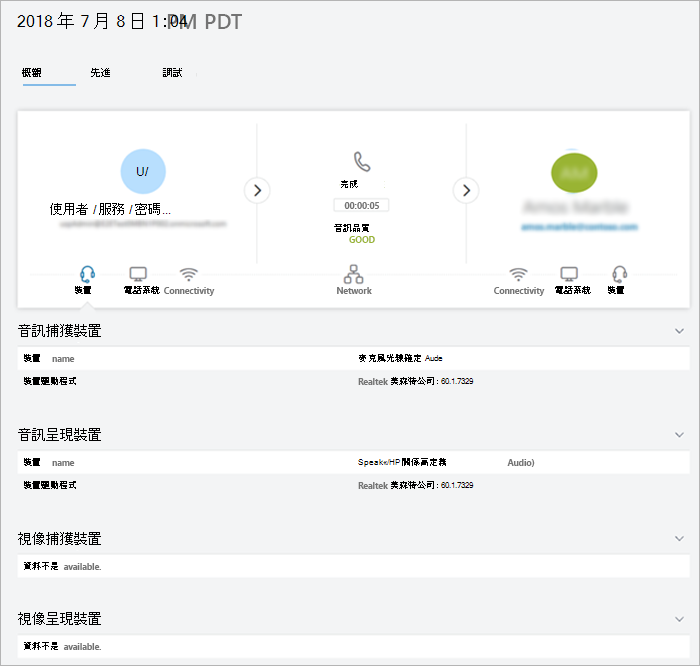

# [通話分析] 和 [通話品質儀表板]

Microsoft 團隊和商務用 Skype 提供兩種監視及疑難排解通話品質問題的方法: [通話分析] 和 [通話品質儀表板] (CQD)。 本文將說明這兩者, 並告訴您何時使用每一個專案。

呼叫分析與 CQD 會並存執行, 而且可以獨立地或一起使用。 例如, 說通訊支援專家認為他們需要進一步協助疑難排解通話問題。 通訊支援專家將呼叫傳遞給通訊支援工程師, 使用者可以存取呼叫分析中的其他資訊, 而不是通訊支援專家。 接著, 通訊支援工程師可以提醒網路工程師發生問題。 網路工程師可能會檢查 CQD, 以查看總體網站相關問題是否可能是引起呼叫問題的問題。

## 什麼是呼叫分析, 何時應該使用它？

**[通話分析] 現已提供給[Microsoft [團隊管理中心](https://admin.teams.microsoft.com)]。** 若要查看使用者的所有通話資訊和資料, 請使用 [**通話記錄**] 索引標籤。您可以查看使用者的設定檔頁面面, 方法是從儀表板搜尋使用者, 或從左側流覽中的**使用者**尋找使用者。

[通話分析] 會顯示與 Microsoft 團隊或商務用 Skype 帳戶中每位使用者的特定通話與會議相關的裝置、網路及連線性的詳細資訊。 為什麼此使用者的通話不佳？ 使用呼叫分析, Office 365 系統管理員或訓練有素的支援者代理程式可以調查與其通話相關的裝置、網路、連線及其他因素, 以解決 Microsoft 團隊與商務用 Skype 中的通話品質和連線問題。

若要在 Microsoft 團隊系統管理中心查看使用者的這項資訊, 請在 [使用者詳細資料] 頁面中按一下該使用者的 [**通話記錄**] 索引標籤, 並顯示使用者在過去30天內參與的所有通話和會議。

若要取得特定會話的其他相關資訊, 包括詳細的媒體和網路統計資料, 請按一下會話以查看詳細資料。

如果您想要非系統管理員 (例如來自外部廠商的支援人員) 使用呼叫分析, 您可以指派許可權, 讓他們可以使用呼叫分析, 但他們無法存取 Microsoft 團隊系統管理中心的其他部分: 
  
- **提供通訊支援專家許可權的支援人員**: 代理程式會在通話分析中看到一組有限的資料和個人辨識資訊 (PII)。 他們可以對通話進行疑難排解, 但他們會將會議問題移交給通訊支援工程師。
    
- **含通訊支援工程師許可權的支援人員代理**: 代理程式會查看通話分析中所有可用的資料, 並同時為通話與會議進行疑難排解。 他們擁有通話記錄及客戶資訊的完整存取權。

> [!NOTE]
> 通訊支援專家角色相當於預覽入口網站中的第1層支援角色, 且通訊支援工程師角色相當於預覽入口網站中的第2層支援角色。

如需溝通支援專家和通訊支援工程師角色的詳細資訊, 請參閱[使用 Microsoft 團隊管理員角色管理團隊](using-admin-roles.md)。

> [!IMPORTANT]
> Microsoft 團隊系統管理中心提供服務台代理許可權和網路拓撲上傳。 溝通支援專家和溝通支援工程師可以使用此入口網站存取通話分析和通話品質儀表板。
    
如需設定撥號分析的詳細資料, 請參閱[設定商務用 Skype 通話分析](set-up-call-analytics.md)。 如需説明台代理程式如何使用呼叫分析的詳細資訊, 請參閱[使用通話分析來診斷不佳通話品質](use-call-analytics-to-troubleshoot-poor-call-quality.md)。
  
## 什麼是通話品質儀表板, 我該如何使用？
  
[通話分析] 的設計目的是協助系統管理員和支援人員診斷特定通話的通話品質問題, 通話品質儀表板 (CQD) 是專門用來協助團隊管理員、商務用 Skype 系統管理員和網路工程師優化網路。 CQD 會將焦點從特定的使用者轉移, 而不是查看整個團隊或商務用 Skype 組織的匯總資訊。 如需詳細資訊, 請參閱[適用于團隊和商務用 Skype Online 的通話品質儀表板功能](turning-on-and-using-call-quality-dashboard.md#BKMKFeaturesOfTheCQD)。
  
使用者的通話品質可能不佳, 因為網路問題也會影響許多其他使用者。 在 CQD 中看不到個別通話體驗, 但會捕獲使用 Microsoft 團隊或商務用 Skype 所做的整體品質。 使用 CQD 時, 整個模式可能會變得很明顯, 讓網路工程師能作出及時的通話品質評估。 CQD 提供通話品質度量的報告, 可讓您深入瞭解整個通話品質、伺服器用戶端資料流程、用戶端資料流程及語音品質[SLA](https://go.microsoft.com/fwlink/p/?linkid=846252)。
  

有了 CQD 的位置改良報表的說明, 您可以評估匯總式通話品質與使用者組建中的可靠性, 以判斷問題是獨立在單一使用者, 還是會影響較大的使用者區段。

![[通話品質儀表板] 的位置改良報告的螢幕擷取畫面。](media/teams-difference-between-call-analytics-and-call-quality-dashboard-image4.png)

> [!NOTE]
> 若要在 CQD 中啟用組建或端點專用的視圖, 系統管理員必須在 CQD 的租使用者資料上傳頁面上[傳建築物或端點資訊](turning-on-and-using-call-quality-dashboard.md#upload-tenant-data-information)。 

如果您想要使用非系統管理員 (例如支援者代理程式) 來使用 [通話品質儀表板], 您可以將這些使用者指派給**團隊通訊支援工程師**、**團隊溝通支援專家**或**報表閱讀**者角色。 具有下列角色的使用者可以存取通話品質儀表板:

- 全域系統管理員
- 全域閱讀程式
- 商務用 Skype 系統管理員
- 團隊服務管理員
- 團隊溝通系統管理員
- 團隊溝通支援工程師
- 團隊溝通支援專家
- 報表閱讀程式

> [!NOTE]
> 團隊通訊支援工程師、團隊溝通支援專家及報告閱讀者角色無法在 CQD 的租使用者上修改檔案, 也無法在租使用者啟用 CQD。

如需有關這些角色的詳細資訊, 請參閱[關於 Office 365 系統管理員角色](/office365/admin/add-users/about-admin-roles)。

如需有關 CQD 的詳細資訊, 請參閱[開啟與使用 Microsoft 團隊和商務用 Skype online 的通話品質儀表板](turning-on-and-using-call-quality-dashboard.md), 以及[Microsoft 團隊和商務用 Skype Online 的通話品質儀表板中提供的維度與量值](dimensions-and-measures-available-in-call-quality-dashboard.md)。
  
## 相關主題

[影片: 通話品質概覽](https://aka.ms/teams-quality)

[設定通話分析](set-up-call-analytics.md)

[使用呼叫分析來排查不佳的通話品質問題](use-call-analytics-to-troubleshoot-poor-call-quality.md)

[開啟並使用 Microsoft 團隊及商務用 Skype Online 的通話品質儀表板](turning-on-and-using-call-quality-dashboard.md)
