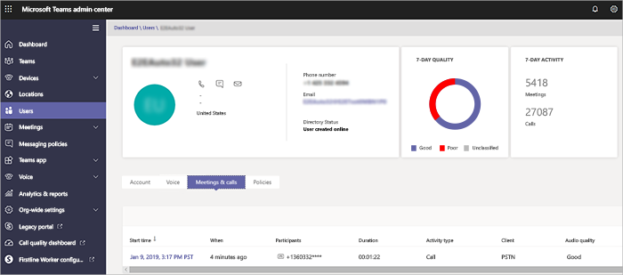

# [通話分析] 和 [通話品質儀表板]Call Analytics and Call Quality Dashboard

Microsoft 團隊和商務用 Skype 提供兩種監視及疑難排解通話品質問題的方法: [通話分析] 和 [通話品質儀表板] (CQD)。Microsoft Teams and Skype for Business give you two ways to monitor and troubleshoot call-quality problems: Call Analytics and Call Quality Dashboard (CQD). 本文將說明這兩者, 並告訴您何時使用每一個專案。This article describes both and tells you when to use each one.

呼叫分析與 CQD 會並存執行, 而且可以獨立地或一起使用。Call Analytics and CQD run in parallel and can be used independently or together. 例如, 說通訊支援專家認為他們需要進一步協助疑難排解通話問題。For example, say a communications support specialist determines that they need more help troubleshooting a call problem. 通訊支援專家將呼叫傳遞給通訊支援工程師, 使用者可以存取呼叫分析中的其他資訊, 而不是通訊支援專家。The communications support specialist passes the call to a communications support engineer, who has access to more information in Call Analytics than the communications support specialist. 接著, 通訊支援工程師可以提醒網路工程師發生問題。In turn, the communications support engineer can alert a network engineer to an issue. 網路工程師可能會檢查 CQD, 以查看總體網站相關問題是否可能是引起呼叫問題的問題。The network engineer might check CQD to see if an overall site-related issue could be a contributing cause of call problems.

## 什麼是呼叫分析, 何時應該使用它？What's Call Analytics, and when should I use it?

**[通話分析] 現已提供給[Microsoft [團隊管理中心](https://admin.teams.microsoft.com)]。****Call Analytics is now available in the [Microsoft Teams admin center](https://admin.teams.microsoft.com).** 若要查看使用者的所有通話資訊和資料, 請使用 [**通話記錄**] 索引標籤。您可以查看使用者的設定檔頁面面, 方法是從儀表板搜尋使用者, 或從左側流覽中的**使用者**尋找使用者。To see all of the call information and data for a user, use the **Call History** tab. You can do this by looking on the user's profile page by either searching for the user from the dashboard or finding the user from **Users** in the left navigation.

[通話分析] 會顯示與 Microsoft 團隊或商務用 Skype 帳戶中每位使用者的特定通話與會議相關的裝置、網路及連線性的詳細資訊。Call Analytics shows detailed information about the devices, networks, and connectivity related to the specific calls and meetings for each user in a Microsoft Teams or Skype for Business account. 為什麼此使用者的通話不佳？Why did this user have a poor call this afternoon? 使用呼叫分析, Office 365 系統管理員或訓練有素的支援者代理程式可以調查與其通話相關的裝置、網路、連線及其他因素, 以解決 Microsoft 團隊與商務用 Skype 中的通話品質和連線問題。Using Call Analytics, an Office 365 admin or trained helpdesk agent can investigate the device, network, connectivity, and other factors related to his call to troubleshoot call quality and connection problems in Microsoft Teams and Skype for Business.

若要在 Microsoft 團隊系統管理中心查看使用者的這項資訊, 請在 [使用者詳細資料] 頁面中按一下該使用者的 [**通話記錄**] 索引標籤, 並顯示使用者在過去30天內參與的所有通話和會議。To see this information for a user in the Microsoft Teams admin center, click the **Call History** tab for that user in the user detail page, showing all the calls and meetings that user has participated in for the last 30 days.

若要取得特定會話的其他相關資訊, 包括詳細的媒體和網路統計資料, 請按一下會話以查看詳細資料。To get additional information about a given session including detailed media and networking statistics, click on a session to see the details.

如果您想要非系統管理員 (例如來自外部廠商的支援人員) 使用呼叫分析, 您可以指派許可權, 讓他們可以使用呼叫分析, 但他們無法存取 Microsoft 團隊系統管理中心的其他部分:If you want non-admins, such as helpdesk agents from an external vendor, to use Call Analytics, you can assign permissions so that they can use Call Analytics, but they can't access the rest of the Microsoft Teams admin center: 
  
- **提供通訊支援專家許可權的支援人員**: 代理程式會在通話分析中看到一組有限的資料和個人辨識資訊 (PII)。**Helpdesk agents with communications support specialist permissions**: Agents see a limited set of data and personally identifiable information (PII) in Call Analytics. 他們可以對通話進行疑難排解, 但他們會將會議問題移交給通訊支援工程師。They can troubleshoot calls, but they will hand off problems with meetings to a communications support engineer.
    
- **含通訊支援工程師許可權的支援人員代理**: 代理程式會查看通話分析中所有可用的資料, 並同時為通話與會議進行疑難排解。**Helpdesk agents with communications support engineer permissions**: Agents see all available data in Call Analytics and troubleshoot both calls and meetings. 他們擁有通話記錄及客戶資訊的完整存取權。They have full access to call logs and customer information.

> [!NOTE]
> 通訊支援專家角色相當於預覽入口網站中的第1層支援角色, 且通訊支援工程師角色相當於預覽入口網站中的第2層支援角色。The communications support specialist role is equivalent to tier 1 support role from the preview portal and the communications support engineer role is equivalent to tier 2 support role from the preview portal.

如需溝通支援專家和通訊支援工程師角色的詳細資訊, 請參閱[使用 Microsoft 團隊管理員角色管理團隊](using-admin-roles.md)。For more information about the communications support specialist and communications support engineer roles, see [Use Microsoft Teams admin roles to manage teams](using-admin-roles.md).

> [!IMPORTANT]
> Microsoft 團隊系統管理中心提供服務台代理許可權和網路拓撲上傳。Helpdesk agent permissions and network topology upload are available in the Microsoft Teams admin center. 溝通支援專家和溝通支援工程師可以使用此入口網站存取通話分析和通話品質儀表板。Communications Support Specialists and Communications Support Engineers can use this portal to access Call Analytics and the Call Quality Dashboard.
    
如需設定撥號分析的詳細資料, 請參閱[設定商務用 Skype 通話分析](set-up-call-analytics.md)。For details about setting up Call Analytics, see [Set up Skype for Business Call Analytics](set-up-call-analytics.md). 如需説明台代理程式如何使用呼叫分析的詳細資訊, 請參閱[使用通話分析來診斷不佳通話品質](use-call-analytics-to-troubleshoot-poor-call-quality.md)。For more information about how Helpdesk agents can work with Call Analytics, see [Use Call Analytics to troubleshoot poor call quality](use-call-analytics-to-troubleshoot-poor-call-quality.md).
  
## 什麼是通話品質儀表板, 我該如何使用？What's the Call Quality Dashboard, and when should I use it?
  
[通話分析] 的設計目的是協助系統管理員和支援人員診斷特定通話的通話品質問題, 通話品質儀表板 (CQD) 是專門用來協助團隊管理員、商務用 Skype 系統管理員和網路工程師優化網路。Whereas Call Analytics is designed to help admins and helpdesk agents troubleshoot call quality problems with specific calls, the Call Quality Dashboard (CQD) is designed to help Teams admins, Skype for Business admins, and network engineers optimize a network. CQD 會將焦點從特定的使用者轉移, 而不是查看整個團隊或商務用 Skype 組織的匯總資訊。CQD shifts focus from specific users and instead looks at aggregate information for an entire Teams or Skype for Business organization. 如需詳細資訊, 請參閱[適用于團隊和商務用 Skype Online 的通話品質儀表板功能](turning-on-and-using-call-quality-dashboard.md#BKMKFeaturesOfTheCQD)。For more details, see [Features of the Call Quality Dashboard for Teams and Skype for Business Online](turning-on-and-using-call-quality-dashboard.md#BKMKFeaturesOfTheCQD).
  
使用者的通話品質可能不佳, 因為網路問題也會影響許多其他使用者。Maybe the user's poor call quality is due to a network issue that's also affecting many other users. 在 CQD 中看不到個別通話體驗, 但會捕獲使用 Microsoft 團隊或商務用 Skype 所做的整體品質。The individual call experience isn't visible in CQD, but the overall quality of calls made using Microsoft Teams or Skype for Business is captured. 使用 CQD 時, 整個模式可能會變得很明顯, 讓網路工程師能作出及時的通話品質評估。With the CQD, overall patterns may become apparent, allowing network engineers to make informed assessments of call quality. CQD 提供通話品質度量的報告, 可讓您深入瞭解整個通話品質、伺服器用戶端資料流程、用戶端資料流程及語音品質[SLA](https://go.microsoft.com/fwlink/p/?linkid=846252)。CQD provides reports of call quality metrics that give you insights into overall call quality, server-client streams, client-client streams, and voice quality [SLA](https://go.microsoft.com/fwlink/p/?linkid=846252).
  

有了 CQD 的位置改良報表的說明, 您可以評估匯總式通話品質與使用者組建中的可靠性, 以判斷問題是獨立在單一使用者, 還是會影響較大的使用者區段。With the help of CQD's Location-Enhanced Reports, aggregate call quality and reliability within the user's building can be assessed to determine if the problem is isolated to a single user or affects a larger segment of users.

![[通話品質儀表板] 的位置改良報告的螢幕擷取畫面。](media/teams-difference-between-call-analytics-and-call-quality-dashboard-image4.png)

> [!NOTE]
> 若要在 CQD 中啟用組建或端點專用的視圖, 系統管理員必須在 CQD 的租使用者資料上傳頁面上[傳建築物或端點資訊](turning-on-and-using-call-quality-dashboard.md#upload-tenant-data-information)。To enable building or endpoint-specific views in CQD, an admin must [upload building or endpoint information](turning-on-and-using-call-quality-dashboard.md#upload-tenant-data-information) on CQD's Tenant Data Upload page. 

如果您想要使用非系統管理員 (例如支援者代理程式) 來使用 [通話品質儀表板], 您可以將這些使用者指派給**團隊通訊支援工程師**、**團隊溝通支援專家**或**報表閱讀**者角色。If you want non-admins, such as helpdesk agents, to use Call Quality Dashboard, you can assign those users the **Teams Communications Support Engineer**, **Teams Communications Support Specialist**, or **Reports Reader** role. 具有下列角色的使用者可以存取通話品質儀表板:Users with the following roles can access Call Quality Dashboard:

- 全域系統管理員Global Administrator
- 全域閱讀程式Global Reader
- 商務用 Skype 系統管理員Skype for Business Administrator
- 團隊服務管理員Teams Service Administrator
- 團隊溝通系統管理員Teams Communications Administrator
- 團隊溝通支援工程師Teams Communications Support Engineer
- 團隊溝通支援專家Teams Communications Support Specialist
- 報表閱讀程式Reports Reader

> [!NOTE]
> 團隊通訊支援工程師、團隊溝通支援專家及報告閱讀者角色無法在 CQD 的租使用者上修改檔案, 也無法在租使用者啟用 CQD。The Teams Communications Support Engineer, Teams Communications Support Specialist, and Reports Reader roles cannot modify files on CQD's Tenant Data Upload page nor activate CQD for a tenant.

如需有關這些角色的詳細資訊, 請參閱[關於 Office 365 系統管理員角色](/office365/admin/add-users/about-admin-roles)。For more information about these roles, see [About Office 365 admin roles](/office365/admin/add-users/about-admin-roles).

如需有關 CQD 的詳細資訊, 請參閱[開啟與使用 Microsoft 團隊和商務用 Skype online 的通話品質儀表板](turning-on-and-using-call-quality-dashboard.md), 以及[Microsoft 團隊和商務用 Skype Online 的通話品質儀表板中提供的維度與量值](dimensions-and-measures-available-in-call-quality-dashboard.md)。For more information about CQD, see [Turning on and using Call Quality Dashboard for Microsoft Teams and Skype for Business Online](turning-on-and-using-call-quality-dashboard.md) and [Dimensions and measures available in Call Quality Dashboard for Microsoft Teams and Skype for Business Online](dimensions-and-measures-available-in-call-quality-dashboard.md).
  
## 相關主題Related topics

[影片: 通話品質概覽Video: Call Quality Overview](https://aka.ms/teams-quality)

[設定通話分析Set up Call Analytics](set-up-call-analytics.md)

[使用呼叫分析來排查不佳的通話品質問題Use Call Analytics to troubleshoot poor call quality](use-call-analytics-to-troubleshoot-poor-call-quality.md)

[開啟並使用 Microsoft 團隊及商務用 Skype Online 的通話品質儀表板Turning on and using Call Quality Dashboard for Microsoft Teams and Skype for Business Online](turning-on-and-using-call-quality-dashboard.md)
