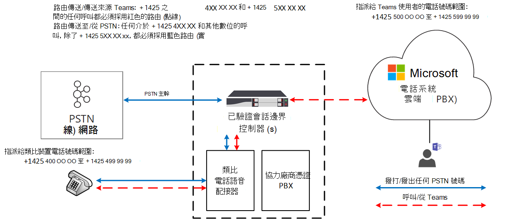

# <a name="how-to-use-analog-devices-with-phone-system-direct-routing"></a><span data-ttu-id="7b32d-103">如何將模擬裝置與電話系統直接路由搭配使用</span><span class="sxs-lookup"><span data-stu-id="7b32d-103">How to use analog devices with Phone System Direct Routing</span></span>

<span data-ttu-id="7b32d-104">本文說明如何將模擬裝置與電話系統 Direct 路由搭配使用。</span><span class="sxs-lookup"><span data-stu-id="7b32d-104">This article describes how to use analog devices with Phone System Direct Routing.</span></span> <span data-ttu-id="7b32d-105">若要將類比裝置連線至直接路由，您必須使用類比電話配接器（ATA），且認證的會話邊界控制器（SBC）供應商必須支援此配接器。</span><span class="sxs-lookup"><span data-stu-id="7b32d-105">To connect analog devices to Direct Routing, you must use an Analog Telephony Adapter (ATA), and this adapter must be supported by the certified Session Border Controller (SBC) vendor.</span></span> 

<span data-ttu-id="7b32d-106">當使用者從類比裝置撥打電話時，會透過類比電話配接器（ATA）傳送信號和媒體流程至 SBC。</span><span class="sxs-lookup"><span data-stu-id="7b32d-106">When a user makes a call from an analog device, the signaling and media flow through the Analog Telephony Adapter (ATA) to the SBC.</span></span>  <span data-ttu-id="7b32d-107">SBC 會將呼叫傳送至 Microsoft 團隊端點，或是根據內部路由資料表傳送給公開的交換電話網絡（PSTN）。</span><span class="sxs-lookup"><span data-stu-id="7b32d-107">The SBC sends the call to a Microsoft Teams endpoint or to the Public Switched Telephone Network (PSTN) based on the internal routing table.</span></span>  <span data-ttu-id="7b32d-108">當裝置撥打電話時，傳送的路線會視為裝置所建立的路由策略而定。</span><span class="sxs-lookup"><span data-stu-id="7b32d-108">When a device makes a call, the route it takes depends on the routing policies created for the device.</span></span>

<span data-ttu-id="7b32d-109">在下圖中，將 [直接路由] 設定為：從 + 1425 4XX XX xx 和 + 1425 5XX XX XX xx xx 的任何小組撥打電話給，以及從 + 1425 4XX xx xx 和其他數位之間的數位撥打，除了 number range 範圍 + 1425 5XX XX xx 必須採用藍色路線（實線）。</span><span class="sxs-lookup"><span data-stu-id="7b32d-109">In the following diagram, Direct Routing is configured so that any Teams calls to and from the numbers between +1425 4XX XX XX and +1425 5XX XX XX must take the red route (dotted line), and any PSTN call to and from numbers between +1425 4XX XX XX and any other number except number range +1425 5XX XX XX must take the blue route (solid line).</span></span> 



## <a name="example--how-to-configure-the-use-of-analog-devices-with-direct-routing"></a><span data-ttu-id="7b32d-111">範例：如何設定使用直接路由的類比裝置</span><span class="sxs-lookup"><span data-stu-id="7b32d-111">Example:  How to configure the use of analog devices with Direct Routing</span></span>

<span data-ttu-id="7b32d-112">若要設定直接路由的類比裝置的使用，您必須將類比電話配接器連線至 SBC，並設定 SBC 與直接路由搭配使用。</span><span class="sxs-lookup"><span data-stu-id="7b32d-112">To configure the use of analog devices with Direct Routing, you must connect the Analog Telephony Adapter to the SBC, and configure the SBC to work with Direct Routing.</span></span> 

<span data-ttu-id="7b32d-113">這個範例會逐步引導您完成下列步驟：</span><span class="sxs-lookup"><span data-stu-id="7b32d-113">This example walks you through the following steps:</span></span>

1. <span data-ttu-id="7b32d-114">將 SBC 連接至直接路由</span><span class="sxs-lookup"><span data-stu-id="7b32d-114">Connect the SBC to Direct Routing</span></span>
2. <span data-ttu-id="7b32d-115">建立 PSTN 使用量</span><span class="sxs-lookup"><span data-stu-id="7b32d-115">Create the PSTN Usage</span></span>
3. <span data-ttu-id="7b32d-116">建立語音路由，並將它與 PSTN 使用量建立關聯</span><span class="sxs-lookup"><span data-stu-id="7b32d-116">Create a voice route and associate it with the PSTN Usage</span></span>
4. <span data-ttu-id="7b32d-117">將語音路由指派給 PSTN 使用量</span><span class="sxs-lookup"><span data-stu-id="7b32d-117">Assign the voice route to the PSTN Usage</span></span>
5. <span data-ttu-id="7b32d-118">啟用線上使用者</span><span class="sxs-lookup"><span data-stu-id="7b32d-118">Enable the online user</span></span>
6. <span data-ttu-id="7b32d-119">將語音路線原則指派給使用者</span><span class="sxs-lookup"><span data-stu-id="7b32d-119">Assign the voice route policy to the user</span></span>
7. <span data-ttu-id="7b32d-120">建立類比裝置的語音路線</span><span class="sxs-lookup"><span data-stu-id="7b32d-120">Create a voice route for an analog device</span></span>

<span data-ttu-id="7b32d-121">如需如何將 ATA 連線至 SBC 並設定 SBC 的相關資訊，請參閱您的 SBC 製造商配置指南：</span><span class="sxs-lookup"><span data-stu-id="7b32d-121">For information on how to connect an ATA to an SBC and configure the SBC, see your SBC manufacturer configuration guide:</span></span>
- [<span data-ttu-id="7b32d-122">AudioCodes 設定檔</span><span class="sxs-lookup"><span data-stu-id="7b32d-122">AudioCodes configuration documentation</span></span>](https://www.audiocodes.com/media/14278/connecting-audiocodes-sbc-with-analog-device-to-microsoft-teams-direct-routing-enterprise-model-configuration-note.pdf)

## <a name="step-1--connect-the-sbc-to-direct-routing"></a><span data-ttu-id="7b32d-123">步驟1。</span><span class="sxs-lookup"><span data-stu-id="7b32d-123">Step 1.</span></span>  <span data-ttu-id="7b32d-124">將 SBC 連接至直接路由</span><span class="sxs-lookup"><span data-stu-id="7b32d-124">Connect the SBC to Direct Routing</span></span>

<span data-ttu-id="7b32d-125">下列命令會設定 SBC 連接，如下所示：</span><span class="sxs-lookup"><span data-stu-id="7b32d-125">The following command configures the SBC connection as follows:</span></span>

- <span data-ttu-id="7b32d-126">FQDN sbc.contoso.com</span><span class="sxs-lookup"><span data-stu-id="7b32d-126">FQDN sbc.contoso.com</span></span>
- <span data-ttu-id="7b32d-127">信號埠5068</span><span class="sxs-lookup"><span data-stu-id="7b32d-127">Signaling port 5068</span></span>
- <span data-ttu-id="7b32d-128">媒體旁路模式</span><span class="sxs-lookup"><span data-stu-id="7b32d-128">Media bypass mode</span></span>
- <span data-ttu-id="7b32d-129">來電記錄資訊轉寄給 SBC-</span><span class="sxs-lookup"><span data-stu-id="7b32d-129">Call history information forwarded to the SBC-</span></span>
- <span data-ttu-id="7b32d-130">P-斷言身分識別（PAI）標頭與通話一起轉寄</span><span class="sxs-lookup"><span data-stu-id="7b32d-130">P-Asserted-Identity (PAI) header forwarded along with the call</span></span> 

```
PS C:\> New-CsOnlinePSTNGateway -FQDN sbc.contoso.com -SIPSignalingPort 5068 -ForwardCallHistory $true -ForwardPAI $true -MediaBypass $true -Enabled $true 
```

## <a name="step-2--create-the-pstn-usage"></a><span data-ttu-id="7b32d-131">步驟2：建立 PSTN 使用量</span><span class="sxs-lookup"><span data-stu-id="7b32d-131">Step 2:  Create the PSTN usage</span></span> 

<span data-ttu-id="7b32d-132">下一個命令會建立空白的 PSTN 用法。</span><span class="sxs-lookup"><span data-stu-id="7b32d-132">The next command creates an empty PSTN usage.</span></span> <span data-ttu-id="7b32d-133">線上 PSTN 用法是用來進行通話授權的字串值。</span><span class="sxs-lookup"><span data-stu-id="7b32d-133">Online PSTN usages are string values that are used for call authorization.</span></span> <span data-ttu-id="7b32d-134">線上 PSTN 使用會將線上語音原則連結至路線。</span><span class="sxs-lookup"><span data-stu-id="7b32d-134">An online PSTN usage links an online voice policy to a route.</span></span> <span data-ttu-id="7b32d-135">這個範例會將字串「交互操作」新增到目前可用 PSTN 用法的清單中。</span><span class="sxs-lookup"><span data-stu-id="7b32d-135">This example adds the string "Interop" to the current list of available PSTN usages.</span></span> 

```
PS C:\> Set-CsOnlinePstnUsage -Identity global -Usage @{add="Interop"} 
```

## <a name="step-3--create-a-voice-route-and-associate-it-with-the-pstn-usage"></a><span data-ttu-id="7b32d-136">步驟3：建立語音路由，並將它與 PSTN 用法建立關聯：</span><span class="sxs-lookup"><span data-stu-id="7b32d-136">Step 3:  Create a voice route and associate it with the PSTN usage:</span></span>

<span data-ttu-id="7b32d-137">這個命令會針對數位範圍 + 1425 XXX xx XX 的身分識別「類比-interop」建立新的線上語音路由。</span><span class="sxs-lookup"><span data-stu-id="7b32d-137">This command creates a new online voice route with the identity “analog-interop” for the number range +1425 XXX XX XX.</span></span>  <span data-ttu-id="7b32d-138">語音路由適用于線上閘道 sbc.contoso.com 清單，並將路由與線上 PSTN 使用 "互通性" 關聯。</span><span class="sxs-lookup"><span data-stu-id="7b32d-138">The voice route is applicable to a list of online gateways sbc.contoso.com and associates the route with online PSTN usage “Interop”.</span></span> <span data-ttu-id="7b32d-139">語音路由包含一個正則運算式，可識別將透過特定語音路線傳送哪些電話號碼：</span><span class="sxs-lookup"><span data-stu-id="7b32d-139">A voice route includes a regular expression that identifies which phone numbers will be routed through a given voice route:</span></span>

```
PS C:\> New-CsOnlineVoiceRoute -Identity analog-interop -NumberPattern "^\+1(425)(\d{7}])$" -OnlinePstnGatewayList sbc.contoso.com -Priority 1 -OnlinePstnUsages "
```

## <a name="step-4-assign-the-voice-route-to-the-pstn-usage"></a><span data-ttu-id="7b32d-140">步驟4：將語音路由指派給 PSTN 用法：</span><span class="sxs-lookup"><span data-stu-id="7b32d-140">Step 4: Assign the voice route to the PSTN usage:</span></span>

<span data-ttu-id="7b32d-141">這個命令會針對 [AnalogInteropPolicy] 身分識別，建立新的每使用者語音路由策略。</span><span class="sxs-lookup"><span data-stu-id="7b32d-141">This command creates a new online per-user voice routing policy with the Identity “AnalogInteropPolicy”.</span></span> <span data-ttu-id="7b32d-142">此原則會指派單一線上 PSTN 使用量： "互通性"。</span><span class="sxs-lookup"><span data-stu-id="7b32d-142">This policy is assigned a single online PSTN usage: “Interop”.</span></span>

```
PS C:\> New-CsOnlineVoiceRoutingPolicy -Identity "AnalogInteropPolicy" -Name "AnalogInteropPolicy" -OnlinePstnUsages "Interop"
```

## <a name="step-5-enable-the-online-user"></a><span data-ttu-id="7b32d-143">步驟5：啟用線上使用者</span><span class="sxs-lookup"><span data-stu-id="7b32d-143">Step 5: Enable the online user</span></span>

<span data-ttu-id="7b32d-144">這個命令會使用身分識別 exampleuser@contoso.com 來修改使用者帳戶。</span><span class="sxs-lookup"><span data-stu-id="7b32d-144">This command modifies the user account with the Identity exampleuser@contoso.com.</span></span> <span data-ttu-id="7b32d-145">在這種情況下，會將帳戶修改為啟用企業語音、Microsoft VoIP 的 Microsoft 實現以及已啟用的語音信箱，並將數位 + 14255000000 指派給此使用者。</span><span class="sxs-lookup"><span data-stu-id="7b32d-145">In this case, the account is modified to enable Enterprise Voice, the Microsoft implementation of VoIP, with enabled voice mail and assigns the number +14255000000 to this user.</span></span>  <span data-ttu-id="7b32d-146">對於公司租使用者中的每個團隊使用者（不包括 ATA 裝置使用者），應執行此命令。</span><span class="sxs-lookup"><span data-stu-id="7b32d-146">This command should be run for each Teams user (excluding ATA device users) in the company tenant.</span></span>

```
PS C:\> Set-CsUser -Identity "exampleuser@contoso.com" -EnterpriseVoiceEnabled $True -HostedVoiceMail $True -OnPremLineUri "tel:+14255000000"
```

## <a name="step-6-assign-the-voice-route-policy-to-a-user"></a><span data-ttu-id="7b32d-147">步驟6：將語音路線原則指派給使用者</span><span class="sxs-lookup"><span data-stu-id="7b32d-147">Step 6: Assign the voice route policy to a user</span></span>

<span data-ttu-id="7b32d-148">這個命令會將每個使用者的線上語音路由策略 AnalogInteropPolicy 指派給具有身分識別 exampleuser@contoso.com 的使用者。</span><span class="sxs-lookup"><span data-stu-id="7b32d-148">This command assigns the per-user online voice routing policy AnalogInteropPolicy to the user with the identity exampleuser@contoso.com.</span></span>  <span data-ttu-id="7b32d-149">對於公司租使用者中的每個團隊使用者（不包括 ATA 裝置使用者），應執行此命令。</span><span class="sxs-lookup"><span data-stu-id="7b32d-149">This command should be run for each Teams user (excluding ATA device users) in the company tenant.</span></span>

```
PS C:\> Grant-CsOnlineVoiceRoutingPolicy -Identity "exampleuser@contoso.com" -PolicyName "AnalogInteropPolicy" 
```

## <a name="step-7--create-a-voice-route-for-an-analog-device"></a><span data-ttu-id="7b32d-150">步驟7：為類比裝置建立語音路線</span><span class="sxs-lookup"><span data-stu-id="7b32d-150">Step 7:  Create a voice route for an analog device</span></span>

<span data-ttu-id="7b32d-151">這個命令會建立一個含有「類比-interop」的 [身分識別] 的線上語音路由，該號碼範圍 + 1425 4XX XX XX 適用于線上閘道 sbc.contoso.com 清單，並將其與線上 PSTN 使用 "互通性" 關聯。</span><span class="sxs-lookup"><span data-stu-id="7b32d-151">This command creates an online voice route with identity “analog-interop” for number range +1425 4XX XX XX applicable to a list of online gateways sbc.contoso.com and associates it with online PSTN usage “Interop”.</span></span>  <span data-ttu-id="7b32d-152">針對每個具有適當電話號碼模式的類比裝置，都應該執行這個命令。</span><span class="sxs-lookup"><span data-stu-id="7b32d-152">This command should be run for each analog device with appropriate phone number pattern.</span></span> <span data-ttu-id="7b32d-153">或者，當您在上述其中一個步驟中設定線上語音路由時，可以使用類比裝置的適當數位模式。</span><span class="sxs-lookup"><span data-stu-id="7b32d-153">Alternatively, a proper number pattern for analog devices can be used while configuring the online voice route during one of the previous steps.</span></span>

```
PS C:\> New-CsOnlineVoiceRoute -Identity analog-interop -NumberPattern "^\+1(4254)(\d{6}])$"  -OnlinePstnGatewayList sbc.contoso.com -Priority 1 -OnlinePstnUsages "Interop"
```

## <a name="considerations"></a><span data-ttu-id="7b32d-154">考量</span><span class="sxs-lookup"><span data-stu-id="7b32d-154">Considerations</span></span>

- <span data-ttu-id="7b32d-155">除非另請注意，類比裝置就是任何可以傳送 DTMF 位數以進行呼叫的裝置。</span><span class="sxs-lookup"><span data-stu-id="7b32d-155">Unless otherwise note, an analog device is any device that can send DTMF digits to place a call.</span></span> <span data-ttu-id="7b32d-156">例如，類比電話、傳真機和投影機呼機。</span><span class="sxs-lookup"><span data-stu-id="7b32d-156">For example, analog phones, fax machines, and overhead pagers.</span></span>
- <span data-ttu-id="7b32d-157">無法從團隊中搜尋連線至 ATA 的類比電話。</span><span class="sxs-lookup"><span data-stu-id="7b32d-157">Analog phones connected to an ATA are not searchable from Teams.</span></span> <span data-ttu-id="7b32d-158">團隊使用者必須手動輸入與裝置相關聯的電話號碼，才能呼叫該裝置。</span><span class="sxs-lookup"><span data-stu-id="7b32d-158">Teams users must manually enter the phone number associated with the device to call that device.</span></span>  
 

## <a name="see-also"></a><span data-ttu-id="7b32d-159">另請參閱</span><span class="sxs-lookup"><span data-stu-id="7b32d-159">See also</span></span>

[<span data-ttu-id="7b32d-160">規劃直接路由</span><span class="sxs-lookup"><span data-stu-id="7b32d-160">Plan Direct Routing</span></span>](direct-routing-plan.md)

[<span data-ttu-id="7b32d-161">設定直接路由</span><span class="sxs-lookup"><span data-stu-id="7b32d-161">Configure Direct Routing</span></span>](direct-routing-configure.md)
