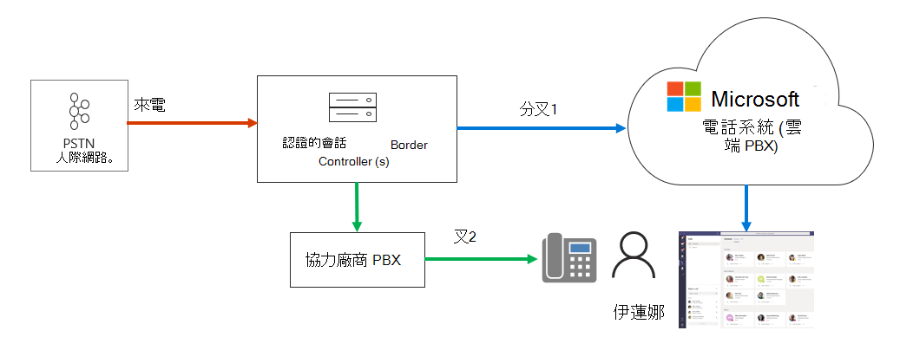
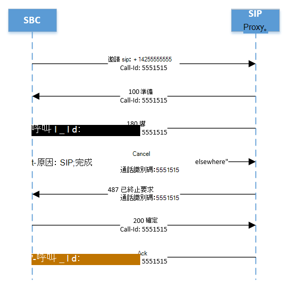

# 管理來電通知Manage call notifications

本文說明如何管理使用者的呼叫通知。This article describes how to manage call notifications for your users. 您可以將呼叫端點設定為兩個小組，以及協力廠商的專用分支 Exchange （PBX）或會話邊界控制器（SBC）。You can configure call endpoints to both Teams and to a third-party Private Branch Exchange (PBX) or Session Border Controller (SBC).  例如，如果您想要同時將呼叫傳送給使用者的行動裝置和手機，這會很有用。This is useful, for example, if you want to send a call to a user's mobile and desk phones at the same time.   

在下圖中，使用者 Irena 有兩個端點：In the following diagram, user Irena has two endpoints:

- 團隊端點A Teams endpoint
- 連接至協力廠商 SBC 的 SIP 電話A SIP phone connected to a third-party SBC

當來電到達時，SBC 會將電話系統 Direct 路由和協力廠商 SBC 之間的呼叫派生。When a call arrives, the SBC forks the call between Phone System Direct Routing and the third-party SBC.

如果在分叉2（由協力廠商 SBC）接受呼叫，小組會產生「未接來電」通知。If the call is accepted on Fork 2 (by the third-party SBC), Teams will generate a “Missed Call” notification.  

您可以將 SBC 設定為在分叉1上傳送取消，以避免「未接來電」通知，如下所示：You can prevent the “Missed Call” notification by configuring the SBC to send a Cancel on Fork 1 as follows:

原因： SIP;原因 = 200; 文字「通話完成于別處」REASON: SIP; cause=200;text”Call completed elsewhere” 

請注意，通話不會在 Microsoft Phone 系統的通話詳細資料記錄中登入，因為這是成功的呼叫。Note that the call will not be registered in the call detail records of Microsoft Phone System as a successful call. 呼叫將會註冊為「嘗試」，其最終 SIP 程式碼為「487」、最終的 Microsoft 子代碼 "540200"，以及最後一個 SIP 程式碼片語「在別處完成通話」。The call will be registered as an “Attempt” with Final SIP Code “487”, Final Microsoft subcode “540200”, and Final SIP Code Phrase “Call completed elsewhere”.   （若要查看通話明細記錄，請移至 [團隊管理員] 入口網站、[分析] 和 [報表] 的使用方式報告，然後選取 [PSNT 使用量]。）(To view the call detail records, go the Teams Admin portal, Analytics and Reports, Usage Reports, and select PSNT Usage.)

下圖說明分叉1的 SIP 階梯，說明通話流程，以及取消訊息中的預期原因。The diagram below illustrates the SIP ladder for Fork 1, explains the call flow, and the expected REASON in the Cancel message. 

