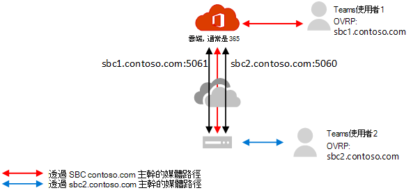

# 設定媒體旁路搭配直接路由

在使用直接路由配置旁路媒體之前，請確定您有[使用直接路由的媒體旁路方案](direct-routing-plan-media-bypass.md)。

若要開啟 [媒體旁路]，必須符合下列條件：

1.    請確定您的會話邊界控制器（SBC）選擇支援媒體旁路，並提供如何在 SBC 上設定旁路的指示。 請參閱認證頁面，瞭解 SBCs、支援媒體旁路的資訊，以及相關指示。

2.    您必須使用下列命令在幹線上開啟媒體旁路： **CSOnlinePSTNGateway 身分識別 <sbc_FQDN>-MediaBypass $true**。

3.    確定所需的埠已開啟。 

## 從非回避 trunks 遷移到旁路啟用的 trunks

您可以一次切換所有使用者，或者您可以執行分階段的階段（建議使用）。

- **一次切換所有使用者。** 如果符合所有條件，您可以開啟 [略過] 模式。 不過，您所有的生產使用者都會同時進行切換。 因為您在最初設定 trunks 和埠時可能會遇到一些問題，所以您的生產使用者體驗可能會受到影響。 

- **分階段的方法。（建議使用）**。  針對同一個 SBC （使用不同的埠）建立新的主幹，進行測試，然後變更使用者的線上語音路由原則，以指向新的主幹。 

  這是建議的方法，因為它可讓您更順暢地轉換和不間斷的使用者體驗。 這個方法需要使用 SBC、新的 FQDN 名稱和防火牆的設定。 注意：您必須確認您的憑證同時支援這兩個 trunks。 在 SAN 中，您必須有兩個名稱（**sbc1.contoso.com**和**sbc2.contoso.com**），或是擁有萬用字元證書。

如需如何設定 trunks 及執行遷移的指示，請參閱來自 SBC 廠商的檔：

- [AudioCodes 部署檔](https://www.audiocodes.com/solutions-products/products/products-for-microsoft-365/direct-routing-for-microsoft-teams)
- [Oracle 部署檔](https://www.oracle.com/industries/communications/enterprise-session-border-controller/microsoft.html)
- [功能區通訊部署檔](https://ribboncommunications.com/solutions/enterprise-solutions/microsoft-solutions/direct-routing-microsoft-teams-calling)
- [TE-系統（anynode）部署檔](https://www.anynode.de/anynode-and-microsoft-teams/)

如需直接路由認證的會話邊界控制器（SBCs）清單，請參閱[認證直接路由的會話 Broder 控制器清單](direct-routing-border-controllers.md)。

## 相關主題

[使用直接路由規劃媒體旁路](direct-routing-plan-media-bypass.md)

