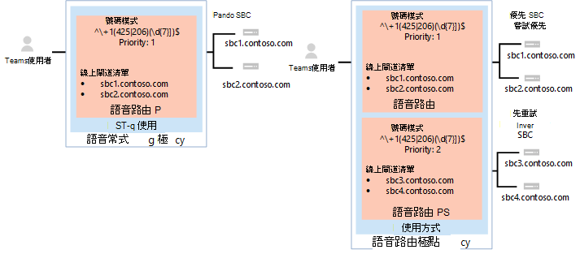
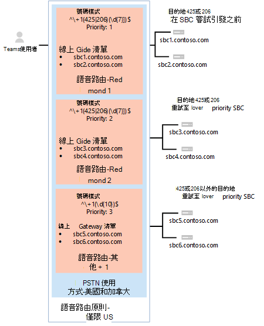
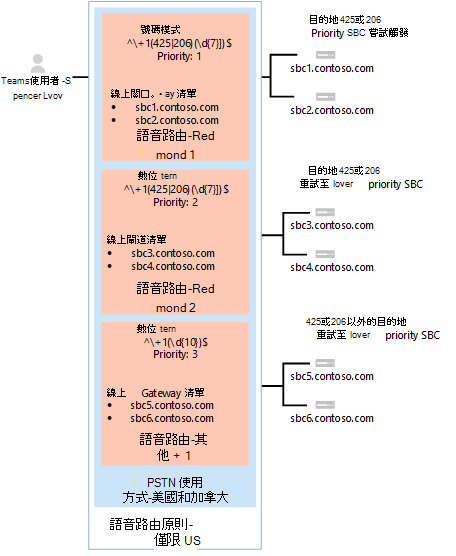
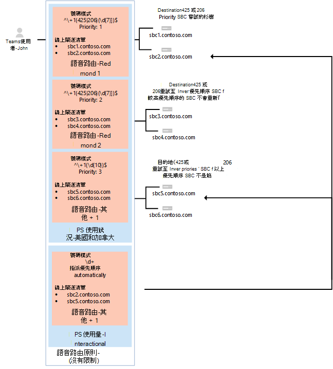

# <a name="configure-direct-routing"></a><span data-ttu-id="5aa18-103">設定直接路由</span><span class="sxs-lookup"><span data-stu-id="5aa18-103">Configure Direct Routing</span></span>

> [!Tip]
> <span data-ttu-id="5aa18-104">請觀看下列會話，瞭解直接路由的優點、如何規劃，以及部署方式：[直接在 Microsoft 團隊中傳送路線](https://aka.ms/teams-direct-routing)</span><span class="sxs-lookup"><span data-stu-id="5aa18-104">Watch the following session to learn about the benefits of Direct Routing, how to plan for it, and how to deploy it: [Direct Routing in Microsoft Teams](https://aka.ms/teams-direct-routing)</span></span>

<span data-ttu-id="5aa18-105">如果您尚未這麼做，請閱讀規劃先決條件的 [[直接路由](direct-routing-plan.md)]，並查看設定 Microsoft Phone 系統網路之前所需採取的其他步驟。</span><span class="sxs-lookup"><span data-stu-id="5aa18-105">If you have not already done so, read [Plan Direct Routing](direct-routing-plan.md) for prerequisites and to review other steps you’ll need to take before you configure your Microsoft Phone System network.</span></span> 

<span data-ttu-id="5aa18-106">本文說明如何設定 Microsoft Phone 系統 Direct 路由。</span><span class="sxs-lookup"><span data-stu-id="5aa18-106">This article describes how to configure Microsoft Phone System Direct Routing.</span></span> <span data-ttu-id="5aa18-107">它詳細說明如何將支援的會話邊界控制器（SBC）搭配使用，以直接傳送路線，以及如何將 Microsoft 團隊使用者設定為使用直接路由來連接至公用的交換電話網絡（PSTN）。</span><span class="sxs-lookup"><span data-stu-id="5aa18-107">It details how to pair a supported Session Border Controller (SBC) to Direct Routing and how to configure Microsoft Teams users to use Direct Routing to connect to the Public Switched Telephone Network (PSTN).</span></span> <span data-ttu-id="5aa18-108">若要完成本文所述的步驟，管理員需要熟悉 PowerShell Cmdlet。</span><span class="sxs-lookup"><span data-stu-id="5aa18-108">To complete the steps explained in this article, administrators need some familiarity with PowerShell cmdlets.</span></span> <span data-ttu-id="5aa18-109">如需有關使用 PowerShell 的詳細資訊，請參閱[設定您的 Windows PowerShell 電腦](https://docs.microsoft.com/SkypeForBusiness/set-up-your-computer-for-windows-powershell/set-up-your-computer-for-windows-powershell)。</span><span class="sxs-lookup"><span data-stu-id="5aa18-109">For more information about using PowerShell, see [Set up your computer for Windows PowerShell](https://docs.microsoft.com/SkypeForBusiness/set-up-your-computer-for-windows-powershell/set-up-your-computer-for-windows-powershell).</span></span> 

<span data-ttu-id="5aa18-110">我們建議您確認您的 SBC 已按照您的 SBC 廠商的建議進行設定：</span><span class="sxs-lookup"><span data-stu-id="5aa18-110">We recommend that you confirm that your SBC has already been configured as recommended by your SBC vendor:</span></span> 

- [<span data-ttu-id="5aa18-111">AudioCodes 部署檔</span><span class="sxs-lookup"><span data-stu-id="5aa18-111">AudioCodes deployment documentation</span></span>](https://www.audiocodes.com/solutions-products/products/products-for-microsoft-365/direct-routing-for-microsoft-teams)
- [<span data-ttu-id="5aa18-112">Oracle 部署檔</span><span class="sxs-lookup"><span data-stu-id="5aa18-112">Oracle deployment documentation</span></span>](https://www.oracle.com/industries/communications/enterprise-session-border-controller/microsoft.html)
- [<span data-ttu-id="5aa18-113">功能區通訊部署檔</span><span class="sxs-lookup"><span data-stu-id="5aa18-113">Ribbon Communications deployment documentation</span></span>](https://ribboncommunications.com/solutions/enterprise-solutions/microsoft-solutions/direct-routing-microsoft-teams-calling)
- [<span data-ttu-id="5aa18-114">TE-系統（anynode）部署檔</span><span class="sxs-lookup"><span data-stu-id="5aa18-114">TE-Systems (anynode) deployment documentation</span></span>](https://www.anynode.de/anynode-and-microsoft-teams/)

<span data-ttu-id="5aa18-115">您可以設定您的 Microsoft 手機系統，並讓使用者使用直接路由，然後將 Microsoft 團隊設定為首選的呼叫用戶端，方法是完成下列程式：</span><span class="sxs-lookup"><span data-stu-id="5aa18-115">You can configure your Microsoft Phone System and enable users to use Direct Routing, then set up Microsoft Teams as the preferred calling client by completing the following procedures:</span></span> 

- [<span data-ttu-id="5aa18-116">將 SBC 與 Microsoft 手機系統配對並驗證配對</span><span class="sxs-lookup"><span data-stu-id="5aa18-116">Pair the SBC with a Microsoft Phone System and validate the pairing</span></span>](#pair-the-sbc-to-the-direct-routing-service-of-phone-system)
- [<span data-ttu-id="5aa18-117">允許使用者使用直接路由服務</span><span class="sxs-lookup"><span data-stu-id="5aa18-117">Enable users for Direct Routing Service</span></span>](#enable-users-for-direct-routing-service)
- <span data-ttu-id="5aa18-118">確定 Microsoft 團隊是使用者的首選呼叫用戶端</span><span class="sxs-lookup"><span data-stu-id="5aa18-118">Ensure that Microsoft Teams is the preferred calling client for the users</span></span>

## <a name="pair-the-sbc-to-the-direct-routing-service-of-phone-system"></a><span data-ttu-id="5aa18-119">將 SBC 與電話系統的直接路由服務配對</span><span class="sxs-lookup"><span data-stu-id="5aa18-119">Pair the SBC to the Direct Routing Service of Phone System</span></span> 

<span data-ttu-id="5aa18-120">以下是可讓您將 SBC 連接或配對至直接路由介面的三個高層次步驟：</span><span class="sxs-lookup"><span data-stu-id="5aa18-120">The following are the three high-level steps to let you connect, or pair, the SBC to the Direct Routing interface:</span></span> 

- <span data-ttu-id="5aa18-121">使用 PowerShell**連線到商務用 Skype Online**系統管理中心</span><span class="sxs-lookup"><span data-stu-id="5aa18-121">Connect to **Skype for Business Online** admin center using PowerShell</span></span> 
- <span data-ttu-id="5aa18-122">對 SBC 進行配對</span><span class="sxs-lookup"><span data-stu-id="5aa18-122">Pair the SBC</span></span> 
- <span data-ttu-id="5aa18-123">驗證配對</span><span class="sxs-lookup"><span data-stu-id="5aa18-123">Validate the pairing</span></span> 

### <a name="connect-to-skype-for-business-online-by-using-powershell"></a><span data-ttu-id="5aa18-124">使用 PowerShell 連線到商務用 Skype Online</span><span class="sxs-lookup"><span data-stu-id="5aa18-124">Connect to Skype for Business Online by using PowerShell</span></span> 

<span data-ttu-id="5aa18-125">您可以使用連接至租使用者的 PowerShell 會話，將 SBC 與直接路由介面配對。</span><span class="sxs-lookup"><span data-stu-id="5aa18-125">You can use a PowerShell session connected to the tenant to pair the SBC to the Direct Routing interface.</span></span> <span data-ttu-id="5aa18-126">若要開啟 PowerShell 會話，請依照[設定您的 Windows PowerShell 電腦](https://docs.microsoft.com/SkypeForBusiness/set-up-your-computer-for-windows-powershell/set-up-your-computer-for-windows-powershell)中所述的步驟進行。</span><span class="sxs-lookup"><span data-stu-id="5aa18-126">To open a PowerShell session, please follow the steps outlined in [Set up your computer for Windows PowerShell](https://docs.microsoft.com/SkypeForBusiness/set-up-your-computer-for-windows-powershell/set-up-your-computer-for-windows-powershell).</span></span> 
 
<span data-ttu-id="5aa18-127">建立遠端 PowerShell 會話之後，請確認您可以看到管理 SBC 的命令。</span><span class="sxs-lookup"><span data-stu-id="5aa18-127">After you establish a remote PowerShell session, please validate that you can see the commands to manage the SBC.</span></span> <span data-ttu-id="5aa18-128">若要驗證命令，請在 PowerShell 會話中輸入或複製/貼上下列內容，然後按 Enter：</span><span class="sxs-lookup"><span data-stu-id="5aa18-128">To validate the commands, type or copy/paste in the following in the PowerShell session and press Enter:</span></span> 

```
Get-Command *onlinePSTNGateway*
```

<span data-ttu-id="5aa18-129">您的命令會傳回這裡顯示的四個函數，可讓您管理 SBC。</span><span class="sxs-lookup"><span data-stu-id="5aa18-129">Your command will return the four functions shown here that will let you manage the SBC.</span></span> 

<pre>
CommandType    Name                       Version    Source 
-----------    ----                       -------    ------ 
Function       Get-CsOnlinePSTNGateway    1.0        tmp_v5fiu1no.wxt 
Function       New-CsOnlinePSTNGateway    1.0        tmp_v5fiu1no.wxt 
Function       Remove-CsOnlinePSTNGateway 1.0        tmp_v5fiu1no.wxt 
Function       Set-CsOnlinePSTNGateway    1.0        tmp_v5fiu1no.wxt
</pre>   


### <a name="pair-the-sbc-to-the-tenant"></a><span data-ttu-id="5aa18-130">將 SBC 與租使用者配對</span><span class="sxs-lookup"><span data-stu-id="5aa18-130">Pair the SBC to the tenant</span></span> 

<span data-ttu-id="5aa18-131">若要將 SBC 與租使用者進行配對，請在 PowerShell 會話中輸入下列內容，然後按 Enter 鍵：</span><span class="sxs-lookup"><span data-stu-id="5aa18-131">To pair the SBC to the tenant, in the PowerShell session type the following and press Enter:</span></span> 

```
New-CsOnlinePSTNGateway -Fqdn <SBC FQDN> -SipSignallingPort <SBC SIP Port> -MaxConcurrentSessions <Max Concurrent Sessions the SBC can handle> -Enabled $true 
```
  > [!NOTE]
  > 1. <span data-ttu-id="5aa18-132">我們強烈建議您在 SBC 中設定最大通話限制，使用可在 SBC 檔中找到的資訊。</span><span class="sxs-lookup"><span data-stu-id="5aa18-132">We highly recommend setting a maximum call limit in the SBC, using information that can be found in the SBC documentation.</span></span> <span data-ttu-id="5aa18-133">如果 SBC 是容量等級，則限制會觸發通知。</span><span class="sxs-lookup"><span data-stu-id="5aa18-133">The limit will trigger a notification if the SBC is at the capacity level.</span></span>
  > 2. <span data-ttu-id="5aa18-134">您只能將 SBC 的網域部分與您在租使用者中註冊的其中一個網域相符（除了\*onmicrosoft.com），才能將它配對。</span><span class="sxs-lookup"><span data-stu-id="5aa18-134">You can only pair the SBC if the domain portion of its FQDN matches one of the domains registered in your tenant, except \*.onmicrosoft.com.</span></span> <span data-ttu-id="5aa18-135">SBC \*FQDN 名稱不支援使用 onmicrosoft.com 功能變數名稱。</span><span class="sxs-lookup"><span data-stu-id="5aa18-135">Using \*.onmicrosoft.com domain names is not supported for the SBC FQDN name.</span></span> <span data-ttu-id="5aa18-136">例如，如果您有兩個功能變數名稱：</span><span class="sxs-lookup"><span data-stu-id="5aa18-136">For example, if you have two domain names:</span></span><br/><br/>
  > <span data-ttu-id="5aa18-137">**contoso**</span><span class="sxs-lookup"><span data-stu-id="5aa18-137">**contoso**.com</span></span><br/><span data-ttu-id="5aa18-138">**contoso**. onmicrosoft.com</span><span class="sxs-lookup"><span data-stu-id="5aa18-138">**contoso**.onmicrosoft.com</span></span><br/><br/>
  > <span data-ttu-id="5aa18-139">針對 SBC 名稱，您可以使用名稱 sbc.contoso.com。</span><span class="sxs-lookup"><span data-stu-id="5aa18-139">For the SBC name, you can use the name sbc.contoso.com.</span></span> <span data-ttu-id="5aa18-140">如果您嘗試將 SBC 與 name （contoso..）結合使用，系統將不會讓您，因為該域不是由這個租使用者所擁有。</span><span class="sxs-lookup"><span data-stu-id="5aa18-140">If you try to pair the SBC with a name sbc.contoso.abc, the system will not let you, as the domain is not owned by this tenant.</span></span><br/>
  > <span data-ttu-id="5aa18-141">除了在您的租使用者中註冊的網域外，請務必先擁有該網域的使用者以及指派的 E3 或 E5 授權。</span><span class="sxs-lookup"><span data-stu-id="5aa18-141">In addition to the domain registered in your tenant, it is important that there is a user with that domain and an assigned E3 or E5 license.</span></span> <span data-ttu-id="5aa18-142">如果不是，您會收到下列錯誤：</span><span class="sxs-lookup"><span data-stu-id="5aa18-142">If not, you will receive the following error:</span></span><br/>
  <span data-ttu-id="5aa18-143">`Can not use the “sbc.contoso.com” domain as it was not configured for this tenant`.</span><span class="sxs-lookup"><span data-stu-id="5aa18-143"></span></span>

```
New-CsOnlinePSTNGateway -Identity sbc.contoso.com -Enabled $true -SipSignallingPort 5067 -MaxConcurrentSessions 100 
```
<span data-ttu-id="5aa18-144">回報</span><span class="sxs-lookup"><span data-stu-id="5aa18-144">Returns:</span></span>
<pre>
Identity              : sbc.contoso.com 
Fqdn                  : sbc.contoso.com 
SipSignallingPort     : 5067 
FailoverTimeSeconds   : 10 
ForwardCallHistory    : False 
ForwardPai            : False 
SendSipOptions        : True 
MaxConcurrentSessions : 100 
Enabled               : True   
</pre>
<span data-ttu-id="5aa18-145">您可以在配對處理期間設定其他選項。</span><span class="sxs-lookup"><span data-stu-id="5aa18-145">There are additional options that can be set during the pairing process.</span></span> <span data-ttu-id="5aa18-146">不過，在前面的範例中，只會顯示所需的最低參數。</span><span class="sxs-lookup"><span data-stu-id="5aa18-146">In the previous example, however, only the minimum required parameters are shown.</span></span> 
 
<span data-ttu-id="5aa18-147">下表列出您可以用來設定參數的其他參數`New-CsOnlinePstnGateway`</span><span class="sxs-lookup"><span data-stu-id="5aa18-147">The following table lists the additional parameters that you can use in setting parameters for `New-CsOnlinePstnGateway`</span></span>

|<span data-ttu-id="5aa18-148">必填？</span><span class="sxs-lookup"><span data-stu-id="5aa18-148">Required?</span></span>|<span data-ttu-id="5aa18-149">名稱</span><span class="sxs-lookup"><span data-stu-id="5aa18-149">Name</span></span>|<span data-ttu-id="5aa18-150">說明</span><span class="sxs-lookup"><span data-stu-id="5aa18-150">Description</span></span>|<span data-ttu-id="5aa18-151">設置</span><span class="sxs-lookup"><span data-stu-id="5aa18-151">Default</span></span>|<span data-ttu-id="5aa18-152">可能值</span><span class="sxs-lookup"><span data-stu-id="5aa18-152">Possible values</span></span>|<span data-ttu-id="5aa18-153">類型與限制</span><span class="sxs-lookup"><span data-stu-id="5aa18-153">Type and restrictions</span></span>|
|:-----|:-----|:-----|:-----|:-----|:-----|
|<span data-ttu-id="5aa18-154">是的</span><span class="sxs-lookup"><span data-stu-id="5aa18-154">Yes</span></span>|<span data-ttu-id="5aa18-155">稱</span><span class="sxs-lookup"><span data-stu-id="5aa18-155">FQDN</span></span>|<span data-ttu-id="5aa18-156">SBC 的 FQDN 名稱</span><span class="sxs-lookup"><span data-stu-id="5aa18-156">The FQDN name of the SBC</span></span> |<span data-ttu-id="5aa18-157">無</span><span class="sxs-lookup"><span data-stu-id="5aa18-157">None</span></span>|<span data-ttu-id="5aa18-158">NoneFQDN name，限制63字元</span><span class="sxs-lookup"><span data-stu-id="5aa18-158">NoneFQDN name, limit 63 characters</span></span>|<span data-ttu-id="5aa18-159">在[Active Directory 中針對電腦、網域、網站和組織單位命名慣例](https://support.microsoft.com/help/909264)的允許和禁止字元清單</span><span class="sxs-lookup"><span data-stu-id="5aa18-159">String, list of allowed and disallowed characters on [Naming conventions in Active Directory for computers, domains, sites, and OUs](https://support.microsoft.com/help/909264)</span></span>|
|<span data-ttu-id="5aa18-160">不</span><span class="sxs-lookup"><span data-stu-id="5aa18-160">No</span></span>|<span data-ttu-id="5aa18-161">MediaBypass</span><span class="sxs-lookup"><span data-stu-id="5aa18-161">MediaBypass</span></span> |<span data-ttu-id="5aa18-162">指示 SBC 的參數支援「媒體旁路」，且系統管理員想要使用它。</span><span class="sxs-lookup"><span data-stu-id="5aa18-162">Parameter indicated of the SBC supports Media Bypass and the administrator wants to use it.</span></span>|<span data-ttu-id="5aa18-163">無</span><span class="sxs-lookup"><span data-stu-id="5aa18-163">None</span></span>|<span data-ttu-id="5aa18-164">滿足</span><span class="sxs-lookup"><span data-stu-id="5aa18-164">True</span></span><br/><span data-ttu-id="5aa18-165">虛假</span><span class="sxs-lookup"><span data-stu-id="5aa18-165">False</span></span>|<span data-ttu-id="5aa18-166">Boolean</span><span class="sxs-lookup"><span data-stu-id="5aa18-166">Boolean</span></span>|
|<span data-ttu-id="5aa18-167">是的</span><span class="sxs-lookup"><span data-stu-id="5aa18-167">Yes</span></span>|<span data-ttu-id="5aa18-168">SipSignallingPort</span><span class="sxs-lookup"><span data-stu-id="5aa18-168">SipSignallingPort</span></span> |<span data-ttu-id="5aa18-169">使用傳輸層安全性（TLS）通訊協定，與直接路由服務通訊時所使用的偵聽埠。</span><span class="sxs-lookup"><span data-stu-id="5aa18-169">Listening port used for communicating with Direct Routing services by using the Transport Layer Security (TLS) protocol.</span></span>|<span data-ttu-id="5aa18-170">無</span><span class="sxs-lookup"><span data-stu-id="5aa18-170">None</span></span>|<span data-ttu-id="5aa18-171">任何埠</span><span class="sxs-lookup"><span data-stu-id="5aa18-171">Any port</span></span>|<span data-ttu-id="5aa18-172">0到65535</span><span class="sxs-lookup"><span data-stu-id="5aa18-172">0 to 65535</span></span> |
|<span data-ttu-id="5aa18-173">不</span><span class="sxs-lookup"><span data-stu-id="5aa18-173">No</span></span>|<span data-ttu-id="5aa18-174">FailoverTimeSeconds</span><span class="sxs-lookup"><span data-stu-id="5aa18-174">FailoverTimeSeconds</span></span> |<span data-ttu-id="5aa18-175">當設定為10（預設值）時，閘道不會在10秒內應答的輸出呼叫會路由至下一個可用的幹線;如果沒有其他 trunks，就會自動中斷通話。</span><span class="sxs-lookup"><span data-stu-id="5aa18-175">When set to 10 (default value), outbound calls that are not answered by the gateway within 10 seconds are routed to the next available trunk; if there are no additional trunks, then the call is automatically dropped.</span></span> <span data-ttu-id="5aa18-176">組織的網路速度與閘道回應速度若是很慢，可能會造成來電不必要地遭到掛斷。</span><span class="sxs-lookup"><span data-stu-id="5aa18-176">In an organization with slow networks and gateway responses, that could potentially result in calls being dropped unnecessarily.</span></span> <span data-ttu-id="5aa18-177">預設值為10。</span><span class="sxs-lookup"><span data-stu-id="5aa18-177">The default value is 10.</span></span>|<span data-ttu-id="5aa18-178">第</span><span class="sxs-lookup"><span data-stu-id="5aa18-178">10</span></span>|<span data-ttu-id="5aa18-179">電話</span><span class="sxs-lookup"><span data-stu-id="5aa18-179">Number</span></span>|<span data-ttu-id="5aa18-180">Int</span><span class="sxs-lookup"><span data-stu-id="5aa18-180">Int</span></span>|
|<span data-ttu-id="5aa18-181">不</span><span class="sxs-lookup"><span data-stu-id="5aa18-181">No</span></span>|<span data-ttu-id="5aa18-182">ForwardCallHistory</span><span class="sxs-lookup"><span data-stu-id="5aa18-182">ForwardCallHistory</span></span> |<span data-ttu-id="5aa18-183">指出是否透過主幹轉送通話記錄資訊。</span><span class="sxs-lookup"><span data-stu-id="5aa18-183">Indicates whether call history information will be forwarded through the trunk.</span></span> <span data-ttu-id="5aa18-184">如果啟用，Office 365 PSTN Proxy 會傳送兩個標頭： [歷程記錄] 資訊和 [參照者]。</span><span class="sxs-lookup"><span data-stu-id="5aa18-184">If enabled, the Office 365 PSTN Proxy sends two headers: History-info and Referred-By.</span></span> <span data-ttu-id="5aa18-185">預設值為**False** （$False）。</span><span class="sxs-lookup"><span data-stu-id="5aa18-185">The default value is **False** ($False).</span></span> |<span data-ttu-id="5aa18-186">虛假</span><span class="sxs-lookup"><span data-stu-id="5aa18-186">False</span></span>|<span data-ttu-id="5aa18-187">滿足</span><span class="sxs-lookup"><span data-stu-id="5aa18-187">True</span></span><br/><span data-ttu-id="5aa18-188">虛假</span><span class="sxs-lookup"><span data-stu-id="5aa18-188">False</span></span>|<span data-ttu-id="5aa18-189">Boolean</span><span class="sxs-lookup"><span data-stu-id="5aa18-189">Boolean</span></span>|
|<span data-ttu-id="5aa18-190">不</span><span class="sxs-lookup"><span data-stu-id="5aa18-190">No</span></span>|<span data-ttu-id="5aa18-191">ForwardPAI</span><span class="sxs-lookup"><span data-stu-id="5aa18-191">ForwardPAI</span></span>|<span data-ttu-id="5aa18-192">指出 P-Asserted-Identity (PAI) 標頭是否要隨通話轉接。</span><span class="sxs-lookup"><span data-stu-id="5aa18-192">Indicates whether the P-Asserted-Identity (PAI) header will be forwarded along with the call.</span></span> <span data-ttu-id="5aa18-193">PAI 標頭可用於驗證來電者的身分識別。</span><span class="sxs-lookup"><span data-stu-id="5aa18-193">The PAI header provides a way to verify the identity of the caller.</span></span> <span data-ttu-id="5aa18-194">如果啟用，則也會傳送隱私權： ID 標頭。</span><span class="sxs-lookup"><span data-stu-id="5aa18-194">If enabled the Privacy:ID header will also be sent.</span></span> <span data-ttu-id="5aa18-195">預設值為**False** （$False）。</span><span class="sxs-lookup"><span data-stu-id="5aa18-195">The default value is **False** ($False).</span></span>|<span data-ttu-id="5aa18-196">虛假</span><span class="sxs-lookup"><span data-stu-id="5aa18-196">False</span></span>|<span data-ttu-id="5aa18-197">滿足</span><span class="sxs-lookup"><span data-stu-id="5aa18-197">True</span></span><br/><span data-ttu-id="5aa18-198">虛假</span><span class="sxs-lookup"><span data-stu-id="5aa18-198">False</span></span>|<span data-ttu-id="5aa18-199">Boolean</span><span class="sxs-lookup"><span data-stu-id="5aa18-199">Boolean</span></span>|
|<span data-ttu-id="5aa18-200">不</span><span class="sxs-lookup"><span data-stu-id="5aa18-200">No</span></span>|<span data-ttu-id="5aa18-201">SendSIPOptions</span><span class="sxs-lookup"><span data-stu-id="5aa18-201">SendSIPOptions</span></span> |<span data-ttu-id="5aa18-202">定義 SBC 是否將傳送 SIP 選項。</span><span class="sxs-lookup"><span data-stu-id="5aa18-202">Defines if an SBC will or will not send the SIP options.</span></span> <span data-ttu-id="5aa18-203">如果停用，則會將 SBC 排除在監視及觸發系統中。</span><span class="sxs-lookup"><span data-stu-id="5aa18-203">If disabled, the SBC will be excluded from Monitoring and Alerting system.</span></span> <span data-ttu-id="5aa18-204">我們強烈建議您啟用 SIP 選項。</span><span class="sxs-lookup"><span data-stu-id="5aa18-204">We highly recommend that you enable SIP options.</span></span> <span data-ttu-id="5aa18-205">預設值為**True**。</span><span class="sxs-lookup"><span data-stu-id="5aa18-205">Default value is **True**.</span></span> |<span data-ttu-id="5aa18-206">滿足</span><span class="sxs-lookup"><span data-stu-id="5aa18-206">True</span></span>|<span data-ttu-id="5aa18-207">滿足</span><span class="sxs-lookup"><span data-stu-id="5aa18-207">True</span></span><br/><span data-ttu-id="5aa18-208">虛假</span><span class="sxs-lookup"><span data-stu-id="5aa18-208">False</span></span>|<span data-ttu-id="5aa18-209">Boolean</span><span class="sxs-lookup"><span data-stu-id="5aa18-209">Boolean</span></span>|
|<span data-ttu-id="5aa18-210">不</span><span class="sxs-lookup"><span data-stu-id="5aa18-210">No</span></span>|<span data-ttu-id="5aa18-211">MaxConcurrentSessions</span><span class="sxs-lookup"><span data-stu-id="5aa18-211">MaxConcurrentSessions</span></span> |<span data-ttu-id="5aa18-212">由觸發系統所使用。</span><span class="sxs-lookup"><span data-stu-id="5aa18-212">Used by alerting system.</span></span> <span data-ttu-id="5aa18-213">設定任何值後，當併發會話數量為 90% 或高於此值時，警示系統會在租使用者管理員產生警示。</span><span class="sxs-lookup"><span data-stu-id="5aa18-213">When any value is set, the alerting system will generate an alert to the tenant administrator when the number of concurrent session is 90% or higher than this value.</span></span> <span data-ttu-id="5aa18-214">如果未設定參數，就不會產生預警。</span><span class="sxs-lookup"><span data-stu-id="5aa18-214">If parameter is not set, the alerts are not generated.</span></span> <span data-ttu-id="5aa18-215">不過，監視系統會在每24小時報告併發會話數目。</span><span class="sxs-lookup"><span data-stu-id="5aa18-215">However, the monitoring system will report number of concurrent session every 24 hours.</span></span> |<span data-ttu-id="5aa18-216">非</span><span class="sxs-lookup"><span data-stu-id="5aa18-216">Null</span></span>|<span data-ttu-id="5aa18-217">非</span><span class="sxs-lookup"><span data-stu-id="5aa18-217">Null</span></span><br/><span data-ttu-id="5aa18-218">1到100000</span><span class="sxs-lookup"><span data-stu-id="5aa18-218">1 to 100,000</span></span> ||
|<span data-ttu-id="5aa18-219">不</span><span class="sxs-lookup"><span data-stu-id="5aa18-219">No</span></span>|<span data-ttu-id="5aa18-220">MediaRelayRoutingLocationOverride</span><span class="sxs-lookup"><span data-stu-id="5aa18-220">MediaRelayRoutingLocationOverride</span></span> |<span data-ttu-id="5aa18-221">允許手動選取媒體路徑。</span><span class="sxs-lookup"><span data-stu-id="5aa18-221">Allows selecting path for media manually.</span></span> <span data-ttu-id="5aa18-222">[直接傳送] 會根據 SBC 的公用 IP，指派媒體路徑的資料中心。</span><span class="sxs-lookup"><span data-stu-id="5aa18-222">Direct Routing assigns a datacenter for media path based on the public IP of the SBC.</span></span> <span data-ttu-id="5aa18-223">我們總是選取最接近 SBC 資料中心的資料。</span><span class="sxs-lookup"><span data-stu-id="5aa18-223">We always select closest to the SBC datacenter.</span></span> <span data-ttu-id="5aa18-224">不過，在某些情況下，來自例如美國範圍的公用 IP 可以指派給位於歐洲的 SBC。</span><span class="sxs-lookup"><span data-stu-id="5aa18-224">However, in some cases a public IP from for example a US range can be assigned to an SBC located in Europe.</span></span> <span data-ttu-id="5aa18-225">在這種情況下，我們會使用不是最佳的媒體路徑。</span><span class="sxs-lookup"><span data-stu-id="5aa18-225">In this case we will be using not optimal media path.</span></span> <span data-ttu-id="5aa18-226">這個參數可讓您手動設定媒體流量的首選區域。</span><span class="sxs-lookup"><span data-stu-id="5aa18-226">This parameter allows manually set the preferred region for media traffic.</span></span> <span data-ttu-id="5aa18-227">我們只建議在通話記錄中清楚指出自動指派媒體路徑的 datacenter，不會指派最接近 SBC 資料中心的資料中心。</span><span class="sxs-lookup"><span data-stu-id="5aa18-227">We only recommend setting this parameter if the call logs clearly indicate that automatic assignment of the datacenter for media path does not assign the closest to the SBC datacenter.</span></span> |<span data-ttu-id="5aa18-228">無</span><span class="sxs-lookup"><span data-stu-id="5aa18-228">None</span></span>|<span data-ttu-id="5aa18-229">ISO 格式的國家/地區代碼</span><span class="sxs-lookup"><span data-stu-id="5aa18-229">Country codes in ISO format</span></span>||
|<span data-ttu-id="5aa18-230">不</span><span class="sxs-lookup"><span data-stu-id="5aa18-230">No</span></span>|<span data-ttu-id="5aa18-231">後</span><span class="sxs-lookup"><span data-stu-id="5aa18-231">Enabled</span></span>|<span data-ttu-id="5aa18-232">用來針對撥出通話啟用這個 SBC。</span><span class="sxs-lookup"><span data-stu-id="5aa18-232">Used to enable this SBC for outbound calls.</span></span> <span data-ttu-id="5aa18-233">可用於暫時移除 SBC，或在進行更新或在維護期間進行。</span><span class="sxs-lookup"><span data-stu-id="5aa18-233">Can be used to temporarily remove the SBC, while it is being updated or during maintenance.</span></span> |<span data-ttu-id="5aa18-234">虛假</span><span class="sxs-lookup"><span data-stu-id="5aa18-234">False</span></span>|<span data-ttu-id="5aa18-235">滿足</span><span class="sxs-lookup"><span data-stu-id="5aa18-235">True</span></span><br/><span data-ttu-id="5aa18-236">虛假</span><span class="sxs-lookup"><span data-stu-id="5aa18-236">False</span></span>|<span data-ttu-id="5aa18-237">Boolean</span><span class="sxs-lookup"><span data-stu-id="5aa18-237">Boolean</span></span>|
 
### <a name="verify-the-sbc-pairing"></a><span data-ttu-id="5aa18-238">驗證 SBC 配對</span><span class="sxs-lookup"><span data-stu-id="5aa18-238">Verify the SBC pairing</span></span> 

<span data-ttu-id="5aa18-239">確認連線：</span><span class="sxs-lookup"><span data-stu-id="5aa18-239">Verify the connection:</span></span> 
- <span data-ttu-id="5aa18-240">檢查 SBC 是否在成對的 SBCs 清單中。</span><span class="sxs-lookup"><span data-stu-id="5aa18-240">Check if the SBC is on the list of paired SBCs.</span></span> 
- <span data-ttu-id="5aa18-241">驗證 SIP 選項。</span><span class="sxs-lookup"><span data-stu-id="5aa18-241">Validate SIP Options.</span></span> 
 
#### <a name="validate-if-the-sbc-is-on-the-list-of-paired-sbcs"></a><span data-ttu-id="5aa18-242">驗證 SBC 是否在成對半形的清單中</span><span class="sxs-lookup"><span data-stu-id="5aa18-242">Validate if the SBC is on the list of paired SBCs</span></span> 

<span data-ttu-id="5aa18-243">在您配對 SBC 之後，請在遠端 PowerShell 會話中執行下列命令，以驗證 SBC 是否出現在成對的 SBCs 清單中：`Get-CSOnlinePSTNGateway`</span><span class="sxs-lookup"><span data-stu-id="5aa18-243">After you pair the SBC, validate that the SBC is present in the list of paired SBCs by running the following command in a remote PowerShell session: `Get-CSOnlinePSTNGateway`</span></span>

<span data-ttu-id="5aa18-244">成對閘道應該會出現在清單中，如下列範例所示，並確認*已啟用*參數顯示值**True**。</span><span class="sxs-lookup"><span data-stu-id="5aa18-244">The paired gateway should appear in the list as shown in the example below, and verify that the parameter *Enabled* displays the value **True**.</span></span> <span data-ttu-id="5aa18-245">鍵</span><span class="sxs-lookup"><span data-stu-id="5aa18-245">Enter:</span></span>

```
Get-CsOnlinePSTNGateway -Identity sbc.contoso.com  
```
<span data-ttu-id="5aa18-246">返回：</span><span class="sxs-lookup"><span data-stu-id="5aa18-246">Which returns:</span></span>
<pre>
Identity              : sbc.contoso.com  
Fqdn                  : sbc.contoso.com 
SipSignallingPort     : 5067 
CodecPriority         : SILKWB,SILKNB,PCMU,PCMA 
ExcludedCodecs        :  
FailoverTimeSeconds   : 10 
ForwardCallHistory    : False 
ForwardPai            : False 
SendSipOptions        : True 
MaxConcurrentSessions : 100 
Enabled               : True 
</pre>

#### <a name="validate-sip-options-flow"></a><span data-ttu-id="5aa18-247">驗證 SIP 選項流程</span><span class="sxs-lookup"><span data-stu-id="5aa18-247">Validate SIP Options flow</span></span> 

<span data-ttu-id="5aa18-248">若要使用外寄 SIP 選項驗證配對，請使用 SBC 管理介面，並確認 SBC 是否收到其外寄選項訊息的 200 OK 回應。</span><span class="sxs-lookup"><span data-stu-id="5aa18-248">To validate the pairing using outgoing SIP Options, use the SBC management interface and confirm that the SBC receives 200 OK responses to its outgoing OPTIONS messages.</span></span>

<span data-ttu-id="5aa18-249">當直接路由查看內送的選項時，它會開始將傳出的 SIP 選項訊息傳送到 [傳入選項] 訊息中的 [連絡人頭] 欄位中設定的 SBC FQDN。</span><span class="sxs-lookup"><span data-stu-id="5aa18-249">When Direct Routing sees incoming OPTIONS, it will start sending outgoing SIP Options messages to the SBC FQDN configured in the Contact header field in the incoming OPTIONS message.</span></span> 

<span data-ttu-id="5aa18-250">若要使用傳入的 SIP 選項驗證配對，請使用 SBC 管理介面，並查看 SBC 會傳送回復給來自直接路由的選項訊息，且其傳送的回應代碼為 200 OK。</span><span class="sxs-lookup"><span data-stu-id="5aa18-250">To validate the pairing using incoming SIP Options, use the SBC management interface and see that the SBC sends a reply to the OPTIONS messages coming in from Direct Routing and that the response code it sends is 200 OK.</span></span>

## <a name="enable-users-for-direct-routing-service"></a><span data-ttu-id="5aa18-251">允許使用者使用直接路由服務</span><span class="sxs-lookup"><span data-stu-id="5aa18-251">Enable users for Direct Routing Service</span></span> 

<span data-ttu-id="5aa18-252">當您準備好要讓使用者使用直接路由服務時，請遵循下列步驟：</span><span class="sxs-lookup"><span data-stu-id="5aa18-252">When you are ready to enable users for the Direct Routing Service, follow these steps:</span></span> 

1. <span data-ttu-id="5aa18-253">在 Office 365 中建立使用者並指派電話系統授權。</span><span class="sxs-lookup"><span data-stu-id="5aa18-253">Create a user in Office 365 and assign a phone system license.</span></span> 
2. <span data-ttu-id="5aa18-254">確定使用者是駐留在商務用 Skype Online 中。</span><span class="sxs-lookup"><span data-stu-id="5aa18-254">Ensure that the user is homed in Skype for Business Online.</span></span> 
3. <span data-ttu-id="5aa18-255">設定電話號碼，並啟用企業語音及語音信箱。</span><span class="sxs-lookup"><span data-stu-id="5aa18-255">Configure the phone number and enable enterprise voice and voicemail.</span></span> 
4. <span data-ttu-id="5aa18-256">設定語音路由。</span><span class="sxs-lookup"><span data-stu-id="5aa18-256">Configure voice routing.</span></span> <span data-ttu-id="5aa18-257">此路線會自動驗證。</span><span class="sxs-lookup"><span data-stu-id="5aa18-257">The route is automatically validated.</span></span>

### <a name="create-a-user-in-office-365-and-assign-the-license"></a><span data-ttu-id="5aa18-258">在 Office 365 中建立使用者並指派授權</span><span class="sxs-lookup"><span data-stu-id="5aa18-258">Create a user in Office 365 and assign the license</span></span> 

<span data-ttu-id="5aa18-259">在 Office 365 中建立新使用者有兩個選項。</span><span class="sxs-lookup"><span data-stu-id="5aa18-259">There are two options for creating a new user in Office 365.</span></span> <span data-ttu-id="5aa18-260">不過，建議您的組織選取並使用其中一個選項來避免路由問題：</span><span class="sxs-lookup"><span data-stu-id="5aa18-260">However, we recommend that your organization select and use one option to avoid routing issues:</span></span> 

- <span data-ttu-id="5aa18-261">在內部部署的 Active Directory 中建立使用者，並將使用者同步處理到雲端。</span><span class="sxs-lookup"><span data-stu-id="5aa18-261">Create the user in on-premises Active Directory and sync the user to the cloud.</span></span> <span data-ttu-id="5aa18-262">請參閱[將您的內部部署目錄與 Azure Active Directory 整合](https://docs.microsoft.com/azure/active-directory/connect/active-directory-aadconnect)。</span><span class="sxs-lookup"><span data-stu-id="5aa18-262">See [Integrate your on-premises directories with Azure Active Directory](https://docs.microsoft.com/azure/active-directory/connect/active-directory-aadconnect).</span></span>
- <span data-ttu-id="5aa18-263">直接在 Office 365 管理員入口網站中建立使用者。</span><span class="sxs-lookup"><span data-stu-id="5aa18-263">Create the user directly in the Office 365 Administrator Portal.</span></span> <span data-ttu-id="5aa18-264">請參閱[個別或大量將使用者新增至 Office 365-系統管理協助](https://support.office.com/article/Add-users-individually-or-in-bulk-to-Office-365-Admin-Help-1970f7d6-03b5-442f-b385-5880b9c256ec)。</span><span class="sxs-lookup"><span data-stu-id="5aa18-264">See [Add users individually or in bulk to Office 365 - Admin Help](https://support.office.com/article/Add-users-individually-or-in-bulk-to-Office-365-Admin-Help-1970f7d6-03b5-442f-b385-5880b9c256ec).</span></span> 

<span data-ttu-id="5aa18-265">如果您的商務用 skype Online 部署與商務用 Skype 2015 或 Lync 2010/2013 內部部署共同存在，則支援的唯一選項是在內部部署 Active Directory 中建立使用者，並將使用者同步處理到雲端（選項1）。</span><span class="sxs-lookup"><span data-stu-id="5aa18-265">If your Skype for Business Online deployment co-exists with Skype for Business 2015 or Lync 2010/2013 on-premises, the only supported option is to create the user in on-premises Active Directory and sync the user to the cloud (Option 1).</span></span> 

<span data-ttu-id="5aa18-266">所需的授權：</span><span class="sxs-lookup"><span data-stu-id="5aa18-266">Required licenses:</span></span> 

- <span data-ttu-id="5aa18-267">Office 365 企業版 E3 （包括 SfB Plan2、Exchange Plan2 及團隊） + 電話系統</span><span class="sxs-lookup"><span data-stu-id="5aa18-267">Office 365 Enterprise E3 (including SfB Plan2, Exchange Plan2, and Teams) + Phone System</span></span>
- <span data-ttu-id="5aa18-268">Office 365 企業版 E5 （包括 SfB Plan2、Exchange Plan2、團隊及電話系統）</span><span class="sxs-lookup"><span data-stu-id="5aa18-268">Office 365 Enterprise E5 (including SfB Plan2, Exchange Plan2, Teams, and Phone System)</span></span> 

<span data-ttu-id="5aa18-269">選用的授權：</span><span class="sxs-lookup"><span data-stu-id="5aa18-269">Optional licenses:</span></span> 

- <span data-ttu-id="5aa18-270">通話方案</span><span class="sxs-lookup"><span data-stu-id="5aa18-270">Calling Plan</span></span> 
- <span data-ttu-id="5aa18-271">音訊會議</span><span class="sxs-lookup"><span data-stu-id="5aa18-271">Audio Conferencing</span></span> 

### <a name="ensure-that-the-user-is-homed-in-skype-for-business-online"></a><span data-ttu-id="5aa18-272">確定使用者是在商務用 Skype Online 中託管</span><span class="sxs-lookup"><span data-stu-id="5aa18-272">Ensure that the user is homed in Skype for Business Online</span></span> 

<span data-ttu-id="5aa18-273">[直接傳送] 要求使用者駐留在商務用 Skype Online 中。</span><span class="sxs-lookup"><span data-stu-id="5aa18-273">Direct Routing requires the user to be homed in Skype for Business Online.</span></span> <span data-ttu-id="5aa18-274">您可以透過查看 RegistrarPool 參數來檢查此情況。</span><span class="sxs-lookup"><span data-stu-id="5aa18-274">You can check this by looking at the RegistrarPool parameter.</span></span> <span data-ttu-id="5aa18-275">它必須在 infra.lync.com 網域中有一個值。</span><span class="sxs-lookup"><span data-stu-id="5aa18-275">It needs to have a value in the infra.lync.com domain.</span></span>

1. <span data-ttu-id="5aa18-276">[連線至遠端 PowerShell]。</span><span class="sxs-lookup"><span data-stu-id="5aa18-276">Connect to remote PowerShell.</span></span>
2. <span data-ttu-id="5aa18-277">發出命令：</span><span class="sxs-lookup"><span data-stu-id="5aa18-277">Issue the command:</span></span> 

```
Get-CsOnlineUser -Identity "<User name>" | fl RegistrarPool
``` 

### <a name="configure-the-phone-number-and-enable-enterprise-voice-and-voicemail"></a><span data-ttu-id="5aa18-278">設定電話號碼並啟用企業語音及語音信箱</span><span class="sxs-lookup"><span data-stu-id="5aa18-278">Configure the phone number and enable enterprise voice and voicemail</span></span> 

<span data-ttu-id="5aa18-279">在您建立使用者並指派授權之後，下一步就是設定他們的電話號碼和語音信箱。</span><span class="sxs-lookup"><span data-stu-id="5aa18-279">After you have created the user and assigned a license, the next step is to configure their phone number and voicemail.</span></span> <span data-ttu-id="5aa18-280">這可以一步完成。</span><span class="sxs-lookup"><span data-stu-id="5aa18-280">This can be done in one step.</span></span> 

<span data-ttu-id="5aa18-281">若要新增電話號碼並啟用語音信箱：</span><span class="sxs-lookup"><span data-stu-id="5aa18-281">To add the phone number and enable for voicemail:</span></span>
 
1. <span data-ttu-id="5aa18-282">連線到遠端 PowerShell 會話。</span><span class="sxs-lookup"><span data-stu-id="5aa18-282">Connect to a remote PowerShell session.</span></span> 
2. <span data-ttu-id="5aa18-283">輸入命令：</span><span class="sxs-lookup"><span data-stu-id="5aa18-283">Enter the command:</span></span> 
 
```
Set-CsUser -Identity "<User name>" -EnterpriseVoiceEnabled $true -HostedVoiceMail $true -OnPremLineURI tel:<E.164 phone number>
```

<span data-ttu-id="5aa18-284">例如，若要將使用者的電話號碼新增至 [Spencer Low]，您可以輸入下列專案：</span><span class="sxs-lookup"><span data-stu-id="5aa18-284">For example, to add a phone number for user "Spencer Low," you would enter the following:</span></span> 

```
Set-CsUser -Identity "Spencer Low" -OnPremLineURI tel:+14255388797 -EnterpriseVoiceEnabled $true -HostedVoiceMail $true
```

<span data-ttu-id="5aa18-285">所使用的電話號碼必須設定為完整的 E. 164 電話號碼（國家/地區碼）。</span><span class="sxs-lookup"><span data-stu-id="5aa18-285">The phone number used has to be configured as a full E.164 phone number with country code.</span></span> 

  > [!NOTE]
  > <span data-ttu-id="5aa18-286">如果使用者的電話號碼是在內部部署管理，請使用內部部署商務用 Skype 管理命令介面或 [控制台] 來設定使用者的電話號碼。</span><span class="sxs-lookup"><span data-stu-id="5aa18-286">If the user’s phone number is managed on premises, use on-premises Skype for Business Management Shell or Control Panel to configure the user's phone number.</span></span> 

### <a name="configure-voice-routing"></a><span data-ttu-id="5aa18-287">設定語音路由</span><span class="sxs-lookup"><span data-stu-id="5aa18-287">Configure Voice Routing</span></span> 

<span data-ttu-id="5aa18-288">Microsoft Phone 系統有一個路由機制，可讓您根據下列情況，將呼叫傳送到特定的 SBC：</span><span class="sxs-lookup"><span data-stu-id="5aa18-288">Microsoft Phone System has a routing mechanism that allows a call to be sent to a specific SBC based on:</span></span> 

- <span data-ttu-id="5aa18-289">名為 [數位模式]</span><span class="sxs-lookup"><span data-stu-id="5aa18-289">Called number pattern</span></span> 
- <span data-ttu-id="5aa18-290">撥打電話的電話號碼模式 + 特定使用者</span><span class="sxs-lookup"><span data-stu-id="5aa18-290">Called number pattern + Specific User who makes the call</span></span>
 
<span data-ttu-id="5aa18-291">SBCs 可以指定為 [作用中] 和 [備份]。</span><span class="sxs-lookup"><span data-stu-id="5aa18-291">SBCs can be designated as active and backup.</span></span> <span data-ttu-id="5aa18-292">這表示當針對此數值模式設定為作用中的 SBC，或數位模式 + 特定使用者時，會將呼叫路由至備份 SBC。</span><span class="sxs-lookup"><span data-stu-id="5aa18-292">That means when the SBC that is configured as active for this number pattern, or number pattern + specific user, is not available, then the calls will be routed to a backup SBC.</span></span>
 
<span data-ttu-id="5aa18-293">[通話路由] 是由下列元素所組成：</span><span class="sxs-lookup"><span data-stu-id="5aa18-293">Call routing is made up of the following elements:</span></span> 
- <span data-ttu-id="5aa18-294">語音路由策略– PSTN 用途的容器;可以指派給使用者或多位使用者</span><span class="sxs-lookup"><span data-stu-id="5aa18-294">Voice Routing Policy – container for PSTN Usages; can be assigned to a user or to multiple users</span></span> 
- <span data-ttu-id="5aa18-295">PSTN 用途–語音路由和 PSTN 用途的容器;可以在不同的語音路由策略中共用</span><span class="sxs-lookup"><span data-stu-id="5aa18-295">PSTN Usages – container for Voice Routes and PSTN Usages; can be shared in different Voice Routing Policies</span></span> 
- <span data-ttu-id="5aa18-296">語音路由-數位模式和一組線上 PSTN 閘道，用於撥打電話號碼符合模式的電話</span><span class="sxs-lookup"><span data-stu-id="5aa18-296">Voice Routes – number pattern and set of Online PSTN Gateways to use for calls where calling number matches the pattern</span></span> 
- <span data-ttu-id="5aa18-297">線上 PSTN 閘道-指向 SBC 的指標也會儲存透過 SBC 發出呼叫時所套用的設定，例如轉寄 P 斷言身分識別（PAI）或首選編解碼器。可以新增到語音路由</span><span class="sxs-lookup"><span data-stu-id="5aa18-297">Online PSTN Gateway - pointer to an SBC, also stores the configuration that is applied when call is placed via the SBC, such as forward P-Asserted-Identity (PAI) or Preferred Codecs; can be added to Voice Routes</span></span> 

#### <a name="creating-a-voice-routing-policy-with-one-pstn-usage"></a><span data-ttu-id="5aa18-298">建立具有一個 PSTN 使用量的語音路由策略</span><span class="sxs-lookup"><span data-stu-id="5aa18-298">Creating a voice routing policy with one PSTN Usage</span></span> 

<span data-ttu-id="5aa18-299">下圖顯示通話流程中的語音路由策略的兩個範例。</span><span class="sxs-lookup"><span data-stu-id="5aa18-299">The following diagram shows two examples of voice routing policies in call flow.</span></span>

<span data-ttu-id="5aa18-300">**通話流程1（在左邊）：** 如果使用者撥打電話給 + 1 425 XXX XX 或 + 1 206 XXX XX xx，該通話會路由至 SBC sbc1.contoso.biz 或 sbc2.contoso.biz。</span><span class="sxs-lookup"><span data-stu-id="5aa18-300">**Call Flow 1 (on the left):** If a user makes a call to +1 425 XXX XX XX or +1 206 XXX XX XX, the call is routed to SBC sbc1.contoso.biz or sbc2.contoso.biz.</span></span> <span data-ttu-id="5aa18-301">如果 sbc1.contoso.biz 和 sbc2.contoso.biz 都無法使用，就會掛斷通話。</span><span class="sxs-lookup"><span data-stu-id="5aa18-301">If neither sbc1.contoso.biz nor sbc2.contoso.biz are available, the call is dropped.</span></span> 

<span data-ttu-id="5aa18-302">**通話流程2（右側）：** 如果使用者撥打電話給 + 1 425 XXX XX 或 + 1 206 XXX XX xx，該通話就會先路由至 SBC sbc1.contoso.biz 或 sbc2.contoso.biz。</span><span class="sxs-lookup"><span data-stu-id="5aa18-302">**Call Flow 2 (on the right):** If a user makes a call to +1 425 XXX XX XX or +1 206 XXX XX XX, the call is first routed to SBC sbc1.contoso.biz or sbc2.contoso.biz.</span></span> <span data-ttu-id="5aa18-303">如果沒有可用的 SBC，則會嘗試使用較低優先順序的路由（sbc3.contoso.biz 和 sbc4.contoso.biz）。</span><span class="sxs-lookup"><span data-stu-id="5aa18-303">If neither SBC is available, the route with lower priority will be tried (sbc3.contoso.biz and sbc4.contoso.biz).</span></span> <span data-ttu-id="5aa18-304">如果沒有任何 SBCs 可用，就會中斷通話。</span><span class="sxs-lookup"><span data-stu-id="5aa18-304">If none of the SBCs are available, the call is dropped.</span></span> 



<span data-ttu-id="5aa18-306">在這兩個範例中，雖然語音路由是指派優先順序，但路由中的 SBCs 會以隨機順序嘗試。</span><span class="sxs-lookup"><span data-stu-id="5aa18-306">In both examples, while the Voice Route is assigned priorities, the SBCs in the routes are tried in random order.</span></span>

  > [!NOTE]
  > <span data-ttu-id="5aa18-307">除非使用者也有 Microsoft 通話方案授權，否則呼叫範例設定中的 [除了模式 + 1 425 XXX xx xx] 或 [+ 1 206 XXX xx xx] 以外的任何號碼。</span><span class="sxs-lookup"><span data-stu-id="5aa18-307">Unless the user also has a Microsoft Calling Plan license, calls to any number except numbers matching the patterns +1 425 XXX XX XX or +1 206 XXX XX XX in the example configuration are dropped.</span></span> <span data-ttu-id="5aa18-308">如果使用者有通話方案授權，通話會根據 Microsoft 通話方案的原則自動傳送。</span><span class="sxs-lookup"><span data-stu-id="5aa18-308">If the user has a Calling Plan license, the call is automatically routed according to the policies of the Microsoft Calling Plan.</span></span> 

<span data-ttu-id="5aa18-309">Microsoft 通話方案會自動套用為所有擁有 Microsoft 通話方案授權的使用者，而且不需要額外的呼叫路由設定。</span><span class="sxs-lookup"><span data-stu-id="5aa18-309">The Microsoft Calling Plan applies automatically as the last route to all users with the Microsoft Calling Plan license and does not require additional call routing configuration.</span></span>

<span data-ttu-id="5aa18-310">在下圖所示的範例中，新增了語音信箱，以傳送來電給所有其他美國和加拿大的號碼（移至撥打電話號碼模式 + 1 XXX XXX xx XX 的通話）。</span><span class="sxs-lookup"><span data-stu-id="5aa18-310">In the example shown in the following diagram, a voice route is added to send calls to all other US and Canadian number (calls that go to called number pattern +1 XXX XXX XX XX).</span></span>



<span data-ttu-id="5aa18-312">針對所有其他通話，如果使用者同時擁有兩個授權（Microsoft 手機系統和 Microsoft 通話方案），則會使用自動路由。</span><span class="sxs-lookup"><span data-stu-id="5aa18-312">For all other calls, if a user has both licenses (Microsoft Phone System and Microsoft Calling Plan), Automatic Route is used.</span></span> <span data-ttu-id="5aa18-313">如果沒有與管理員建立的線上語音路線中的數位模式相符，請透過 Microsoft 通話方案傳送。</span><span class="sxs-lookup"><span data-stu-id="5aa18-313">If nothing matches the number patterns in the administrator-created online voice routes, route via Microsoft Calling Plan.</span></span>

<span data-ttu-id="5aa18-314">如果使用者只有 Microsoft 手機系統，就會中斷通話，因為沒有可用的相符規則。</span><span class="sxs-lookup"><span data-stu-id="5aa18-314">If the user has only Microsoft Phone System, the call is dropped because no matching rules are available.</span></span>

  > [!NOTE]
  > <span data-ttu-id="5aa18-315">在這種情況下，路由 "Other + 1" 的優先順序值不重要，因為只有一個路由符合模式 + 1 XXX XXX XXX xx。</span><span class="sxs-lookup"><span data-stu-id="5aa18-315">The Priority value for route "Other +1" doesn’t matter in this case, as there is only one route that matches the pattern +1 XXX XXX XX XX.</span></span> <span data-ttu-id="5aa18-316">如果使用者撥打電話給 + 1 324 567 89 89，且 sbc5.contoso.biz 和 sbc6.contoso.biz 都無法使用，通話就會斷撥。</span><span class="sxs-lookup"><span data-stu-id="5aa18-316">If a user makes a call to +1 324 567 89 89 and both sbc5.contoso.biz and sbc6.contoso.biz are unavailable, the call is dropped.</span></span>

<span data-ttu-id="5aa18-317">下表摘要列出使用三個語音路由的配置。</span><span class="sxs-lookup"><span data-stu-id="5aa18-317">The following table summarizes the configuration using three voice routes.</span></span> <span data-ttu-id="5aa18-318">在這個範例中，所有三個路由都是「美國和加拿大」相同的 PSTN 使用量。</span><span class="sxs-lookup"><span data-stu-id="5aa18-318">In this example, all three routes are part of the same PSTN Usage "US and Canada".</span></span>

|<span data-ttu-id="5aa18-319">**PSTN 使用量**</span><span class="sxs-lookup"><span data-stu-id="5aa18-319">**PSTN usage**</span></span>|<span data-ttu-id="5aa18-320">**語音路線**</span><span class="sxs-lookup"><span data-stu-id="5aa18-320">**Voice route**</span></span>|<span data-ttu-id="5aa18-321">**數位模式**</span><span class="sxs-lookup"><span data-stu-id="5aa18-321">**Number pattern**</span></span>|<span data-ttu-id="5aa18-322">**優先順序**</span><span class="sxs-lookup"><span data-stu-id="5aa18-322">**Priority**</span></span>|<span data-ttu-id="5aa18-323">**SBC**</span><span class="sxs-lookup"><span data-stu-id="5aa18-323">**SBC**</span></span>|<span data-ttu-id="5aa18-324">**說明**</span><span class="sxs-lookup"><span data-stu-id="5aa18-324">**Description**</span></span>|
|:-----|:-----|:-----|:-----|:-----|:-----|
|<span data-ttu-id="5aa18-325">僅限美國</span><span class="sxs-lookup"><span data-stu-id="5aa18-325">US only</span></span>|<span data-ttu-id="5aa18-326">"雷德蒙 1"</span><span class="sxs-lookup"><span data-stu-id="5aa18-326">"Redmond 1"</span></span>|<span data-ttu-id="5aa18-327">^\\+ 1 （425\|206）（\d{7}） $</span><span class="sxs-lookup"><span data-stu-id="5aa18-327">^\\+1(425\|206)(\d{7})$</span></span>|<span data-ttu-id="5aa18-328">sr-1</span><span class="sxs-lookup"><span data-stu-id="5aa18-328">1</span></span>|<span data-ttu-id="5aa18-329">sbc1.contoso.biz</span><span class="sxs-lookup"><span data-stu-id="5aa18-329">sbc1.contoso.biz</span></span><br/><span data-ttu-id="5aa18-330">sbc2.contoso.biz</span><span class="sxs-lookup"><span data-stu-id="5aa18-330">sbc2.contoso.biz</span></span>|<span data-ttu-id="5aa18-331">呼叫號碼 + 1 425 XXX XX xx 美元或 + 1 206 XXX XX xx 的活動路由</span><span class="sxs-lookup"><span data-stu-id="5aa18-331">Active route for called numbers +1 425 XXX XX XX or +1 206 XXX XX XX</span></span>|
|<span data-ttu-id="5aa18-332">僅限美國</span><span class="sxs-lookup"><span data-stu-id="5aa18-332">US only</span></span>|<span data-ttu-id="5aa18-333">"雷德蒙 2"</span><span class="sxs-lookup"><span data-stu-id="5aa18-333">"Redmond 2"</span></span>|<span data-ttu-id="5aa18-334">^\\+ 1 （425\|206）（\d{7}） $</span><span class="sxs-lookup"><span data-stu-id="5aa18-334">^\\+1(425\|206)(\d{7})$</span></span>|<span data-ttu-id="5aa18-335">pplx-2</span><span class="sxs-lookup"><span data-stu-id="5aa18-335">2</span></span>|<span data-ttu-id="5aa18-336">sbc3.contoso.biz</span><span class="sxs-lookup"><span data-stu-id="5aa18-336">sbc3.contoso.biz</span></span><br/><span data-ttu-id="5aa18-337">sbc4.contoso.biz</span><span class="sxs-lookup"><span data-stu-id="5aa18-337">sbc4.contoso.biz</span></span>|<span data-ttu-id="5aa18-338">呼叫號碼的備份路由 + 1 425 XXX XX XX or + 1 206 XXX XX xx</span><span class="sxs-lookup"><span data-stu-id="5aa18-338">Backup route for called numbers +1 425 XXX XX XX or +1 206 XXX XX XX</span></span>|
|<span data-ttu-id="5aa18-339">僅限美國</span><span class="sxs-lookup"><span data-stu-id="5aa18-339">US only</span></span>|<span data-ttu-id="5aa18-340">"Other + 1"</span><span class="sxs-lookup"><span data-stu-id="5aa18-340">"Other +1"</span></span>|<span data-ttu-id="5aa18-341">^\\+ 1 （\d{10}） $</span><span class="sxs-lookup"><span data-stu-id="5aa18-341">^\\+1(\d{10})$</span></span>|<span data-ttu-id="5aa18-342">3</span><span class="sxs-lookup"><span data-stu-id="5aa18-342">3</span></span>|<span data-ttu-id="5aa18-343">sbc5.contoso.biz</span><span class="sxs-lookup"><span data-stu-id="5aa18-343">sbc5.contoso.biz</span></span><br/><span data-ttu-id="5aa18-344">sbc6.contoso.biz</span><span class="sxs-lookup"><span data-stu-id="5aa18-344">sbc6.contoso.biz</span></span>|<span data-ttu-id="5aa18-345">呼叫號碼的路由 + 1 XXX XXX XXX xx （除 + 1 425 XXX XX 或 + 1 206 XXX XX xx 以外）</span><span class="sxs-lookup"><span data-stu-id="5aa18-345">Route for called numbers +1 XXX XXX XX XX (except +1 425 XXX XX XX or +1 206 XXX XX XX)</span></span>|
|||||||

<span data-ttu-id="5aa18-346">所有路由都與 PSTN 使用量「美國和加拿大」相關聯，且 PSTN 使用量與語音路由策略「僅限美國」相關聯。</span><span class="sxs-lookup"><span data-stu-id="5aa18-346">All routes are associated with the PSTN Usage "US and Canada" and the PSTN Usage is associated with the Voice Routing Policy "US Only."</span></span> <span data-ttu-id="5aa18-347">在這個範例中，語音路由策略會指派給使用者 Spencer Low （低）。</span><span class="sxs-lookup"><span data-stu-id="5aa18-347">In this example, the voice routing policy is assigned to user Spencer Low.</span></span>

#### <a name="examples-of-call-routes"></a><span data-ttu-id="5aa18-348">通話路線範例</span><span class="sxs-lookup"><span data-stu-id="5aa18-348">Examples of call routes</span></span>

<span data-ttu-id="5aa18-349">在下列範例中，我們將示範如何設定路由、PSTN 使用方式及路由原則，並將原則指派給使用者。</span><span class="sxs-lookup"><span data-stu-id="5aa18-349">In the following example, we demonstrate how to configure Routes, PSTN Usages, and Routing policies, and we assign the policy to the user.</span></span>

<span data-ttu-id="5aa18-350">**步驟1：** 建立 PSTN 使用 "美國和加拿大"。</span><span class="sxs-lookup"><span data-stu-id="5aa18-350">**Step 1:** Create the PSTN Usage "US and Canada".</span></span>

<span data-ttu-id="5aa18-351">在商務用 Skype 遠端 PowerShell 會話中，鍵入：</span><span class="sxs-lookup"><span data-stu-id="5aa18-351">In a Skype for Business Remote PowerShell session, type:</span></span>

```
Set-CsOnlinePstnUsage -Identity Global -Usage @{Add="US and Canada"}
```

<span data-ttu-id="5aa18-352">輸入以下內容以驗證是否已建立使用：</span><span class="sxs-lookup"><span data-stu-id="5aa18-352">Validate that the usage was created by entering:</span></span> 
```
Get-CSOnlinePSTNUsage
``` 
<span data-ttu-id="5aa18-353">這會傳回可能會被截斷的名稱清單：</span><span class="sxs-lookup"><span data-stu-id="5aa18-353">Which returns a list of names that may be truncated:</span></span>
```
  Identity  : Global
  Usage     : {testusage, US and Canada, International, karlUsage. . .}
```
<span data-ttu-id="5aa18-354">在下列範例中，您可以查看執行 PowerShell 命令`(Get-CSOnlinePSTNUsage).usage`以顯示完整名稱（不會被截斷）的結果。</span><span class="sxs-lookup"><span data-stu-id="5aa18-354">In the example below, you can see the result of the running the PowerShell command `(Get-CSOnlinePSTNUsage).usage` to display full names (not truncated).</span></span> 
<pre>
 testusage
 US and Canada
 International
 karlUsage
 New test env
 Tallinn Lab Sonus
 karlUsage2
 Unrestricted
 Two trunks
</pre>

<span data-ttu-id="5aa18-355">**步驟2：** 在商務用 Skype Online 的 PowerShell 會話中，建立三個路線：雷德蒙1、雷德蒙2和其他 + 1，如上表所述。</span><span class="sxs-lookup"><span data-stu-id="5aa18-355">**Step 2:** In a PowerShell session in Skype for Business Online, create three routes: Redmond 1, Redmond 2, and Other +1, as detailed in the previous table.</span></span> 

<span data-ttu-id="5aa18-356">若要建立「雷蒙德1」路線，請輸入：</span><span class="sxs-lookup"><span data-stu-id="5aa18-356">To create the "Redmond 1" route, enter:</span></span>

  ```
  New-CsOnlineVoiceRoute -Identity "Redmond 1" -NumberPattern "^\+1(425|206)
  (\d{7})$" -OnlinePstnGatewayList sbc1.contoso.biz, sbc2.contoso.biz -Priority 1 -OnlinePstnUsages "US and Canada"
  ```

<span data-ttu-id="5aa18-357">返回：</span><span class="sxs-lookup"><span data-stu-id="5aa18-357">Which returns:</span></span>
<pre>
Identity                : Redmond 1
Priority            : 1
Description         :
NumberPattern       : ^\+1(425|206) (\d{7})$
OnlinePstnUsages    : {US and Canada}
OnlinePstnGatewayList   : {sbc1.contoso.biz, sbc2.contoso.biz}
Name            : Redmond 1
</pre>
<span data-ttu-id="5aa18-358">若要建立雷德蒙2路線，請輸入：</span><span class="sxs-lookup"><span data-stu-id="5aa18-358">To create the Redmond 2 route, enter:</span></span>

```
New-CsOnlineVoiceRoute -Identity "Redmond 2" -NumberPattern "^\+1(425|206)
(\d{7})$" -OnlinePstnGatewayList sbc3.contoso.biz, sbc4.contoso.biz -Priority 2 -OnlinePstnUsages "US and Canada"
```

<span data-ttu-id="5aa18-359">若要建立其他 + 1 路線，請輸入：</span><span class="sxs-lookup"><span data-stu-id="5aa18-359">To create the Other +1 route, enter:</span></span>

```
New-CsOnlineVoiceRoute -Identity "Other +1" -NumberPattern "^\+1(\d{10})$"
-OnlinePstnGatewayList sbc5.contoso.biz, sbc6.contoso.biz -OnlinePstnUsages "US and Canada"
```

  > [!CAUTION]
  > <span data-ttu-id="5aa18-360">請確定 NumberPattern 屬性中的正則運算式是有效的運算式。</span><span class="sxs-lookup"><span data-stu-id="5aa18-360">Make sure that your regular expression in the NumberPattern attribute is a valid expression.</span></span> <span data-ttu-id="5aa18-361">您可以使用此網站進行測試：[https://www.regexpal.com](https://www.regexpal.com)</span><span class="sxs-lookup"><span data-stu-id="5aa18-361">You can test it using this website: [https://www.regexpal.com](https://www.regexpal.com)</span></span>

<span data-ttu-id="5aa18-362">在某些情況下，需要將所有呼叫路由至同一個 SBC;請使用-NumberPattern ". \*"</span><span class="sxs-lookup"><span data-stu-id="5aa18-362">In some cases there is a need to route all calls to the same SBC; please use -NumberPattern ".\*"</span></span>

- <span data-ttu-id="5aa18-363">將所有呼叫路由至同一個 SBC</span><span class="sxs-lookup"><span data-stu-id="5aa18-363">Route all calls to same SBC</span></span>

    ```
    Set-CsOnlineVoiceRoute -id "Redmond 1" -NumberPattern ".*" 
     -OnlinePstnGatewayList sbc1.contoso.biz
    ```

<span data-ttu-id="5aa18-364">使用如下所示的選項，驗證您是否已`Get-CSOnlineVoiceRoute`透過執行 PowerShell 命令來正確設定路線：</span><span class="sxs-lookup"><span data-stu-id="5aa18-364">Validate that you’ve correctly configured the route by running the `Get-CSOnlineVoiceRoute` PowerShell command using options as shown:</span></span> 

```
Get-CsOnlineVoiceRoute | Where-Object {($_.priority -eq 1) -or ($_.priority -eq 2) or ($_.priority -eq 4) -Identity "Redmond 1" -NumberPattern "^\+1(425|206) (\d{7})$" -OnlinePstnGatewayList sbc1.contoso.biz, sbc2.contoso.biz -Priority 1 -OnlinePstnUsages "US and Canada"
```
<span data-ttu-id="5aa18-365">應傳回的專案：</span><span class="sxs-lookup"><span data-stu-id="5aa18-365">Which should return:</span></span>
<pre>
Identity            : Redmond 1 
Priority            : 1
Description     : 
NumberPattern       : ^\+1(425|206) (\d{7})$
OnlinePstnUsages    : {US and Canada}    
OnlinePstnGatewayList   : {sbc1.contoso.biz, sbc2.contoso.biz}
Name            : Redmond 1
Identity        : Redmond 2 
Priority            : 2
Description     : 
NumberPattern       : ^\+1(425|206) (\d{7})$
OnlinePstnUsages    : {US and Canada}    
OnlinePstnGatewayList   : {sbc3.contoso.biz, sbc4.contoso.biz}
Name            : Redmond 2
    
Identity        : Other +1 
Priority            : 4
Description     : 
NumberPattern       : ^\+1(\d{10})$
OnlinePstnUsages    : {US and Canada}    
OnlinePstnGatewayList   : {sbc5.contoso.biz, sbc6.contoso.biz}
Name            : Other +1
</pre>

<span data-ttu-id="5aa18-366">在這個範例中，「其他 + 1」路由會自動指派優先順序4。</span><span class="sxs-lookup"><span data-stu-id="5aa18-366">In the example, the route "Other +1" was automatically assigned priority 4.</span></span> 

<span data-ttu-id="5aa18-367">**步驟3：** 建立「僅限我們」的語音路由策略，並將 PSTN 使用量「美國和加拿大」加入原則。</span><span class="sxs-lookup"><span data-stu-id="5aa18-367">**Step 3:** Create a Voice Routing Policy "US Only" and add to the policy the PSTN Usage "US and Canada."</span></span>

<span data-ttu-id="5aa18-368">在商務用 Skype Online 的 PowerShell 會話中，鍵入：</span><span class="sxs-lookup"><span data-stu-id="5aa18-368">In a PowerShell session in Skype for Business Online, type:</span></span>

```
New-CsOnlineVoiceRoutingPolicy "US Only" -OnlinePstnUsages "US and Canada"
```

<span data-ttu-id="5aa18-369">結果會顯示在這個範例中：</span><span class="sxs-lookup"><span data-stu-id="5aa18-369">The result is shown in this example:</span></span>

<pre>
Identity        : Tag:US only
OnlinePstnUsages    : {US and Canada}
Description         :
RouteType           : BYOT
</pre>

<span data-ttu-id="5aa18-370">**步驟4：** 使用 PowerShell 授與使用者 Spencer 低的語音路由原則。</span><span class="sxs-lookup"><span data-stu-id="5aa18-370">**Step 4:** Grant to user Spencer Low a voice routing policy by using PowerShell.</span></span>

- <span data-ttu-id="5aa18-371">在商務用 Skype Online 的 PowerShell 會話中，鍵入：</span><span class="sxs-lookup"><span data-stu-id="5aa18-371">In a PowerShell session in Skype for Business Online, type:</span></span>

    ```Grant-CsOnlineVoiceRoutingPolicy -Identity "Spencer Low" -PolicyName "US Only"```

- <span data-ttu-id="5aa18-372">輸入以下命令以驗證原則指派：</span><span class="sxs-lookup"><span data-stu-id="5aa18-372">Validate the policy assignment by entering this command:</span></span>

```
Get-CsOnlineUser "Spencer Low" | select OnlineVoiceRoutingPolicy
```
<span data-ttu-id="5aa18-373">返回：</span><span class="sxs-lookup"><span data-stu-id="5aa18-373">Which returns:</span></span>
<pre>
    OnlineVoiceRoutingPolicy
    ---------------------
    US Only
</pre>

#### <a name="creating-a-voice-routing-policy-with-several-pstn-usages"></a><span data-ttu-id="5aa18-374">建立具有幾個 PSTN 用途的語音路由策略</span><span class="sxs-lookup"><span data-stu-id="5aa18-374">Creating a Voice Routing Policy with several PSTN Usages</span></span>

<span data-ttu-id="5aa18-375">先前建立的語音路由策略只允許撥打美國和加拿大電話號碼，除非使用者也指派 Microsoft 通話方案授權。</span><span class="sxs-lookup"><span data-stu-id="5aa18-375">The Voice Routing Policy created previously only allows calls to phone numbers in the US and Canada--unless the Microsoft Calling Plan license is also assigned to the user.</span></span>

<span data-ttu-id="5aa18-376">在下列範例中，您可以建立語音路由策略「無限制」。</span><span class="sxs-lookup"><span data-stu-id="5aa18-376">In the example that follows, you can create the Voice Routing Policy "No Restrictions."</span></span> <span data-ttu-id="5aa18-377">原則會重複使用在上述範例中建立的 PSTN 使用量 "美國和加拿大"，以及新的 PSTN 使用量 "國際"。</span><span class="sxs-lookup"><span data-stu-id="5aa18-377">The policy reuses the PSTN Usage "US and Canada" created in the previous example, as well as the new PSTN Usage "International."</span></span> 

<span data-ttu-id="5aa18-378">這會將所有其他呼叫路由到 SBCs sbc2.contoso.biz 和 sbc5.contoso.biz。</span><span class="sxs-lookup"><span data-stu-id="5aa18-378">This routes all other calls to the SBCs sbc2.contoso.biz and sbc5.contoso.biz.</span></span> <span data-ttu-id="5aa18-379">所顯示的範例會將 [僅限美國] 原則指派給使用者 "Spencer Low"，而不限制使用者「John 的使用方式」。</span><span class="sxs-lookup"><span data-stu-id="5aa18-379">The examples that are shown assign the US Only policy to user "Spencer Low," and No Restrictions to the user "John Woods."</span></span>

<span data-ttu-id="5aa18-380">Spencer [低] –只允許通話至美國和加拿大號碼。</span><span class="sxs-lookup"><span data-stu-id="5aa18-380">Spencer Low – Calls allowed only to US and Canadian numbers.</span></span> <span data-ttu-id="5aa18-381">呼叫雷德蒙的數位範圍時，必須使用一組特定的 SBC。</span><span class="sxs-lookup"><span data-stu-id="5aa18-381">When calling to the Redmond number range, the specific set of SBC must be used.</span></span> <span data-ttu-id="5aa18-382">除非指派給使用者的是通話方案授權，否則不會路由非美國數位。</span><span class="sxs-lookup"><span data-stu-id="5aa18-382">Non-US numbers will not be routed unless the Calling Plan license is assigned to the user.</span></span>

<span data-ttu-id="5aa18-383">John：可撥打任何號碼的電話。</span><span class="sxs-lookup"><span data-stu-id="5aa18-383">John Woods – Calls allowed to any number.</span></span> <span data-ttu-id="5aa18-384">呼叫雷德蒙的數位範圍時，必須使用一組特定的 SBC。</span><span class="sxs-lookup"><span data-stu-id="5aa18-384">When calling to the Redmond number range, the specific set of SBC must be used.</span></span> <span data-ttu-id="5aa18-385">非美國數位會透過 sbc2.contoso.biz 和 sbc5.contoso.biz 路由。</span><span class="sxs-lookup"><span data-stu-id="5aa18-385">Non-US numbers will be routed via sbc2.contoso.biz and sbc5.contoso.biz.</span></span>



<span data-ttu-id="5aa18-387">針對所有其他通話，如果使用者同時擁有兩個授權（Microsoft 手機系統和 Microsoft 通話方案），則會使用自動路由。</span><span class="sxs-lookup"><span data-stu-id="5aa18-387">For all other calls, if a user has both licenses (Microsoft Phone System and Microsoft Calling Plan), Automatic Route is used.</span></span> <span data-ttu-id="5aa18-388">如果沒有與管理員建立的線上語音路線中的數位模式相符，請透過 Microsoft 通話方案傳送。</span><span class="sxs-lookup"><span data-stu-id="5aa18-388">If nothing matches the number patterns in the administrator-created online voice routes, route via Microsoft Calling Plan.</span></span>

<span data-ttu-id="5aa18-389">如果使用者只有 Microsoft 手機系統，就會中斷通話，因為沒有可用的相符規則。</span><span class="sxs-lookup"><span data-stu-id="5aa18-389">If the user has only Microsoft Phone System, the call is dropped because no matching rules are available.</span></span>



<span data-ttu-id="5aa18-391">下表摘要列出路由策略「無限制」的使用方式指派和語音路由。</span><span class="sxs-lookup"><span data-stu-id="5aa18-391">The following table summarizes routing policy "No Restrictions" usage designations and voice routes.</span></span> 

|<span data-ttu-id="5aa18-392">**PSTN 使用量**</span><span class="sxs-lookup"><span data-stu-id="5aa18-392">**PSTN usage**</span></span>|<span data-ttu-id="5aa18-393">**語音路線**</span><span class="sxs-lookup"><span data-stu-id="5aa18-393">**Voice route**</span></span>|<span data-ttu-id="5aa18-394">**數位模式**</span><span class="sxs-lookup"><span data-stu-id="5aa18-394">**Number pattern**</span></span>|<span data-ttu-id="5aa18-395">**優先順序**</span><span class="sxs-lookup"><span data-stu-id="5aa18-395">**Priority**</span></span>|<span data-ttu-id="5aa18-396">**SBC**</span><span class="sxs-lookup"><span data-stu-id="5aa18-396">**SBC**</span></span>|<span data-ttu-id="5aa18-397">**說明**</span><span class="sxs-lookup"><span data-stu-id="5aa18-397">**Description**</span></span>|
|:-----|:-----|:-----|:-----|:-----|:-----|
|<span data-ttu-id="5aa18-398">僅限美國</span><span class="sxs-lookup"><span data-stu-id="5aa18-398">US Only</span></span>|<span data-ttu-id="5aa18-399">"雷德蒙 1"</span><span class="sxs-lookup"><span data-stu-id="5aa18-399">"Redmond 1"</span></span>|<span data-ttu-id="5aa18-400">^\\+ 1 （425\|206）（\d{7}） $</span><span class="sxs-lookup"><span data-stu-id="5aa18-400">^\\+1(425\|206)(\d{7})$</span></span>|<span data-ttu-id="5aa18-401">sr-1</span><span class="sxs-lookup"><span data-stu-id="5aa18-401">1</span></span>|<span data-ttu-id="5aa18-402">sbc1.contoso.biz</span><span class="sxs-lookup"><span data-stu-id="5aa18-402">sbc1.contoso.biz</span></span><br/><span data-ttu-id="5aa18-403">sbc2.contoso.biz</span><span class="sxs-lookup"><span data-stu-id="5aa18-403">sbc2.contoso.biz</span></span>|<span data-ttu-id="5aa18-404">被呼叫者編號的作用中路由 + 1 425 XXX XX XX 或 + 1 206 XXX XX xx</span><span class="sxs-lookup"><span data-stu-id="5aa18-404">Active route for callee numbers +1 425 XXX XX XX or +1 206 XXX XX XX</span></span>|
|<span data-ttu-id="5aa18-405">僅限美國</span><span class="sxs-lookup"><span data-stu-id="5aa18-405">US Only</span></span>|<span data-ttu-id="5aa18-406">"雷德蒙 2"</span><span class="sxs-lookup"><span data-stu-id="5aa18-406">"Redmond 2"</span></span>|<span data-ttu-id="5aa18-407">^\\+ 1 （425\|206）（\d{7}） $</span><span class="sxs-lookup"><span data-stu-id="5aa18-407">^\\+1(425\|206)(\d{7})$</span></span>|<span data-ttu-id="5aa18-408">pplx-2</span><span class="sxs-lookup"><span data-stu-id="5aa18-408">2</span></span>|<span data-ttu-id="5aa18-409">sbc3.contoso.biz</span><span class="sxs-lookup"><span data-stu-id="5aa18-409">sbc3.contoso.biz</span></span><br/><span data-ttu-id="5aa18-410">sbc4.contoso.biz</span><span class="sxs-lookup"><span data-stu-id="5aa18-410">sbc4.contoso.biz</span></span>|<span data-ttu-id="5aa18-411">被呼叫者編號的備份路由 + 1 425 XXX XX XX 或 + 1 206 XXX XX xx</span><span class="sxs-lookup"><span data-stu-id="5aa18-411">Backup route for callee numbers +1 425 XXX XX XX or +1 206 XXX XX XX</span></span>|
|<span data-ttu-id="5aa18-412">僅限美國</span><span class="sxs-lookup"><span data-stu-id="5aa18-412">US Only</span></span>|<span data-ttu-id="5aa18-413">"Other + 1"</span><span class="sxs-lookup"><span data-stu-id="5aa18-413">"Other +1"</span></span>|<span data-ttu-id="5aa18-414">^\\+ 1 （\d{10}） $</span><span class="sxs-lookup"><span data-stu-id="5aa18-414">^\\+1(\d{10})$</span></span>|<span data-ttu-id="5aa18-415">3</span><span class="sxs-lookup"><span data-stu-id="5aa18-415">3</span></span>|<span data-ttu-id="5aa18-416">sbc5.contoso.biz</span><span class="sxs-lookup"><span data-stu-id="5aa18-416">sbc5.contoso.biz</span></span><br/><span data-ttu-id="5aa18-417">sbc6>. contoso.biz</span><span class="sxs-lookup"><span data-stu-id="5aa18-417">sbc6>.contoso.biz</span></span>|<span data-ttu-id="5aa18-418">被呼叫者的電話號碼 + 1 XXX XXX XX （不包括 + 1 425 XXX XX 或 + 1 206 XXX xx xx）</span><span class="sxs-lookup"><span data-stu-id="5aa18-418">Route for callee numbers +1 XXX XXX XX XX (except +1 425 XXX XX XX or +1 206 XXX XX XX)</span></span>|
|<span data-ttu-id="5aa18-419">國際</span><span class="sxs-lookup"><span data-stu-id="5aa18-419">International</span></span>|<span data-ttu-id="5aa18-420">國際</span><span class="sxs-lookup"><span data-stu-id="5aa18-420">International</span></span>|<span data-ttu-id="5aa18-421">\d +</span><span class="sxs-lookup"><span data-stu-id="5aa18-421">\d+</span></span>|<span data-ttu-id="5aa18-422">4</span><span class="sxs-lookup"><span data-stu-id="5aa18-422">4</span></span>|<span data-ttu-id="5aa18-423">sbc2.contoso.biz</span><span class="sxs-lookup"><span data-stu-id="5aa18-423">sbc2.contoso.biz</span></span><br/><span data-ttu-id="5aa18-424">sbc5.contoso.biz</span><span class="sxs-lookup"><span data-stu-id="5aa18-424">sbc5.contoso.biz</span></span>|<span data-ttu-id="5aa18-425">任何數位模式的路線</span><span class="sxs-lookup"><span data-stu-id="5aa18-425">Route for any number pattern</span></span> |


  > [!NOTE]
  > - <span data-ttu-id="5aa18-426">語音路由策略中的 PSTN 使用順序非常重要。</span><span class="sxs-lookup"><span data-stu-id="5aa18-426">The order of PSTN Usages in Voice Routing Policies is critical.</span></span> <span data-ttu-id="5aa18-427">此用法會依順序套用，如果在第一個用法中找到一個相符專案，則永遠不會評估其他用法。</span><span class="sxs-lookup"><span data-stu-id="5aa18-427">The usages are applied in order, and if a match is found in the first usage, then other usages are never evaluated.</span></span> <span data-ttu-id="5aa18-428">Pstn 使用量 "國際" 必須放在 PSTN 使用 [僅限美國] 後。</span><span class="sxs-lookup"><span data-stu-id="5aa18-428">The PSTN Usage "International" must be placed after the PSTN Usage "US Only."</span></span> <span data-ttu-id="5aa18-429">若要變更 PSTN 用法的順序，請執行`Set-CSOnlineVoiceRoutingPolicy`命令。</span><span class="sxs-lookup"><span data-stu-id="5aa18-429">To change the order of the PSTN Usages, run the `Set-CSOnlineVoiceRoutingPolicy` command.</span></span> <br/><span data-ttu-id="5aa18-430">例如，若要將訂單從 "美國和加拿大" 先變更為 [國際 "，然後再執行相反順序：</span><span class="sxs-lookup"><span data-stu-id="5aa18-430">For example, to change the order from "US and Canada" first and "International" second to the reverse order run:</span></span><br/> `Set-CsOnlineVoiceRoutingPolicy -id tag:"no Restrictions" -OnlinePstnUsages @{Replace="International", "US and Canada"}`
 > - <span data-ttu-id="5aa18-431">系統會自動指派「其他 + 1」和「國際」語音路由的優先順序。</span><span class="sxs-lookup"><span data-stu-id="5aa18-431">The priority for "Other +1" and "International" Voice routes are assigned automatically.</span></span> <span data-ttu-id="5aa18-432">只要其優先順序低於「雷蒙德1」和「雷蒙德2」，就不重要。</span><span class="sxs-lookup"><span data-stu-id="5aa18-432">They don’t matter as long as they have lower priorities than "Redmond 1" and "Redmond 2."</span></span>

#### <a name="example-of-voice-routing-policy-for-user-john-woods"></a><span data-ttu-id="5aa18-433">使用者 John 的語音路由策略範例</span><span class="sxs-lookup"><span data-stu-id="5aa18-433">Example of Voice Routing Policy for user John Woods</span></span>

<span data-ttu-id="5aa18-434">建立 PSTN 使用量 "國際"，語音路由 "國際，" 語音路由策略 "無限制，然後再將它指派給使用者「John 54777」的步驟如下所示。</span><span class="sxs-lookup"><span data-stu-id="5aa18-434">The steps to create PSTN Usage "International", voice route "International," Voice Routing Policy "No Restrictions," and then assigning it to the user "John Woods" are as follows.</span></span>


1. <span data-ttu-id="5aa18-435">首先，建立 PSTN 使用量 "國際"。</span><span class="sxs-lookup"><span data-stu-id="5aa18-435">First, create the PSTN Usage "International."</span></span> <span data-ttu-id="5aa18-436">在商務用 Skype Online 的遠端 PowerShell 會話中，輸入：</span><span class="sxs-lookup"><span data-stu-id="5aa18-436">In a remote PowerShell session in Skype for Business Online, enter:</span></span>

   ```
   Set-CsOnlinePstnUsage -Identity Global -Usage @{Add="International"}
   ```

2. <span data-ttu-id="5aa18-437">接著，建立新的語音路由「國際」。</span><span class="sxs-lookup"><span data-stu-id="5aa18-437">Next, create the new voice route "International."</span></span>

   ```
   New-CsOnlineVoiceRoute -Identity "International" -NumberPattern ".*" -OnlinePstnGatewayList sbc2.contoso.biz, sbc5.contoso.biz -OnlinePstnUsages "International"
   ```
   <span data-ttu-id="5aa18-438">返回：</span><span class="sxs-lookup"><span data-stu-id="5aa18-438">Which returns:</span></span>

   <pre>
   Identity                  : International 
   Priority                      : 5
   Description                   : 
   NumberPattern                 : .*
   OnlinePstnUsages          : {International} 
   OnlinePstnGatewayList           : {sbc2.contoso.biz, sbc5.contoso.biz}
   Name                            : International
   </pre>
3. <span data-ttu-id="5aa18-439">接著，建立語音路由策略「無限制」。</span><span class="sxs-lookup"><span data-stu-id="5aa18-439">Next, create a Voice Routing Policy "No Restrictions".</span></span> <span data-ttu-id="5aa18-440">在此語音路由原則中，PSTN 使用 "雷德蒙 1" 和 "雷德蒙" 會重複使用，以保留對號碼 "+ 1 425 XXX XX" 和 "+ 1 206 XXX XX" （作為本機或內部部署的呼叫）的特殊處理。</span><span class="sxs-lookup"><span data-stu-id="5aa18-440">The PSTN Usage "Redmond 1" and "Redmond" are reused in this voice routing policy to preserve special handling for calls to number "+1 425 XXX XX XX" and "+1 206 XXX XX XX" as local or on-premises calls.</span></span>

```
New-CsOnlineVoiceRoutingPolicy "No Restrictions" -OnlinePstnUsages "US and Canada", "International"
```

    Take note of the order of PSTN Usages:

    a. If a call made to number "+1 425 XXX XX XX" with the usages configured as in the following example, the call follows the route set in "US and Canada" usage and the special routing logic is applied. That is, the call is routed using sbc1.contoso.biz and sbc2.contoso.biz first, and then sbc3.contoso.biz and sbc4.contoso.biz as the backup routes. 

    b.  If "International" PSTN usage is before "US and Canada," calls to +1 425 XXX XX XX are routed to sbc2.contoso.biz and sbc5.contoso.biz as part of the routing logic. Enter the command:

    ```New-CsOnlineVoiceRoutingPolicy "No Restrictions" -OnlinePstnUsages "US and Canada", "International"```

   <span data-ttu-id="5aa18-441">傳回</span><span class="sxs-lookup"><span data-stu-id="5aa18-441">Which returns</span></span>

  <pre>
   Identity     : International 
   OnlinePstnUsages     : {US and Canada, International}     
   Description      :  
   RouteType        : BYOT
  </pre>

4. <span data-ttu-id="5aa18-442">使用下列命令，將語音路由策略指派給使用者「John</span><span class="sxs-lookup"><span data-stu-id="5aa18-442">Assign the voice routing policy to the user "John Woods" using the following command.</span></span>

   ```
   Grant-CsOnlineVoiceRoutingPolicy -Identity "John Woods" -PolicyName "No Restrictions”
   ```

   <span data-ttu-id="5aa18-443">然後使用命令驗證作業：</span><span class="sxs-lookup"><span data-stu-id="5aa18-443">Then verify the assignment using the command:</span></span> 

   ```
   Get-CsOnlineUser "John Woods" | Select OnlineVoiceRoutingPolicy
   ```
   <span data-ttu-id="5aa18-444">返回：</span><span class="sxs-lookup"><span data-stu-id="5aa18-444">Which returns:</span></span>

<pre>
    OnlineVoiceRoutingPolicy
    ------------------------
    No Restrictions
</pre>

<span data-ttu-id="5aa18-445">結果是，套用到 John 54777 通話的語音原則是不受限制的，將遵循可供美國、加拿大和國際電話使用的呼叫路由的邏輯。</span><span class="sxs-lookup"><span data-stu-id="5aa18-445">The result is that the voice policy applied to John Woods’ calls is unrestricted, and will follow the logic of call routing available for US, Canada, and International calling.</span></span>

## <a name="assign-teams-only-mode-to-users-to-ensure-calls-land-in-microsoft-teams"></a><span data-ttu-id="5aa18-446">將 [僅限團隊] 模式指派給使用者，以確保在 Microsoft 團隊中撥打土地</span><span class="sxs-lookup"><span data-stu-id="5aa18-446">Assign Teams Only mode to users to ensure calls land in Microsoft Teams</span></span>

<span data-ttu-id="5aa18-447">直接路由要求使用者只能在 [僅限團隊] 模式中，以確保來電在團隊用戶端中保持通話。</span><span class="sxs-lookup"><span data-stu-id="5aa18-447">Direct Routing requires that users be in Teams Only mode to ensure incoming calls land in the Teams client.</span></span> <span data-ttu-id="5aa18-448">若要將使用者置於 [僅限團隊] 模式，請將 [UpgradeToTeams] TeamsUpgradePolicy 的實例指派給他們。</span><span class="sxs-lookup"><span data-stu-id="5aa18-448">To put users in Teams Only mode, assign them the "UpgradeToTeams" instance of TeamsUpgradePolicy.</span></span> <span data-ttu-id="5aa18-449">如果您的組織使用商務用 Skype Server 或商務用 Skype Online，請參閱下列文章以瞭解 Skype 與團隊之間的資訊互用性：[與 skype 搭配使用團隊的組織的遷移與互通性指南商務](https://docs.microsoft.com/microsoftteams/migration-interop-guidance-for-teams-with-skype)用。</span><span class="sxs-lookup"><span data-stu-id="5aa18-449">If your organization uses Skype for Business Server or Skype for Business Online, see the following article for information interoperability between Skype and Teams: [Migration and interoperability guidance for organizations using Teams together with Skype for Business](https://docs.microsoft.com/microsoftteams/migration-interop-guidance-for-teams-with-skype).</span></span> 


## <a name="configuring-sending-calls-directly-to-voicemail"></a><span data-ttu-id="5aa18-450">設定直接傳送來電至語音信箱</span><span class="sxs-lookup"><span data-stu-id="5aa18-450">Configuring sending calls directly to voicemail</span></span>

<span data-ttu-id="5aa18-451">[直接路由] 可讓您結束通話呼叫並直接傳送給使用者的語音信箱。</span><span class="sxs-lookup"><span data-stu-id="5aa18-451">Direct Routing allows you to end the call to a user and send it directly to the users' voicemail.</span></span> <span data-ttu-id="5aa18-452">如果您想要直接將來電傳送到語音信箱，請將不透明的 = app 附加至 [要求 URI 標頭]。</span><span class="sxs-lookup"><span data-stu-id="5aa18-452">If you want to send the call directly to voicemail, please attach opaque=app:voicemail to the Request URI header.</span></span> <span data-ttu-id="5aa18-453">例如，「sip： user@yourdomain.com; 不透明 = app：語音信箱」。</span><span class="sxs-lookup"><span data-stu-id="5aa18-453">For example, "sip:user@yourdomain.com;opaque=app:voicemail".</span></span>
<span data-ttu-id="5aa18-454">在這種情況下，小組使用者將不會收到來電通知，該通話會直接連線至使用者的語音信箱。</span><span class="sxs-lookup"><span data-stu-id="5aa18-454">In this case the Teams user will not receive the calling notification, the call will be connected to the voicemail of the user directly.</span></span>

## <a name="see-also"></a><span data-ttu-id="5aa18-455">另請參閱</span><span class="sxs-lookup"><span data-stu-id="5aa18-455">See also</span></span>

[<span data-ttu-id="5aa18-456">規劃直接路由</span><span class="sxs-lookup"><span data-stu-id="5aa18-456">Plan Direct Routing</span></span>](direct-routing-plan.md)
