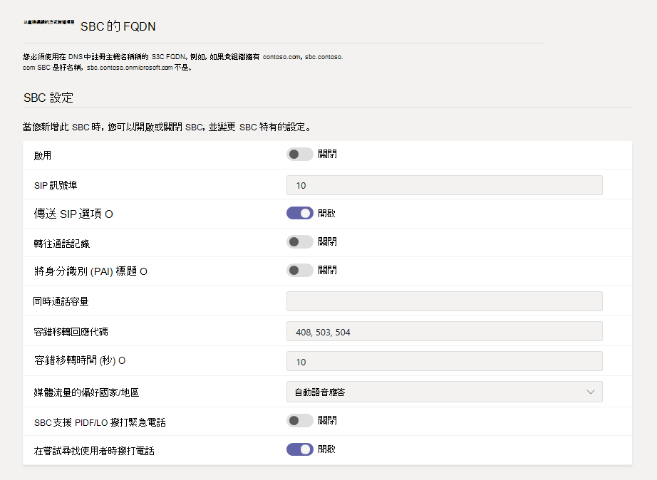

# <a name="connect-your-session-border-controller-sbc-to-direct-routing"></a>將會話框線控制器 (SBC) 連線至直接路由

本文說明如何設定會話框線控制器 (SBC) 並將它連線至直接路由。  這是設定直接路由的下列步驟之 1 步驟：

- **步驟 1.使用電話系統連接您的 SBC 並驗證聯** 機 (本文) 
- 步驟 2. [啟用使用者的直接路由](direct-routing-enable-users.md)
- 步驟 3. [設定通話路由](direct-routing-voice-routing.md)
- 步驟 4. [將數位翻譯成替代格式](direct-routing-translate-numbers.md)

如需設定直接路由所需所有步驟的相關資訊，請參閱 [設定直接路由](direct-routing-configure.md)。

您可以使用 [Microsoft Teams 系統管理中心](#using-the-microsoft-teams-admin-center) 或 [PowerShell](#using-powershell) 來設定並將 SBC 連線到直接路由。

## <a name="using-the-microsoft-teams-admin-center"></a>使用 Microsoft Teams 系統管理中心

1. 在左側導覽中，移至 **[語音**  >  **直接路由]**，然後按一下 [**SBC] 索引卷** 標。

2. 按一下 [新增 **]**。

3. 輸入 SBC 的 FQDN。 <br><br>請確定 FQDN 的功能變數名稱部分符合您租使用者中註冊的網域， `*.onmicrosoft.com` 並記住 SBC FQDN 功能變數名稱不支援該功能變數名稱。 例如，如果您有兩個功能變數名稱， `contoso.com` 而 `contoso.onmicrosoft.com` 使用 `sbc.contoso.com` 為 SBC 名稱。 如果使用子域，請確定此子域也已在您的租使用者中註冊。 例如，如果您想要使用 `sbc.service.contoso.com` ，則 `service.contoso.com` 需要註冊。

4. 根據貴組織的需求，為 SBC 設定下列設定。 如需每個設定的詳細資料，請參閱 [SBC 設定](#sbc-settings)。

    

5. 完成後，按一下 [儲存]。

## <a name="using-powershell"></a>使用 PowerShell

若要將 SBC 連線至直接路由，您必須：

1. [使用 PowerShell 連線至 商務用 Skype Online](#connect-to-skype-for-business-online-by-using-powershell)。

2. [將 SBC 連線到租使用者](#connect-the-sbc-to-the-tenant)。

3. [驗證 SBC 連線](#verify-the-sbc-connection)。

### <a name="connect-to-skype-for-business-online-by-using-powershell"></a>使用 PowerShell 連線至 商務用 Skype Online

若要將 SBC 與直接路由介面配對，請使用連線到租使用者的 PowerShell 會話。 若要開啟 PowerShell 會話，請依照設定[電腦以Windows PowerShell](/SkypeForBusiness/set-up-your-computer-for-windows-powershell/set-up-your-computer-for-windows-powershell)中所述的步驟操作。
 
建立遠端 PowerShell 會話之後，請確認您可以看到管理 SBC 的命令。 若要驗證命令，請在 PowerShell 會話中輸入或複製並貼上下列命令，然後按 Enter： 

```PowerShell
Get-Command *onlinePSTNGateway*
```

此命令會傳回此處顯示的四個函數，可讓您管理 SBC。

<pre>
CommandType    Name                       Version    Source 
-----------    ----                       -------    ------ 
Function       Get-CsOnlinePSTNGateway    1.0        tmp_v5fiu1no.wxt 
Function       New-CsOnlinePSTNGateway    1.0        tmp_v5fiu1no.wxt 
Function       Remove-CsOnlinePSTNGateway 1.0        tmp_v5fiu1no.wxt 
Function       Set-CsOnlinePSTNGateway    1.0        tmp_v5fiu1no.wxt
</pre>

### <a name="connect-the-sbc-to-the-tenant"></a>將 SBC 連線到租使用者

若要將 SBC 連線到租使用者，請使用 [New-CsOnlinePSTNGateway](/powershell/module/skype/new-csonlinepstngateway) Cmdlet。 在 PowerShell 會話中，輸入下列內容，然後按 Enter：

```PowerShell
New-CsOnlinePSTNGateway -Fqdn <SBC FQDN> -SipSignalingPort <SBC SIP Port> -MaxConcurrentSessions <Max Concurrent Sessions the SBC can handle> -Enabled $true
```

  > [!NOTE]
  > 1. 我們建議您使用 SBC 檔中可找到的資訊，在 SBC 中設定最大通話限制。 如果 SBC 處於容量等級，此限制將會觸發通知。
  > 2. 您只能在 FQDN 的網域部分符合您租使用者中註冊的其中一個網域時連線 SBC，但 .onmicrosoft.com 除外 \* 。 SBC FQDN 名稱不支援使用 \* .onmicrosoft.com 功能變數名稱。 例如，如果您有兩個功能變數名稱 **，contoso.com** 和 **contoso.onmicrosoft.com**，您可以使用 sbc.contoso.com 做為 SBC 名稱。 如果您嘗試以 sbc.contoso.abc 等名稱連線 SBC，系統將不會讓您這麼做，因為網域不是由此租使用者所擁有。<br/>
  > 除了在租使用者中註冊的網域之外，請務必有一位使用者擁有該網域，並擁有指派的 E3 或 E5 授權。 如果沒有，您會收到下列錯誤：<br/>
  `Can not use the "sbc.contoso.com" domain as it was not configured for this tenant`.
  > 3. 不支援在 SBC 端對應相同 FQDN 的多個 IP。
  > 4. 為了提供一流的加密給我們的客戶，Microsoft 將會強制使用 TLS1.2 直接路由 SIP 介面。
  > 若要避免任何服務影響，請確定您的 SBC 已設定為支援 TLS1.2，而且可以使用下列其中一個密碼套件連線：TLS_ECDHE_RSA_WITH_AES_256_GCM_SHA384即。 ECDHE-RSA-AES256-GCM-SHA384 TLS_ECDHE_RSA_WITH_AES_128_GCM_SHA256即 ECDHE-RSA-AES128-GCM-SHA256 TLS_ECDHE_RSA_WITH_AES_256_CBC_SHA384，也即 ECDHE-RSA-AES256-SHA384 TLS_ECDHE_RSA_WITH_AES_128_CBC_SHA256 i.e. ECDHE-RSA-AES128-SHA256
  > 5. SIP 選項偵測不可超過每 60 秒一筆交易的頻率，而且每隔 180 秒針對每個端點設定的主幹，不得超過一筆交易的頻率或頻率。

以下是範例：

```PowerShell
New-CsOnlinePSTNGateway -Identity sbc.contoso.com -Enabled $true -SipSignalingPort 5067 -MaxConcurrentSessions 100 
```

這會傳回：

<pre>
Identity              : sbc.contoso.com 
Fqdn                  : sbc.contoso.com 
SipSignalingPort     : 5067 
FailoverTimeSeconds   : 10 
ForwardCallHistory    : False 
ForwardPai            : False 
SendSipOptions        : True 
MaxConcurrentSessions : 100 
Enabled               : True   
</pre>

> [!NOTE]
> 此範例僅顯示所需參數的最小值。 在連線過程中，您可以使用 [New-CsOnlinePSTNGateway](/powershell/module/skype/new-csonlinepstngateway) Cmdlet 設定其他參數。 若要深入瞭解，請參閱 [SBC 設定](#sbc-settings)。
 
### <a name="verify-the-sbc-connection"></a>驗證 SBC 連線

若要驗證連線：

- [檢查 SBC 是否列在已配對的 SBC 清單中](#check-whether-the-sbc-is-on-the-list-of-paired-sbcs)。
- [驗證 SIP 選項](#validate-sip-options)。
 
#### <a name="check-whether-the-sbc-is-on-the-list-of-paired-sbcs"></a>檢查 SBC 是否列在已配對 SB 的清單中

連接 SBC 之後，請使用 [Get-CsOnlinePSTNGateway](/powershell/module/skype/get-csonlinepstngateway) Cmdlet 來驗證 SBC 是否出現在已配對的 SBC 清單中。 在遠端 PowerShell 會話中輸入下列內容，然後按 Enter：

```PowerShell
Get-CsOnlinePSTNGateway -Identity sbc.contoso.com  
```

配對閘道應該會顯示在清單中，如下列範例所示， **而 Enabled** 參數應顯示 **True** 值。

這會傳回：

<pre>
Identity              : sbc.contoso.com  
Fqdn                  : sbc.contoso.com
SipSignalingPort     : 5067
CodecPriority         : SILKWB,SILKNB,PCMU,PCMA
ExcludedCodecs        :  
FailoverTimeSeconds   : 10
ForwardCallHistory    : False
ForwardPai            : False
SendSipOptions        : True
MaxConcurrentSessions : 100
Enabled               : True
</pre>

#### <a name="validate-sip-options"></a>驗證 SIP 選項

若要使用外寄 SIP 選項驗證配對，請使用 SBC 管理介面，並確認 SBC 收到其待發選項訊息的 200 個確定回應。

當直接路由看到內送選項時，它會開始傳送外寄 SIP 選項郵件到內送選項訊息中 [連絡人] 標題欄位中設定的 SBC FQDN。 

若要使用內送 SIP 選項驗證配對，請使用 SBC 管理介面，並查看 SBC 會傳送回復來自直接路由的選項訊息，且傳送的回應碼為 200 確定。

## <a name="sbc-settings"></a>SBC 設定

下表列出您可以在 Microsoft Teams 系統管理中心以及使用 [New-CsOnlinePSTNGateway](/powershell/module/skype/new-csonlinepstngateway) Cmdlet 為 SBC 設定的選項。

|必填？|Teams 系統管理中心設定|PowerShell 參數|描述|預設|可能的值|類型與限制|
|:-----|:-----|:-----|:-----|:-----|:-----|:-----|
|是|**新增 SBC 的 FQDN**|Fqdn |無|FQDN 名稱，限制 63 個字元|字串，請參閱在[Active Directory 中為電腦、網域、網站和 OU 命名慣例](https://support.microsoft.com/help/909264)上的允許和不允許的字元清單|
|否|**Enabled**|Enabled|用來開啟 SBC 來接聽撥出電話。 您可以使用此功能在服務更新或維護期間暫時移除 SBC。 |假|真<br/>假|Boolean|
|是|**SIP 訊號埠**|SipSignalingPort |這是使用傳輸層 (TLS) 通訊協定來與直接路由通訊時所用的聆聽埠。|無|任何埠|0 到 65535 |
|否|**傳送 SIP 選項**|SendSIPOptions |定義 SBC 是否會傳送 SIP 選項訊息。 強烈建議您開啟此設定。 關閉此設定時，系統會排除 SBC。|真|真<br/>假|Boolean|
|否|**轉接通訊記錄**|ForwardCallHistory |指出通話記錄資訊是否透過主幹轉接。 當您開啟此設定時，Microsoft 365 Proxy 會傳送歷程記錄資訊和參照標頭。 |假|真<br/>假|Boolean|
|否|**FORWARD P-標題 (的 P-名識別)**|ForwardPAI|指出是否在呼叫中轉接了該當中的一頁首。 PAI 標頭可用於驗證來電者的身分識別。 如果此設定已開啟，也會傳送 Privacy：ID 標頭。|假|真<br/>假|Boolean|
|否|**並行通話容量**|MaxConcurrentSessions |當您設定值時，當同時會話數目超過此值 90% 或更高時，警示系統會通知您。 如果您未設定值，就不會產生警示。 不過，監控系統會每 24 小時報告一次並行會話的數目。 |空|空<br/>1 到 100，000 ||
|否|**容錯移轉回應代碼**|FailoverResponseCodes<br>|如果直接路由在回應外寄邀請時收到任何 4xx 或 6xx SIP 錯誤碼，則預設會將通話視為完成。 外寄是指從 Teams 用戶端到 PSTN 的流量流量：Teams 用戶端 ->直接路由 -> SBC ->電話語音網路) 。 當您指定容錯移轉回應碼時，如果使用者) 的語音路由原則中有另一個 SBC 因網路或其他問題而無法撥打電話，這會強制直接路由嘗試另一個 SBC (。 若要深入瞭解，請參閱 [從會話框線控制器收到的特定 SIP 代碼容錯移轉 (SBC) ](direct-routing-trunk-failover-on-outbound-call.md)。|408, 503, 504||Int|
|否|**容錯移轉時間 (秒)**|FailoverTimeSeconds |當您設定值時，閘道未在您設定的來電轉接至下一個可用主幹時未接聽的撥出電話。 如果沒有額外的樹幹，通話會自動中斷。 預設值為 10 秒。 在網路和閘道回應緩慢的組織中，這可能會導致通話不必要地中斷。|10|數量|Int|
|否|**媒體流量的慣用國家或地區**|MediaRelayRoutingLocationOverride | 不適用於直接路由。 此參數保留給通話方案中的受管理電信業者使用 |無|||
|否|**SBC 支援 PIDF/LO 進行緊急通話**|PidfloSupported|指定 SBC 是否支援緊急通話的目前狀態資訊資料格式位置物件 (PIDF/LO) 。||||
|否| - |MediaBypass|此設定會指出 SBC 是否支援媒體略過，以及您是否要將它用於此 SBC。 |無|真<br/>假|Boolean|

## <a name="see-also"></a>另請參閱

[規劃直接路由](direct-routing-plan.md)

[設定直接路由](direct-routing-configure.md)

[Teams PowerShell 概觀](teams-powershell-overview.md)
