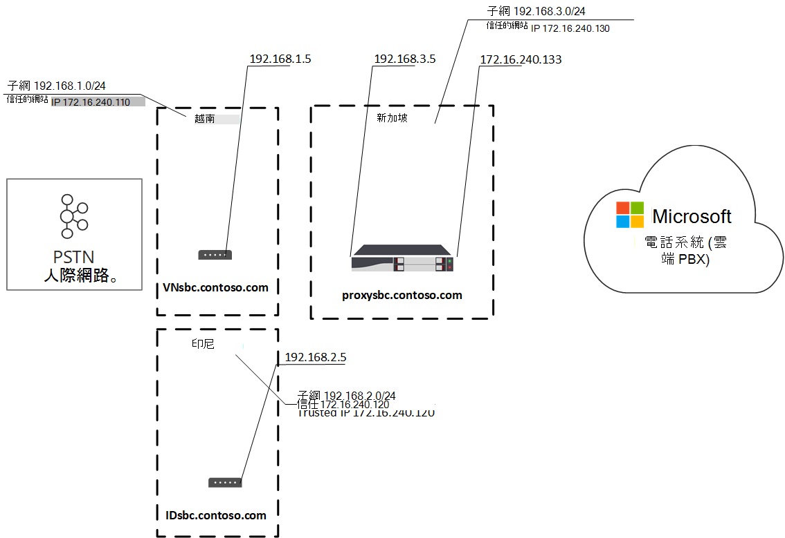
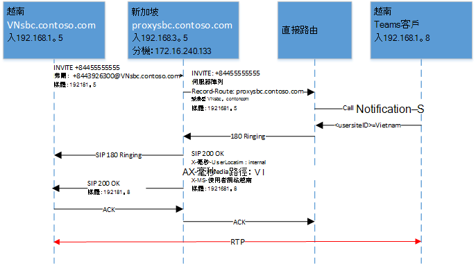
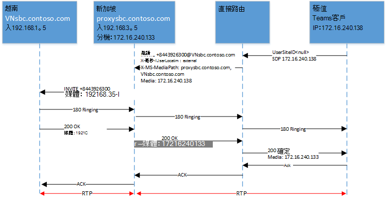
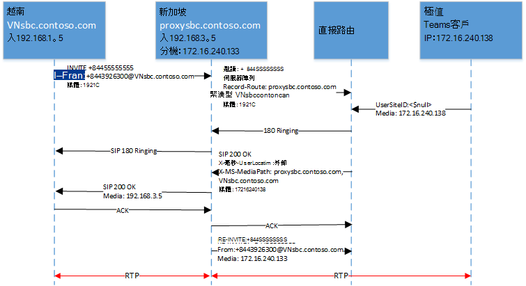
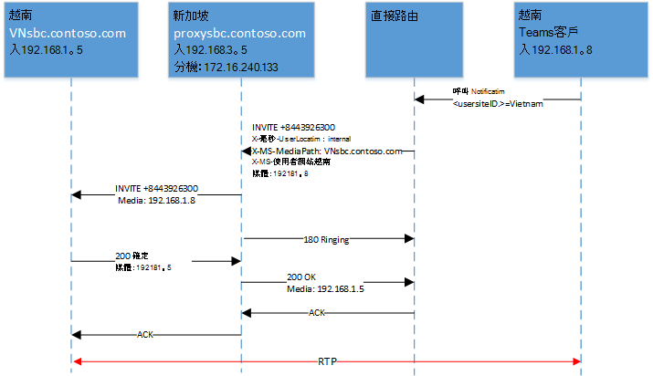
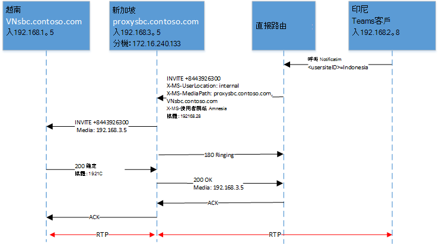
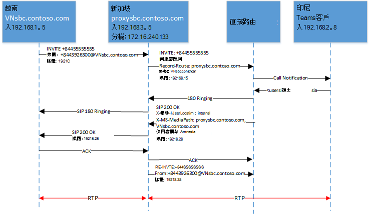

# <a name="configure-local-media-optimization-for-direct-routing"></a><span data-ttu-id="604cc-103">針對直接路由設定本機媒體優化</span><span class="sxs-lookup"><span data-stu-id="604cc-103">Configure Local Media Optimization for Direct Routing</span></span>

<span data-ttu-id="604cc-104">本機媒體優化的設定是以其他雲端語音功能（例如位置式路由和動態緊急通話）通用的網路設定為基礎。</span><span class="sxs-lookup"><span data-stu-id="604cc-104">Configuration for Local Media Optimization is based on network settings that are common to other cloud voice features, such as Location-Based Routing and dynamic emergency calling.</span></span> <span data-ttu-id="604cc-105">若要深入瞭解網路區域、網路網站、網路子網和信任的 IP 位址，請參閱[雲端語音功能的網路設定](cloud-voice-network-settings.md)。</span><span class="sxs-lookup"><span data-stu-id="604cc-105">To learn more about network regions, network sites, network subnets, and trusted IP addresses, see [Network settings for cloud voice features](cloud-voice-network-settings.md).</span></span>

<span data-ttu-id="604cc-106">在您設定本機媒體優化之前，請參閱[直接路由的本機媒體優化](direct-routing-media-optimization.md)。</span><span class="sxs-lookup"><span data-stu-id="604cc-106">Before you configure Local Media Optimization, see [Local media Optimization for Direct Routing](direct-routing-media-optimization.md).</span></span>  

<span data-ttu-id="604cc-107">若要設定本機媒體優化，必須執行下列步驟。</span><span class="sxs-lookup"><span data-stu-id="604cc-107">To configure Local Media Optimization, the following steps are required.</span></span> <span data-ttu-id="604cc-108">您可以使用 [團隊系統管理中心] 或 [PowerShell]。</span><span class="sxs-lookup"><span data-stu-id="604cc-108">You can use the Teams Admin Center or PowerShell.</span></span> <span data-ttu-id="604cc-109">如需詳細資訊，請參閱[管理您的網路拓撲](manage-your-network-topology.md)。</span><span class="sxs-lookup"><span data-stu-id="604cc-109">For details, see [Manage your network topology](manage-your-network-topology.md).</span></span>

1. <span data-ttu-id="604cc-110">如本文所述，設定使用者和 SBC 網站 (，請參閱) 。</span><span class="sxs-lookup"><span data-stu-id="604cc-110">Configure the user and the SBC sites (as described in this article).</span></span>
2. <span data-ttu-id="604cc-111">根據您的 SBC 供應商規格) ，設定本機媒體優化 (的 SBCs。</span><span class="sxs-lookup"><span data-stu-id="604cc-111">Configure the SBCs for Local Media Optimization (according to your SBC vendor specification).</span></span>

<span data-ttu-id="604cc-112">下圖顯示本文範例中所用的網路設定。</span><span class="sxs-lookup"><span data-stu-id="604cc-112">The following diagram shows the network setup used in the examples throughout this article.</span></span>

<span data-ttu-id="604cc-113"></span><span class="sxs-lookup"><span data-stu-id="604cc-113"></span></span>


## <a name="configure-the-user-and-the-sbc-sites"></a><span data-ttu-id="604cc-114">設定使用者和 SBC 網站</span><span class="sxs-lookup"><span data-stu-id="604cc-114">Configure the user and the SBC sites</span></span>

<span data-ttu-id="604cc-115">若要設定使用者與 SBC 網站，您將需要：</span><span class="sxs-lookup"><span data-stu-id="604cc-115">To configure the user and the SBC sites, you will need to:</span></span>

1. <span data-ttu-id="604cc-116">[管理外部信任的 IP 位址](#manage-external-trusted-ip-addresses)。</span><span class="sxs-lookup"><span data-stu-id="604cc-116">[Manage external trusted IP addresses](#manage-external-trusted-ip-addresses).</span></span>  

2. <span data-ttu-id="604cc-117">您可以設定網路區域、網路網站和網路子網，以[定義網路拓撲](#define-the-network-topology)。</span><span class="sxs-lookup"><span data-stu-id="604cc-117">[Define the network topology](#define-the-network-topology) by configuring the network regions, network sites, and network subnets.</span></span>

3. <span data-ttu-id="604cc-118">將 SBC (s) 指派給網站 (s) ，並以相關的模式與 proxy SBC 值來[定義虛擬網路拓撲](#define-the-virtual-network-topology)。</span><span class="sxs-lookup"><span data-stu-id="604cc-118">[Define the virtual network topology](#define-the-virtual-network-topology) by assigning SBC(s) to site(s) with relevant modes and proxy SBC values.</span></span>


## <a name="configure-sbcs-for-local-media-optimization-according-to-the-sbc-vendor-specification"></a><span data-ttu-id="604cc-119">根據 SBC 廠商的規格，設定用於本機媒體優化的 SBC (s) </span><span class="sxs-lookup"><span data-stu-id="604cc-119">Configure SBC(s) for Local Media Optimization according to the SBC vendor specification</span></span>

<span data-ttu-id="604cc-120">本文將說明 Microsoft 元件的配置。</span><span class="sxs-lookup"><span data-stu-id="604cc-120">This article describes configuration for Microsoft components.</span></span> <span data-ttu-id="604cc-121">如需 SBC 設定的相關資訊，請參閱您的 SBC 供應商檔。</span><span class="sxs-lookup"><span data-stu-id="604cc-121">For information on SBC configuration, see your SBC vendor documentation.</span></span>

<span data-ttu-id="604cc-122">下列 SBC 廠商支援本機媒體優化：</span><span class="sxs-lookup"><span data-stu-id="604cc-122">Local Media Optimization is supported by the following SBC vendors:</span></span>

| <span data-ttu-id="604cc-123">那裡</span><span class="sxs-lookup"><span data-stu-id="604cc-123">Vendor</span></span> | <span data-ttu-id="604cc-124">產品</span><span class="sxs-lookup"><span data-stu-id="604cc-124">Product</span></span> |    <span data-ttu-id="604cc-125">軟體版本</span><span class="sxs-lookup"><span data-stu-id="604cc-125">Software version</span></span> |
|:------------|:-------|:-------|
| [<span data-ttu-id="604cc-126">Audiocodes</span><span class="sxs-lookup"><span data-stu-id="604cc-126">Audiocodes</span></span>](https://www.audiocodes.com/media/13253/connecting-audiocodes-sbc-to-microsoft-teams-direct-routing-enterprise-model-configuration-note.pdf) |    <span data-ttu-id="604cc-127">Mediant 500 SBC</span><span class="sxs-lookup"><span data-stu-id="604cc-127">Mediant 500 SBC</span></span> |   <span data-ttu-id="604cc-128">7.20 （256）</span><span class="sxs-lookup"><span data-stu-id="604cc-128">7.20A.256</span></span> | 
|            |  <span data-ttu-id="604cc-129">Mediant 800 SBC</span><span class="sxs-lookup"><span data-stu-id="604cc-129">Mediant 800 SBC</span></span> |   <span data-ttu-id="604cc-130">7.20 （256）</span><span class="sxs-lookup"><span data-stu-id="604cc-130">7.20A.256</span></span> | 
|            |  <span data-ttu-id="604cc-131">Mediant 2600 SBC</span><span class="sxs-lookup"><span data-stu-id="604cc-131">Mediant 2600 SBC</span></span> |  <span data-ttu-id="604cc-132">7.20 （256）</span><span class="sxs-lookup"><span data-stu-id="604cc-132">7.20A.256</span></span> | 
|            |  <span data-ttu-id="604cc-133">Mediant 4000 SBC</span><span class="sxs-lookup"><span data-stu-id="604cc-133">Mediant 4000 SBC</span></span> |  <span data-ttu-id="604cc-134">7.20 （256）</span><span class="sxs-lookup"><span data-stu-id="604cc-134">7.20A.256</span></span> | 
|            |  <span data-ttu-id="604cc-135">Mediant 1000B SBC</span><span class="sxs-lookup"><span data-stu-id="604cc-135">Mediant 1000B SBC</span></span> | <span data-ttu-id="604cc-136">7.20 （256）</span><span class="sxs-lookup"><span data-stu-id="604cc-136">7.20A.256</span></span> | 
|            |  <span data-ttu-id="604cc-137">Mediant 9000 SBC</span><span class="sxs-lookup"><span data-stu-id="604cc-137">Mediant 9000 SBC</span></span> |  <span data-ttu-id="604cc-138">7.20 （256）</span><span class="sxs-lookup"><span data-stu-id="604cc-138">7.20A.256</span></span> | 
|            |  <span data-ttu-id="604cc-139">Mediant 虛擬版 SBC</span><span class="sxs-lookup"><span data-stu-id="604cc-139">Mediant Virtual Edition SBC</span></span> |   <span data-ttu-id="604cc-140">7.20 （256）</span><span class="sxs-lookup"><span data-stu-id="604cc-140">7.20A.256</span></span> | 
|            |  <span data-ttu-id="604cc-141">Mediant 雲端版 SBC</span><span class="sxs-lookup"><span data-stu-id="604cc-141">Mediant Cloud Edition SBC</span></span> | <span data-ttu-id="604cc-142">7.20 （256）</span><span class="sxs-lookup"><span data-stu-id="604cc-142">7.20A.256</span></span> |
| [<span data-ttu-id="604cc-143">功能區 SBC 核心</span><span class="sxs-lookup"><span data-stu-id="604cc-143">Ribbon SBC Core</span></span>](https://support.sonus.net/display/ALLDOC/SBC+8.2+-+Configure+Local+Media+Optimization)  |  <span data-ttu-id="604cc-144">SBC 5110</span><span class="sxs-lookup"><span data-stu-id="604cc-144">SBC 5110</span></span>         | <span data-ttu-id="604cc-145">8.2</span><span class="sxs-lookup"><span data-stu-id="604cc-145">8.2</span></span>  |
|            |  <span data-ttu-id="604cc-146">SBC 5210</span><span class="sxs-lookup"><span data-stu-id="604cc-146">SBC 5210</span></span>         | <span data-ttu-id="604cc-147">8.2</span><span class="sxs-lookup"><span data-stu-id="604cc-147">8.2</span></span>  |
|            |  <span data-ttu-id="604cc-148">SBC 5400</span><span class="sxs-lookup"><span data-stu-id="604cc-148">SBC 5400</span></span>         | <span data-ttu-id="604cc-149">8.2</span><span class="sxs-lookup"><span data-stu-id="604cc-149">8.2</span></span>  |
|            |  <span data-ttu-id="604cc-150">SBC 7000</span><span class="sxs-lookup"><span data-stu-id="604cc-150">SBC 7000</span></span>         | <span data-ttu-id="604cc-151">8.2</span><span class="sxs-lookup"><span data-stu-id="604cc-151">8.2</span></span>  |
|            |  <span data-ttu-id="604cc-152">SBC SWe</span><span class="sxs-lookup"><span data-stu-id="604cc-152">SBC SWe</span></span>          | <span data-ttu-id="604cc-153">8.2</span><span class="sxs-lookup"><span data-stu-id="604cc-153">8.2</span></span>  |
| [<span data-ttu-id="604cc-154">功能區 SBC 邊緣</span><span class="sxs-lookup"><span data-stu-id="604cc-154">Ribbon SBC Edge</span></span>](https://support.sonus.net/display/UXDOC81/Best+Practice+-+Configuring+Microsoft+Teams+Local+Media+Optimization)  |  <span data-ttu-id="604cc-155">SBC SWe Lite</span><span class="sxs-lookup"><span data-stu-id="604cc-155">SBC SWe Lite</span></span> | <span data-ttu-id="604cc-156">8.1.5</span><span class="sxs-lookup"><span data-stu-id="604cc-156">8.1.5</span></span> |
|               | <span data-ttu-id="604cc-157">SBC 1000</span><span class="sxs-lookup"><span data-stu-id="604cc-157">SBC 1000</span></span> | <span data-ttu-id="604cc-158">8.1.5</span><span class="sxs-lookup"><span data-stu-id="604cc-158">8.1.5</span></span>  |
|               | <span data-ttu-id="604cc-159">SBC 2000</span><span class="sxs-lookup"><span data-stu-id="604cc-159">SBC 2000</span></span> | <span data-ttu-id="604cc-160">8.1.5</span><span class="sxs-lookup"><span data-stu-id="604cc-160">8.1.5</span></span>  |
| [<span data-ttu-id="604cc-161">TE-系統</span><span class="sxs-lookup"><span data-stu-id="604cc-161">TE-SYSTEMS</span></span>](https://www.anynode.de/local_media_optimization/) |  <span data-ttu-id="604cc-162">anynode</span><span class="sxs-lookup"><span data-stu-id="604cc-162">anynode</span></span>          | <span data-ttu-id="604cc-163">4.0.1 +</span><span class="sxs-lookup"><span data-stu-id="604cc-163">4.0.1+</span></span> |
| [<span data-ttu-id="604cc-164">聯手</span><span class="sxs-lookup"><span data-stu-id="604cc-164">Oracle</span></span>](https://www.oracle.com/industries/communications/enterprise-communications/session-border-controller/microsoft.html) | <span data-ttu-id="604cc-165">AP 1100</span><span class="sxs-lookup"><span data-stu-id="604cc-165">AP 1100</span></span> | <span data-ttu-id="604cc-166">8.4.0.0.0</span><span class="sxs-lookup"><span data-stu-id="604cc-166">8.4.0.0.0</span></span> |
|        | <span data-ttu-id="604cc-167">AP 3900</span><span class="sxs-lookup"><span data-stu-id="604cc-167">AP 3900</span></span> | <span data-ttu-id="604cc-168">8.4.0.0.0</span><span class="sxs-lookup"><span data-stu-id="604cc-168">8.4.0.0.0</span></span> |
|        | <span data-ttu-id="604cc-169">AP 4600</span><span class="sxs-lookup"><span data-stu-id="604cc-169">AP 4600</span></span> | <span data-ttu-id="604cc-170">8.4.0.0.0</span><span class="sxs-lookup"><span data-stu-id="604cc-170">8.4.0.0.0</span></span> | 
|        | <span data-ttu-id="604cc-171">AP 6300</span><span class="sxs-lookup"><span data-stu-id="604cc-171">AP 6300</span></span> | <span data-ttu-id="604cc-172">8.4.0.0.0</span><span class="sxs-lookup"><span data-stu-id="604cc-172">8.4.0.0.0</span></span> |
|        | <span data-ttu-id="604cc-173">AP 6350</span><span class="sxs-lookup"><span data-stu-id="604cc-173">AP 6350</span></span> | <span data-ttu-id="604cc-174">8.4.0.0.0</span><span class="sxs-lookup"><span data-stu-id="604cc-174">8.4.0.0.0</span></span> | 
|        | <span data-ttu-id="604cc-175">VME</span><span class="sxs-lookup"><span data-stu-id="604cc-175">VME</span></span>     | <span data-ttu-id="604cc-176">8.4.0.0.0</span><span class="sxs-lookup"><span data-stu-id="604cc-176">8.4.0.0.0</span></span> |


## <a name="manage-external-trusted-ip-addresses"></a><span data-ttu-id="604cc-177">管理外部信任的 IP 位址</span><span class="sxs-lookup"><span data-stu-id="604cc-177">Manage external trusted IP addresses</span></span>

<span data-ttu-id="604cc-178">外部信任的 Ip 是商業網路的網際網路外部 Ip。</span><span class="sxs-lookup"><span data-stu-id="604cc-178">External trusted IPs are the Internet external IPs of the enterprise network.</span></span> <span data-ttu-id="604cc-179">這些 IP 是 Microsoft 團隊用戶端連線至 Microsoft 365 時所使用的 IP 位址。</span><span class="sxs-lookup"><span data-stu-id="604cc-179">These IP’s are the IP addresses used by Microsoft Teams clients when they connect to Microsoft 365.</span></span> <span data-ttu-id="604cc-180">您必須針對每一個您有使用者使用本機媒體優化的網站，新增這些外部 Ip。</span><span class="sxs-lookup"><span data-stu-id="604cc-180">You need to add these external IPs for each site where you have users using Local Media Optimization.</span></span>

<span data-ttu-id="604cc-181">若要為每個網站新增公用 IP 位址，請使用 CsTenantTrustedIPAddress Cmdlet。</span><span class="sxs-lookup"><span data-stu-id="604cc-181">To add the public IP addresses for each site, use the New-CsTenantTrustedIPAddress cmdlet.</span></span> <span data-ttu-id="604cc-182">您可以為租使用者定義數量不受信任的 IP 位址。</span><span class="sxs-lookup"><span data-stu-id="604cc-182">You can define an unlimited number of trusted IP addresses for a tenant.</span></span> <span data-ttu-id="604cc-183">如果 Microsoft 365 所看到的外部 IPs 都是 IPv4 與 IPv6 位址，則您必須新增這兩種類型的 IP 位址。</span><span class="sxs-lookup"><span data-stu-id="604cc-183">If the external IPs seen by Microsoft 365 are both IPv4 and IPv6 addresses, you need to add both types of IP addresses.</span></span> <span data-ttu-id="604cc-184">若是 IPv4，請使用 mask 32。</span><span class="sxs-lookup"><span data-stu-id="604cc-184">For IPv4, use mask 32.</span></span> <span data-ttu-id="604cc-185">若是 IPv6，請使用 mask 128。</span><span class="sxs-lookup"><span data-stu-id="604cc-185">For IPv6, use mask 128.</span></span> <span data-ttu-id="604cc-186">您可以在 Cmdlet 上指定不同的 MaskBits，以新增個別的外部 IP 位址和外部 IP 子網。</span><span class="sxs-lookup"><span data-stu-id="604cc-186">You can add both individual external IP addresses and external IP subnets by specifying different MaskBits on the cmdlet.</span></span>

```
New-CsTenantTrustedIPAddress -IPAddress <External IP address> -MaskBits <Subnet bitmask> -Description <description>
```


<span data-ttu-id="604cc-187">新增信任的 IP 位址範例。</span><span class="sxs-lookup"><span data-stu-id="604cc-187">Example of adding trusted IP addresses.</span></span>

```
New-CsTenantTrustedIPAddress -IPAddress 172.16.240.110 -MaskBits 32 -Description "Vietnam site trusted IP"
New-CsTenantTrustedIPAddress -IPAddress 172.16.240.120 -MaskBits 32 -Description "Indonesia site trusted IP"
New-CsTenantTrustedIPAddress -IPAddress 172.16.240.130 -MaskBits 32 -Description "Singapore site trusted IP"
```


## <a name="define-the-network-topology"></a><span data-ttu-id="604cc-188">定義網路拓撲</span><span class="sxs-lookup"><span data-stu-id="604cc-188">Define the network topology</span></span>

<span data-ttu-id="604cc-189">本節說明如何為您的網路拓撲定義網路區域、網路網站和網路子網。</span><span class="sxs-lookup"><span data-stu-id="604cc-189">This section describes how to define the network regions, network sites, and network subnets for your network topology.</span></span>

<span data-ttu-id="604cc-190">所有參數都是區分大小寫的，因此您必須確保您使用的是在安裝期間使用的相同大小寫。</span><span class="sxs-lookup"><span data-stu-id="604cc-190">All parameters are case sensitive so you need to ensure that you use the same case that was used during setup.</span></span>  <span data-ttu-id="604cc-191"> (例如，GatewaySiteID 值 "越南" 和 "越南" 將會被視為不同的網站。 ) </span><span class="sxs-lookup"><span data-stu-id="604cc-191">(For example, GatewaySiteID values “Vietnam” and “vietnam” will be treated as different sites.)</span></span>

### <a name="define-network-regions"></a><span data-ttu-id="604cc-192">定義網路區域</span><span class="sxs-lookup"><span data-stu-id="604cc-192">Define network regions</span></span>

<span data-ttu-id="604cc-193">若要定義網路區域，請使用 CsTenantNetworkRegion Cmdlet。</span><span class="sxs-lookup"><span data-stu-id="604cc-193">To define network regions, use the New-CsTenantNetworkRegion cmdlet.</span></span> <span data-ttu-id="604cc-194">RegionID 參數是代表區域地理位置的邏輯名稱，沒有相依性或限制。</span><span class="sxs-lookup"><span data-stu-id="604cc-194">The RegionID parameter is a logical name that represents the geography of the region and has no dependencies or restrictions.</span></span> <span data-ttu-id="604cc-195">CentralSite <site ID> 參數是選擇性的。</span><span class="sxs-lookup"><span data-stu-id="604cc-195">The CentralSite <site ID> parameter is optional.</span></span>

```
New-CsTenantNetworkRegion -NetworkRegionID <region ID>  
```

<span data-ttu-id="604cc-196">下列範例會建立名為 APAC 的網路區域：</span><span class="sxs-lookup"><span data-stu-id="604cc-196">The following example creates a network region named APAC:</span></span>

```
New-CsTenantNetworkRegion -NetworkRegionID "APAC"  
```

###  <a name="define-network-sites"></a><span data-ttu-id="604cc-197">定義網路網站</span><span class="sxs-lookup"><span data-stu-id="604cc-197">Define network sites</span></span>

<span data-ttu-id="604cc-198">若要定義網路網站，請使用 CsTenantNetworkSite Cmdlet。</span><span class="sxs-lookup"><span data-stu-id="604cc-198">To define network sites, use the New-CsTenantNetworkSite cmdlet.</span></span> <span data-ttu-id="604cc-199">每個網路網站都必須與一個網路區域建立關聯。</span><span class="sxs-lookup"><span data-stu-id="604cc-199">Each network site must be associated with a network region.</span></span>

```
New-CsTenantNetworkSite -NetworkSiteID <site ID> -NetworkRegionID <region ID>
```

<span data-ttu-id="604cc-200">下列範例會在 APAC 區域中建立三個新的網路網站、越南、印尼及新加坡：</span><span class="sxs-lookup"><span data-stu-id="604cc-200">The following example creates three new network sites, Vietnam, Indonesia, and Singapore in the APAC region:</span></span>

```
New-CsTenantNetworkSite -NetworkSiteID "Vietnam" -NetworkRegionID "APAC"
New-CsTenantNetworkSite -NetworkSiteID "Indonesia" -NetworkRegionID "APAC"
New-CsTenantNetworkSite -NetworkSiteID "Singapore" -NetworkRegionID "APAC"
```

### <a name="define-network-subnets"></a><span data-ttu-id="604cc-201">定義網路子網</span><span class="sxs-lookup"><span data-stu-id="604cc-201">Define network subnets</span></span>

<span data-ttu-id="604cc-202">若要定義網路子網並將它們與網路網站關聯，請使用 CsTenantNetworkSubnet Cmdlet。</span><span class="sxs-lookup"><span data-stu-id="604cc-202">To define network subnets and associate them to network sites, use the New-CsTenantNetworkSubnet cmdlet.</span></span> <span data-ttu-id="604cc-203">每個網路子網只能與一個網站建立關聯。</span><span class="sxs-lookup"><span data-stu-id="604cc-203">Each network subnet can only be associated with one site.</span></span> 

```
New-CsTenantNetworkSubnet -SubnetID <Subnet IP address> -MaskBits <Subnet bitmask> -NetworkSiteID <site ID>
```

<span data-ttu-id="604cc-204">下列範例定義三個網路子網，並將它們與三個網路網站進行關聯：越南、印尼及新加坡：</span><span class="sxs-lookup"><span data-stu-id="604cc-204">The following example defines three network subnets and associates them with the three network sites:  Vietnam, Indonesia, and Singapore:</span></span>

```
New-CsTenantNetworkSubnet -SubnetID 192.168.1.0 -MaskBits 24 -NetworkSiteID “Vietnam”
New-CsTenantNetworkSubnet -SubnetID 192.168.2.0 -MaskBits 24 -NetworkSiteID “Indonesia”
New-CsTenantNetworkSubnet -SubnetID 192.168.3.0 -MaskBits 24 -NetworkSiteID “Singapore”
```

## <a name="define-the-virtual-network-topology"></a><span data-ttu-id="604cc-205">定義虛擬網路拓撲</span><span class="sxs-lookup"><span data-stu-id="604cc-205">Define the virtual network topology</span></span> 

<span data-ttu-id="604cc-206">首先，租使用者管理員使用 CsOnlinePSTNGateway Cmdlet，為每個相關的 SBC 建立新的 SBC 設定。</span><span class="sxs-lookup"><span data-stu-id="604cc-206">First, the tenant administrator creates a new SBC configuration for each relevant SBC by using the New-CsOnlinePSTNGateway cmdlet.</span></span>
<span data-ttu-id="604cc-207">租使用者管理員使用 CsOnlinePSTNGateway Cmdlet 來指定 PSTN 閘道物件的網路網站，以定義虛擬網路拓朴：</span><span class="sxs-lookup"><span data-stu-id="604cc-207">The tenant administrator defines the virtual network topology by specifying the network sites for the PSTN gateway objects using the Set-CsOnlinePSTNGateway cmdlet:</span></span>

```
PS C:\> Set-CsOnlinePSTNGateway -Identity <Identity> -GatewaySiteID <site ID> -MediaBypass <true/false> -BypassMode <Always/OnlyForLocalUsers> -ProxySBC  <proxy SBC FQDN or $null>
```

<span data-ttu-id="604cc-208">請注意下列事項：</span><span class="sxs-lookup"><span data-stu-id="604cc-208">Note the following:</span></span> 
   - <span data-ttu-id="604cc-209">如果客戶擁有單一 SBC，則 ProxySBC 參數必須是強制性 $null 或 SBC FQDN 值， (中央 SBC 與集中式 trunks 案例) 。</span><span class="sxs-lookup"><span data-stu-id="604cc-209">If the customer has a single SBC, the -ProxySBC parameter must be either mandatory $null or SBC FQDN value (Central SBC with centralized trunks scenario).</span></span>
   - <span data-ttu-id="604cc-210">-MediaBypass 參數必須設定為 $true，才能支援本機媒體優化。</span><span class="sxs-lookup"><span data-stu-id="604cc-210">The -MediaBypass parameter must be set to $true in order to support Local Media Optimization.</span></span>
   - <span data-ttu-id="604cc-211">如果 SBC 沒有 BypassMode 參數集，則不會傳送 X MS 標頭。</span><span class="sxs-lookup"><span data-stu-id="604cc-211">If the SBC doesn’t have the -BypassMode parameter set, X-MS headers will not be sent.</span></span> 
   - <span data-ttu-id="604cc-212">所有參數都區分大小寫，因此您需要確保您使用的是在安裝期間使用的相同大小寫。</span><span class="sxs-lookup"><span data-stu-id="604cc-212">All parameters are case sensitive so you need to ensure that you use the same case that was used used during setup.</span></span>  <span data-ttu-id="604cc-213"> (例如，GatewaySiteID 值 "越南" 和 "越南" 將會被視為不同的網站。 ) </span><span class="sxs-lookup"><span data-stu-id="604cc-213">(For example, GatewaySiteID values “Vietnam” and “vietnam” will be treated as different sites.)</span></span>

<span data-ttu-id="604cc-214">下列範例會將三個 SBCs 新增到 [APAC] 區域中的 [越南]、[印尼] 和 [新加坡]，且模式總是略過：</span><span class="sxs-lookup"><span data-stu-id="604cc-214">The following example adds three SBCs to the network sites Vietnam, Indonesia, and Singapore in the APAC region with mode Always bypass:</span></span>

```
Set-CSOnlinePSTNGateway -Identity “proxysbc.contoso.com” -GatewaySiteID “Singapore” -MediaBypass $true -BypassMode “Always” -ProxySBC $null

Set-CSOnlinePSTNGateway -Identity “VNsbc.contoso.com” -GatewaySiteID “Vietnam” -MediaBypass $true -BypassMode “Always” -ProxySBC “proxysbc.contoso.com”

Set-CSOnlinePSTNGateway -Identity “IDsbc.contoso.com” -GatewaySiteID “Indonesia” -MediaBypass $true -BypassMode “Always” -ProxySBC “proxysbc.contoso.com”
```

<span data-ttu-id="604cc-215">注意：若要確保不間斷的作業在本機媒體優化和位置式路由 (LBR) 同時進行設定，必須先將 GatewaySiteLbrEnabled 參數設定 $true 為 LBR 每個下游 SBC，才能啟用下游 SBCs。</span><span class="sxs-lookup"><span data-stu-id="604cc-215">Note: To ensure uninterrupted operations when Local Media Optimization and Location-Based Routing (LBR) are configured at the same time, downstream SBCs must be enabled for LBR by setting the GatewaySiteLbrEnabled parameter to $true for each downstream SBC.</span></span> <span data-ttu-id="604cc-216"> (對於 proxy SBC 而言，此設定不是強制性的。 ) </span><span class="sxs-lookup"><span data-stu-id="604cc-216">(This setting is not mandatory for the proxy SBC.)</span></span>

<span data-ttu-id="604cc-217">根據上述資訊，直接路由會包含三個專有的 SIP 標頭至 SIP 邀請和重新邀請，如下表所示。</span><span class="sxs-lookup"><span data-stu-id="604cc-217">Based on the information above, Direct Routing will include three proprietary SIP Headers to SIP Invites and Re-invites as shown  in the following table.</span></span>

<span data-ttu-id="604cc-218">如果定義了 BypassMode，則會直接在邀請和重新邀請上路由的 X MS 標頭：</span><span class="sxs-lookup"><span data-stu-id="604cc-218">X-MS Headers introduced in Direct Routing on Invites and Re-Invites if BypassMode is defined:</span></span>

| <span data-ttu-id="604cc-219">標題名稱</span><span class="sxs-lookup"><span data-stu-id="604cc-219">Header name</span></span> | <span data-ttu-id="604cc-220">相對值</span><span class="sxs-lookup"><span data-stu-id="604cc-220">Values</span></span> | <span data-ttu-id="604cc-221">註解</span><span class="sxs-lookup"><span data-stu-id="604cc-221">Comments</span></span> | 
|:------------|:-------|:-------|
| <span data-ttu-id="604cc-222">X 毫秒-UserLocation</span><span class="sxs-lookup"><span data-stu-id="604cc-222">X-MS-UserLocation</span></span> | <span data-ttu-id="604cc-223">內部/外部</span><span class="sxs-lookup"><span data-stu-id="604cc-223">internal/external</span></span> | <span data-ttu-id="604cc-224">指出使用者是否為內部或外部使用者</span><span class="sxs-lookup"><span data-stu-id="604cc-224">Indicates if user is internal or external</span></span> |
| <span data-ttu-id="604cc-225">要求-URI 邀請 sip： + 84439263000@VNsbc.contoso.com SIP/2。0</span><span class="sxs-lookup"><span data-stu-id="604cc-225">Request-URI   INVITE sip: +84439263000@VNsbc.contoso.com SIP /2.0</span></span> | <span data-ttu-id="604cc-226">SBC FQDN</span><span class="sxs-lookup"><span data-stu-id="604cc-226">SBC FQDN</span></span> | <span data-ttu-id="604cc-227">即使 SBC 未直接連線至直接佈線，也會以呼叫為目標的 FQDN</span><span class="sxs-lookup"><span data-stu-id="604cc-227">The FQDN which is targeted for the call even if the SBC is not directly connected to Direct Routing</span></span> |
| <span data-ttu-id="604cc-228">X 毫秒-MediaPath</span><span class="sxs-lookup"><span data-stu-id="604cc-228">X-MS-MediaPath</span></span> | <span data-ttu-id="604cc-229">範例： proxysbc.contoso.com、VNsbc.contoso.com</span><span class="sxs-lookup"><span data-stu-id="604cc-229">Example: proxysbc.contoso.com, VNsbc.contoso.com</span></span> | <span data-ttu-id="604cc-230">應該用於使用者與目標 SBC 之間媒體路徑的 SBCs 順序。</span><span class="sxs-lookup"><span data-stu-id="604cc-230">Order of SBCs that should be used for Media path between the user and target SBC.</span></span> <span data-ttu-id="604cc-231">最後一個 SBC 永遠是最後一個</span><span class="sxs-lookup"><span data-stu-id="604cc-231">The final SBC is always last</span></span> |
| <span data-ttu-id="604cc-232">X 毫秒-UserSite</span><span class="sxs-lookup"><span data-stu-id="604cc-232">X-MS-UserSite</span></span> | <span data-ttu-id="604cc-233">usersiteID</span><span class="sxs-lookup"><span data-stu-id="604cc-233">usersiteID</span></span> | <span data-ttu-id="604cc-234">由租使用者管理員定義的字串</span><span class="sxs-lookup"><span data-stu-id="604cc-234">String defined by tenant administrator</span></span> |

## <a name="call-flows"></a><span data-ttu-id="604cc-235">通話流程</span><span class="sxs-lookup"><span data-stu-id="604cc-235">Call flows</span></span> 

<span data-ttu-id="604cc-236">下列顯示兩種模式的通話流程：</span><span class="sxs-lookup"><span data-stu-id="604cc-236">The following shows call flows for two modes:</span></span>

- [<span data-ttu-id="604cc-237">永遠略過</span><span class="sxs-lookup"><span data-stu-id="604cc-237">Always Bypass</span></span>](#always-bypass-mode)
- [<span data-ttu-id="604cc-238">僅適用于本機使用者</span><span class="sxs-lookup"><span data-stu-id="604cc-238">Only for local users</span></span>](#only-for-local-users-mode)

### <a name="always-bypass-mode"></a><span data-ttu-id="604cc-239">[Always 旁路] 模式</span><span class="sxs-lookup"><span data-stu-id="604cc-239">Always Bypass mode</span></span>

<span data-ttu-id="604cc-240">[Always 旁路模式] 是最簡單的設定選項。</span><span class="sxs-lookup"><span data-stu-id="604cc-240">Always Bypass mode is the simplest option to configure.</span></span> <span data-ttu-id="604cc-241">如果所有的 SBCs 都可從任何網站取得，租使用者管理員可以為所有使用者和 SBCs 設定單一網站。</span><span class="sxs-lookup"><span data-stu-id="604cc-241">The tenant administrator can configure a single site for all users and SBCs if all SBCs are reachable from any site.</span></span>

<span data-ttu-id="604cc-242">在下列情況下，這些範例會顯示 [總是繞過] 模式：</span><span class="sxs-lookup"><span data-stu-id="604cc-242">The examples show Always bypass mode for the following scenarios:</span></span>

- [<span data-ttu-id="604cc-243">呼出通話，且使用者與 SBC 位於相同的位置</span><span class="sxs-lookup"><span data-stu-id="604cc-243">Outbound calls and the user is in the same location as the SBC</span></span>](#outbound-calls-and-the-user-is-in-the-same-location-as-the-sbc-with-always-bypass)
- [<span data-ttu-id="604cc-244">輸入通話，且使用者與 SBC 位於相同的位置</span><span class="sxs-lookup"><span data-stu-id="604cc-244">Inbound calls and the user is in the same location as the SBC</span></span>](#inbound-calls-and-the-user-is-in-the-same-location-as-the-sbc-with-always-bypass)
- <span data-ttu-id="604cc-245">[[撥出通話] 和 [外部使用者]](#outbound-calls-and-the-user-is-external-with-always-bypass)</span><span class="sxs-lookup"><span data-stu-id="604cc-245">[Outbound calls and the user is external](#outbound-calls-and-the-user-is-external-with-always-bypass)</span></span>
- [<span data-ttu-id="604cc-246">入站通話與使用者是外部的</span><span class="sxs-lookup"><span data-stu-id="604cc-246">Inbound calls and the user is external</span></span>](#inbound-calls-and-the-user-is-external-with-always-bypass)

<span data-ttu-id="604cc-247">下表顯示範例中使用的 FQDN 和 IP 位址：</span><span class="sxs-lookup"><span data-stu-id="604cc-247">The following table shows the FQDN and IP addresses used in the examples:</span></span>

| <span data-ttu-id="604cc-248">稱</span><span class="sxs-lookup"><span data-stu-id="604cc-248">FQDN</span></span> | <span data-ttu-id="604cc-249">SBC 外部 IP 位址</span><span class="sxs-lookup"><span data-stu-id="604cc-249">SBC external IP address</span></span> | <span data-ttu-id="604cc-250">SBC 內部 IP 位址</span><span class="sxs-lookup"><span data-stu-id="604cc-250">SBC internal IP Address</span></span> | <span data-ttu-id="604cc-251">內部子網</span><span class="sxs-lookup"><span data-stu-id="604cc-251">Internal subnet</span></span> | <span data-ttu-id="604cc-252">位置</span><span class="sxs-lookup"><span data-stu-id="604cc-252">Location</span></span> | <span data-ttu-id="604cc-253">外部 NAT (信任的 IP) </span><span class="sxs-lookup"><span data-stu-id="604cc-253">External NAT (Trusted IP)</span></span> |
|:------------|:-------|:-------|:-------|:-------|:-------|
| <span data-ttu-id="604cc-254">VNsbc.contoso.com</span><span class="sxs-lookup"><span data-stu-id="604cc-254">VNsbc.contoso.com</span></span> | <span data-ttu-id="604cc-255">無</span><span class="sxs-lookup"><span data-stu-id="604cc-255">None</span></span> | <span data-ttu-id="604cc-256">192.168.1.5</span><span class="sxs-lookup"><span data-stu-id="604cc-256">192.168.1.5</span></span> | <span data-ttu-id="604cc-257">192.168.1.0/24</span><span class="sxs-lookup"><span data-stu-id="604cc-257">192.168.1.0/24</span></span> | <span data-ttu-id="604cc-258">越南</span><span class="sxs-lookup"><span data-stu-id="604cc-258">Vietnam</span></span> | <span data-ttu-id="604cc-259">172.16.240.110</span><span class="sxs-lookup"><span data-stu-id="604cc-259">172.16.240.110</span></span> |
| <span data-ttu-id="604cc-260">IDsbc.contoso.com</span><span class="sxs-lookup"><span data-stu-id="604cc-260">IDsbc.contoso.com</span></span> | <span data-ttu-id="604cc-261">無</span><span class="sxs-lookup"><span data-stu-id="604cc-261">None</span></span> | <span data-ttu-id="604cc-262">192.168.2.5</span><span class="sxs-lookup"><span data-stu-id="604cc-262">192.168.2.5</span></span> | <span data-ttu-id="604cc-263">192.168.2.0/24</span><span class="sxs-lookup"><span data-stu-id="604cc-263">192.168.2.0/24</span></span> | <span data-ttu-id="604cc-264">印尼</span><span class="sxs-lookup"><span data-stu-id="604cc-264">Indonesia</span></span> | <span data-ttu-id="604cc-265">172.16.240.120</span><span class="sxs-lookup"><span data-stu-id="604cc-265">172.16.240.120</span></span> |
| <span data-ttu-id="604cc-266">proxysbc.contoso.com</span><span class="sxs-lookup"><span data-stu-id="604cc-266">proxysbc.contoso.com</span></span> | <span data-ttu-id="604cc-267">172.16.240.133</span><span class="sxs-lookup"><span data-stu-id="604cc-267">172.16.240.133</span></span> | <span data-ttu-id="604cc-268">192.168.3.5</span><span class="sxs-lookup"><span data-stu-id="604cc-268">192.168.3.5</span></span> | <span data-ttu-id="604cc-269">192.168.3.0/24</span><span class="sxs-lookup"><span data-stu-id="604cc-269">192.168.3.0/24</span></span> | <span data-ttu-id="604cc-270">新加坡</span><span class="sxs-lookup"><span data-stu-id="604cc-270">Singapore</span></span> | <span data-ttu-id="604cc-271">172.16.240.130</span><span class="sxs-lookup"><span data-stu-id="604cc-271">172.16.240.130</span></span> |


#### <a name="outbound-calls-and-the-user-is-in-the-same-location-as-the-sbc-with-always-bypass"></a><span data-ttu-id="604cc-272">[呼出通話]，而且使用者與使用永遠略過的 SBC 位於相同的位置</span><span class="sxs-lookup"><span data-stu-id="604cc-272">Outbound calls and the user is in the same location as the SBC with Always Bypass</span></span>

| <span data-ttu-id="604cc-273">下</span><span class="sxs-lookup"><span data-stu-id="604cc-273">Mode</span></span> |    <span data-ttu-id="604cc-274">使用者</span><span class="sxs-lookup"><span data-stu-id="604cc-274">User</span></span> |  <span data-ttu-id="604cc-275">位置</span><span class="sxs-lookup"><span data-stu-id="604cc-275">Location</span></span> |  <span data-ttu-id="604cc-276">通話方向</span><span class="sxs-lookup"><span data-stu-id="604cc-276">Call direction</span></span> |
|:------------|:-------|:-------| :-------|
| <span data-ttu-id="604cc-277">AlwaysBypass</span><span class="sxs-lookup"><span data-stu-id="604cc-277">AlwaysBypass</span></span> |    <span data-ttu-id="604cc-278">內部</span><span class="sxs-lookup"><span data-stu-id="604cc-278">Internal</span></span> |  <span data-ttu-id="604cc-279">與 SBC 相同的網站</span><span class="sxs-lookup"><span data-stu-id="604cc-279">The same site as SBC</span></span> |  <span data-ttu-id="604cc-280">發</span><span class="sxs-lookup"><span data-stu-id="604cc-280">Outbound</span></span> |

<span data-ttu-id="604cc-281">下表顯示使用者的設定和動作：</span><span class="sxs-lookup"><span data-stu-id="604cc-281">The following table shows the end user configuration and action:</span></span>

| <span data-ttu-id="604cc-282">使用者物理位置</span><span class="sxs-lookup"><span data-stu-id="604cc-282">User physical location</span></span>| <span data-ttu-id="604cc-283">使用者撥打或接聽電話號碼</span><span class="sxs-lookup"><span data-stu-id="604cc-283">User makes or receives a call to/from number</span></span> | <span data-ttu-id="604cc-284">使用者電話號碼</span><span class="sxs-lookup"><span data-stu-id="604cc-284">User phone number</span></span>  | <span data-ttu-id="604cc-285">線上語音路由策略</span><span class="sxs-lookup"><span data-stu-id="604cc-285">Online Voice Routing Policy</span></span> | <span data-ttu-id="604cc-286">針對 SBC 設定的模式</span><span class="sxs-lookup"><span data-stu-id="604cc-286">Mode configured for SBC</span></span> |
|:------------|:-------|:-------|:-------|:-------|
| <span data-ttu-id="604cc-287">越南</span><span class="sxs-lookup"><span data-stu-id="604cc-287">Vietnam</span></span> | <span data-ttu-id="604cc-288">+ 84 4 3926 3000</span><span class="sxs-lookup"><span data-stu-id="604cc-288">+84 4 3926 3000</span></span> | <span data-ttu-id="604cc-289">+ 84 4 5555 5555</span><span class="sxs-lookup"><span data-stu-id="604cc-289">+84 4 5555 5555</span></span>   | <span data-ttu-id="604cc-290">優先順序1： ^ \+ 84 ( \d {9}) $-VNsbc.contoso.com</span><span class="sxs-lookup"><span data-stu-id="604cc-290">Priority 1: ^\+84(\d{9})$ -VNsbc.contoso.com</span></span> <br> <span data-ttu-id="604cc-291">優先順序2：. \*-proxysbc.contoso.com</span><span class="sxs-lookup"><span data-stu-id="604cc-291">Priority 2: .\* - proxysbc.contoso.com</span></span>   | <span data-ttu-id="604cc-292">VNsbc.contoso.com –總是略過</span><span class="sxs-lookup"><span data-stu-id="604cc-292">VNsbc.contoso.com – Always Bypass</span></span> <br> <span data-ttu-id="604cc-293">proxysbc.contoso.com –總是略過</span><span class="sxs-lookup"><span data-stu-id="604cc-293">proxysbc.contoso.com – Always Bypass</span></span>


<span data-ttu-id="604cc-294">下圖顯示使用 [永遠繞過] 模式進行出站通話的 SIP 階梯，以及使用者與 SBC 位於相同位置的情況。</span><span class="sxs-lookup"><span data-stu-id="604cc-294">The following diagram shows the SIP ladder for an outbound call with Always bypass mode, and the user in the same location as the SBC.</span></span>

<span data-ttu-id="604cc-295"></span><span class="sxs-lookup"><span data-stu-id="604cc-295"></span></span>

<span data-ttu-id="604cc-296">下表顯示直接路由傳送的 X MS 標頭：</span><span class="sxs-lookup"><span data-stu-id="604cc-296">The following table shows the X-MS headers sent by Direct Routing:</span></span>

| <span data-ttu-id="604cc-297">參數</span><span class="sxs-lookup"><span data-stu-id="604cc-297">Parameter</span></span> | <span data-ttu-id="604cc-298">簡要</span><span class="sxs-lookup"><span data-stu-id="604cc-298">Explanation</span></span> |
|:------------|:-------|
| <span data-ttu-id="604cc-299">邀請 + 8443926300@VNsbc.contoso.com</span><span class="sxs-lookup"><span data-stu-id="604cc-299">Invite +8443926300@VNsbc.contoso.com</span></span> | <span data-ttu-id="604cc-300">在線上語音路由策略中定義之 SBC 的目標 FQDN 是在要求 URI 中傳送</span><span class="sxs-lookup"><span data-stu-id="604cc-300">The target FQDN of the SBC as defined in the Online Voice Routing Policy is sent in the Request URI</span></span> | 
| <span data-ttu-id="604cc-301">X-MS-UserLocation：內部</span><span class="sxs-lookup"><span data-stu-id="604cc-301">X-MS-UserLocation: internal</span></span> | <span data-ttu-id="604cc-302">指出使用者位於公司網路內部的欄位</span><span class="sxs-lookup"><span data-stu-id="604cc-302">The field indicated that user is located inside the corporate network</span></span> |
| <span data-ttu-id="604cc-303">X-MS-MediaPath： VNsbc.contoso.com</span><span class="sxs-lookup"><span data-stu-id="604cc-303">X-MS-MediaPath: VNsbc.contoso.com</span></span> |   <span data-ttu-id="604cc-304">指定用戶端必須向目標 SBC 遍歷哪個 SBC。</span><span class="sxs-lookup"><span data-stu-id="604cc-304">Specifies which SBC the client must traverse to the target SBC.</span></span> <span data-ttu-id="604cc-305">在這種情況下，我們一直都略過，而用戶端則是以標題中的唯一名稱傳送的目標名稱。</span><span class="sxs-lookup"><span data-stu-id="604cc-305">In this case as we have Always Bypass, and the client is internal the target name sent as the only name in the header.</span></span> | 
|<span data-ttu-id="604cc-306">X-MS-UserSite：越南</span><span class="sxs-lookup"><span data-stu-id="604cc-306">X-MS-UserSite: Vietnam</span></span> |   <span data-ttu-id="604cc-307">在使用者所在的網站中指示的欄位。</span><span class="sxs-lookup"><span data-stu-id="604cc-307">The field indicated within the site the user is located.</span></span> |


#### <a name="inbound-calls-and-the-user-is-in-the-same-location-as-the-sbc-with-always-bypass"></a><span data-ttu-id="604cc-308">入站通話，且使用者與具有 Always 略過之 SBC 的位置相同</span><span class="sxs-lookup"><span data-stu-id="604cc-308">Inbound calls and the user is in the same location as the SBC with Always Bypass</span></span>

| <span data-ttu-id="604cc-309">下</span><span class="sxs-lookup"><span data-stu-id="604cc-309">Mode</span></span> |    <span data-ttu-id="604cc-310">使用者</span><span class="sxs-lookup"><span data-stu-id="604cc-310">User</span></span> |  <span data-ttu-id="604cc-311">位置</span><span class="sxs-lookup"><span data-stu-id="604cc-311">Location</span></span> |  <span data-ttu-id="604cc-312">通話方向</span><span class="sxs-lookup"><span data-stu-id="604cc-312">Call direction</span></span> |
|:------------|:-------|:-------|:-------|:-------|
| <span data-ttu-id="604cc-313">AlwaysBypass</span><span class="sxs-lookup"><span data-stu-id="604cc-313">AlwaysBypass</span></span> |    <span data-ttu-id="604cc-314">內部</span><span class="sxs-lookup"><span data-stu-id="604cc-314">Internal</span></span> | <span data-ttu-id="604cc-315">與 SBC 相同的網站</span><span class="sxs-lookup"><span data-stu-id="604cc-315">The same site as SBC</span></span> | <span data-ttu-id="604cc-316">進貨</span><span class="sxs-lookup"><span data-stu-id="604cc-316">Inbound</span></span> |


<span data-ttu-id="604cc-317">在撥入通話中，使用者的位置未知，而且 SBC 必須猜使用者在哪裡。</span><span class="sxs-lookup"><span data-stu-id="604cc-317">On an inbound call, the location of the user is unknown, and the SBC must guess where the user is.</span></span> <span data-ttu-id="604cc-318">如果 guess 不正確，就需要重新邀請。</span><span class="sxs-lookup"><span data-stu-id="604cc-318">If the guess is not correct, a re-invite will be required.</span></span> <span data-ttu-id="604cc-319">這個案例假設使用者是 internal，媒體可以直接流向，不需要進一步的動作 (重新邀請) 。</span><span class="sxs-lookup"><span data-stu-id="604cc-319">This case assumes user is internal, media can flow directly, and no further actions are required (re-invite).</span></span>
<span data-ttu-id="604cc-320">透過提供 Record 路由和連絡人欄位，連線至直接路由服務的 SBC 會報告原始的 SBC 位置。</span><span class="sxs-lookup"><span data-stu-id="604cc-320">The SBC connected to the Direct Routing service reports the originating SBC location by providing Record-Route and Contact fields.</span></span> <span data-ttu-id="604cc-321">根據這些欄位，媒體路徑是透過直接路由來計算。</span><span class="sxs-lookup"><span data-stu-id="604cc-321">Based on these fields, the media path is calculated by Direct Routing.</span></span>

<span data-ttu-id="604cc-322">注意：假設使用者可以有多個端點，就不可能支援183。</span><span class="sxs-lookup"><span data-stu-id="604cc-322">Note: Given that a user can have multiple endpoints, support of 183 is not possible.</span></span> <span data-ttu-id="604cc-323">在這種情況下，直接路由將永遠使用180鈴聲。</span><span class="sxs-lookup"><span data-stu-id="604cc-323">The Direct Routing will always use 180 Ringing in this case.</span></span> 

<span data-ttu-id="604cc-324">下圖顯示入站通話中 AlwaysBypass 模式的 SIP 階梯，且使用者與 SBC 位於相同的位置。</span><span class="sxs-lookup"><span data-stu-id="604cc-324">The following diagram shows the SIP ladder for in inbound call with AlwaysBypass mode, and the user is in the same location as the SBC.</span></span>




#### <a name="outbound-calls-and-the-user-is-external-with-always-bypass"></a><span data-ttu-id="604cc-326">[呼出通話] 與 [永遠略過] 的使用者是外部的</span><span class="sxs-lookup"><span data-stu-id="604cc-326">Outbound calls and the user is external with Always Bypass</span></span>

| <span data-ttu-id="604cc-327">下</span><span class="sxs-lookup"><span data-stu-id="604cc-327">Mode</span></span> |    <span data-ttu-id="604cc-328">使用者</span><span class="sxs-lookup"><span data-stu-id="604cc-328">User</span></span> |  <span data-ttu-id="604cc-329">網站</span><span class="sxs-lookup"><span data-stu-id="604cc-329">Site</span></span> |  <span data-ttu-id="604cc-330">通話方向</span><span class="sxs-lookup"><span data-stu-id="604cc-330">Call direction</span></span>
|:------------|:-------|:-------|:-------|
<span data-ttu-id="604cc-331">AlwaysBypass</span><span class="sxs-lookup"><span data-stu-id="604cc-331">AlwaysBypass</span></span> |  <span data-ttu-id="604cc-332">外來</span><span class="sxs-lookup"><span data-stu-id="604cc-332">External</span></span> |  <span data-ttu-id="604cc-333">不適用</span><span class="sxs-lookup"><span data-stu-id="604cc-333">N/A</span></span> | <span data-ttu-id="604cc-334">發</span><span class="sxs-lookup"><span data-stu-id="604cc-334">Outbound</span></span> |


<span data-ttu-id="604cc-335">下圖顯示使用 AlwaysBypass 模式的出站呼叫的 SIP 階梯，且使用者是外部的：</span><span class="sxs-lookup"><span data-stu-id="604cc-335">The following diagram shows the SIP ladder for an outbound call with AlwaysBypass mode, and the user is external:</span></span>



<span data-ttu-id="604cc-337">下表顯示由直向路由服務傳送的 X MS 標頭：</span><span class="sxs-lookup"><span data-stu-id="604cc-337">The following table shows the X-MS headers sent by the Direct Routing service:</span></span>

| <span data-ttu-id="604cc-338">參數</span><span class="sxs-lookup"><span data-stu-id="604cc-338">Parameter</span></span> |   <span data-ttu-id="604cc-339">簡要</span><span class="sxs-lookup"><span data-stu-id="604cc-339">Explanation</span></span> |
|:------------|:-------|
|<span data-ttu-id="604cc-340">邀請 + 8443926300@VNsbc.contoso.com</span><span class="sxs-lookup"><span data-stu-id="604cc-340">Invite +8443926300@VNsbc.contoso.com</span></span> | <span data-ttu-id="604cc-341">在線上語音路由策略中定義之 SBC 的目標 FQDN 會在要求 URI 中傳送。</span><span class="sxs-lookup"><span data-stu-id="604cc-341">The target FQDN of the SBC as defined in the Online Voice Routing Policy is sent in the Request URI.</span></span>|
| <span data-ttu-id="604cc-342">X-MS-UserLocation：外部</span><span class="sxs-lookup"><span data-stu-id="604cc-342">X-MS-UserLocation: external</span></span> | <span data-ttu-id="604cc-343">指出使用者位於公司網路以外的欄位。</span><span class="sxs-lookup"><span data-stu-id="604cc-343">The field indicated that user is located outside the corporate network.</span></span> |
| <span data-ttu-id="604cc-344">X-MS-MediaPath： proxysbc.contoso.com，VNsbc.contoso.com</span><span class="sxs-lookup"><span data-stu-id="604cc-344">X-MS-MediaPath: proxysbc.contoso.com, VNsbc.contoso.com</span></span>    | <span data-ttu-id="604cc-345">指定用戶端必須向目標 SBC 遍歷哪個 SBC。</span><span class="sxs-lookup"><span data-stu-id="604cc-345">Specifies which SBC the client must traverse to the target SBC.</span></span> <span data-ttu-id="604cc-346">在這種情況下，我們一直都略過，而用戶端則是外部的。</span><span class="sxs-lookup"><span data-stu-id="604cc-346">In this case as we have Always Bypass, and the client is external.</span></span> |

#### <a name="inbound-calls-and-the-user-is-external-with-always-bypass"></a><span data-ttu-id="604cc-347">輸入通話，且使用者是使用永遠略過的外部</span><span class="sxs-lookup"><span data-stu-id="604cc-347">Inbound calls and the user is external with Always Bypass</span></span>

| <span data-ttu-id="604cc-348">下</span><span class="sxs-lookup"><span data-stu-id="604cc-348">Mode</span></span> | <span data-ttu-id="604cc-349">使用者</span><span class="sxs-lookup"><span data-stu-id="604cc-349">User</span></span> | <span data-ttu-id="604cc-350">網站</span><span class="sxs-lookup"><span data-stu-id="604cc-350">Site</span></span> |  <span data-ttu-id="604cc-351">通話方向</span><span class="sxs-lookup"><span data-stu-id="604cc-351">Call direction</span></span> |
|:------------|:-------|:-------|:-------|
<span data-ttu-id="604cc-352">AlwaysBypass</span><span class="sxs-lookup"><span data-stu-id="604cc-352">AlwaysBypass</span></span> |  <span data-ttu-id="604cc-353">外來</span><span class="sxs-lookup"><span data-stu-id="604cc-353">External</span></span> |  <span data-ttu-id="604cc-354">不適用</span><span class="sxs-lookup"><span data-stu-id="604cc-354">N/A</span></span> |   <span data-ttu-id="604cc-355">進貨</span><span class="sxs-lookup"><span data-stu-id="604cc-355">Inbound</span></span> |

<span data-ttu-id="604cc-356">在撥入通話中，連接至直接路由的 SBC 必須傳送重新邀請 (預設情況下，如果使用者是外部的位置，就會提供本機媒體候選) 。</span><span class="sxs-lookup"><span data-stu-id="604cc-356">For an inbound call, the SBC connected to Direct Routing needs to send a re-invite (by default, local media candidates are always offered) if the location of the user is external.</span></span>  <span data-ttu-id="604cc-357">X-MediaPath 是根據記錄路由與指定的 SBC 使用者來計算。</span><span class="sxs-lookup"><span data-stu-id="604cc-357">The X-MediaPath is calculated based on Record-Route and the SBC user specified.</span></span>

<span data-ttu-id="604cc-358">下圖顯示使用 AlwaysBypass 模式的入站呼叫的 SIP 階梯，且使用者是外部的。</span><span class="sxs-lookup"><span data-stu-id="604cc-358">The following diagram shows the SIP ladder for an inbound call with AlwaysBypass mode, and the user is external.</span></span>




### <a name="only-for-local-users-mode"></a><span data-ttu-id="604cc-360">僅適用于 [本機使用者] 模式</span><span class="sxs-lookup"><span data-stu-id="604cc-360">Only for local users mode</span></span>

<span data-ttu-id="604cc-361">只有在使用者與 SBC 位於相同的位置時，才會提供目標 SBC 的本機媒體候選項目。</span><span class="sxs-lookup"><span data-stu-id="604cc-361">Local media candidates of the target SBC will be offered only if a user is in the same location as the SBC.</span></span> <span data-ttu-id="604cc-362">在其他所有情況下，媒體會透過 proxy SBC 的內部或外部 IP 來傳送。</span><span class="sxs-lookup"><span data-stu-id="604cc-362">In all other cases, media will flow through either an internal or external IP of the proxy SBC.</span></span>

<span data-ttu-id="604cc-363">描述下列案例：</span><span class="sxs-lookup"><span data-stu-id="604cc-363">The following scenarios are described:</span></span>

- [<span data-ttu-id="604cc-364">呼出通話，且使用者與 SBC 位於相同的位置</span><span class="sxs-lookup"><span data-stu-id="604cc-364">Outbound calls and the user is in the same location as the SBC</span></span>](#outbound-calls-and-the-user-is-in-the-same-location-as-the-sbc-with-only-for-local-users)
- [<span data-ttu-id="604cc-365">輸入通話，且使用者與 SBC 位於相同的位置</span><span class="sxs-lookup"><span data-stu-id="604cc-365">Inbound calls and the user is in the same location as the SBC</span></span>](#inbound-calls-and-the-user-is-in-the-same-location-as-the-sbc-with-only-for-local-users)
- [<span data-ttu-id="604cc-366">使用者與 SBC 不在同一個位置，但在商業網路中</span><span class="sxs-lookup"><span data-stu-id="604cc-366">User is not at the same location as the SBC but is in the corporate network</span></span>](#user-is-not-at-the-same-location-as-the-sbc-but-is-in-the-corporate-network-with-only-for-local-users)
- [<span data-ttu-id="604cc-367">輸入通話與使用者是內部的，但不在與 SBC 相同的位置</span><span class="sxs-lookup"><span data-stu-id="604cc-367">Inbound calls and the user is internal but is not at the same location as the SBC</span></span>](#inbound-call-and-the-user-is-internal-but-is-not-at-the-same-location-as-the-sbc-with-only-for-local-users)

<span data-ttu-id="604cc-368">下表顯示最終使用者設定和動作：</span><span class="sxs-lookup"><span data-stu-id="604cc-368">The following table shows end user configuration and action:</span></span>

| <span data-ttu-id="604cc-369">使用者物理位置</span><span class="sxs-lookup"><span data-stu-id="604cc-369">User physical location</span></span> |  <span data-ttu-id="604cc-370">使用者撥打或接聽電話號碼</span><span class="sxs-lookup"><span data-stu-id="604cc-370">User makes or receives a call to/from number</span></span> |  <span data-ttu-id="604cc-371">使用者電話號碼</span><span class="sxs-lookup"><span data-stu-id="604cc-371">User phone number</span></span> | <span data-ttu-id="604cc-372">線上語音路由策略</span><span class="sxs-lookup"><span data-stu-id="604cc-372">Online Voice Routing Policy</span></span> |   <span data-ttu-id="604cc-373">針對 SBC 設定的模式</span><span class="sxs-lookup"><span data-stu-id="604cc-373">Mode configured for SBC</span></span> |
|:------------|:-------|:-------|:-------|:-------|
| <span data-ttu-id="604cc-374">越南</span><span class="sxs-lookup"><span data-stu-id="604cc-374">Vietnam</span></span> | <span data-ttu-id="604cc-375">+ 84 4 3926 3000</span><span class="sxs-lookup"><span data-stu-id="604cc-375">+84 4 3926  3000</span></span> |  <span data-ttu-id="604cc-376">+ 84 4 5555 5555</span><span class="sxs-lookup"><span data-stu-id="604cc-376">+84 4 5555 5555</span></span> | <span data-ttu-id="604cc-377">優先順序1： ^ \+ 84 ( \d {9}) $-VNsbc.contoso.com</span><span class="sxs-lookup"><span data-stu-id="604cc-377">Priority 1: ^\+84(\d{9})$ -VNsbc.contoso.com</span></span> <br> <span data-ttu-id="604cc-378">優先順序2：. \*-proxysbc.contoso.com</span><span class="sxs-lookup"><span data-stu-id="604cc-378">Priority 2: .\* - proxysbc.contoso.com</span></span> | <span data-ttu-id="604cc-379">VNsbc.contoso.com – OnlyForLocalUsers Proxysbc.contoso.com-Always 旁路</span><span class="sxs-lookup"><span data-stu-id="604cc-379">VNsbc.contoso.com – OnlyForLocalUsers Proxysbc.contoso.com – Always Bypass</span></span> |

#### <a name="outbound-calls-and-the-user-is-in-the-same-location-as-the-sbc-with-only-for-local-users"></a><span data-ttu-id="604cc-380">呼出通話，且使用者與 SBC 在相同的位置，且僅適用于本機使用者</span><span class="sxs-lookup"><span data-stu-id="604cc-380">Outbound calls and the user is in the same location as the SBC with Only for local users</span></span>

| <span data-ttu-id="604cc-381">下</span><span class="sxs-lookup"><span data-stu-id="604cc-381">Mode</span></span> | <span data-ttu-id="604cc-382">使用者</span><span class="sxs-lookup"><span data-stu-id="604cc-382">User</span></span> | <span data-ttu-id="604cc-383">網站</span><span class="sxs-lookup"><span data-stu-id="604cc-383">Site</span></span> | <span data-ttu-id="604cc-384">通話方向</span><span class="sxs-lookup"><span data-stu-id="604cc-384">Call direction</span></span> |
|:------------|:-------|:-------|:-------|
| <span data-ttu-id="604cc-385">OnlyForLocalUsers</span><span class="sxs-lookup"><span data-stu-id="604cc-385">OnlyForLocalUsers</span></span> |   <span data-ttu-id="604cc-386">內部</span><span class="sxs-lookup"><span data-stu-id="604cc-386">Internal</span></span> |<span data-ttu-id="604cc-387">與 SBC 相同</span><span class="sxs-lookup"><span data-stu-id="604cc-387">Same as SBC</span></span>   | <span data-ttu-id="604cc-388">發</span><span class="sxs-lookup"><span data-stu-id="604cc-388">Outbound</span></span> |

<span data-ttu-id="604cc-389">下圖顯示使用 OnlyForLocalUsers 模式的撥出電話，且使用者與 SBC 位於相同的位置。</span><span class="sxs-lookup"><span data-stu-id="604cc-389">The following diagram shows an outbound call with OnlyForLocalUsers mode, and the user is in the same location as the SBC.</span></span> <span data-ttu-id="604cc-390">[當使用者位於與 SBC 相同的位置時，在呼出通話](#outbound-calls-and-the-user-is-in-the-same-location-as-the-sbc-with-always-bypass)中會顯示相同的流程。</span><span class="sxs-lookup"><span data-stu-id="604cc-390">This is the same flow shown in [Outbound calls when the user is in the same location as the SBC](#outbound-calls-and-the-user-is-in-the-same-location-as-the-sbc-with-always-bypass).</span></span>




#### <a name="inbound-calls-and-the-user-is-in-the-same-location-as-the-sbc-with-only-for-local-users"></a><span data-ttu-id="604cc-392">輸入通話，且使用者與 SBC 在相同的位置，且僅適用于本機使用者</span><span class="sxs-lookup"><span data-stu-id="604cc-392">Inbound calls and the user is in the same location as the SBC with Only for local users</span></span>

| <span data-ttu-id="604cc-393">下</span><span class="sxs-lookup"><span data-stu-id="604cc-393">Mode</span></span> | <span data-ttu-id="604cc-394">使用者</span><span class="sxs-lookup"><span data-stu-id="604cc-394">User</span></span> | <span data-ttu-id="604cc-395">網站</span><span class="sxs-lookup"><span data-stu-id="604cc-395">Site</span></span> | <span data-ttu-id="604cc-396">通話方向</span><span class="sxs-lookup"><span data-stu-id="604cc-396">Call direction</span></span> |
|:------------|:-------|:-------|:-------|
| <span data-ttu-id="604cc-397">OnlyForLocalUsers</span><span class="sxs-lookup"><span data-stu-id="604cc-397">OnlyForLocalUsers</span></span> |   <span data-ttu-id="604cc-398">內部</span><span class="sxs-lookup"><span data-stu-id="604cc-398">Internal</span></span> | <span data-ttu-id="604cc-399">與 SBC 相同</span><span class="sxs-lookup"><span data-stu-id="604cc-399">Same as SBC</span></span> | <span data-ttu-id="604cc-400">進貨</span><span class="sxs-lookup"><span data-stu-id="604cc-400">Inbound</span></span> |

<span data-ttu-id="604cc-401">下圖顯示使用 OnlyForLocalUsers 模式的入站通話，且使用者與 SBC 位於同一個位置。</span><span class="sxs-lookup"><span data-stu-id="604cc-401">The following diagram shows an inbound call with OnlyForLocalUsers mode, and the user is in the same location as the SBC.</span></span> <span data-ttu-id="604cc-402">[當使用者與 SBC 位於同一個位置時](#inbound-calls-and-the-user-is-in-the-same-location-as-the-sbc-with-always-bypass)，這就是與入站通話中所示的相同流程。</span><span class="sxs-lookup"><span data-stu-id="604cc-402">This is the same flow as shown in [Inbound calls when the user is in the same location as the SBC](#inbound-calls-and-the-user-is-in-the-same-location-as-the-sbc-with-always-bypass).</span></span>


#### <a name="user-is-not-at-the-same-location-as-the-sbc-but-is-in-the-corporate-network-with-only-for-local-users"></a><span data-ttu-id="604cc-404">使用者與 SBC 不在同一個位置，但位於公司網路中，僅適用于本機使用者</span><span class="sxs-lookup"><span data-stu-id="604cc-404">User is not at the same location as the SBC but is in the corporate network with Only for local users</span></span>

| <span data-ttu-id="604cc-405">下</span><span class="sxs-lookup"><span data-stu-id="604cc-405">Mode</span></span> | <span data-ttu-id="604cc-406">使用者</span><span class="sxs-lookup"><span data-stu-id="604cc-406">User</span></span> | <span data-ttu-id="604cc-407">網站</span><span class="sxs-lookup"><span data-stu-id="604cc-407">Site</span></span> |<span data-ttu-id="604cc-408">通話方向</span><span class="sxs-lookup"><span data-stu-id="604cc-408">Call direction</span></span> |
|:------------|:-------|:-------|:-------|
| <span data-ttu-id="604cc-409">OnlyForLocalUsers</span><span class="sxs-lookup"><span data-stu-id="604cc-409">OnlyForLocalUsers</span></span>  | <span data-ttu-id="604cc-410">內部</span><span class="sxs-lookup"><span data-stu-id="604cc-410">Internal</span></span> |   <span data-ttu-id="604cc-411">SBC 不同</span><span class="sxs-lookup"><span data-stu-id="604cc-411">Different from SBC</span></span> | <span data-ttu-id="604cc-412">發</span><span class="sxs-lookup"><span data-stu-id="604cc-412">Outbound</span></span> |

<span data-ttu-id="604cc-413">[直接路由] 會根據在 SBC 上設定的使用者和模式的已報告位置來計算 X MediaPath。</span><span class="sxs-lookup"><span data-stu-id="604cc-413">Direct routing calculates X-MediaPath based on the reported location of the user and mode configured on the SBC.</span></span>


<span data-ttu-id="604cc-414">下圖顯示使用 OnlyForLocalUsers 模式的撥出電話，以及與 SBC 不在相同位置的內部使用者。</span><span class="sxs-lookup"><span data-stu-id="604cc-414">The following diagram shows an outbound call with OnlyForLocalUsers mode, and an internal user who is not at the same location as the SBC.</span></span>




#### <a name="inbound-call-and-the-user-is-internal-but-is-not-at-the-same-location-as-the-sbc-with-only-for-local-users"></a><span data-ttu-id="604cc-416">撥入通話且使用者是內部使用者，但不與僅供本機使用者使用的 SBC 位置相同</span><span class="sxs-lookup"><span data-stu-id="604cc-416">Inbound call and the user is internal but is not at the same location as the SBC with Only for local users</span></span>

| <span data-ttu-id="604cc-417">下</span><span class="sxs-lookup"><span data-stu-id="604cc-417">Mode</span></span> |    <span data-ttu-id="604cc-418">使用者</span><span class="sxs-lookup"><span data-stu-id="604cc-418">User</span></span> |  <span data-ttu-id="604cc-419">網站</span><span class="sxs-lookup"><span data-stu-id="604cc-419">Site</span></span> |  <span data-ttu-id="604cc-420">通話方向</span><span class="sxs-lookup"><span data-stu-id="604cc-420">Call direction</span></span> |
|:------------|:-------|:-------|:-------|
| <span data-ttu-id="604cc-421">OnlyForLocalUsers</span><span class="sxs-lookup"><span data-stu-id="604cc-421">OnlyForLocalUsers</span></span> | <span data-ttu-id="604cc-422">內部</span><span class="sxs-lookup"><span data-stu-id="604cc-422">Internal</span></span> |    <span data-ttu-id="604cc-423">SBC 不同</span><span class="sxs-lookup"><span data-stu-id="604cc-423">Different from SBC</span></span> |    <span data-ttu-id="604cc-424">進貨</span><span class="sxs-lookup"><span data-stu-id="604cc-424">Inbound</span></span> |

<span data-ttu-id="604cc-425">下圖顯示使用 OnlyForLocalUsers 模式的入站通話，以及與 SBC 不在相同位置的內部使用者。</span><span class="sxs-lookup"><span data-stu-id="604cc-425">The following diagram shows an inbound call with OnlyForLocalUsers mode, and an internal user who is not at the same location as the SBC.</span></span>




