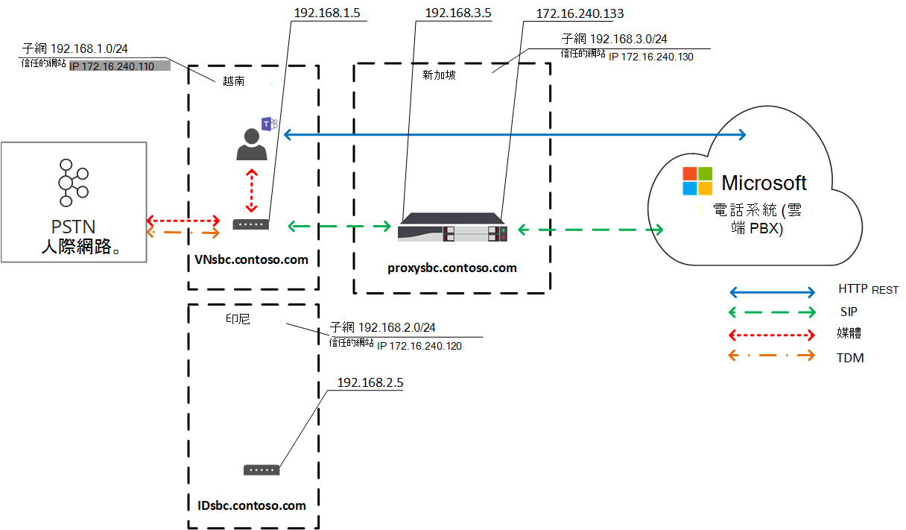

# 規劃直接路由的當地媒體優化

公用交換電話網路 (PSTN) 語音被視為業務關鍵型應用程式，對語音品質有很高的期望。 直接路由可讓您控制媒體流量流量，以容納全球各種企業的各種網路拓撲和市內電話設定。 

直接路由的當地媒體優化可讓您管理語音品質，方法為：

-   控制媒體流量在用戶端Teams用戶端與客戶會話邊界控制器之間 (SBC) 。
-   將媒體保留于公司網路子網的界限內。
-   允許用戶端Teams SBC 之間的媒體流，即使 SBCs 位於具有私人 IP 的公司防火牆後面，且 Microsoft 無法直接看到。

Local Media 優化支援兩種案例：

- 透過連接至主要會話初始通訊協定 (SIP) 主幹的集中式 SBC 集中所有本地主幹，為公司的所有當地分公司提供電話語音。

-   建立 SBC 的虛擬網路拓撲，其中本地分支辦公室中的 SBC 會連接到集中式 Proxy SBC，而系統可透過外部 IP 位址Microsoft 電話系統與它通訊。 在虛擬網路拓撲中，下游 SBCs 會透過內部 IP 通訊，因此無法直接電話系統。

本文將說明功能功能，以及客戶案例和解決方案。 有關設定的詳細資訊，請參閱 [設定 Local Media 優化](direct-routing-media-optimization-configure.md)。 

  > [!NOTE]
  > 如果您想要將媒體保持在內部網路的邊界內，建議您使用 Local Media 優化。 如果您已經有媒體旁路，而且您只使用 SBC 的公用 IP 位址，則並非必須移至 Local Media 優化。 您可以繼續使用媒體旁路。 詳細資訊，請參閱規劃 [媒體旁路](direct-routing-plan-media-bypass.md)。

有關哪些 SBC 廠商支援本地媒體優化的資訊，請參閱通過直接路由的會話 [邊界控制器認證](direct-routing-border-controllers.md)。

## 支援的客戶案例

針對此討論，請假設 Contoso 在全球執行多個企業，如下所示。  (請注意，歐洲和亞太地區僅做為範例使用。 公司可能有幾個具有類似需求的不同區域。) 
 
- **Contoso** 在歐洲大約 30 個國家/地區設有辦公室。 每個辦公室都有自己的私人分支Exchange (PBX) 。 

  Contoso 已提供一個選項，可針對所有 30 個歐洲辦公室，將主幹集中到一個位置 ，即 ：荷蘭的倫敦。 Contoso 在阿姆斯特丹部署 SBC，提供足夠的頻寬，可透過集中式位置執行通話，將中央 SIP 主幹連接到集中位置，並開始服務來自荷蘭的歐洲所有位置。 

- **在亞太地區，Contoso** 在不同的國家/地區設有多個辦公室。 

  在大多數國家/地區，公司仍擁有當地分公司的 TDM (多) 多工。 在 APAC 地區中，TDM 主幹集中化不是一個選項，因此無法切換到 SIP。 假設亞太地區超過 50 個 Contoso 分公司，有數百個閘道 (SBC) 。 在此情境中，由於缺少公用 IP 位址和/或本地網際網路中斷，因此無法將所有閘道配對至直接路由介面。 此外，部分國家/地區會強制規定沒有當地 PSTN 網路連接就無法符合的法規要求。

Contoso 根據業務需求，使用直接路由的 Local Media 優化來實施兩種解決方案：

- **在歐洲，** 所有主幹都是集中式，而媒體會依據使用者的位置，在中央 SBC 與使用者之間流動。 

  - 如果使用者已連接到公司網路 (即使用者為內部) ，則媒體會從中央 SBC 的內部 IP 與使用者的 Teams 用戶端之間流動。 
  
  - 如果使用者超出公司網路的邊界 ，例如，如果使用者使用公用無線網際網路連接，則該使用者會被視為外部使用者。 在這種情況下，媒體會從中央 SBC 的外部 IP 與用戶端Teams之間。

- **在 APAC 地區，** 集中式 Proxy SBC 會配對至 Microsoft Direct Routing，將媒體引導至直接路由介面與本地分支辦公室的下游 SBC 之間。 

  本地分支辦公室中的下游 SBC 不會直接顯示在 APAC 的直接路由中，而是使用 Set-CSOnlinePSTNGateway Cmdlet 配對，在 Microsoft 電話 System 中建立虛擬網路拓撲。 媒體盡可能保持在當地。 外部使用者有媒體在用戶端Teams Proxy SBC 的公用 IP 之間流動。

## 中央 SBC 與集中式主幹

若要建立解決方案，讓 PSTN 服務透過具有已連接的集中式 SIP 主幹的單一中央 SBC 提供給所有本地分支辦公室，Contoso 租使用者系統管理員會將一個 SBC (centralsbc.contoso.com) 配對至服務;SBC 已連接集中式 SIP 主幹。 

- 當使用者位於公司的內部網路中時，SBC 會提供媒體用 SBC 的內部 IP。 

- 當使用者位於公司網路外部時，SBC 會提供外部 (公用) SBC 的 IP。

> [!NOTE]
> 範例、表格或圖表內的所有值僅供圖例使用。

表格 1. SBCs 的範例網路參數 

| 位置 | SBC FQDN | 內部子網 | 外部 NAT (信任的 IP)  | SBC 外部 IP 位址 | SBC 內部 IP 位址 |
|:------------|:-------|:-------|:-------|:-------|:-------|
| 阿姆斯特丹 | centralsbc.contoso.com | 192.168.5.0/24 | 172.16.76.73 | 172.16.76.71 | 192.168.5.5 |
| 德國 | 尚未部署 | 192.168.6.0/24 | 172.16.76.74 | 尚未部署 |  尚未部署 |
| 法國 | 尚未部署 | 192.168.7.0/24 | 172.16.76.75 | 尚未部署 |  尚未部署 |

### 內部使用者

下圖顯示使用者連接到使用者主分支辦公室或網站中的公司網路時的流量流程。 

在內部部署期間，使用者會指派給德國的當地分公司。 使用者透過電話機直接路由Teams。

- 使用者的用戶端Teams直接透過 REST API 電話系統通訊，但通話期間產生的媒體會流向中央 SBC 的內部 IP 位址。 

- SBC 會將流程重新導向至電話系統連接 PSTN 網路。 

- 系統只會透過外部 IP 位址電話系統中央 SBC。 

圖表 1。 當使用者位於具有集中式 SBC 和已連結的集中式 SIP 主幹的 '家用'網站時的流量流程

### 外部使用者

下圖顯示使用者不在內部部署且未連接到公司網路時的流量流程 (也就是說，使用者的裝置已透過行動裝置或公用 Wi-Fi) 連接到網際網路。 使用者透過以下方式進行直接路由Teams：

- 使用者的用戶端Teams會直接透過 REST API 電話系統與 電話系統 通訊，但在此案例中，通話期間產生的媒體會流向中央 SBC 的外部 IP 位址。 

- SBC 會將流程重新導向至電話系統連接 PSTN 網路。 

- 系統只會透過外部 IP 位址電話系統中央 SBC。 

在此案例中，無論使用者是德國分公司或任何其他分支辦公室的當地使用者，行為都類似。 使用者被視為外部使用者，因為使用者超出公司網路的邊界。

圖表 2。 當使用者使用集中式 SBC 和已連結的集中式 SIP 主幹進行外部時的流量流程

## Proxy SBC 與已連接的下游 SBC

若要建立解決方案，讓 PSTN 服務在非選項的 APAC 地區所有本地分支辦公室中提供，而 TDM 主幹的集中化則是由 Contoso 系統管理員將一個 SBC (proxysbc.contoso.com) 也稱為 Proxy SBC 配對至直接路由服務。 

之後，Contoso 系統管理員會新增一些下游 SBC，指出這些 SBC 可以透過 proxy SBC proxysbc.contoso.com。 下游 SBCs 沒有公用 IP，不過，可以指派給語音路由。 下表顯示網路參數和設定範例。

當使用者位於下游 SBC 所在的本地分支辦公室時，媒體流量會直接在使用者與本地下游 SBC 之間流動。 如果使用者位於公用網際網路 (上的 office) 之外，媒體會從使用者流向 Proxy SBC 的公用 IP，而 Proxy SBC 會代理到相關的下游 SBC () 。

表格 2. 範例 SBC 網路資訊

| 位置 | SBC FQDN | 內部子網 | 外部 NAT (信任的 IP)  | SBC 外部 IP 位址  | SBC 內部 IP 位址 |
|:------------|:-------|:-------|:-------|:-------|:-------|
| 越南 | VNsbc.contoso.com | 192.168.1.0/24 | 172.16.240.110 | 無 |  192.168.1.5 |
| 印尼  | IDsbc.contoso.com | 192.168.2.0/24 | 172.16.240.120 | 無 |  192.168.2.5 |
| 新加坡 | proxysbc.contoso.com |   192.168.3.0/24 | 172.16.240.130 | 172.16.240.133 | 192.168.3.5 |

### 內部使用者 

下圖顯示當使用者位於 APAC 地區的辦公室內時，案例的高層流量流量。 指派給 越南 當地分公司且位於內部部署中的使用者，會透過 Teams。 

- 使用者的用戶端Teams直接透過 REST API 電話系統通訊，但通話期間產生的媒體會流向當地 SBC 的內部 IP 位址。

- 本地 SBC 會將流程重新導向到新加坡的 Proxy SBC，並重新導向到已連接的當地 PSTN 網路。

-  Proxy SBC 只會電話系統外部 IP 位址，並路由流程從下游 SBC (在此案例中，本地 SBC 越南) 電話系統。 

- 本地分支辦公室中的下游 SBC 無法直接電話系統但對應于設定 Local Media 優化時由 Contoso 系統管理員定義的虛擬網路拓撲中。

> [!NOTE]
> 根據已配置的 Local Media 優化模式，本地使用者和非本地使用者的行為可能會有所不同。 

若要進一步瞭解可能的模式和相關行為，請參閱設定 Local Media 優化。

圖表 3。 當使用者使用 Proxy SBC 與連接下游 SBC 的「家用」網路時的流量流量 

### 外部使用者

下圖顯示使用者超出公司網路邊界時的流量流程。 使用者不在內部部署 (不在公司網路邊界) 。 使用者透過直接路由電話Teams到 越南。 

- 使用者的用戶端Teams透過 REST API 直接與 電話系統通訊，但通話期間產生的媒體會先流向新加坡 Proxy SBC 的外部 IP 位址。 

- 根據設定和語音 (請參閱設定本地媒體優化) ，Proxy SBC 會將流程重新導向至 越南 中的下游 SBC。  

- 下行 SBC 越南將流程重新導向到已連接的本地 PSTN 網路。 

- Proxy SBC 只會電話系統外部 IP 位址顯示。

-  本地分支辦公室的下游 SBC 不會直接電話系統，而是對應在設定 Local Media 優化時由 Contoso 系統管理員定義的虛擬網路拓撲中。 在範例中，使用者被視為外部使用者，因為使用者超出公司網路的邊界。 

圖表 4. 當使用者使用 Proxy SBC 與連結的下游 SBC 外部時的流量流程

## Local Media 優化模式

Local Media 優化支援兩種模式：

- **模式 1：永遠忽略**。 在這種情況下，如果使用者是內部使用者，無論內部使用者的實際位置如何，媒體都會透過本地下游 SBC 的內部 IP 位址流程;例如，在下游 SBC 所在的同一個分支辦公室中，或在其他分支辦公室中。  

- **模式 2：僅適用于本地使用者**。 在此模式中，媒體只會在內部使用者與下游 SBC 位於同一個分支辦公室產生時，直接流向本地下游 SBC 的內部 IP 位址。 

若要區分本地媒體優化模式，租使用者系統管理員必須使用 Set-CSonlinePSTNGateway Cmdlet，將每個 SBC 的 -BypassMode 參數設為 "Always" 或 'OnlyForLocalUsers'。 詳細資訊，請參閱設定 [Local Media 優化](direct-routing-media-optimization-configure.md)。  

> [!NOTE]
> 當使用者是內部使用者時，使用者與 SBC 之間必須經過內部 IP 位址的媒體 **連接**。 在這種情況下，媒體的公用傳輸轉場沒有退路，因為 SBC 會提供媒體連接的內部 IP。 

### 模式 1：永遠忽略

如果您在分支辦公室之間有良好的連接，建議的模式會一直忽略。
 
例如，假設一家公司在阿姆斯特丹有集中式 SIP 主幹，服務 30 個國家/地區，且所有 30 個網站與當地使用者之間擁有良好的連接能力。 德國也有部署本地 SBC 的分支。

德國的 SBC 可以以「一直忽略」模式進行配置。 無論使用者的位置如何，使用者都會透過 SBC 內部 IP 位址直接連接到 SBC，例如從法國 (德國;請參閱下圖，以參考) 。

下列說明兩個案例：

- 案例 1。 使用者的位置與線上語音路由策略中定義的 SBC 相同。

- 案例 2。 使用者和閘道會在不同的網站中。

#### 案例 1。 使用者的位置與線上語音路由策略中定義的 SBC 相同

位於荷蘭的 SBC 已配置為德國當地下游 SBC 的 Proxy SBC。 使用者位於德國，與本地 SBC 的公司網路位於同一子網內。 Proxy 和 (的 SBC 都) 一直旁路模式。 線上語音路由政策指定，如果在德國境內撥打 (使用區碼 +49) 應路由至德國的當地 SBC。 所有其他通話 ，萬一德國的 SBC 失敗，則德國的通話應該會路由至位於荷蘭的 Proxy SBC。 下表摘要列出範例組組。 

表格 3. 案例 1 的範例組組

| 使用者實際位置 | 使用者撥打號碼 | 線上語音路由策略 | 為 SBC 所配置的模式 | 媒體Flow | 
|:------------|:-------|:-------|:-------|:-------|
| 德國 | +49 1 437 2800 | 優先順序 1：^ \+ 49 (\d) {8} $ -DEsbc.contoso.com 優先順序 2：.* - proxysbc.contoso.com| DEsbc.contoso.com – 永遠忽略  proxysbc.contoso.com – 永遠忽略 | Teams使用者<> DEsbc.contoso.com |

下圖顯示德國內部使用者透過 Teams 直接路由電話號碼撥打到德國號碼的高層流量。 

- 使用者的用戶端Teams直接透過 REST API 電話系統通訊。 

- 通話期間產生的媒體會流向當地 SBC 的內部 IP 位址。 

- 本地 SBC 會將流程重新導向到位於荷蘭的 Proxy SBC，以及連結的當地 PSTN 網路。 

- Proxy SBC 只會電話系統外部 IP 位址，並路由流程從下游 SBC (在此案例中，德國的當地 SBC) 電話系統。 

- 本地分支辦公室中的下游 SBC 無法直接電話系統但對應于設定 Local Media 優化時由 Contoso 系統管理員定義的虛擬網路拓撲中。

圖表 5。  使用「一直忽略」模式的流量，且使用者位於「首頁」網站

#### 案例 2：使用者和閘道在不同的網站

位於荷蘭的 SBC 已配置為德國當地下游 SBC 的 Proxy SBC。 Proxy 和 (的 SBC 都) 一直旁路模式。 法國的內部使用者位於當地分公司，正在撥打直接路由到德國。 線上語音路由政策指定使用 (+49) 撥打至德國的當地 SBC。 所有其他通話 ，如果德國的 SBC 失敗，則所有在德國的通話都應該路由至位於荷蘭的 Proxy SBC。 下表摘要列出範例組組。 

表格 4. 案例 2 的範例組組

| 使用者實際位置 | 使用者撥打號碼 | 線上語音路由策略 | 為 SBC 所配置的模式 | 媒體Flow | 
|:------------|:-------|:-------|:-------|:-------|
| 法國 | +49 1 437 2800 | 優先順序 1：^ \+ 49 (\d) {8} $ -DEsbc.contoso.com  優先順序 2：.* - proxysbc.contoso.com |  DEsbc.contoso.com – 永遠忽略 proxysbc.contoso.com – 永遠忽略 | Teams使用者<– > DEsbc.contoso.com  |

下圖顯示位於法國的內部德文使用者透過 Teams 直接路由到德國號碼時，高流量流量。 

- 使用者的用戶端Teams直接透過 REST API 電話系統通訊。

- 通話期間產生的媒體會直接流向德國內部 IP 位址中的 SBC。 

- 德國的 SBC 會將流程重新導向到位於荷蘭的 Proxy SBC，以及連結的當地 PSTN 網路。 

圖表 6。  使用「一直忽略」模式的流量，且使用者不是在「家用」網站，而是在內部網路中

### 模式 2：僅適用于當地使用者

如果當地分支辦公室之間的連結不良，但每個當地分公司與地區辦公室之間的連結良好，則建議模式為「僅適用于當地使用者」。

例如，在 APAC 地區，假設 Contoso 在不同的國家/地區有多個辦公室。 對許多國家/地區來說，無法切換到 SIP，因為該公司在許多當地分公司中仍擁有 TDM 主幹。 在 APAC 地區中，TDM 主幹集中化不是一個選項。 此外，亞太地區有 50 多個 Contoso 分公司，有數百個閘道 (SBC) 。 

若要建立解決方案，讓 PSTN 服務在亞太地區的所有當地分公司中提供，而 TDM 主幹無法集中處理，Contoso 系統管理員會將新加坡的一個區域 SBC 配對為 Proxy SBC 至直接路由服務。 當地分公司之間的直接連接並不良好，但每一個當地分公司與新加坡的地區 SBC 之間都有良好的關聯。 針對地區 SBC，系統管理員選擇 'Always Bypass' 模式，而對於當地下游 SBC，系統管理員選擇 'Only for Local Users' 模式。

下列說明兩個案例：

- 案例 1。 使用者的位置與線上語音路由策略中定義的 SBC 相同

- 案例 2。 使用者和閘道在不同的網站

#### 案例 1。 使用者的位置與線上語音路由策略中定義的 SBC 相同

假設新加坡的 SBC 已針對新加坡和印尼的當地下游 SBC 越南 PROXY SBC。 使用者位於越南 SBC 的同一個位置。 線上語音路由策略指定越南 (區碼 +84) 的通話應路由至 越南。 所有其他通話 ，以及如果 越南 中的 SBC 失敗，越南中的通話應該會路由至新加坡的 Proxy SBC。 下表摘要列出範例組組。 

表格 5. "僅適用于本地使用者" 模式的範例組組案例 1

| 使用者實際位置 | 使用者撥打號碼 | 線上語音路由策略 | 為 SBC 所配置的模式 | 媒體Flow | 
|:------------|:-------|:-------|:-------|:-------|
| 越南 | +84 4 3926 3000 | 優先順序 1：^ \+ 84 (\d) {9} $ -VNsbc.contoso.com  優先順序 2：.* - proxysbc.contoso.com | VNsbc.contoso.com – 僅適用于本地使用者   proxysbc.contoso.com – 永遠忽略 | Teams使用者<> VNsbc.contoso.com |

在下列圖表中，指派給 越南 中當地分支辦公室的使用者，在內部部署時，會透過 Teams。 

- 使用者的用戶端Teams直接透過 REST API 電話系統通訊。 

- 通話期間產生的媒體會流向當地 SBC 的內部 IP 位址。 

- 本地 SBC 會將流程重新導向到新加坡的 Proxy SBC，並重新導向到已連接的當地 PSTN 網路。 

- Proxy SBC 只會電話系統外部 IP 位址顯示，並路由流程從下游 SBC (在此案例中，將 越南) 中的本地 SBC 電話系統。 

- 本地分支辦公室的下游 SBC 不會直接電話系統，而是對應在虛擬網路拓撲中。

圖表 7。 使用「僅適用于本地使用者」模式的流量，且使用者位於「首頁」網站

#### 案例 2。 使用者和閘道在不同的網站

假設新加坡的 SBC 已針對新加坡和印尼的當地下游 SBC 越南 PROXY SBC。 印尼的內部使用者位於當地分公司，正在撥打直接路由越南。 線上語音路由策略指定越南 (區碼 +84) 的通話應路由至當地 SBC 越南。 所有其他通話 ，萬一 SBC 越南失敗，越南的通話應該會路由至新加坡的 Proxy SBC。 新加坡的 Proxy SBC 設定為 "Always bypass" 模式，而 越南 中的本地 SBC 則設為 "僅適用于當地使用者」 模式。 下表摘要列出範例組組。 

表格 6. 使用者組組

| 使用者實際位置 | 使用者撥打號碼 | 線上語音路由策略 | 為 SBC 所配置的模式 | 媒體Flow | 
|:------------|:-------|:-------|:-------|:-------|
| 印尼 | +84 4 3926 3000 | 優先順序 1：^ \+ 84 (\d) {9} $ -VNsbc.contoso.com   優先順序 2：.* - proxysbc.contoso.com |VNsbc.contoso.com – 僅適用于本地使用者   proxysbc.contoso.com – 永遠忽略 | Teams使用者<> proxysbc.contoso.com <> VNsbc.contoso.com |

在下列圖表中，內部使用者在印尼分公司的內部部署中，透過 Teams 直接路由電話越南。 

- 使用者的用戶端Teams直接透過 REST API 電話系統通訊。

- 在通話期間產生的媒體會先流向 Proxy SBC 的內部 IP 位址。 

- 新加坡的 Proxy SBC 會將流程重新導向至 越南 中下游 SBC 的內部 IP 位址，電話系統。 

- [下行 SBC 越南路由流程至已連接的本地 PSTN 網路。 

- Proxy SBC 只會電話系統外部 IP 位址顯示。

- 本地分支辦公室中的下游 SBC 不會直接電話系統，而是對應在虛擬網路拓撲中。

圖表 8。  流量流程為「僅適用于本地使用者」模式，且使用者不是在「家用」網站，而是在內部網路中

## 已知問題

以下是目前存在於 Local Media 優化中的已知問題清單。 Microsoft 正在努力解決這些問題。

| 問題 | 解決 方案 |
| :--- | :--- |
| Teams用戶端公用 IP 符合客戶信任的 IP 清單Teams用戶端不會識別為內部用戶端。 | Local Media 優化要求Teams子網符合租使用者所配置的[網路子網](/powershell/module/skype/new-cstenantnetworksubnet)|
| 當用戶端被識別為內部Teams通話升級會導致通話中斷。| 停用直接路由 SBC 上的 Local Media 優化。|
| 從內部客戶之間的 1 到 1 通話升級為與外部客戶/資源進行多方通話，導致通話中斷 | 正在處理修正程式。 或者，停用直接路由 SBC 上的 Local Media 優化。|
| Teams將通話保留。 PSTN 端播放音樂，而 [Local Media 優化功能」 正在使用中。 使用者Teams繼續通話。 PSTN 的通話繼續，但 [本地媒體優化 (SBC) 通話 | 當使用者將通話暫停以啟動等候音樂 (MoH) 時，通話控制器會從 1：1 升級為多方通話，以呼叫媒體控制器和媒體處理器 (做為 AVMCU 混合器) ，MoH 會透過此呼叫到達已保留的使用者。 在通話繼續後取消升級為 1：1 通話，不會像每個設計一樣發生。 停用直接路由 SBC 上的 Local Media 優化。|
|當通話建立數秒時，使用者可能會聽到靜音。| 由於本地媒體優化架構的複雜性，在某些情況下可能會發生此情況。|
|語音應用程式 (例如自動語音留言、通話佇列) 無法工作。| LMO 不支援 Voice Apps，因為它們位於雲端且需要外部連接。 目前沒有任何解決方法。|
