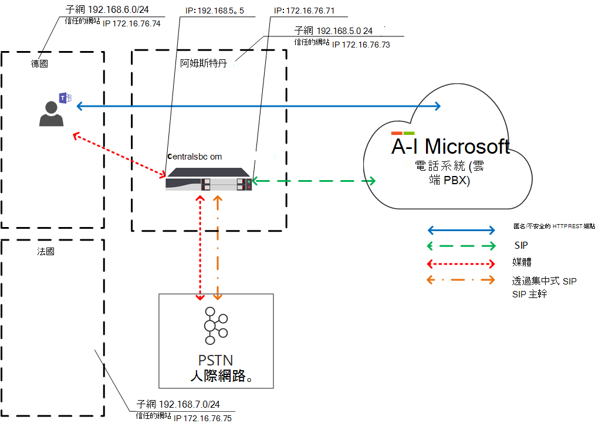

# 規劃直接路由的本機媒體優化

公用交換電話網路 (PSTN) 語音是商務關鍵應用程式，對語音品質有很高的預期。 直接路由可讓您控制媒體流量，以容納世界各地各種企業的眾多網路拓撲和本機電話語音設定。

直接路由的本機媒體優化可讓您透過下列方式管理語音品質：

- 控制 Teams 用戶端與客戶會話框線控制器之間的媒體流量如何 (SBC) 。
- 將媒體保持在公司網路子網的邊界內。
- 允許在 Teams 用戶端和 SBC 之間串流媒體，即使 SBC 位於具有私人 IP 的公司防火牆後面，而且 Microsoft 也無法直接看到。

本機媒體優化支援兩種案例：

- 透過連接至主要會話初始通訊協定的集中式 SBC 集中處理所有本機主幹 (SIP) 主幹-- 提供電話語音服務給公司的所有當地分公司。

- 建置 SBC 的虛擬網路拓撲，讓本機分公司中的 SBC 連線到集中式 Proxy SBC，並透過其外部 IP 位址與 Microsoft Phone System 通訊。 在虛擬網路拓撲中，下層 SB 會透過內部 IP 進行通訊，而手機系統不會直接看到。

本文將說明功能，以及客戶案例和解決方案。 如需設定的詳細資料，請參閱 [設定本機媒體優化](direct-routing-media-optimization-configure.md)。

  > [!NOTE]
  > 如果您想要讓媒體保持在內部網路邊界內，建議使用本機媒體優化。 如果您已經有 Media Bypass，而且只使用 SBC 的公用 IP 位址，則不需移至本機媒體優化。 您可以繼續使用 Media Bypass。 如需詳細資訊，請參閱 [規劃媒體旁路](direct-routing-plan-media-bypass.md)。

如需哪些 SBC 廠商支援本機媒體優化的相關資訊，請參閱 [通過直接路由認證的會話框線控制器](direct-routing-border-controllers.md)。

## 支援的客戶案例

在此討論中，假設 Contoso 在全球執行多個業務，如下所示。  (請注意，歐洲和太平洋地區只會做為範例使用。 公司可能有數個不同的地區有類似的需求。) 

- **在歐洲**，Contoso 在大約 30 個國家/地區設有辦公室。 每個辦公室都有自己的 Private Branch Exchange (PBX) 。

  針對所有 30 個歐洲辦公室，Contoso 都可選擇集中一處的樹幹 —阿姆斯特丹。 Contoso 在阿姆斯特丹部署 SBC，提供足夠的頻寬，可透過集中位置執行通話、將中央 SIP 主幹連接至集中位置，以及從阿姆斯特丹開始服務所有歐洲位置。

- **在 APAC 地區**，Contoso 在不同國家/地區設有多個辦公室。

  在許多國家/地區，該公司在當地分公司中仍具有時間分割 (TDM) 主幹。 TDM 主幹集中不是 APAC 地區的選項，因此無法切換到 SIP。 假設在 APAC 地區有超過 50 個 Contoso 分公司， (SBC) 上百個閘道。 在此案例中，由於缺少公用 IP 位址和/或本機網際網路分組，無法將所有閘道配對至直接路由介面。 此外，某些國家/地區規定在沒有本機 PSTN 網路連線的情況下，無法滿足的法規要求。

根據他們的業務需求，Contoso 針對直接路由實作「本機媒體優化」實作兩個解決方案：

- **在歐洲**，所有主幹都是集中式的，媒體會根據使用者位置在 SBC 中心和使用者之間流動。

  - 如果使用者已連線到公司網路 (的本機子網，則該使用者為內部) ，媒體會在中央 SBC 的內部 IP 和使用者的 Teams 用戶端之間流動。

  - 如果使用者超出公司網路的界限，例如，如果使用者使用公用無線網際網路連線，則使用者會被視為外部使用者。 在此情況下，媒體會在中央 SBC 的外部 IP 和 Teams 用戶端之間流動。

- **在 APAC 地區**，集中式 Proxy SBC 已與 Microsoft Direct Routing 配對，後者會在直接路由介面和當地分公司的下層 SB 之間導向媒體。

  在 APAC 的直接路由中，無法直接看到當地分公司中的下層 SB，但是它們是使用Set-CSOnlinePSTNGateway Cmdlet 在 Microsoft Phone System 中建立虛擬網路拓撲來配對。 媒體會盡可能保持本機。 外部使用者的媒體在 Teams 用戶端和 Proxy SBC 的公用 IP 之間流動。

## 具有集中式主幹的中央 SBC

為了建置解決方案，讓 PSTN 服務透過單一中央 SBC 提供給所有當地分公司，並具有連接的集中式 SIP 主幹，Contoso 租使用者系統管理員會將一個 SBC (centralsbc.contoso.com) 配對到服務;SBC 已連接集中式 SIP 主幹。

- 當使用者位於公司的內部網路時，SBC 會提供媒體用 SBC 的內部 IP。

- 當使用者不在公司網路之外時，SBC 會提供 SBC 的外部 (公用) IP。

> [!NOTE]
> 範例、表格或圖表中的所有值僅供圖例使用。

資料表 1. SBC 的網路參數範例

| 位置 | SBC FQDN | 內部子網 | 外部 NAT (信任的 IP)  | SBC 外部 IP 位址 | SBC 內部 IP 位址 |
|:------------|:-------|:-------|:-------|:-------|:-------|
| 阿姆斯特丹 | centralsbc.contoso.com | 192.168.5.0/24 | 172.16.76.73 | 172.16.76.71 | 192.168.5.5 |
| 德國 | 未部署 | 192.168.6.0/24 | 172.16.76.74 | 未部署 |  未部署 |
| 法國 | 未部署 | 192.168.7.0/24 | 172.16.76.75 | 未部署 |  未部署 |

### 內部使用者

下圖顯示當使用者連線到使用者家用分公司或網站中的公司網路時的流量。

在內部部署期間，使用者會被指派給德國的當地分公司。 使用者透過 Teams 撥打直接路由電話。

- 使用者的 Teams 用戶端會直接透過 REST API 與電話系統通訊，但通話期間產生的媒體會流向中央 SBC 的內部 IP 位址。

- SBC 會將流程重新導向至電話系統和連線的 PSTN 網路。

- 手機系統只能透過外部 IP 位址看到中央 SBC。

圖表 1. 當使用者位於具有集中式 SBC 且具有連線集中式 SIP 主幹的「首頁」網站時的流量

### 外部使用者

下圖顯示當使用者不在內部部署且未連線至公司網路時的流量 (，也就是使用者的裝置是透過行動裝置或公用 Wi-Fi) 連線到網際網路。 使用者透過 Teams 撥打直接路由電話：

- 使用者的 Teams 用戶端會透過 REST API 直接與電話系統通訊，但在此情況下，通話期間產生的媒體會流向中央 SBC 的外部 IP 位址。

- SBC 會將流程重新導向至電話系統和連線的 PSTN 網路。

- 手機系統只能透過外部 IP 位址看到中央 SBC。

在此情況下，無論使用者是德國分公司或任何其他分公司的本地分公司，其行為都是類似的。 使用者會被視為外部使用者，因為使用者超出公司網路的界限。

圖表 2. 當使用者使用集中式 SBC 和連線的集中式 SIP 主機時的流量流量

## Proxy SBC 與連接的下游 SBC

若要建置解決方案，讓 PSTN 服務在 APAC 地區的所有當地分公司中提供，但其中不提供 TDM 主幹的集中化選項，Contoso 系統管理員會將一個 SBC (proxysbc.contoso.com) ，也稱為 Proxy SBC，配對至直接路由服務。

之後，Contoso 系統管理員會新增一些下游 SB，表示可以透過 Proxy SBC proxysbc.contoso.com 聯繫。 下方 SBC 沒有公用 IP，但是可以指派給語音路由。 下表顯示範例網路參數和設定。

當使用者位於下方 SBC 所在的本機分公司時，媒體流量會直接在使用者與本機的下游 SBC 之間流向。 如果使用者在公用網際網路) 上不在辦公室 (之外，則媒體會從使用者流向 Proxy SBC 的公用 IP，而 Proxy SBC 則會將它 proxy 匯出至相關的下游 SBC () 。

資料表 2. SBC 網路資訊範例

| 位置 | SBC FQDN | 內部子網 | 外部 NAT (信任的 IP)  | SBC 外部 IP 位址  | SBC 內部 IP 位址 |
|:------------|:-------|:-------|:-------|:-------|:-------|
| 越南 | VNsbc.contoso.com | 192.168.1.0/24 | 172.16.240.110 | 無 |  192.168.1.5 |
| 印尼  | IDsbc.contoso.com | 192.168.2.0/24 | 172.16.240.120 | 無 |  192.168.2.5 |
| 新加坡 | proxysbc.contoso.com |   192.168.3.0/24 | 172.16.240.130 | 172.16.240.133 | 192.168.3.5 |

### 內部使用者

下圖顯示當使用者位於 APAC 地區的辦公室內時，案例的高階流量。
使用者獲指派至 越南 中的本機分公司，且位於內部部署，可透過 Teams 撥打直接路由電話。

- 使用者的 Teams 用戶端會直接透過 REST API 與電話系統通訊，但通話期間產生的媒體會流向本機 SBC 的內部 IP 位址。

- 本機 SBC 會將流程重新導向至新加坡的 Proxy SBC 以及連線的本機 PSTN 網路。

-  手機系統只能透過外部 IP 位址看到 Proxy SBC，並在此情況下將流程從下方 SBC (路由至越南) 中的本機 SBC 至電話系統。

- 手機系統無法直接看到本機分公司中的下層 SBC，但在設定本機媒體優化時由 Contoso 系統管理員定義的虛擬網路拓撲內對應。

> [!NOTE]
> 視設定的本機媒體優化模式而定，本機使用者和非本機使用者的行為可能有所不同。

如需有關可能模式和相關行為的詳細資訊，請參閱設定本機媒體優化。

圖表 3. 當使用者使用 Proxy SBC 和連接的下方 SBC 在「家庭」網路中時的流量

### 外部使用者

下圖顯示當使用者超出公司網路界限時的流量。 使用者不在內部部署 (不在公司網路) 的範圍內。 使用者透過 Teams 撥打直接路由至越南中的電話號碼。

- 使用者的 Teams 用戶端會直接透過 REST API 與電話系統通訊，但通話期間產生的媒體會先流向新加坡 Proxy SBC 的外部 IP 位址。

- 根據設定和語音原則 (參閱設定本機 [媒體優化](direct-routing-media-optimization-configure.md) 以取得詳細) ，Proxy SBC 會將流程重新導向至越南中的下層 SBC。

- 越南中的下層 SBC 會將流程重新導向至連線的本機 PSTN 網路。

- 手機系統只能透過外部 IP 位址看到 Proxy SBC。

-  手機系統無法直接看到本機分公司中的下層 SBC，但在設定本機媒體優化時由 Contoso 系統管理員定義的虛擬網路拓撲內對應。 在範例中，使用者會被視為外部使用者，因為使用者超出公司網路的界限。

圖表 4. 當使用者使用 Proxy SBC 與連接的下方 SBC 為外部時的流量

## 本機媒體優化模式

本機媒體優化支援兩種模式：

- **模式 1：一律略過**。 在此情況下，如果使用者是內部使用者，無論內部使用者的實際位置為何，媒體都會流經本機的內部 SBC 內部 IP 位址;例如，在位於下方 SBC 的同一個分公司內，或位於其他分公司。

- **模式 2：僅適用于本機使用者**。 在此模式中，只有當內部使用者與下方 SBC 位於同一個分公司時，媒體才會直接流向本機的下游 SBC 內部 IP 位址。

若要區分本機媒體優化模式，租使用者系統管理員必須使用 Set-CSonlinePSTNGateway Cmdlet，為每個 SBC 將 -BypassMode 參數設定為 [Always] 或 [OnlyForLocalUsers]。 如需詳細資訊，請參閱 [設定本機媒體優化](direct-routing-media-optimization-configure.md)。

> [!NOTE]
> 當使用者是內部使用者時，使用者與 SBC 之間 **必須** 透過內部 IP 位址進行媒體連線。 在此情況下，媒體的公用傳輸轉送沒有回溯，因為 SBC 會提供內部 IP 以供媒體連線。

### 模式 1：永遠略過

如果您在分公司之間關係良好，建議的模式一律會略過。

例如，假設公司在阿姆斯特丹有集中式 SIP 主幹，可服務于 30 個國家/地區，且在所有 30 個網站和本機使用者之間具有良好的連線能力。 德國也有部署本機 SBC 的分支。

德國的 SBC 可設定為「永遠略過」模式。 無論使用者的位置為何，使用者都會透過 SBC (的內部 IP 位址直接連線到 SBC，例如從法國到德國;請參閱下圖以取得參考) 。

下列說明兩個案例：

- 案例 1. 使用者所在的位置與線上語音路由原則中定義的 SBC 相同。

- 案例 2. 使用者和閘道位於不同的網站。

#### 案例 1. 使用者所在的位置與線上語音路由原則中定義的 SBC 相同

阿姆斯特丹的 SBC 已設定為德國當地下游 SBC 的 Proxy SBC。 使用者在德國的子網與本機 SBC 的公司網路相同。 Proxy (和下) 兩個 SBC 都設定為 [永遠略過] 模式。 線上語音路由原則會指定如果德國境內的通話 (區碼 +49) 應路由至德國的本機 SBC。 所有其他通話--如果德國的 SBC 失敗，德國的通話應該路由至阿姆斯特丹的 Proxy SBC。 下表摘要列出範例設定。

資料表 3. 案例 1 的範例設定

| 使用者實體位置 | 使用者撥打號碼 | 線上語音路由原則 | 為 SBC 設定模式 | 媒體流程 |
|:------------|:-------|:-------|:-------|:-------|
| 德國 | +49 1 437 2800 | 優先順序 1：^ \+ 49 (\d {8}) $ -DEsbc.contoso.com 優先順序 2：.* - proxysbc.contoso.com| DEsbc.contoso.com – 永遠略過  proxysbc.contoso.com – 永遠略過 | Teams 使用者<–> DEsbc.contoso.com |

下圖顯示德國內部使用者透過 Teams 撥打直接路由電話到德國的號碼的高層級流量。

- 使用者的 Teams 用戶端會直接透過 REST API 與電話系統通訊。

- 通話期間產生的媒體會流向本機 SBC 的內部 IP 位址。

- 本機 SBC 會將流程重新導向至阿姆斯特丹的 Proxy SBC 以及連線的本機 PSTN 網路。

- 手機系統只能透過外部 IP 位址看到 Proxy SBC，並在此情況下將流程從下方 SBC (路由至德國的本機 SBC) 至電話系統。

- 手機系統無法直接看到本機分公司中的下層 SBC，但在設定本機媒體優化時由 Contoso 系統管理員定義的虛擬網路拓撲內對應。

圖表 5.  流量有「永遠略過」模式，且使用者位於「首頁」網站

#### 案例 2：使用者和閘道位於不同的網站

阿姆斯特丹的 SBC 已設定為德國當地下游 SBC 的 Proxy SBC。 Proxy (和下) 兩個 SBC 都設定為 [永遠略過] 模式。 位於當地分公司的法國內部使用者正在撥打直接路由到德國的通話。 線上語音路由原則會指定使用區碼 +49) 的來電到德國 (應路由至德國的本機 SBC。 所有其他通話，以及如果德國的 SBC 失敗，在德國的所有通話都應該路由至阿姆斯特丹的 Proxy SBC。 下表摘要列出範例設定。

資料表 4. 案例 2 的範例設定

| 使用者實體位置 | 使用者撥打號碼 | 線上語音路由原則 | 為 SBC 設定模式 | 媒體流程 |
|:------------|:-------|:-------|:-------|:-------|
| 法國 | +49 1 437 2800 | 優先順序 1：^ \+ 49 (\d {8}) $ -DEsbc.contoso.com  優先順序 2：.* - proxysbc.contoso.com |  DEsbc.contoso.com – 永遠略過 proxysbc.contoso.com – 永遠略過 | Teams 使用者<– > DEsbc.contoso.com  |

下圖顯示位於法國的德國內部使用者透過 Teams 撥打直接路由電話到德國的號碼時的高層級流量。

- 使用者的 Teams 用戶端會直接透過 REST API 與電話系統通訊。

- 通話期間產生的媒體會直接流向德國內部 IP 位址的 SBC。

- 德國的 SBC 會將流程重新導向至阿姆斯特丹的 Proxy SBC 以及連線的本機 PSTN 網路。

圖表 6.  流量有「永遠略過」模式，且使用者不在「首頁」網站，而是在內部網路中

### 模式 2：僅適用于本機使用者

如果當地分公司之間連線不良，但每個當地分公司和地區辦公室之間關係良好，建議的模式是「僅適用于本機使用者」。

例如，在 APAC 地區，假設 Contoso 在不同國家/地區有多個辦公室。 對大部分國家/地區來說，切換到 SIP 是無法的，因為該公司在許多當地分公司中仍有 TDM 主幹。 TDM 主幹集中不是 APAC 地區的選項。 此外，在 APAC 地區有超過 50 間 Contoso 分公司， (SBC) 上百個閘道。

若要建置解決方案，讓 PSTN 服務在 APAC 地區的所有當地分公司中提供，但若 TDM 主幹的集中化不是選項，Contoso 系統管理員會將新加坡的一個地區 SBC 配對為 Proxy SBC 與直接路由服務。 當地分公司之間的直接連線並不好，但每個當地分公司和新加坡地區 SBC 之間有良好的連線。 對於地區 SBC，系統管理員會選擇「永遠略過」模式，而對於本機的下游 SBC，系統管理員會選擇 [僅適用于本機使用者] 模式。

下列說明兩個案例：

- 案例 1. 使用者所在的位置與線上語音路由原則中定義的 SBC 相同

- 案例 2. 使用者和閘道位於不同的網站

#### 案例 1. 使用者所在的位置與線上語音路由原則中定義的 SBC 相同

假設新加坡的 SBC 設為 越南 及印尼本地下游 SB 的 Proxy SBC。 使用者所在的越南位置與本機 SBC 相同。 線上語音路由原則會指定在越南 (中使用區碼 +84) 的通話應在 越南 中路由至本機 SBC。 所有其他通話--如果 越南 中的 SBC 失敗，越南中的通話應該路由至新加坡的 Proxy SBC。 下表摘要列出範例設定。

資料表 5. 「僅適用于本機使用者」模式案例 1 的範例設定

| 使用者實體位置 | 使用者撥打號碼 | 線上語音路由原則 | 為 SBC 設定模式 | 媒體流程 |
|:------------|:-------|:-------|:-------|:-------|
| 越南 | +84 4 3926 3000 | 優先順序 1：^ \+ 84 (\d {9}) $ -VNsbc.contoso.com  優先順序 2：.* - proxysbc.contoso.com | VNsbc.contoso.com – 僅適用于本機使用者   proxysbc.contoso.com – 永遠略過 | Teams 使用者<–> VNsbc.contoso.com |

在下列圖表中，指派給 越南 中本機分公司的使用者，在內部部署期間，透過 Teams 撥打直接路由電話。

- 使用者的 Teams 用戶端會直接透過 REST API 與電話系統通訊。

- 在通話期間產生的媒體會流向本機 SBC 的內部 IP 位址。

- 本機 SBC 會將流程重新導向至新加坡的 Proxy SBC 以及連線的本機 PSTN 網路。

- 手機系統只能透過外部 IP 位址看到 Proxy SBC，並在此情況下，將流程從下方 SBC (，也就是越南) 中的本機 SBC 路由至電話系統。

- 手機系統無法直接看到本機分公司中的下層 SBC，但在虛擬網路拓撲中對應。

圖表 7. 流量為「僅適用于本機使用者」模式，且使用者位於「首頁」網站

#### 案例 2. 使用者和閘道位於不同的網站

假設新加坡的 SBC 設為 越南 及印尼本地下游 SB 的 Proxy SBC。 位於當地分公司的印尼內部使用者正在撥打直接路由電話給越南。 線上語音路由原則會指定使用區碼 +84) 越南 (的通話應在 越南 中路由至本機 SBC。 所有其他通話，以及萬一 越南 中的 SBC 失敗，則應將呼叫呼叫越南路由至新加坡的 Proxy SBC。 新加坡的 Proxy SBC 設定為「永遠略過」模式，而 越南 中的本機 SBC 設為「僅適用于本機使用者」模式。 下表摘要列出範例設定。

資料表 6. 使用者設定

| 使用者實體位置 | 使用者撥打號碼 | 線上語音路由原則 | 為 SBC 設定模式 | 媒體流程 |
|:------------|:-------|:-------|:-------|:-------|
| 印尼 | +84 4 3926 3000 | 優先順序 1：^ \+ 84 (\d {9}) $ -VNsbc.contoso.com   優先順序 2：.* - proxysbc.contoso.com |VNsbc.contoso.com – 僅適用于本機使用者   proxysbc.contoso.com – 永遠略過 | Teams 使用者<–> proxysbc.contoso.com <–> VNsbc.contoso.com |

在下列圖表中，內部使用者在印尼分公司的內部部署期間，透過 Teams 撥打直接路由電話至越南中的號碼。

- 使用者的 Teams 用戶端會直接透過 REST API 與電話系統通訊。

- 在通話期間產生的媒體會先流向 Proxy SBC 的內部 IP 位址。

- 新加坡的 Proxy SBC 會將流程重新導向至越南中下方 SBC 的內部 IP 位址，並重新導向至電話系統。

- 越南中的下層 SBC 會將流程路由至連線的本機 PSTN 網路。

- 手機系統只能透過外部 IP 位址看到 Proxy SBC。

- 手機系統無法直接看到本機分公司中的下層 SB，但在虛擬網路拓撲中對應。

圖表 8.  流量為「僅適用于本機使用者」模式，且使用者不在「首頁」網站，而是在內部網路中

## 已知的問題

以下是目前出現在本機媒體優化中的已知問題清單。 Microsoft 正在努力解決這些問題。

| 問題 | 解決 方案 |
| :--- | :--- |
| 當 Teams 用戶端公用 IP 與客戶信任的 IP 清單相符時，Teams 用戶端不會識別為 **內部** 。 | 本機媒體優化要求 Teams 用戶端子網符合租使用者設定的 [網路子網](/powershell/module/skype/new-cstenantnetworksubnet)|
| 當 Teams 用戶端被識別為內部時，通話升級會導致通話中斷。| 停用直接路由 SBC 上的本機媒體優化。|
| 內部客戶之間從 1 到 1 通話的通話升級為外部客戶的多方通話/資源導致通話中斷 | 正在處理修正程式。 或者，停用直接路由 SBC 上的本機媒體優化。|
| Teams 使用者將通話設為保留。 音樂會在 PSTN 端播放，而本機媒體優化正在運作。 Teams 使用者會繼續通話。 PSTN 通話會繼續進行，但本機媒體優化無法運作，且通話會透過中央 (Proxy) SBC 繼續進行 | 當使用者停用電話來啟動等候音樂 (MoH) 時，呼叫控制器會將通話從 1：1 升級為多方通話，以叫用媒體控制器和媒體處理器 (做為 AVMCU 混搭) MoH 接獲保留的使用者。 通話繼續之後，降級為 1 對 1 通話，並不會依照設計進行。 停用直接路由 SBC 上的本機媒體優化。|
|建立通話數秒後，使用者可能會聽到靜音。| 由於本機媒體優化架構的複雜性，在某些情況下可能會發生這種情況。|
|語音應用程式 (例如自動語音應答、通話佇列) 無法運作。| 本機媒體優化不支援 Voice Apps，因為它們位於雲端，需要外部連線。 如需Location-Based路由案例，請參閱 [語音應用程式 (自動語音應答或通話佇列) ](location-based-routing-plan.md#inbound-calls-through-voice-apps-auto-attendant-or-call-queue)。|
