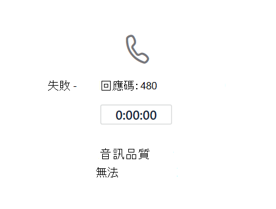

# 監視和疑難排解直接路由

本文將說明如何監控和疑難排解您的直接路由配置。 

使用直接路由撥打和接聽電話的能力涉及下列元件： 

- 會話邊界控制器 (SBC)  
- Microsoft Cloud 中的直接路由元件 
- 電信主幹 

如果您有疑難排解問題，您可以向 SBC 廠商或 Microsoft 開啟支援案例。 

Microsoft 正在努力提供更多疑難排解和監控工具。 請定期檢查檔以尋找更新。 

## 使用會話初始通訊協定監控會話邊界控制器的可用性 (SIP) 訊息

直接路由使用會話邊界控制器傳送的 SIP 選項來監控 SBC 健康情況。 租使用者系統管理員不需要執行任何動作來啟用 SIP 選項監控。 在做出路由決策時，會考慮收集的資訊。 

例如，如果針對特定使用者，有幾個 SBC 可以路由通話，則直接路由會考慮從每個 SBC 收到的 SIP 選項資訊，以決定路由。 

下圖顯示組組範例： 

當使用者撥打號碼 +1 425 \<any seven digits> 時，直接路由會評估路由。 路由中共有兩個 SBC：sbc1.contoso.com 和 sbc2.contoso.com。 這兩個 SBC 在路由中都有相同的優先順序。 挑選 SBC 之前，路由機制會根據 SBC 上次傳送 SIP 選項的時間，評估 SBC 的健康情況。 

如果傳送通話時的統計資料顯示 SBC 每分鐘傳送選項，則 SBC 會被視為健康狀態。  

進行通話時，會採用下列邏輯：

- SBC 在上午 11：00 配對。  
- SBC 會于上午 11：01、上午 11：02 等傳送選項。  
- 在 11：15，使用者進行通話，而路由機制會選取此 SBC。 

直接路由會採用三次定期間隔選項 (一般間隔為一分鐘) 。 如果選項是在過去三分鐘內傳送的，則 SBC 會視為健康狀態。

如果範例中的 SBC 于上午 11：12 到上午 11：15 (通話時間之間的任一時段內) 會被視為健康狀態。 如果沒有，SBC 將會從路由降級。 

降級表示不會先嘗試 SBC。 例如，我們有一 sbc1.contoso.com sbc2.contoso.com 優先順序。  

如果 sbc1.contoso.com 未如先前所述定期傳送 SIP 選項，系統即會降級。 接下來，sbc2.contoso.com 通話。 如果 sbc2.contoso.con 無法傳遞通話，系統 sbc1.contoso.com (降級) 再試一次，然後再產生失敗。 

如果 (一個路由) 兩個或多個 SBCs 視為健康且相等，Fisher-Yates則會使用隨機Fisher-Yates來在 SBC 之間分配通話。

## 監控通話品質分析儀表板和 SBC 記錄 
 
在某些情況下，尤其是在初始配對期間，SBCs 或直接路由服務可能發生配置錯誤的問題。 

您可以使用下列工具來監控您的組組：  
 
- 通話品質儀表板 
- SBC 記錄 

直接路由服務有非常描述性的錯誤碼，會報告給通話分析或 SBC 記錄。 

通話品質儀表板提供有關通話品質和可靠性的資訊。 若要深入瞭解如何使用通話分析疑難排解問題，請參閱開啟及使用 Microsoft Teams 和[商務用 Skype Online 的](/SkypeForBusiness/using-call-quality-in-your-organization/turning-on-and-using-call-quality-dashboard)通話品質儀表板，以及使用通話分析來疑難排解通話品質[不佳的問題](/SkypeForBusiness/using-call-quality-in-your-organization/use-call-analytics-to-troubleshoot-poor-call-quality)。 

如果通話失敗，通話分析會提供標準 SIP 代碼，可協助進行疑難排解。 

不過，通話分析只有在通話到達直接路由的內部元件並失敗時，才能有所説明。 如果 SBC 配對發生問題，或 SIP"Invite" 遭到拒絕的問題 (例如，主幹 FQDN 的名稱) ，通話分析將無説明。 在此案例中，請參閱 SBC 記錄。 直接路由會傳送問題的詳細描述給 SBC;這些問題可以從 SBC 記錄中讀取。