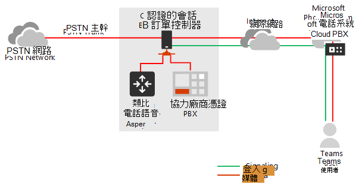
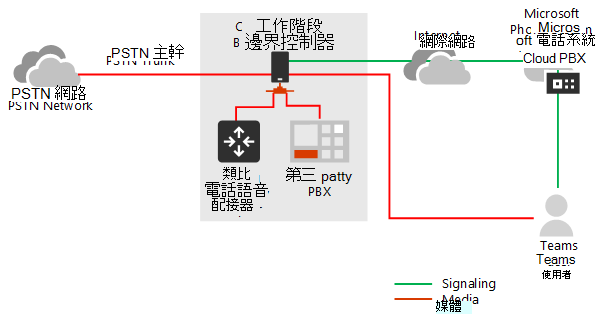
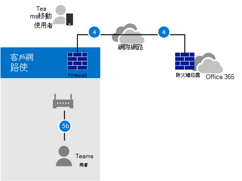
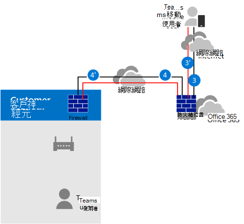
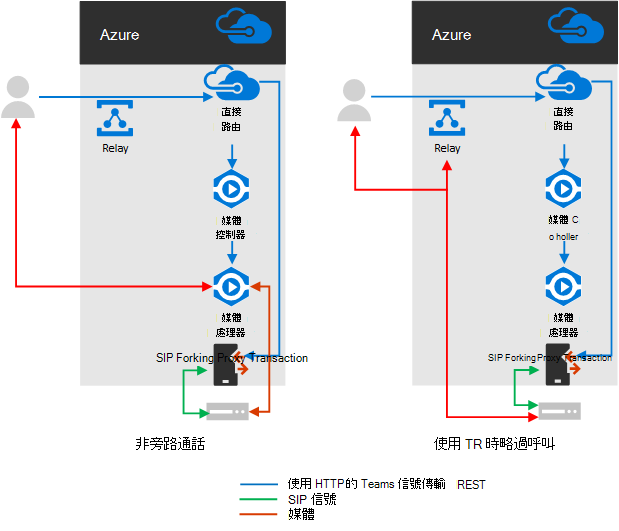
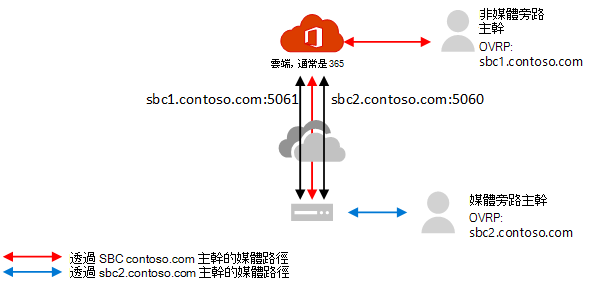

# 使用直接路由規劃媒體旁路Plan for media bypass with Direct Routing

## 關於直接路由的媒體旁路About media bypass with Direct Routing

[媒體旁路] 可讓您縮短媒體流量的路徑, 並減少傳輸中的跳躍數, 以獲得更佳的效能。Media bypass enables you to shorten the path of media traffic and reduce the number of hops in transit for better performance. 在媒體旁路的情況下, 媒體會保留在會話邊界控制器 (SBC) 和用戶端之間, 而不是透過 Microsoft Phone 系統傳送。With media bypass, media is kept between the Session Border Controller (SBC) and the client instead of sending it via the Microsoft Phone System. 若要設定媒體旁路, SBC 與用戶端必須位於同一個位置或網路上。To configure media bypass, the SBC and the client must be in the same location or network.

您可以使用**設定 CSOnlinePSTNGateway**命令, 並將 **-MediaBypass**參數設定為 true 或 false, 以控制每個 SBC 的媒體旁路。You can control media bypass for each SBC by using the **Set-CSOnlinePSTNGateway** command with the **-MediaBypass** parameter set to true or false. 如果您啟用 [媒體旁路], 這並不表示所有媒體流量都會留在公司網路內。If you enable media bypass, this does not mean that all media traffic will stay within the corporate network. 本文將說明不同案例中的通話流程。This article describes the call flow in different scenarios.    

下圖說明通話流程中的差異, 以及不使用媒體旁路的情況。The diagrams below illustrate the difference in call flow with and without media bypass.

若沒有媒體旁路, 當用戶端撥打或接聽來電時, 在 SBC、Microsoft Phone 系統和團隊用戶端之間的信號與媒體流程, 如下圖所示:Without media bypass, when a client makes or receives a call, both signaling and media flow between the SBC, the Microsoft Phone System, and the Teams client, as shown in the following diagram:

但假設使用者與 SBC 在相同的大樓或 network 中。But let's assume that a user is in the same building or network as the SBC. 例如, 假設在 Frankfurt 中建立的使用者撥打電話給 PSTN 使用者:For example, assume a user who is in a building in Frankfurt makes a call to a PSTN user: 

- 如果**沒有媒體旁路**, 媒體會透過阿姆斯特丹或都柏林 (在 Microsoft 資料中心的部署位置), 並回到 Frankfurt 中的 SBC 來流動。**Without media bypass**, media will flow via either Amsterdam or Dublin (where Microsoft datacenters are deployed) and back to the SBC in Frankfurt. 

  之所以選取 [歐洲資料中心], 是因為 SBC 是在歐洲, 而 Microsoft 使用最接近 SBC 的資料中心。The datacenter in Europe is selected because the SBC is in Europe, and Microsoft uses the datacenter closest to the SBC. 雖然這種方法不會影響通話品質, 因為在大部分地區內的 Microsoft 網路中的流量流程已優化, 但通信量卻有不必要的迴圈。While this approach does not affect call quality due to optimization of traffic flow within Microsoft networks in most geographies, the traffic has an unnecessary loop.     

- 在**媒體旁路**的情況下, 媒體會直接保留在團隊使用者與 SBC 之間, 如下圖所示:**With media bypass**, the media is kept directly between the Teams user and the SBC as shown in the following diagram:

媒體旁路利用在 SBC 上的團隊用戶端和 ICE lite 上稱為互動式連線建立 (ICE) 的通訊協定。Media bypass leverages protocols called Interactive Connectivity Establishment (ICE) on the Teams client and ICE lite on the SBC. 這些通訊協定可讓直接路由使用最直接的媒體路徑來獲得最佳品質。These protocols enable Direct Routing to use the most direct media path for optimal quality. 冰與冰 Lite 是 WebRTC 的標準。ICE and ICE Lite are WebRTC standards. 如需這些通訊協定的詳細資訊, 請參閱 RFC 5245。For detailed information about these protocols, see RFC 5245.

## 通話流程與防火牆規劃Call flow and firewall planning

通話流程和防火牆規劃取決於使用者是否能直接存取 SBC 的公用 IP 位址, 以及使用者是否在網路內或外部。Call flow and firewall planning depends on whether the user has direct access to the public IP address of the SBC, and whether the user is inside or outside of the network.

### 如果使用者可以直接存取 SBC 的公用 IP 位址, 就可以進行通話流程Call flow if the user has direct access to the public IP address of the SBC

如果使用者可以直接存取 SBC 的公用 IP 位址, 則呼叫流程如下所示:If the user has direct access to the public IP address of the SBC, the call flow is as follows:

- 針對媒體旁路, 小組用戶端必須能夠存取 SBC 的公用 IP 位址 (即使是來自內部網路)。For media bypass, the Teams client must have access to the public IP address of the SBC even from an internal network. 如果不想要直接媒體, 媒體可以透過傳輸中繼流過。If direct media is not desired, the media can flow via Transport Relays.

- 當使用者與 SBC 在相同的建築物和/或網路中時, 建議使用這項方案: 從媒體路徑中移除 Microsoft 雲端元件。This is the recommended solution when a user is in the same building and/or network as the SBC – remove Microsoft Cloud components from the media path.

- 通知總是透過 Microsoft 雲端傳送流程。Signaling always flows via the Microsoft cloud.

下圖顯示啟用媒體旁路時的通話流程、用戶端為內部, 且用戶端可以取得 SBC 的公用 IP 位址 (直接媒體):The following diagram shows call flow when media bypass is enabled, the client is internal, and the client can reach the public IP address of the SBC (direct media): 

- 路徑的箭號和數值是依照[Microsoft 團隊通話流程](https://docs.microsoft.com/microsoftteams/microsoft-teams-online-call-flows)文章。The arrows and numeric values of the paths are in accordance with the [Microsoft Teams call flows](https://docs.microsoft.com/microsoftteams/microsoft-teams-online-call-flows) article.

- SIP 信號總是會採用路徑4和 4 ' (視通信量的方向而定)。The SIP signaling always takes paths 4 and 4’ (depending on the direction of the traffic). 媒體保持在本機, 並採用路徑5b。Media stays local and takes path 5b.

### 如果使用者無法存取 SBC 的公用 IP 位址, 通話流程Call flow if the user does not have access to the public IP address of the SBC

如果使用者無法存取 SBC 的公用 IP 位址, 下列說明通話流程。The following describes call flow if the user does not have access to the public IP address of the SBC. 

例如, 假設使用者是外部使用者, 而租使用者系統管理員決定不要將 SBC 的公用 IP 位址開啟至網際網路中的每個人, 但僅限 Microsoft 雲端。For example, assume the user is external, and the tenant administrator decided not to open the public IP address of the SBC to everyone in the Internet, but only to the Microsoft Cloud. 流量的內部元件可以透過團隊傳輸繼電器來流動。The internal components of traffic can flow via the Teams Transport Relays. 這是商業網路以外的使用者的建議配置。This is the recommended configuration for users outside of the corporate network. 請考慮下列事項:Consider the following:

- 使用團隊傳輸中繼。Teams Transport Relays are used.

- 針對媒體旁路, Microsoft 使用的傳輸繼電器版本必須在團隊傳輸中繼器與 SBC 之間開啟埠 50 000 至 59 999 (將來我們打算移至只需要3478和3479埠的版本)。For media bypass, Microsoft uses a version of Transport Relays that requires opening ports 50 000 to 59 999 between the Teams Transport Relays and the SBC (in the future we plan to move to the version which requires only 3478 and 3479 ports).

- 針對媒體優化用途, Microsoft 建議您只開啟 SBC 的公用 IP 位址至團隊傳輸中繼。For media optimization purposes, Microsoft recommends opening the public IP address of the SBC only to Teams Transport Relays. 對於公司網路以外的用戶端, Microsoft 建議使用傳輸中繼, 而不是直接到達 SBC 的公用 IP 位址。For clients outside of the corporate network, Microsoft recommends using Transport Relays instead of reaching the public IP address of the SBC directly.

下列圖表顯示在啟用媒體旁路時的通話流程、用戶端為外部, 且用戶端無法取得會話邊界控制器的公用 IP 位址 (媒體是由小組傳輸轉接傳送來中繼)。The following diagram shows call flow when media bypass is enabled, the client is external, and the client cannot reach the public IP address of the Session Border Controller (media is relayed by Teams Transport Relay).

- 路徑的箭號和數值是依照[Microsoft 團隊通話流程](https://docs.microsoft.com/microsoftteams/microsoft-teams-online-call-flows)文章。The arrows and numeric values of the paths are in accordance with the [Microsoft Teams call flows](https://docs.microsoft.com/microsoftteams/microsoft-teams-online-call-flows) article.

- 媒體是透過路徑3、3 '、4和4」進行中繼Media is relayed via paths 3, 3', 4 and 4'

### 如果使用者在網路以外且能存取 SBC 的公用 IP, 通話流程Call flow if a user is outside the network and has access to the public IP of the SBC

> [!NOTE]
> 這不是建議的設定, 因為它不會利用團隊傳輸繼電器。This is not a recommended configuration because it does not take advantage of Teams Transport Relays. 相反地, 您應該考慮先前的情況, 即使用者無法存取 SBC 的公用 IP 位址。Instead, you should consider the previous scenario where the user does not have access to the public IP address of the SBC. 

下圖顯示啟用媒體旁路時的通話流程、用戶端為外部, 且用戶端可以取得 SBC (直接媒體) 的公用 IP 位址。The following diagram shows call flow when media bypass is enabled, the client is external, and the client can reach the public IP address of the SBC (direct media).

- 路徑的箭號和數值是依照[Microsoft 團隊通話流程](https://docs.microsoft.com/microsoftteams/microsoft-teams-online-call-flows)文章。The arrows and numeric values of the paths are in accordance with the [Microsoft Teams call flows](https://docs.microsoft.com/microsoftteams/microsoft-teams-online-call-flows) article.

- SIP 信號通常會採用路徑3和 3 ' (視流量方向而定)。The SIP signaling always takes paths 3 and 3’ (depending on the direction of the traffic). 媒體流程使用路徑2。Media flows using path 2.

## 媒體處理器與傳輸繼電器的用途Use of Media Processors and Transport Relays

Microsoft 雲端中有兩個元件可位於媒體流量的路徑: 媒體處理器和傳輸中繼。There are two components in the Microsoft Cloud that can be in the path of media traffic: Media Processors and Transport Relays. 

- 媒體處理器是一個公開的元件, 可在非旁路情況下處理媒體, 並處理語音應用程式的媒體。The Media Processor is a public facing component that handles media in non-bypass cases and handles media for voice applications.

   媒體處理器一直在最終使用者未繞過呼叫的路徑中, 但不會在回避通話的路徑中。Media Processors are always in the path for end user non-bypassed calls, but never in the path for bypassed calls. 媒體處理器總是位於所有語音應用程式的路徑中, 例如通話寄存、組織自動語音應答及通話佇列。Media Processors are always in the path for all voice applications such as Call Park, Organizational Auto Attendant, and Call Queues.

- 傳輸中繼是用來連線到最接近的傳輸服務, 以傳送即時流量。The Transport Relay is used to connect to the closest Transport Service to send real time traffic.

   傳輸繼電器可能是或不在繞過通話的路徑中, 也可能不是來源於或發給最終使用者--視使用者的位置和網路的設定方式而定。Transport Relays might or might not be in the path for bypassed calls--originating from or destined to end users--depending on where the user is and how the network is configured .

下圖顯示兩個通話流程: 一個啟用「媒體旁路」, 而另一個停用媒體旁路的情況。The following diagram shows two call flows – one with media bypass enabled and the second with media bypass disabled. 注意: 圖表只會說明源自--或發至端使用者的流量。Note the diagram only illustrates traffic originating from--or destined to--end users.  
- 媒體控制器是 Azure 中的 microservice, 可指派媒體處理器並建立會話描述通訊協定 (SDP) 提供的功能。The Media Controller is a microservice in Azure that assigns Media Processors and creates Session Description Protocol (SDP) offers.

- SIP Proxy 是一個元件, 可將小組中使用的 HTTP REST 信號轉譯成 SIP。The SIP Proxy is a component that translates HTTP REST signaling used in Teams to SIP.    

下表摘要列出媒體處理器與傳輸中繼之間的差異。The table below summarizes the difference between Media Processors and Transport Relays.

|    | 媒體處理器Media Processors | 傳輸繼電器Transport Relays|
| :--------------|:---------------|:------------|
在媒體路徑中, 讓使用者無法避開來電In media path for non-bypassed calls for end users | 總會Always | 任何Never | 
在媒體路徑中, 讓使用者略過來電In media path for bypassed calls for end users | 任何Never | 如果用戶端無法在公用 IP 位址上到達 SBCIf client cannot reach the SBC on the public IP address | 
在語音應用程式的媒體路徑中In media path for voice applications | 總會Always | 任何Never | 
可以執行轉碼 (B2BUA)\*Can do transcoding (B2BUA)\* | 是的Yes | 否, 只在端點之間中繼音訊No, only relays audio between endpoints | 
全球和位置的實例數Number of instances worldwide and location | 總共8個: 美國東和西部為2。在阿姆斯特丹和都柏林中為 2,2在香港與新加坡中;日本中的 2 (在 Q1CY2019 中新增)8 total: 2 in US East and West; 2 in Amsterdam and Dublin; 2 in Hong Kong and Singapore; 2 in Japan (being added in Q1CY2019)  | 條Multiple

IP 範圍是 52.112.0.0/14 (從52.112.0.1 到52.115.255.254 的 IP 位址)。The IP range is 52.112.0.0 /14 (IP addresses from 52.112.0.1 to 52.115.255.254). 

\*轉碼說明:\* Transcoding explanation: 

- 媒體處理常式是 B2BUA, 這表示它可以變更編解碼器 (例如, 從 [團隊用戶端] 到 [MP] 和 [在 MP 與 SBC 之間 711] 的絞絲)。Media Processor is B2BUA, which means it can change a codecs (for example, SILK from Teams client to MP and G.711 between MP and SBC).

- 傳輸中繼並非 B2BUA, 這表示在用戶端與 SBC 之間不會變更編解碼器, 即使流量透過中繼流程也一樣。Transport Relays are not B2BUA, which means the codec is never changed between the client and the SBC--even if traffic flows via relays.

### 如果已針對媒體旁路設定幹線, 在問題上報案例中使用團隊傳輸繼電器Use of Teams Transport Relays in escalation scenarios if trunk is configured for media bypass

在下列案例中, 小組傳輸繼電器永遠都在媒體路徑中:Teams Transport Relays are always in the media path in the following scenarios:

- 從1:1 升級到群組通話的通話Call is escalated from 1:1 to a group call
- 通話會傳送給聯盟團隊使用者Call is going to a federated Teams user
- 通話是轉寄或轉接至商務用 Skype 使用者Call is forwarded or transferred to a Skype for Business user

請確定您的 SBC 能夠存取傳輸繼電器, 如下所述。Ensure your SBC has access to the Transport Relays as described below.    

## SIP 信號: Fqdn 和防火牆埠SIP Signaling: FQDNs and firewall ports

針對 SIP 信號, FQDN 和防火牆需求與非繞過案例相同。For SIP signaling, the FQDN and firewall requirements are the same as for non-bypassed cases. 

直接路由的連接點是下列三個 Fqdn:The connection points for Direct Routing are the following three FQDNs:

- **sip.pstnhub.microsoft.com** –全域 FQDN-必須先嘗試。**sip.pstnhub.microsoft.com** – Global FQDN – must be tried first. 當 SBC 傳送要求來解析此名稱時, Microsoft Azure DNS 伺服器會傳回指向指派給 SBC 之主要 Azure 資料中心的 IP 位址。When the SBC sends a request to resolve this name, the Microsoft Azure DNS servers return an IP address pointing to the primary Azure datacenter assigned to the SBC. 作業是以資料中心的效能指標, 以及與 SBC 有關的地理位置為基礎。The assignment is based on performance metrics of the datacenters and geographical proximity to the SBC. 傳回的 IP 位址會對應到主要 FQDN。The IP address returned corresponds to the primary FQDN.

- **sip2.pstnhub.microsoft.com** –次要 FQDN-地理位置對應至第二個優先順序區域。**sip2.pstnhub.microsoft.com** – Secondary FQDN – geographically maps to the second priority region.

- **sip3.pstnhub.microsoft.com** –三元 FQDN-[地理位置] 對應至第三個優先順序區域。**sip3.pstnhub.microsoft.com** – Tertiary FQDN – geographically maps to the third priority region.

您必須將這三個 Fqdn 放在一起, 才能:You must place these three FQDNs in order to:

- 提供最佳的使用體驗 (在所指派的 SBC 資料中心較少且最接近的情況下, 由查詢第一個 FQDN)。Provide optimal experience (less loaded and closest to the SBC datacenter assigned by querying the first FQDN).

- 在來自 SBC 的連線建立至遇到暫時問題的資料中心時, 提供容錯移轉。Provide failover when a connection from an SBC is established to a datacenter that is experiencing a temporary issue. 如需詳細資訊, 請參閱下方的容錯移轉機制。For more information, see Failover mechanism below.

Fqdn **sip.pstnhub.microsoft.com**、 **sip2.pstnhub.microsoft.com**和**sip3.pstnhub.microsoft.com**將解析成下列其中一個 IP 位址:The FQDNs **sip.pstnhub.microsoft.com**, **sip2.pstnhub.microsoft.com**, and **sip3.pstnhub.microsoft.com** will be resolved to one of the following IP addresses:
- 52.114.148.052.114.148.0
- 52.114.132.4652.114.132.46
- 52.114.75.2452.114.75.24
- 52.114.76.7652.114.76.76
- 52.114.7.2452.114.7.24
- 52.114.14.7052.114.14.70

您將需要在防火牆中開啟所有這些 IP 位址的埠, 以允許傳入和傳出流量進出位址以進行寄件者。You will need to open ports for all these IP addresses in your firewall to allow incoming and outgoing traffic to and from the addresses for signaling. 如果您的防火牆支援 DNS 名稱, FQDN **sip-all.pstnhub.microsoft.com**會解析為上述所有 IP 位址。If your firewall supports DNS names, the FQDN **sip-all.pstnhub.microsoft.com** resolves to all the IP addresses above. 您必須使用下列埠:You must use the following ports:

| 頻寬Traffic | 從From | 自To | 來源埠Source port | 目的地埠Destination port|
| :-------- | :-------- |:-----------|:--------|:---------|
SIP/TLSSIP/TLS| SIP ProxySIP Proxy | SBCSBC | 1024-655351024 - 65535 | 在 SBC 上定義Defined on the SBC |
| SIP/TLSSIP/TLS | SBCSBC | SIP ProxySIP Proxy | 在 SBC 上定義Defined on the SBC | 50615061 |

## 媒體流量: IP 與埠範圍Media traffic: IP and Port ranges

如果用戶端無法使用公用 IP 位址到達 SBC, 則在 SBC 與團隊用戶端之間的媒體流量會流動 (如果有直接連線) 或透過團隊傳輸中繼。Media traffic flows between the SBC and Teams client if direct connectivity is available or via Teams Transport Relays if the client cannot reach the SBC using the public IP address.

### 直接媒體流量的需求 (在團隊用戶端與 SBC 之間)Requirements for direct media traffic (between the Teams client and the SBC) 

用戶端必須能夠存取指定的埠 (請參閱 table) 至 SBC 的公用 IP 位址。The client must have access to the specified ports (see table) on the public IP address of the SBC. 

注意: 如果用戶端在內部網路中, 則媒體會流向 SBC 的公用 IP 位址。Note: If the client is in an internal network, the media flows to the public IP address of the SBC. 您可以在您的 NAT 裝置上設定 hairpinning, 讓交通永不離開商業網路裝置。You can configure hairpinning on your NAT device so traffic never leaves the enterprise network equipment.

| 頻寬Traffic | 從From | 自To | 來源埠Source port | 目的地埠Destination port|
| :-------- | :-------- |:-----------|:--------|:---------|
UDP/SRTPUDP/SRTP | 端Client | SBCSBC | 50 000 – 50 01950 000 – 50 019  | 在 SBC 上定義Defined on the SBC |
| UDP/SRTPUDP/SRTP | SBCSBC | 端Client | 在 SBC 上定義Defined on the SBC | 50 000 – 50 01950 000 – 50 019  |

注意: 如果您的網路裝置會轉譯用戶端的來源埠, 請確定已在網路設備與 SBC 之間開啟已轉換的埠。Note: If you have a network device that translates the client's source ports, please make sure that translated ports are opened between the network equipment and the SBC. 

### 使用傳輸繼電器的需求Requirements for using Transport Relays

傳輸繼電器與媒體處理器在同一個範圍內 (針對非旁路情況): 52.112.0.0/14 (從52.112.0.1 到52.115.255.254 的 IP 位址)。Transport Relays are in the same range as Media Processors (for non-bypass cases):  52.112.0.0 /14 (IP addresses from 52.112.0.1 to 52.115.255.254).

小組傳輸繼電器的埠範圍如下表所示:The port range of the Teams Transport Relays is shown in the following table:

| 頻寬Traffic | 從From | 自To | 來源埠Source port | 目的地埠Destination port|
| :-------- | :-------- |:-----------|:--------|:---------|
UDP/SRTPUDP/SRTP | 傳輸中繼Transport Relay | SBCSBC | 50 000-59 99950 000 -59 999    | 在 SBC 上定義Defined on the SBC |
| UDP/SRTPUDP/SRTP | SBCSBC | 傳輸中繼Transport Relay | 在 SBC 上定義Defined on the SBC | 50 000 – 59 999、3478、347950 000 – 59 999, 3478, 3479     |

注意: Microsoft 建議在 SBC 上每個併發呼叫至少有兩個埠。Note: Microsoft recommends at least two ports per concurrent call on the SBC. 因為 Microsoft 有兩個版本的傳輸繼電器, 所以需要下列各項:Because Microsoft has two versions of Transport Relays, the following are required:

- v4, 只能與埠範圍 50 000 搭配 59 999v4, which can only work with port range 50 000 to 59 999

- v6 是與埠3478、3479搭配使用v6, which works with ports 3478, 3479

目前, 媒體旁路只支援 v4 版的傳輸中繼。At this time, media bypass only supports v4 version of Transport Relays. 我們會在未來推出 v6 支援。We will introduce support of v6 in the future. 

您需要開啟埠3478和3479以進行轉換。You need to open ports 3478 and 3479 for transitioning. 當 Microsoft 使用媒體旁路支援 v6 傳輸中繼時, 您就不需要重新設定您的網路設備或 SBCs。When Microsoft introduces support for v6 Transport Relays with Media Bypass, you will not need to reconfigure your network equipment or SBCs. 

### 使用媒體處理器的需求Requirements for using media processors

媒體處理器總是位於語音應用程式和網路 cleints 的媒體路徑中 (適用于 exampe, 小組 cleint 是 Edge 或 Google Chrome)。Media Processors are always in the media path for voice applications and for Web cleints (for exampe, Teams cleint in Edge or Google Chrome). 其需求與非旁路設定相同。The requirements are the same as for non-bypass configuration.

媒體流量的 IP 範圍是 52.112.0.0/14 (從52.112.0.1 到52.115.255.254 的 IP 位址)。The IP range for media traffic is 52.112.0.0 /14 (IP addresses from 52.112.0.1 to 52.115.255.254).

媒體處理器的埠範圍如下表所示:The port range of the Media Processors is shown in the following table:

| 頻寬Traffic | 從From | 自To | 來源埠Source port | 目的地埠Destination port|
| :-------- | :-------- |:-----------|:--------|:---------|
UDP/SRTPUDP/SRTP | 媒體處理器Media Processor | SBCSBC | 49 152 – 53 24749 152 – 53 247    | 在 SBC 上定義Defined on the SBC |
| UDP/SRTPUDP/SRTP | SBCSBC | 媒體處理器Media Processor | 在 SBC 上定義Defined on the SBC | 49 152 – 53 24749 152 – 53 247     |

## 如果您在網路上有商務用 Skype 電話, 請考慮Considerations if you have Skype for Business phones in your network  

如果您的網路中有任何使用 [直接傳送] 的商務用 Skype 端點 (例如, 小組使用者可以擁有以商務用 Skype 用戶端為基礎的3PIP 電話), 則必須關閉為這些使用者提供服務的主幹上的媒體旁路。If you have any Skype for Business end points in your network that are using Direct Routing--for example, a Teams user can have a 3PIP phone that is based on Skype for Business client--the media bypass on the trunk that serves these users must be turned off.

您可以為這些使用者建立單獨的幹線, 並將其指派為線上語音路由策略。You can create a separate trunk for these users and assign it an Online Voice Routing policy.

高層次的設定步驟:High-level configuration steps:

- 依類型分割使用者-視使用者是否有3PIP 電話而定。Split users by type – depending on whether the user has a 3PIP phone or not.

- 使用不同的 Fqdn 建立兩個不同的 trunks: 一個為媒體略過啟用;另一種是。Create two separate trunks with different FQDNs: one enabled for media bypass; the other not. 

  兩個 trunks 都指向同一個 SBC。Both trunks point to the same SBC. TLS SIP 信號的埠必須不同。The ports for TLS SIP signaling must be different. 媒體埠必須相同。The ports for media must be the same.

- 根據線上語音路由策略中的使用者類型, 指派正確的主幹。Assign the correct trunk depending on the type of the user in the Online Voice Routing policy.

下列範例說明這個邏輯。The example below illustrates this logic.

| 使用者組Set of users | 使用者數量Number of users | 在 OVRP 中指派中繼 FQDNTrunk FQDN assigned in OVRP | 已啟用媒體旁路Media bypass enabled |
| :------------ |:----------------- |:--------------|:--------------|
擁有團隊用戶端與3PIP 手機的使用者Users with Teams clients and 3PIP phones | 2020 | sbc1.contoso.com:5061sbc1.contoso.com:5061 | 虛假false | 
只有團隊結束點的使用者 (包括為小組認證的新電話)Users with only Teams end points (including new phones certified for Teams) | 980980 | sbc2.contoso.com:5060sbc2.contoso.com:5060 | 滿足true

兩個 trunks 都可以指向相同的同一個 SBC, 且具有相同的公用 IP 位址。Both trunks can point to the same SBC with the same public IP address. SBC 上的 TLS 信號埠必須不同, 如下圖所示。The TLS signaling ports on the SBC must be different, as shown in the following diagram. 注意: 您必須確認您的憑證同時支援這兩個 trunks。Note you will need to make sure that your certificate supports both trunks. 在 SAN 中, 您必須有兩個名稱 (**sbc1.contoso.com**和**sbc2.contoso.com**), 或是擁有萬用字元證書。In SAN, you need to have two names (**sbc1.contoso.com** and **sbc2.contoso.com**) or have a wildcard certificate.

如需如何在同一個 SBC 上設定兩個 trunks 的相關資訊, 請參閱您的 SBC 轉銷商提供的檔:For information about how to configure two trunks on the same SBC, see the documentation provided by your SBC vendor:

 - [AudioCodes 部署檔AudioCodes deployment documentation](https://www.audiocodes.com/solutions-products/products/products-for-microsoft-365/direct-routing-for-microsoft-teams)
- [Oracle 部署檔Oracle deployment documentation](https://www.oracle.com/industries/communications/enterprise-session-border-controller/microsoft.html)
- [功能區通訊部署檔Ribbon Communications deployment documentation](https://ribboncommunications.com/solutions/enterprise-solutions/microsoft-solutions/direct-routing-microsoft-teams-calling)
- [TE-系統 (anynode) 部署檔TE-Systems (anynode) deployment documentation](https://www.anynode.de/anynode-and-microsoft-teams/)

## 媒體略過支援的用戶端端點Client endpoints supported with media bypass

所有團隊端點都支援媒體旁路。Media bypass is supported with all Teams endpoints.

Webcleints (Microsoft Edge、Google Chrome 或 Mozilla Firefox) 中的 [團隊網頁應用程式], 我們會將呼叫轉換成非旁路, 即使它是繞過通話。Note for webcleints (Teams Web app in Microsoft Edge, Google Chrome or Mozilla Firefox) we will covert the call to non-bypass even of it started as a bypass call. 這會自動發生, 不需要系統管理員執行任何動作。This happens automatically and does not require any actions on the administrator. 
 
## 另請參閱See also

[使用直接路由來設定媒體旁路Configure media bypass with Direct Routing](direct-routing-configure-media-bypass.md)

