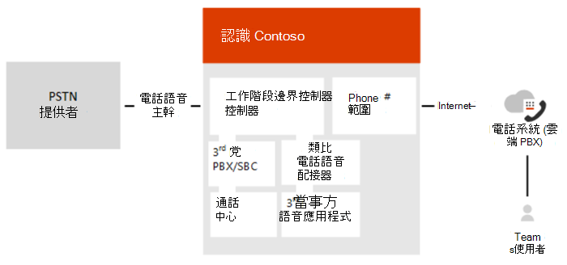

# 規劃直接路由

> [!Tip]
> 觀看下列會話以瞭解直接路由的好處、如何規劃，[以及如何](https://aka.ms/teams-direct-routing)部署：直接路由Microsoft Teams

Microsoft 電話系統直接路由可讓您將支援、客戶提供的會話邊界控制器 (SBC) 至Microsoft 電話系統。  例如，有了這項功能，您可以設定內部部署公用交換電話網絡 (PSTN) 與 Microsoft Teams 用戶端的Microsoft Teams，如下圖所示： 

  > [!NOTE]
  > 商務用 Skype線上也可讓您配對客戶提供的 SBC，但這需要在 SBC 和 Microsoft Cloud 之間進行內部部署 商務用 Skype Server 部署或特殊版本的 商務用 Skype，稱為雲端連接器。 此案例稱為混合式語音。 相反地，直接路由允許在支援的 SBC 和 Microsoft Cloud 之間直接連接。

> [!Important]
> 雲端連接器版本將于 2021 年 7 月 31 日與 商務用 Skype一起淘汰。 一旦貴組織升級至 Teams，瞭解如何使用直接路由將內部部署電話網絡Teams[網路](direct-routing-landing-page.md)。 

使用直接路由，您可以將 SBC 連接到幾乎任何電話主幹，或和協力廠商 PSTN 設備進行互連。 直接路由可讓您： 

- 使用幾乎任何 PSTN 主幹Microsoft 電話系統。 
- 設定客戶所有電話設備之間的互通性，例如 PBX (PBX) 、類比裝置和 Microsoft 電話 交換。

Microsoft 也提供全雲端語音解決方案，例如通話方案。 不過，如果： 

- 您的國家/地區沒有 Microsoft 通話方案。 
- 貴組織需要連接到協力廠商類比裝置、通話中心等。 
- 貴組織與 PSTN 電信公司有現有的合約。

直接路由也支援擁有 Microsoft 通話方案額外授權的使用者。 詳細資訊，請參閱電話系統[通話方案](calling-plan-landing-page.md)。 

使用直接路由時，當使用者參與排定的會議時，電話撥入號碼是由 Microsoft 音訊會議服務提供，需要適當的授權。  撥出時，Microsoft 音訊會議服務會使用線上通話功能撥打電話，這需要適當的授權。  (請注意，如果使用者沒有 Microsoft 音訊會議授權，通話會透過直接路由路由。) 請參閱使用 Teams[的線上會議](https://products.office.com/microsoft-teams/online-meeting-solutions)。 
 
規劃直接路由的部署是成功執行的關鍵。 本文將說明基礎結構和授權需求，並提供有關 SBC 連接的資訊： 

- [基礎結構需求](#infrastructure-requirements)
- [授權和其他需求](#licensing-and-other-requirements)
- [SBC 功能變數名稱](#sbc-domain-names)
- [SBC 的公用信任憑證](#public-trusted-certificate-for-the-sbc)
- [SIP 訊號：FQDNs](#sip-signaling-fqdns)
- [SIP 訊號：埠](#sip-signaling-ports)
- [媒體流量：埠範圍](#media-traffic-port-ranges)
- [支援會話邊界控制器 (SBC) ](#supported-session-border-controllers-sbcs)

有關設定直接路由的詳細資訊，請參閱 [設定直接路由](direct-routing-configure.md)。

## 基礎結構需求
下表列出部署直接路由的支援 SBC、網域和其他網路連接需求之基礎結構需求：  

|基礎結構需求|您需要下列專案|
|:--- |:--- |
|會話邊界控制器 (SBC) |支援的 SBC。 詳細資訊，請參閱支援的 [SBCs](#supported-session-border-controllers-sbcs)。|
|連接到 SBC 的電話主幹|連接到 SBC 的一或多個電話主幹。 在一端，SBC 會透過直接路由Microsoft 電話系統。 SBC 也可以連接到協力廠商電話實體，例如 PBX、類比電話轉接器等。 任何連接至 SBC 的 PSTN 連接選項都會使用。  (如需將 PSTN 主幹組至 SBC，請參閱 SBC 廠商或主幹提供者。) |
|Microsoft 365或Office 365組織|您Microsoft 365或Office 365使用者所使用之組織，Microsoft Teams SBC 的組與連接。|
|使用者註冊機構|使用者必須Microsoft 365或Office 365。 如果您的公司有內部部署 商務用 Skype 或 Lync 環境，且與 Microsoft 365 或 Office 365 的混合式連接，您無法為內部部署使用者啟用 Teams 中的語音。  若要檢查使用者的註冊機構，請使用下列商務用 Skype PowerShell Cmdlet： <code>Get-CsOnlineUser -Identity \<user> \| fl HostingProvider</code>   Cmdlet 的輸出應該會顯示： <code>HostingProvider : sipfed.online.lync.com</code>|
|域|新增到您組織或組織Microsoft 365一Office 365網域。  請注意，您無法使用為租使用者 onmicrosoft.com 建立的預設網 \* 域 .onmicrosoft.com。  若要查看網域，您可以使用下列工具商務用 Skype PowerShell Cmdlet： <code>Get-CsTenant \| fl Domains</code>  有關網域及組織Microsoft 365或Office 365，請參閱[網域常見問題](https://support.office.com/article/Domains-FAQ-1272bad0-4bd4-4796-8005-67d6fb3afc5a)。|
|SBC 的公用 IP 位址|可用來連接到 SBC 的公用 IP 位址。 根據 SBC 類型，SBC 可以使用 NAT。|
|適用于 SBC (FQDN) 功能變數名稱|SBC 的 FQDN，其中 FQDN 的網域部分是貴組織或組織Microsoft 365 Office 365網域。 詳細資訊，請參閱 [SBC 功能變數名稱](#sbc-domain-names)。|
|SBC 的公用 DNS 專案 |將 SBC FQDN 與公用 IP 位址的公用 DNS 專案。 |
|SBC 的公用信任憑證 |SBC 的憑證，用於使用直接路由進行所有通訊。 詳細資訊，請參閱 [SBC 的公用信任憑證](#public-trusted-certificate-for-the-sbc)。|
|直接路由的連接點 |直接路由的連接點為下列三個 FQDNs：  `sip.pstnhub.microsoft.com` – 必須先嘗試全域 FQDN。 `sip2.pstnhub.microsoft.com` – 次要 FQDN，地理上會繪製至第二個優先順序區域。 `sip3.pstnhub.microsoft.com` – 三級 FQDN，地理上可繪製至第三個優先順序區域。  有關組組需求的資訊，請參閱 [SIP 訊號：FQDNs](#sip-signaling-fqdns)。|
|直接路由媒體的防火牆 IP 位址和埠 |SBC 會與雲端中的下列服務通訊：  SIP Proxy，可處理訊號 媒體處理器，可處理媒體 -除非媒體旁路已啟用  這兩個服務在 Microsoft Cloud 中分別有 IP 位址，本檔稍後會說明。  For more information, see the [Microsoft Teams section](/office365/enterprise/urls-and-ip-address-ranges#skype-for-business-online-and-microsoft-teams) in [URLs and IP address ranges](/office365/enterprise/urls-and-ip-address-ranges). |
|媒體傳輸設定檔|TCP/RTP/SAVP  UDP/RTP/SAVP|
適用于媒體的防火牆 IP 位址Microsoft Teams埠 |詳細資訊，請參閱 [URL 和 IP 位址範圍](/office365/enterprise/urls-and-ip-address-ranges)。 |
|||

## 授權和其他需求 

直接路由的使用者必須在下列授權中指派Microsoft 365或Office 365： 

- Microsoft 電話系統。 
- Microsoft Teams + 商務用 Skype方案 2 ，如果包含在授權中。
- Microsoft 音訊會議 (請參閱下列筆記和段落，以瞭解何時需要授權) 。

> [!NOTE]
> 商務用 Skype不應從包含計畫的任何授權合約中移除計畫。 
> 
> [!IMPORTANT]
> GCC高和 DoD 使用者應停用 G5 中包含的任何音訊會議授權，並等待啟用任何音訊會議，直到直接路由完全完成配置。 在啟用音訊會議授權之前，使用者應該已配置電話撥入電話號碼和可工作的撥號鍵台。 請參閱[使用直接路由進行音訊會議GCC高和 DoD](./audio-conferencing-with-direct-routing-for-gcch-and-dod.md)的詳細資訊。

> [!IMPORTANT]
>  若要新增外部參與者至排定的會議，請撥電話給他們，或提供撥入號碼，則您需要音訊會議授權。
> 針對 GCC高和 DoD，請勿為 G5 使用者指派音訊會議授權。  對於 G3 使用者，請勿指派音訊會議授權，直到直接路由完全完成，且使用者擁有可工作的撥號鍵台。

### 臨時通話升級和音訊會議授權

使用者可以Teams PSTN 的一對一Teams或Teams，Teams PSTN 參與者加入通話。 此案例稱為臨時會議。 通話路徑取決於升級通話的使用者是否已指派 Microsoft 音訊會議授權：

- 如果Teams升級通話的使用者已指派 Microsoft 音訊會議授權，則升級會透過 Microsoft 音訊會議服務進行。 受邀加入現有通話的遠端 PSTN 參與者會收到來電通知，並查看指派給啟動升級的 Teams 使用者的 Microsoft 橋接器號碼。
- 如果Teams升級的使用者沒有指派 Microsoft 音訊會議授權，則升級會透過連接至直接路由介面的會話邊界控制器進行。 受邀加入通話的遠端 PSTN 參與者會收到來電通知，並查看啟動Teams的號碼。 升級時所使用的特定 SBC 是由使用者的路由策略定義。 

此外，您必須確保下列各項：
 
- CsOnlineVoiceRoutingPolicy 已指派給使用者。 
- 在租使用者層級啟用允許私人通話Microsoft Teams。 

直接路由也支援擁有 Microsoft 通話方案授權的使用者。 Microsoft 電話具有通話方案的系統可以使用直接路由介面路由部分通話。 不過，使用者的電話號碼必須線上取得或移植到 Microsoft。  

為同一個使用者混合通話方案與直接路由連接是選擇性的，但可能很有用 (例如，當使用者被指派 Microsoft 通話方案，但想要使用 SBC 電話) 。 最常見的案例之一是呼叫協力廠商 PBX。  使用協力廠商 PBX 時，除了連接到該 PBX 的電話以外，所有通話都是使用 Microsoft 通話方案路由，但連至協力廠商 PBX 的電話會傳送到 SBC，因此會留在商業網路內，而不是 PSTN。 

有關授權電話系統，請參閱從 Office[和方案選項取得最大功能](/office365/servicedescriptions/office-365-platform-service-description/office-365-plan-options)。  

若要進一電話系統授權，請參閱Microsoft Teams[附加元件授權。](./teams-add-on-licensing/microsoft-teams-add-on-licensing.md) 

## 支援的結束點 

您可以使用做為終點：

- 任何Teams用戶端。 
- 一般地區電話。 請參閱設定適用于 電話 的[公用區域Microsoft Teams。](./set-up-common-area-phones.md) 請注意，使用直接路由設定公用區域電話通話方案授權。
- 商務用 Skype 3PIP 電話。 請參閱[商務用 Skype 3PIP (3PIP) 支援Microsoft Teams](https://techcommunity.microsoft.com/t5/Microsoft-Teams-Blog/Skype-for-Business-phones-3PIP-support-with-Microsoft-Teams/ba-p/789351)

## SBC 功能變數名稱

SBC 功能變數名稱必須來自在租使用者網域中註冊的其中一個名稱。 您無法將 \* .onmicrosoft.com 租使用者用於 SBC 的 FQDN 名稱。

下表顯示為租使用者註冊的 DNS 名稱範例、該名稱是否可以做為 SBC 的 FQDN，以及有效的 FQDN 名稱範例：

|DNS 名稱|可用於 SBC FQDN|FQDN 名稱範例|
|:--- |:--- |:--- |
contoso.com|是|**有效的名稱：** sbc1.contoso.com ssbcs15.contoso.com europe.contoso.com|
|contoso.onmicrosoft.com|否|SBC onmicrosoft.com 不支援使用 *.onmicrosoft.com 網域

假設您要使用新的功能變數名稱。 例如，您的租使用者 contoso.com 在租使用者中註冊的功能變數名稱，而您想要使用 sbc1.sip.contoso.com。 在將 SBC 與名稱配對 sbc1.sip.contoso.com，您必須在租使用者 sip.contoso.com 網域註冊功能變數名稱。 如果您在註冊功能變數名稱之前嘗試將 SBC 與 sbc1.sip.contoso.com 配對，將會收到下列錯誤：「無法使用 「sbc1.sip.contoso.com」網域，因為它未為此租使用者所配置」。
新增功能變數名稱之後，您也需要使用 UPN 帳戶建立使用者 user@sip.contoso.com 指派Teams授權。 將功能變數名稱新加入租使用者網域、建立具有新名稱的使用者，以及指派授權給使用者之後，最多可能需要 24 小時的時間才能完整配置功能變數名稱。 

一家公司在一個租使用者中可能有幾個 SIP 位址空間。 例如，公司可能 contoso.com SIP 位址空間，fabrikam.com 作為第二個 SIP 位址空間。 有些使用者有位址 user@contoso.com，有些使用者有位址 user@fabrikam.com。 

SBC 只需要一個 FQDN，而且可以從配對租使用者的任何位址空間為使用者提供服務。 例如，名稱為 sbc1.contoso.com 的 SBC 可以接收及傳送位址為 user@contoso.com 和 user@fabrikam.com 的使用者的 PSTN 流量，只要這些 SIP 位址空間是在同一個租使用者中註冊。  

## SBC 的公用信任憑證

Microsoft 建議您針對 SBC 要求憑證，在CSR (中) 。 有關產生 SBC 的CSR 的特定指示，請參閱 SBC 廠商提供的互連指示或檔。 

  > [!NOTE]
  > 大部分的憑證頒發 (CA) 要求私密金鑰大小至少為 2048。 產生CSR 時，請記住這一點。

憑證必須具有 SBC FQDN 做為 CN (的公用名稱) 或 SAN (的) 名稱。 憑證應直接從憑證授權單位發出，而不是從中間提供者發出。

或者，直接路由支援 CN 和/或 SAN 中的萬用字元，而萬用字元必須符合標準的[RFC HTTP Over TLS。](https://tools.ietf.org/html/rfc2818#section-3.1) 例如，使用 \* .contoso.com 會符合 SBC FQDN sbc.contoso.com，但與 sbc.test.contoso.com。

憑證必須由下列其中一個根憑證授權單位產生：

- 確認信任
- AddTrust 外部 CA 根目錄
- 巴的摩網路根信任*
- Buypass
- 網路信任
- 類別 3 公用主要憑證授權單位
- Com正統安全根 CA
- Deutsche Telekom 
- DigiCert 全域根 CA
- DigiCert 高保證 EV 根 CA
- 委託
- GlobalSign
- Go Daddy
- GeoTrust
- Verisign， Inc. 
- SSL.com
- Starfield
- Symantec Enterprise Microsoft 行動裝置根目錄 
- SwissSign
- 解說時間戳記 CA
- Trustwave
- TeliaSonera 
- T-Systems International GmbH (Deutsche Telekom) 
- 仲裁Vadis
- USERTrust RSA 憑證授權單位
- Hongkong Post root CA 1，2，3
- Sect圳根 CA

對於 GCCH Office 365 DoD 環境中的直接路由，憑證必須由下列其中一個根憑證授權單位產生：
- DigiCert 全域根 CA
- DigiCert 高保證 EV 根 CA

> [!NOTE]
> *如果針對 SBC 上的 Teams 連接啟用相互 TLS (MTLS) 支援，則必須在 Teams TLS 上下文的 SBC 根信任存放區中安裝Baltimore CyberTrust 根憑證。  (這是因為 Microsoft 服務憑證使用Baltimore 根憑證。) 若要下載Baltimore 根憑證，[請參閱Office 365鏈](/microsoft-365/compliance/encryption-office-365-certificate-chains)。

Microsoft 正在根據客戶要求新增其他憑證授權單位。 

## SIP 訊號：FQDNs 

直接路由提供于下列環境：
- Microsoft 365或Office 365
- Office 365 GCC
- Office 365 GCC高
- Office 365國防部

深入瞭解[Office 365](/office365/servicedescriptions/office-365-platform-service-description/office-365-us-government/office-365-us-government)美國政府環境，例如 GCC、GCC高和 DoD。

### Microsoft 365、Office 365及Office 365 GCC環境

直接路由的連接點為下列三個 FQDNs：

- **sip.pstnhub.microsoft.com** 全域 FQDN - 必須先嘗試。 當 SBC 傳送解決此名稱的要求時，Microsoft Azure DNS 伺服器會返回指向指派給 SBC 的主要 Azure 資料中心的 IP 位址。 此工作分派是根據資料中心的績效度量，以及 SBC 鄰近的地理位置。 所退回的 IP 位址會對應到主要 FQDN。
- **sip2.pstnhub.microsoft.com** - 次要 FQDN - 地理上會繪製至第二個優先順序區域。
- **sip3.pstnhub.microsoft.com** - 三級 FQDN – 地理上可繪製至第三個優先順序區域。

若要將這三個 FQDNs 排序，必須：

- 查詢第一個 FQDN (，提供較不載入且最接近 SBC 資料中心的最佳) 。
- 當從 SBC 建立與遇到暫時問題的資料中心的連接時，提供容錯移轉。 詳細資訊，請參閱 [下方的容錯移轉](#failover-mechanism-for-sip-signaling) 機制。  

FQNS -sip.pstnhub.microsoft.com、sip2.pstnhub.microsoft.com 和 sip3.pstnhub.microsoft.com -會從下列子網解析為 IP 位址：

- 52.112.0.0/14
- 52.120.0.0/14

您必須在防火牆中開啟所有這些 IP 位址範圍的埠，以允許接收和傳出流量到和從位址接收訊號。  如果您的防火牆支援 DNS 名稱，FQDN **sip-all.pstnhub.microsoft.com** 解析為所有這些 IP 子網。 

> [!IMPORTANT]
> 作為直接路由Teams和服務改進的一部分，我們已在 2020 年 11 月在澳大利亞部署直接路由基礎結構的新實例。 這反映在兩個額外的 IP 位址 (52.114.16.74 和 52.114.20.29) 將針對澳洲客戶解決下列 FQNS - sip.pstnhub.microsoft.com、sip2.pstnhub.microsoft.com 和 sip3.pstnhub.microsoft.com。 您必須確認 IP 存取控制清單 (ACL) 中允許這兩個 IP 位址 (52.114.16.74 和 52.114.20.29) ，而且防火牆中的所有這些 IP 位址都開啟埠，以允許接收和傳出流量來接收和傳出用於訊號。

> [!IMPORTANT]
> 作為直接路由Teams和服務改進的一部分，我們已于 2021 年 5 月在日本部署直接路由基礎結構的新實例。 這反映在兩個額外的 IP 位址 (52.114.36.156 和 52.114.32.169) 針對日本客戶解決下列 FQNS - sip.pstnhub.microsoft.com、sip2.pstnhub.microsoft.com 和 sip3.pstnhub.microsoft.com。 您必須確認 IP 存取控制清單 (ACL) 中允許這兩個 IP 位址 (52.114.36.156 和 52.114.32.169) ，而且防火牆中的所有這些 IP 位址都開啟埠，以便接收和傳出流量來接收和傳出用於訊號。

### Office 365GCCH 和 DoD 環境

直接路由的連接點為下列 FQDN：

**sip.pstnhub.dod.teams.microsoft.us** - 全域 FQDN。 由於 Office 365 DoD 環境僅存在於美國資料中心，因此沒有次要和三級 FQDNs。

FQDN sip.pstnhub.dod.teams.microsoft.us 會從下列子網解析為 IP 位址：

- 52.127.64.0/21

您必須在防火牆中開啟所有這些 IP 位址的埠，以允許接收和傳出流量到與來自接收信令的位址。

### Office 365 GCC高環境

直接路由的連接點為下列 FQDN：

**sip.pstnhub.gov.teams.microsoft.us** - 全域 FQDN。 由於GCC高環境僅存在於美國資料中心，因此沒有次要和三級 FQDNs。

FQDN sip.pstnhub.gov.teams.microsoft.us 會從下列子網解析為 IP 位址：

- 52.127.64.0/21

您必須在防火牆中開啟所有這些 IP 位址的埠，以允許接收和傳出流量到與來自接收信令的位址。 如果您的防火牆支援 DNS 名稱，FQDN **sip-all.pstnhub.gov.teams.microsoft.us** 解析為所有這些 IP 位址。 此 FQDN 也可以做為用於傳入通話分類的聯邦 FQDN。

## SIP 訊號：埠

您必須在提供直接路由Microsoft 365或Office 365環境使用下列埠：
- Microsoft 365或Office 365
- Office 365 GCC
- Office 365 GCC高
- Office 365國防部

|交通|從|自|來源埠|目的地埠|
|:--- |:--- |:--- |:--- |:--- |
|SIP/TLS|SIP Proxy|Sbc|1024 – 65535|在 SBC (中Office 365 GCC只有埠 5061 才能使用) |
SIP/TLS|Sbc|SIP Proxy|在 SBC 上定義|5061|
||||||

### SIP 訊號的容錯移轉機制

SBC 會進行 DNS 查詢來解決 sip.pstnhub.microsoft.com。 根據 SBC 位置和資料中心的績效度量，已選取主資料中心。 如果主要資料中心遇到問題，SBC 會嘗試 sip2.pstnhub.microsoft.com，這可解決至第二個指派的資料中心，而且，在兩個區域的資料中心無法使用的情況下，SBC 會重試最後一個 FQDN (sip3.pstnhub.microsoft.com) ，提供第三級資料中心 IP。

下表摘要列出主要、次要和三級資料中心之間的關係：

|如果主要資料中心是|Emea|NOAM|亞洲|
|:--- |:--- |:--- |:--- |
|次要資料中心 (sip2.pstnhub.microsoft.com) |我們|歐盟|我們|
|第三級資料中心 (sip3.pstnhub.microsoft.com) |亞洲|亞洲|歐盟|
|||||

## 媒體流量：埠範圍
請注意，如果您想要部署不含媒體旁路的直接路由，則適用下列需求。 如需媒體旁路的防火牆需求，請參閱使用直接路由 [規劃媒體旁路](./direct-routing-plan-media-bypass.md)。

媒體流量會往來于 Microsoft Cloud 中的個別服務。 媒體流量的 IP 位址範圍如下。

### Microsoft 365、Office 365及Office 365 GCC環境

- 52.112.0.0/14 (IP 位址從 52.112.0.1 到 52.115.255.254) 。
- 52.120.0.0/14 (IP 位址從 52.120.0.1 到 52.123.255.254) 。

### Office 365DoD 環境

- 52.127.64.0/21

### Office 365 GCC高環境

- 52.127.88.0/21

### 埠範圍 (適用于所有環境) 
媒體處理器的埠範圍如下表所示： 

|交通|從|自|來源埠|目的地埠|
|:--- |:--- |:--- |:--- |:--- |
|UDP/SRTP|媒體處理器|Sbc|3478-3481 和 49152 – 53247|在 SBC 上定義|
|UDP/SRTP|Sbc|媒體處理器|在 SBC 上定義|3478-3481 和 49152 – 53247|

  > [!NOTE]
  > Microsoft 建議 SBC 上每個同時通話至少兩個埠。

## 媒體流量：媒體處理器地理位置

媒體流量會透過稱為媒體處理器的元件而流量。 媒體處理器會置於與 SIP 代理相同的資料中心。 此外，還有其他媒體處理器可優化媒體流程。 例如，我們目前在澳大利亞沒有 SIP proxy 元件 (SIP 經由新加坡或香港) 但我們在澳洲當地有媒體處理器。 本地媒體處理器的需要是由我們傳送流量到澳洲至新加坡或香港等長途傳輸流量時所受到的延遲所決定。 雖然從澳洲到香港或新加坡的流量範例中的延遲是可接受的，可維持 SIP 流量的通話品質，但即時媒體流量則不允許。

媒體處理器的位置：

SIP Proxy 和媒體處理器元件部署的位置：
- 美國 (美國西部和東部資料中心有兩個) 
- 位於 (和伯林達的歐洲資料中心) 
- 亞洲 (新加坡資料中心) 
- 日本 (JP East 和 West 資料中心) 
- 澳大利亞 (東部和東南亞資料中心) 

## 媒體流量：編解碼器

### 在 SBC 與雲端媒體處理器或用戶端Microsoft Teams連接。
適用于媒體旁路案例和非旁路案例。

在會話邊界控制器和雲端媒體處理器之間 (沒有媒體旁路) 或 Teams 用戶端與 SBC (如果已啟用媒體旁路) 之間的直接路由介面可以使用下列編解碼器：

- 將 SBC (雲端媒體處理器) ：SILK、G.711、G.722、G.729
- 媒體旁 (SBC Teams用戶端) ：SILK、G.711、G.722、G.729

您可以強制使用會話邊界控制器上的特定編解碼器，從優惠中排除不想要的編解碼器。

### 在用戶端Microsoft Teams雲端媒體處理器之間移動
僅適用于非媒體旁路案例。 使用媒體旁路，媒體會直接Teams用戶端與 SBC 之間。

在雲端媒體處理器和用戶端之間的Microsoft Teams使用 SILK 或 G.722。 此支腳上的編解碼器選項是以 Microsoft 演算法為基礎，其中會考慮多個參數。 

## 支援會話邊界控制器 (SBC) 

Microsoft 僅支援經過認證的 SBCs 與直接路由配對。 由於企業語音企業至關重要，因此 Microsoft 會與選取的 SBC 執行大量測試，並且與 SBC 廠商合作，以確保兩個系統相容。 

已驗證的裝置會列為直接路由Teams認證。 所有案例都保證認證裝置能夠使用。 

有關支援的 SBCs 詳細資訊，請參閱通過直接路由認證的會話 [邊界控制器清單](direct-routing-border-controllers.md)。

 
## 另請參閱

[設定直接路由](direct-routing-configure.md)
